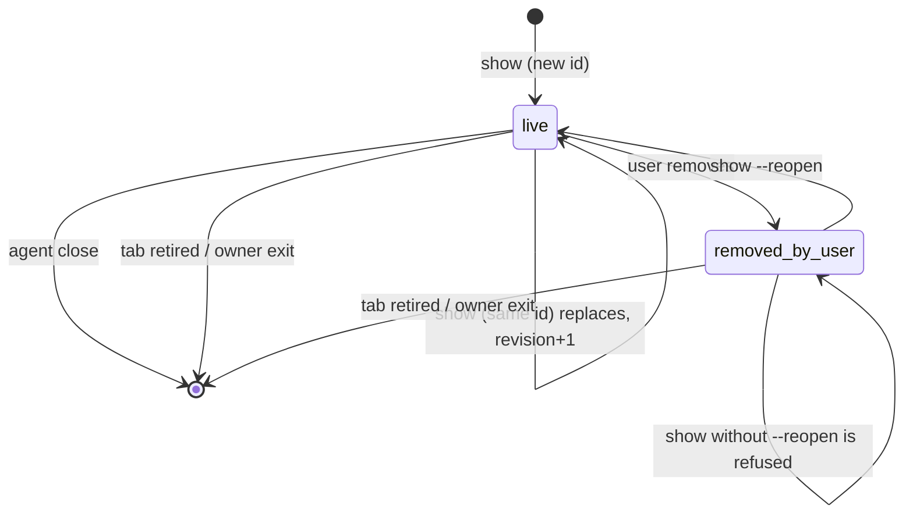
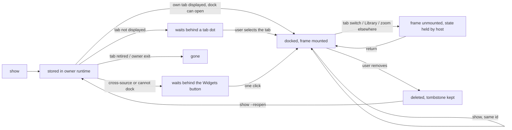

# Agent widgets: a visual companion to the agent conversation in Cockpit

Scope: UX and interaction design, plus the exact repository constraints an implementation must respect. No product code, tests, config or others' docs were changed. Revised 2026-10-02 (second pass): a widget is now a visual companion to the normal agent conversation. The ask/feedback/view modes, host response bars, paste fallback, artifact history and indicator-only arrival of the first design are removed (2.4 lists what changed against the evidence); 3.5 to 3.8 and 4 define auto-open, in-place replacement, several ids per tab and removal. The host-enforced security gates (5.8 G1-G3) are unchanged.

> **Verification status.** Nothing here was built, run or observed in a live Cockpit, Herdr, browser or WebKitGTK. "Current behavior" below is read from source and docs at the cited lines. `[INFERENCE]` marks a judgement I could not ground in the ranges I read. `[PROPOSED]` marks a new name, flag, token or number that does not exist today. The mock and examples are illustrative and scripted; they are not evidence that any behavior works (see section 11).

Reading guide: sections 2.1 to 2.3 are **current state**, read from source at the cited lines. Section 2.4 states what this revision changes. Sections 3 to 5 and 7 to 11 are **proposal**; anything new is `[PROPOSED]` or described as a design choice.

Citations are `path:line` in this repository. External: MCP Apps stable spec `https://github.com/modelcontextprotocol/ext-apps/blob/main/specification/2026-01-26/apps.mdx` (cited as `apps.mdx:<line of the raw file>`), read 2026-10-01.

## 1. Goal & users

**Goal.** The user talks to the agent in the normal terminal session. A widget is a visual companion that the agent puts next to that conversation, changes while the conversation goes on, and the user can throw away with one click. It is not a second chat, a form, or an approval or feedback channel.

The loop this design optimizes:

| Step | User (in the terminal chat) | Agent | Cockpit |
| --- | --- | --- | --- |
| 1 Show | "show me the statistics visually" | `cockpit widget show --id stats --file stats.html` | Docks the widget beside the terminal, visible at once, without moving focus |
| 2 Refine | "looks fine, lets focus on latency" | edits the file and repeats the command with the same id | Replaces the live widget in place; no prompt, no second copy |
| 3 Remove | clicks ✕, then "lets continue with the retry logic" | learns of the removal on its next widget call and does not bring it back | Deletes the widget, removes the dock, returns the terminal to its width; no history |

Principles (each is testable in section 9):

- **P1 The conversation is the interface.** No Send, Answer, Feedback or Cancel control exists. The page may offer an optional selection, with no host control around it.
- **P2 Visible on publish, never intrusive.** In the publishing agent's own displayed tab the widget is simply there. Nothing ever moves focus, tab, Space or Herdr focus.
- **P3 One identity.** `(Space, tab, id)`: the same id replaces in place, different ids coexist.
- **P4 Removal is final and cheap.** One click, no confirmation, no archive. The agent can show it again if the user asks.
- **P5 Safety is one glance and one click.** One chip states provenance and presentation; the detail is in a popover; nothing claims more than has been proven.

**Users.**

- *The developer* (single user, trusted workstation; `CONTEXT.md:9-11`) supervising several agents. Wants to see what the agent describes without reflowing a terminal under their typing or being asked to manage the widget.
- *The agent* (OMP or any CLI agent in a Herdr pane). Reaches Cockpit only through a CLI like the existing `cockpit browser` (2.1 B6). It authors HTML and reads small JSON.

**Non-goals.**

- Not a chat transcript, inbox, feedback form or answer form. Cockpit keeps no agent registry or acknowledgement state (`research/ui-design-direction.md:288`, `research/ui-implementation-constraints.md:147`).
- Not a terminal. A widget has no PTY and Herdr does not know it exists. It is a Cockpit-owned viewer.
- Not the Browser. Pages that need a network, a dev server, cookies or real Chromium stay in the Browser leaf.
- Not an MCP Apps host in v1. See 2.2 and O5.
- Not persisted and not archived. Widgets last one owning-runtime run, like Browser annotations and comment batches (`DECISIONS.md:73-74`); a removed widget is gone.

**Naming.** The viewer is **Widget** (user's word; badge letter `W` is `[PROPOSED]`). The agent names each widget with a stable `--id`. The container leaf is the **dock**. The UI never says "app", "canvas", "artifact" or "popup"; "popup" is already Herdr's floating terminal (`DECISIONS.md:26`).

## 2. Evidence

### 2.1 Current implementation boundaries (what exists, what does not)

| # | Finding | Evidence |
| --- | --- | --- |
| B1 | **Static HTML preview exists and is inert.** An `.html` file opened in Files/Context renders in `<iframe sandbox="" referrerPolicy="no-referrer" srcDoc=…>`. Cockpit builds the document: meta CSP `default-src 'none'; … connect-src 'none'; frame-src 'none'; img-src data:`, removes `script`, `form`, `iframe`, `meta`, `link`, `base`, SVG animation, `on*`, `href`, `src` except data images. No scripts run, nothing posts back. | `src/app/context/HtmlPreview.tsx:1-29`; mode choice `src/app/context/ContextViewer.tsx:326-328,1626-1627,1698`; tests `HtmlPreview.test.tsx:7-42` |
| B2 | **Precedent for a script-running frame.** Mermaid runs trusted library code in `sandbox="allow-scripts"` with nonce CSP, receives results by `postMessage` after checking `event.source === frame.contentWindow` and a nonce, times out at 5 s, sets `pointerEvents:none`, `tabIndex=-1`. It is non-interactive and not agent-authored. | `src/app/context/MermaidView.tsx:14-27`; `mermaidFrame.ts:7-13` |
| B3 | **Interactive web content today is the Browser leaf.** One managed Chromium per Herdr tab, screencast into a canvas with forwarded input. URLs are `http`, `https` or `about` only (no `file:`). Agents drive it with `cockpit browser open\|status\|close\|feedback [ack --id]` and `--current`. The user's feedback is annotation images and element evidence, not structured choices. | `CONTEXT.md:257-265`; `crates/cockpit-core/src/browser.rs:2218-2226`; `crates/cockpit-host/src/bin/cockpit.rs:69-94,411-447`; payload `crates/cockpit-core/src/browser/delivery.rs:543-584` |
| B4 | **Executable HTML was deliberately kept apart from Cockpit's safe document rendering.** | `planning/browser-space-integration-2026-09-08.md:28,30` |
| B5 | **No agent-to-GUI push channel exists.** The Browser leaf is created by a GUI action; viewers open only by user action (palette, menu, tab-strip button). The only agent-facing IPC is the browser owner socket (dir 0700, socket 0600, peer-uid check). | `src/app/App.tsx:496,768-773,909-911`; `src/app/layout/browserLifecycle.ts:93-98`; `planning/cockpit-owned-tab-layout-2026-09-29/01-design.md:386-388`; `crates/cockpit-host/src/browser_runtime.rs:156-165,184-193,220,260-262` |
| B6 | **How an agent names itself and its target.** `--current` requires `HERDR_ENV=1`, which is only a caller-context guard; it then runs `herdr pane current --current` and takes **only `pane_id`** from the result. Session and socket come from flags or the inherited `HERDR_SOCKET_PATH`, `HERDR_SESSION_NAME`, `HERDR_SESSION`. The resulting `BrowserTarget` has `tab_id: None` and `pane_id: Some`, so the tab is resolved later from the Herdr snapshot. Explicit targets require session, socket and `--tab`. `HerdrArgs` also reads `COCKPIT_HERDR_EXECUTABLE`, `COCKPIT_HERDR_SESSION`, `COCKPIT_HERDR_SOCKET`. Cockpit does **not** inject a current tab or pane id into panes: the `COCKPIT_*` variables (`COCKPIT_CONTEXT_PATH`, `COCKPIT_LIBRARY_ROOT`, `COCKPIT_WORKSPACE_ID`, `COCKPIT_REPOSITORY_KEY`, `COCKPIT_ARTIFACT_URL`) are set only for terminals created by project setup and none names a tab or pane. | `cockpit.rs:46-57,312-392`; `crates/cockpit-core/src/projects.rs:2008-2033`; `CONTEXT.md:331` |
| B7 | **User-to-agent delivery exists and is carefully worded.** Bracketed paste, never Enter, 64 KiB framed cap, receipt states `pending/accepted/rejected/outcome_unknown`, a duplicate-risk acknowledgement, recipient = an agent pane with a fingerprint in the focused tab, revalidated before dispatch. Sending **moves Herdr focus** to the agent pane first. Success text: "Herdr accepted one raw bracketed-paste write; no Enter was sent". | `delivery.rs:14-17,54-244` (focus `161`, tab gate `269-280`, duplicate `77-84`, no-Enter `210`); target derivation `crates/cockpit-herdr/src/paste.rs:160-211`; UI `src/app/context/CommentPasteControls.tsx:17-28,76-77,120-121`; `DECISIONS.md:67` |
| B8 | **Leaf model.** `LeafKind = "terminal" \| "files" \| "review" \| "browser"`; a tab's `viewers` slots are keyed by kind; at most one of each per tab; deterministic leaf ids such as `${tabId}:browser`. | `src/app/layout/splitTree.ts:3-4`; `tabLayoutStore.ts:21-27,36-54`; `LeafHost.tsx:25-37`; `browserLifecycle.ts:21`; `CONTEXT.md:235`; `…/01-design.md:11,85` |
| B9 | **Retirement.** Confirmed loss of a tab or its last real terminal releases Files/Review contexts and stops Browser; stale/loading/disconnected is never loss. | `src/app/layout/reconcile.ts:7-9,39-48,79-80,91-92,133-134`; `DECISIONS.md:14` |
| B10 | **Only the selected tab's canvas is mounted** (plus the outgoing one during a switch). Any iframe in a leaf is destroyed on tab switch, Library open, or zoom of another leaf. | `src/app/App.tsx:509,1028`; `DECISIONS.md:21,65` |
| B11 | **Real vs Cockpit-owned is already visible in pane chrome.** Badge letters `T/F/R/B` with per-kind color; scope chip `Herdr terminal` vs `local to this tab`; close label of Browser warns what it deletes. | `src/app/layout/PaneChrome.tsx:4,31,36`; `tabCanvas.css:34-61`; tokens `src/app/styles.css:37-40` |
| B12 | **Agents queue is Herdr's.** Rows come from the Herdr snapshot; order and glyph are presentation of Herdr state; Cockpit adds no state. A per-tab "needs attention" mark is described but I found no implementation. | `src/app/sidebar/Agents.tsx:23-50`; `DECISIONS.md:15,114-115`; `research/ui-design-direction.md:114,124`; grep for `tab-attention\|tab-state\|tab-mark` in `src/app` returned no match |
| B13 | **Precedent for a non-reflowing transient surface**: Herdr's popup floats above the unchanged layout with an inert underlay. | `DECISIONS.md:26-27`; `docs/keyboard-shortcuts.md:112-116` |
| B14 | **Terminals resize when leaves change.** Fitting a control-attached terminal updates the PTY grid; an inserted leaf narrows its neighbours. | `DECISIONS.md:11,19`; `CONTEXT.md:195` |
| B15 | **Keyboard law.** `Ctrl+B` prefix everywhere; terminal and browser surfaces claim only `Ctrl+B`+key, clipboard chords, `Shift+Enter`; `Esc` belongs to the focused content surface; Commands-only actions exist (Pull/Push, limits). The prefix works from the Browser surface because it is Cockpit DOM. | `DECISIONS.md:32-38`; `docs/keyboard-shortcuts.md:62,126-127`; `src/app/input/shortcuts.ts:103-104,126,128` |
| B16 | **Error placement law.** Errors live on the affected resource; toast only when the resource is offscreen; no modal for recoverable errors; absent (not disabled) when unsupported; disabled + muted reason when state-blocked (standing preference). | `research/ui-design-direction.md:228-238,295,298`; skills `cockpit-design-polish-html-mock-first` ("User preferences seen") |
| B17 | **Run-local state reset.** The runtime holding the browser owner lock empties `browser/`, `comments/`, `review/` before publishing its socket. | `crates/cockpit-core/src/ephemeral.rs:6-14`; `DECISIONS.md:73-74` |
| B18 | **Pane to tab to Space resolution already exists for Browser.** A target must name exactly one of tab or pane (`invalid_browser_target`); a pane is looked up in the snapshot to get its tab (`pane_not_visible` if absent), and the tab gives its Space (`space_not_visible` if absent); an endpoint change is `stale_endpoint`. The protocol carries `space_id` and `tab_id` on panes, `space_id` on tabs, and `focused` on Space and tab summaries. | `crates/cockpit-core/src/browser.rs:611-662`; `crates/cockpit-protocol/src/v1.rs:184-225` |

### 2.2 MCP Apps is a different thing; keep it distinct

Read from the stable spec (`apps.mdx`, status "Stable (2026-01-26)"):

| Axis | Agent-authored widget (this spec) | MCP App |
| --- | --- | --- |
| Author / source | The agent writes HTML at run time and hands it to Cockpit. | An MCP server predeclares a `ui://` resource, MIME `text/html;profile=mcp-app`, and links it from a tool via `_meta.ui.resourceUri` (`apps.mdx:326-352`). |
| Host role | Cockpit, which is **not** an MCP client of the agent's tools. | The MCP client that called the tool (a chat host). Here that client is the agent harness, not Cockpit. `[INFERENCE]` |
| Wire | Cockpit-defined bridge + CLI. | JSON-RPC 2.0 over `postMessage`: `ui/initialize` → `ui/notifications/initialized`, `ui/notifications/tool-input\|tool-result`, `size-changed`, `host-context-changed`, and View requests `tools/call`, `ui/message`, `ui/update-model-context`, `ui/open-link`, `ui/request-display-mode` (`apps.mdx:418-513,965-1110`). |
| Network / CSP | The policy goal is deny-by-default (`connect-src 'none'`, no undeclared domains), but it is **not a guarantee until G1/G3 are proven on that runtime**; never claim air-gapping. | Server-declared `csp.connectDomains/resourceDomains/frameDomains/baseUriDomains`; default `default-src 'none'; script-src 'self' 'unsafe-inline'; …; connect-src 'none'` (`apps.mdx:279-300`). |
| Sandbox | One `iframe sandbox="allow-scripts"`, opaque origin, `srcdoc` (as `MermaidView.tsx:27`). | Desktop: iframe. Web host: separate-origin sandbox proxy whose iframe has `allow-scripts allow-same-origin` (`apps.mdx:476-493`). |
| What a reply means | An optional page-reported selection that the agent pulls. | `ui/message` posts a **chat message** to the host's conversation; Cockpit has no conversation channel to the model, only terminal paste. |
| Provenance label | `Agent-authored` | `MCP App · <server name>` `[PROPOSED]` |

Consequences for this design:

1. The widget surface must not be named or shaped as "the MCP Apps host". MCP Apps support, if ever added, is a second *adapter* behind the same leaf, chrome and sandbox, with its own provenance chip and its own capability prompts (`apps.mdx:1768`: hosts "should clearly indicate sandboxed UI boundaries").
2. Do not map `ui/message` to the selection. It would silently turn a UI click into text in the agent's conversation. Cockpit writes nothing into an agent terminal for a widget (S7); any such mapping would need its own design and confirmation.
3. The Cockpit bridge borrows MCP Apps vocabulary where concepts truly coincide (`ui/initialize`, `size-changed`, theme CSS variables) so a small view could later run in both. This is an option (O5), not a commitment.

### 2.3 Integration constraints (each with its evidence)

| ID | Constraint | Forces | Evidence |
| --- | --- | --- | --- |
| C1 | The sandboxed frame must be built by the host from a **separately preflighted** document (G2, 5.8), never passed through as agent HTML. CSP and bridge prelude come first. | The preflight (trusted code in the owner runtime, not in the document) parses the agent document, removes `meta[http-equiv]`, `base`, `iframe`, `object`, `embed`, `form`, `link` and external URL references, and records findings; the host then rebuilds head/body. A meta CSP governs only content parsed after it, so it must be the first element; a CSP delivered as a response header from a host-controlled source is stronger and preferred where a runtime allows it `[PROPOSED]`. Neither stops the frame navigating itself (C2). | pattern `HtmlPreview.tsx:23-25` (the existing preview also builds its own head and sanitizes the body) |
| C2 | There is **no app-level CSP**: neither `tauri.conf.json` `security` (only `capabilities`) nor `index.html` sets one. Nothing outside the frame limits where the frame may navigate, and a document's own CSP cannot stop that document navigating itself. | **Host-enforced navigation blocking (G1) is a precondition for mounting agent HTML as active**, not an optional hardening. Candidate mechanisms, none verified here: a webview-level navigation policy that also covers subframes; an app CSP whose `frame-src` governs the child frame's own navigations; serving the document from a host-controlled origin or scheme with a header CSP. Each must pass the runtime capability proof (G3) on every supported runtime, and the answer may differ between native WebKitGTK and a browser build (Q4). | `src-tauri/tauri.conf.json:25-27`; `index.html:3-8` |
| C3 | The `main` window holds ~80 permissions (terminal commands, `mutate`, `focus`, comment paste, library, browser view). By Tauri defaults all registered commands are available to all windows and webviews of the app. | A frame must provably have **no** IPC: negative acceptance test W-40/W-41. | `src-tauri/capabilities/default.json:8-88`; Tauri capabilities doc (`https://v2.tauri.app/security/capabilities/`, "By default, all commands … are allowed to be used by all the windows and webviews"); `native.ts:133` uses `invoke`; Tauri `=2.11.5` `Cargo.toml:54`. A web-search summary claimed Linux cannot tell iframe from window IPC; the fetched docs page did not contain that text, so `[UNVERIFIED]` and tested, not assumed |
| C4 | The browser gateway refuses any request whose `Origin` is not exactly its own, and mutating requests with no `Origin`. A sandboxed frame's requests carry `Origin: null`. Plain `GET`s with no `Origin` (for example an ``) pass. | Frame CSP `connect-src 'none'` and `img-src data:` are the first wall; gateway checks are the second. Keep both. | `crates/cockpit-host/src/server.rs:60-68,165-166,279-300` (loopback-only `101-105`) |
| C5 | Native capability/CSP and gateway authorization must match; do not copy permissive POC policy. | Same widget behavior in `cockpit serve` and Tauri. | `planning/inline-space-browser-2026-09-13/01-architecture-and-transport.md:168-171`; `CONTEXT.md:57-63` |
| C6 | A new leaf kind touches: `LeafKind`, `ViewerKind`, `tabLayoutStore` slots and actions, `LeafHost`, `PaneChrome` badge/close label, `tabCanvas.css` kind color, retirement effects, last-terminal-close confirmation text, "Open view" menu, Commands, tab-strip actions. | Treat as one change; the confirmation text that lists "Files, Review and Browser" must add Widget. | `splitTree.ts:3-4`; `tabLayoutStore.ts:21-27,36-54`; `LeafHost.tsx:25-37`; `PaneChrome.tsx:4,29-31`; `reconcile.ts:39-48`; `App.tsx:262-266,767-773,909-911,956-962,227`; `…/01-design.md:397` |
| C7 | Leaves unmount with the tab canvas; a widget's JS state dies on tab switch, Library, zoom. | Host must hold HTML, revision and the latest selection outside the leaf and re-supply them on mount. | `App.tsx:509,1028`; `DECISIONS.md:21,65`; layout store keeps `viewsBySource` for viewers (`tabLayoutStore.ts:11-14`) |
| C8 | During header drag and divider resize the canvas uses pointer capture and a `body.is-pane-dragging` class; iframes swallow pointer events unless disabled. | Frame gets `pointer-events:none` under that class and while `inputBlocked`. | `TabCanvas.tsx:15,73,186-187`; `tabCanvas.css:104-105` |
| C9 | Keyboard events inside a cross-document iframe never reach Cockpit's DOM, so `Ctrl+B` would be lost. | Host-injected prelude forwards the prefix (mock does this; real design in 5.4). | `DECISIONS.md:35-36`; `docs/keyboard-shortcuts.md:127` |
| C10 | Agent-facing channel needs a Cockpit-owned process with a private socket; `cockpit serve` and native may both run. Single owner wins; others observe. | The widget store lives in the owner runtime; windows subscribe. `widgets/` must join the reset list. | `browser_runtime.rs:156-165`; `ephemeral.rs:14` (the `for name in ["browser","comments","review"]` loop); `DECISIONS.md:73-74` |
| C11 | Client contract is generated and mirrored in native + browser adapters; no transport branching in components. | New methods go through `CockpitClient`, `v1.rs`/`v1.ts`, `native.ts`, `browser.ts`, Tauri permission `allow-cockpit-widget-*` in `default.json`. | `src/client/CockpitClient.ts:294-375`; `src/protocol/generated/v1.ts`; `default.json:8-88`; `research/ui-implementation-constraints.md:131-143` |
| C12 | Herdr focus is not changed by selecting a viewer; delivery by paste **does** change it. | Widget publishing, replacing, switching and removing send no Herdr request; the design uses no paste, and `Go to agent` is the only widget path that may move Herdr focus, and says so. | `DECISIONS.md:13`; `delivery.rs:161,269-280` |
| C13 | Agent identity for fingerprinting exists (`agent_fingerprint` of terminal id + agent + session). A restarted agent has a different fingerprint. | Origin binding survives pane renames, not agent restarts. | `paste.rs:196-209`; test `paste.rs:442` |
| C14 | Layout is Cockpit-local; viewers cannot move between tabs or Spaces. | Widget leaf is never offered "Move to tab/Space" (absent, not disabled). | `DECISIONS.md:11,38`; `…/01-design.md:396` |
| C15 | Docs that are generated or authoritative must be updated with the change: `docs/keyboard-shortcuts.md` (generated from `shortcuts.ts`), `CONTEXT.md` 5.5, `DECISIONS.md` (new "Agent widgets" block), `CODE_GUIDE.md`. | Part of "done". | `docs/keyboard-shortcuts.md:3,9,100`; `CONTEXT.md:233-265` |

### 2.4 What this revision changes against the evidence

Proposal boundary: the rows below name earlier assumptions of this spec (first pass, 2026-10-01) and what replaces them. Evidence rows B and C above are current-state facts and are not edited by this revision.

| Earlier assumption | Leaned on | Now |
| --- | --- | --- |
| Indicator-only arrival; viewers open on user action | B5, B13, B14 | Superseded for the publishing agent's own displayed tab: the dock appears unselected without a click (3.6). B5 still holds today: there is no agent-to-GUI push, so this needs a new owner-to-window event. B14 means one PTY resize on insert and one on removal; accepted |
| One widget leaf per tab with a stack of artifacts and history of answered ones | B8, C14 | B8 is kept for the dock container only; identity, replacement and removal are per widget id; there is no history (3.7, 4.4) |
| `ask`, `feedback`, `view` modes; host bar with `Send answer`, `Send feedback`, `Cancel`; paste fallback | B7 | Removed. Paste delivery moves Herdr focus and is not used; the agent pulls an optional page-reported selection (3.4) |
| Permanent trust line, 44 px response bar, Details row | B1, B2, B16 | One header chip and an on-demand popover; the same facts, gates and honesty rules (4.3, 5.8) |
| Closing tells the agent `closed` or `cancelled` and lingers in a switcher | 4.6 (first pass) | Removal is a deletion with a metadata tombstone the agent can read; nothing lingers in the UI |

## 3. Flow

### 3.1 The conversational loop, end to end

```mermaid
sequenceDiagram
  autonumber
  participant U as User
  participant A as Agent (real Herdr pane)
  participant C as cockpit widget (CLI)
  participant O as Cockpit owner runtime
  participant W as Cockpit window
  U->>A: "show me the statistics visually" (normal terminal chat)
  A->>C: widget show --id stats --file stats.html (no target flag: current pane)
  C->>O: show(bytes, sha256, id, source = herdr pane current), owner socket
  O->>O: preflight; resolve pane to tab to Space from a fresh Herdr snapshot; store stats r1
  O-->>W: widget event (tab, id)
  W->>W: tab displayed? insert dock unselected, stats current, frame mounted
  O-->>C: {result: opened, displayed: now}
  Note over W: no focus change, no Herdr request, no toast
  U->>A: "looks fine, lets focus on latency"
  A->>C: widget show --id stats --file stats.html
  O-->>W: replace stats r2
  W->>W: new frame loads hidden, swap, old frame destroyed
  U->>W: clicks Remove
  W->>O: remove(tab, stats)
  O->>O: delete bytes and selection; tombstone {stats, r2, by user}
  W->>W: dock removed (last widget); selection back to the terminal
  U->>A: "lets continue with the retry logic"
  A->>C: widget list (or a late show)
  O-->>C: stats: removed_by_user; show without --reopen is refused (exit 15)
```

The conversation happens only in the terminal. Cockpit never routes the user's words, never asks for feedback, and never tells the agent anything the agent did not ask for.

### 3.2 Entry points

| # | Entry | Who acts | Effect |
| --- | --- | --- | --- |
| E1 | **Agent `show`** (primary) | agent via CLI | Creates or replaces the widget in the tab resolved from its target (3.5). In the agent's own displayed tab it docks without a click (3.6 F1); otherwise it waits behind a dot or button |
| E2 | User selects a tab that holds undisplayed own-tab widgets | user | Ordinary tab selection; the dock is inserted unselected as part of showing the tab (F3, F4) |
| E3 | Tab-strip **Widgets** button (conditional), Commands `Show widgets`, `Go to widget…` | user | Docks and shows the newest undisplayed widget (F2, F5, F6) |
| E4 | Header tab, `▾` menu, Commands `Next widget`/`Previous widget` | user | Switches the current widget in the dock |
| E5 | **Remove**: `✕`, `Ctrl+B x` on the dock wrapper, Commands `Remove widget` | user | Deletes the current widget (4.6) |
| E6 *(deferred, Q9)* | Files viewer, HTML preview header → *Run as widget…* | user | Runs a repo HTML file after an explicit trust confirmation |

No entry opens a modal, steals typing, or changes selection. The first widget in a tab reshapes the layout once, at the moment the user asked their own agent for it (3.6, O3).

### 3.3 Widget lifecycle and fact ownership

Lifecycle states and transitions are in 3.7; presentation (stored, docked, hidden) is in 5.7. Who is the authority for each fact the UI shows:

| Fact | Owner | Source |
| --- | --- | --- |
| Origin pane id, agent name, agent status glyph, pane existence, tab/Space | **Herdr** | session snapshot; same data as `Agents.tsx:23-50` |
| Space and tab that own a widget; tab membership | **Herdr** | resolved at invocation from a fresh snapshot and revalidated on every later use (3.5.4); never taken from an environment variable |
| Agent fingerprint match / "restarted" | **Cockpit**, from Herdr facts | `paste.rs:196-209` |
| Widget revision, selection, tombstones | **Cockpit** (owner runtime) | new |
| Selected tab, current widget, hover, focus rings, frame mounted | **Cockpit DOM** | `DECISIONS.md:13` |
| Whether the agent has seen the widget, read the selection, or acted on it | **nobody** | the UI never claims it (cf. `delivery.rs:210`); the popover may show the time the agent read the selection because that is a CLI call Cockpit served |

### 3.4 Optional selection (page to agent)

A widget has one optional way to hand a value back; it is not a mode and has no host control.

- The page calls `cockpit.select(json)` on a final user gesture (a click on a choice, an in-page "Use this"). Cockpit stores the latest value with the revision and time in the owner runtime. Nothing is shown to the user except the popover's `Selection` line.
- The agent reads it with `cockpit widget selection --id I`, which returns `none` or the stored value at once, or with `--wait [--timeout N]`, which blocks until a selection, a removal (`dismissed`), retirement (`retired`) or the timeout.
- The user normally says what they want in the terminal; the selection is a convenience for charts and pickers. It is page-reported data, untrusted JSON (`examples/cli-transcripts.md` section 6). Cockpit never pastes it anywhere.
- A static-preview widget cannot select; `selection` exits 23.

### 3.5 Targeting, source and content semantics

This section is the behavior contract for `show`, `close`, `list` and `selection`. The concrete CLI shape and error strings are in `examples/cli-transcripts.md`. Names marked `[PROPOSED]` do not exist today.

#### 3.5.1 Source versus target

- **Source** = the Herdr pane the CLI runs in. It is **provenance and authorization** (origin chip, agent fingerprint, "agent restarted", who may replace or close a widget). A pane is not a UI container: a widget never lives "in a pane".
- **Target** = the **tab** that owns the widget dock, because the dock leaf is tab-local and at most one per tab (B8, C14). The **owning Space** is that tab's Space. Both come from the Herdr snapshot; neither is stored in, or inferred from, the environment.
- `HERDR_ENV=1` is a caller-context guard only (`cockpit.rs:330`). Identity comes from `herdr pane current --current` (`cockpit.rs:336-363`). No variable supplies a pane, tab or Space id: Cockpit injects none (B6), and the widget CLI ignores `COCKPIT_WORKSPACE_ID` and the other `COCKPIT_*` values for targeting.

#### 3.5.2 Resolution rules (recommended)

| Invocation | Source | Owning tab | Owning Space |
| --- | --- | --- | --- |
| no target flag, `HERDR_ENV=1` `[PROPOSED]` | the caller's current pane | that pane's tab | that tab's Space |
| `--current` | same; fails without `HERDR_ENV=1` using the existing wording (`cockpit.rs:331-333`) | same | same |
| `--pane P` `[PROPOSED]` | the caller's current pane if `HERDR_ENV=1` (a failed lookup is an error), else none | P's tab, from a fresh snapshot (`browser.rs:623-626`) | that tab's Space |
| `--tab T` | as above | T (must exist) | T's Space (`browser.rs:630-632`) |
| `--space S` alone `[PROPOSED]` | as above | the tab Herdr reports as `focused` in Space S, once, at invocation; **fails if there is none** | S |
| `--space S` with `--tab T` or `--pane P` | as above | as for the other flag | **validated equal to S**, else `widget_target_mismatch` |
| none of the above and no `HERDR_ENV=1` | n/a | refused: `widget_target_required` | n/a |

- `--current` conflicts with `--pane` and `--tab` (as `browser` does for `--tab`, `cockpit.rs:76-77`); `--pane` and `--tab` conflict with each other (Browser requires exactly one, `browser.rs:612`). `--space` may accompany any of them as a membership check.
- `--space S` alone selects the Herdr-focused tab and **stores that tab id**. The selection is documented, shown in the CLI JSON as `resolved_from: "space_focused_tab"`, and never re-evaluated: a later change of focus does not move the widget. Whether `TabSummary.focused` is per Space or global is not established by the protocol file (`v1.rs:198-206`) `[INFERENCE]`; the implementation must resolve "focused in this Space" from the snapshot and fail rather than guess.
- Explicit targets outside a Herdr pane need the Browser CLI's session and socket context (`--herdr-session`, `--herdr-socket`, or `COCKPIT_HERDR_SESSION`, `COCKPIT_HERDR_SOCKET`; the socket may also be the inherited `HERDR_SOCKET_PATH`; the session may not be inferred in explicit mode: `cockpit.rs:46-57,318,374-391`). The source is then none.
- **Does the source pane imply the owning Space/tab?** Yes by default (no flag, `--current`): the tab and Space are looked up from the pane in a fresh snapshot at invocation. With `--pane/--tab/--space` the **target wins**: the source is still the caller, and the widget appears in the target's tab. The source never decides where the leaf is once a target flag is given.

#### 3.5.3 Source-less ("unattributed") widgets

Without `HERDR_ENV=1` there is no caller pane. The widget is allowed with an explicit target but is labelled `CLI, not in a Herdr pane`; the chip is not a *Go to agent* button; `show` (replace), `close` and `selection` are allowed only to another source-less caller addressing the same tab and id; an unattributed arrival is never auto-docked (3.6). This keeps scripts and CI able to show a visualization without pretending an agent is attached (Q20).

#### 3.5.4 Validation and revalidation

| When | What is checked, from a fresh Herdr snapshot (never a cached one) | On failure |
| --- | --- | --- |
| `show` | Herdr answers; endpoint identity equals the owner's (`stale_endpoint`, `browser.rs:652`); target tab exists and has a pane; `--space`/`--pane`/`--tab` combinations agree; for a replace, the tab id, id and source match the stored widget | CLI error, nothing stored (`widget_herdr_unavailable`, `widget_target_not_found`, `widget_target_mismatch`, `widget_target_no_focused_tab`, `widget_not_owner`) |
| `close`, `list`, `selection` | same, without re-selecting a tab: the stored tab id is used; `--space S` alone is only valid if it still resolves to that stored tab, otherwise `widget_target_changed` | CLI error |
| While the widget lives (owner side, each snapshot) | tab still exists and has a real terminal. **Confirmed** loss deletes the tab's widgets and tombstones and tells waiters `retired`; stale, loading or disconnected is never loss (B9) | `retired` |
| Dock insertion | tab still present; otherwise nothing is docked | none |
| `Go to agent` in the popover | existing origin revalidation: pane present, same agent fingerprint, Herdr live (`paste.rs:196-209`) | the button is absent and the popover says `pane closed` or `restarted` (4.3) |
| Tab's Space differs from the stored one | refuse CLI operations with `widget_target_changed`; keep the widget readable; Technical details shows both Spaces `[INFERENCE: Herdr may not allow this]` | CLI error + Technical details |

The source pane closing or its agent restarting does **not** move or retire the widget: the tab still owns it; the chip and popover show `pane closed` or `restarted` (4.3).

#### 3.5.5 Cross-tab and cross-Space targets

An agent may target any tab in its own Herdr session and endpoint, including another tab or Space, by passing `--pane`, `--tab` or `--space` explicitly (the explicit flag is the intent). Containment: such a cross-source arrival is **never auto-docked** (3.6 F5, F6) and waits behind a tab dot or the Widgets button; the per-tab cap of 8 and the per-agent rate cap apply (S10, Q16); the source is named truthfully in the popover (4.3); and the CLI prints `target tab … is not Herdr's focused tab; the user will see only that tab's marker` when the target is not focused. A target in another Herdr session or endpoint is refused. See Q19 for the stricter alternative.

#### 3.5.6 Content ingestion and revision

- **Input is exactly one of `--file <path>` or `--stdin`.** No inline `--html '<string>'` argument: large HTML in argv hits argument-size limits, shell quoting and shows up in process listings and agent transcripts. `--stdin` is for short generated HTML (heredoc); a file is the path for complex mocks the agent iterates on.
- **Copy at invocation.** The *CLI process* opens the path in its own working directory, requires a regular file, reads at most the size limit plus one byte, validates UTF-8 and sends the bytes with a SHA-256 and the basename (display only). Cockpit's owner never receives a path to open, never watches it and never re-reads it: relative paths mean nothing in its working directory, a re-read could execute content the agent did not mean to ship, and path authorization would become a new surface (S15).
- **`show` is the only way to publish or replace.** `show --id I` creates `(tab, I)`, replaces it when the source matches (bumping the revision), or returns `unchanged` when the SHA-256 is identical (no reload, selection kept). A removed id is refused unless `--reopen` (3.7). A replace cannot change target or source. A `selection --wait` already in flight keeps waiting across a replace.
- Preflight (G2) runs in the owner at ingest, so the agent gets warnings and errors in the same call.

#### 3.6 Arrival: exact foreground and background behavior

Definitions:

- **Displayed**: the target tab is the selected tab of the selected Space in a visible Cockpit window and its canvas is mounted (B10).
- **Own-tab publish**: the CLI had no explicit target flag, or the resolved tab is the tab of the source pane.
- **Cross-source publish**: an explicit `--pane`, `--tab` or `--space` that resolves to a tab other than the source pane's tab, or any publish with no source pane (3.5.3).
- **Blocker**: the tab is displayed but cannot take a new leaf now: Library open, another leaf zoomed, a header or divider drag in progress, or a canvas too small to give the dock its minimum (Q25).

| # | Situation when `show` is accepted | What Cockpit does | CLI `displayed` |
| --- | --- | --- | --- |
| F1 | Own-tab, displayed, no blocker | Inserts the dock **unselected** if absent (4.1) and mounts the widget; it becomes current (4.4). One polite announcement | `now` |
| F2 | Own-tab, displayed, blocker | Stores it. A drag defers to pointer-up, Library to its closing, zoom to un-zoom; then it docks as F1 without a click. For zoom or size blockers the Widgets button with a dot shows meanwhile (4.5); clicking it un-zooms or makes room and docks | `when_visible` |
| F3 | Own-tab, tab in the selected Space but not selected | Stores it; no layout change in that tab. Dot on the tab label. When the user selects the tab the dock is inserted unselected before first paint of the canvas, the dot clears; no further click | `when_tab_selected` |
| F4 | Own-tab, tab in a Space that is not selected | As F3. No sidebar or Space mark (Q24); listed in Commands `Go to widget…`; one polite announcement naming Space and tab | `when_tab_selected` |
| F5 | Cross-source, tab displayed | Stores it; **does not dock**. The Widgets button with a dot shows in that tab; one click docks it. The popover names the publisher | `when_opened` |
| F6 | Cross-source, tab not displayed | Dot on the tab as F3/F4. When the user selects the tab it behaves as F5 (button, no auto-dock) | `when_opened` |
| F7 | No Cockpit window open (owner only) | Stores it; the first window that displays the tab applies F1 or F5 as above | `no_window` |
| F8 | The id is live | Replaces it in place (3.7); never docks, selects or switches anything; no indicator, no announcement | the displayed value the row above would give |
| F9 | The id was removed by the user | Refused unless `--reopen`; no layout effect, no dot (3.7) | not applicable (exit 15) |

Never, in any row: select a tab or Space, move DOM focus, call Herdr focus, select the dock, play a sound, raise an OS notification, show a toast or modal, pulse, or ask for confirmation. There is no `--focus` or `--select` flag (O3-E). Why own-tab only for auto-docking: the user just asked their own agent for it. Another agent must not reshape the layout the user is working in (Q27).

The CLI JSON carries `displayed` and `location` (`Space api · tab 2`). When `displayed` is not `now` the agent should tell the user where to look.

#### 3.7 Identity, replacement, removal and reopen

- **Identity** is `(Space, tab, id)`. `id` is an agent-chosen slug `[a-z0-9][a-z0-9_-]{0,47}` `[PROPOSED]`. The Space is implied by the tab (3.5) and is carried for display and validation. The same id in different tabs is independent. The same id from a different source in the same tab is refused (`widget_not_owner`, Q31).
- **Replace**: `show --id I` on a live id with the same source replaces the widget in place and bumps the revision, with no confirmation and no notice. The new document loads in a hidden second frame and is swapped in on load (no blank flash); the old frame is destroyed; the old bytes are dropped, so copies never accumulate. Identical bytes return `unchanged` with no reload. The selection is kept (5.6). Which widget is current and the dock's layout do not change (F8).
- **Remove by the user** (4.6) deletes the widget. A tombstone `{id, revision, removed_at, by: "user"}` (no content) is kept per tab until owner exit or tab retirement, at most 64 per tab (oldest dropped). Cockpit shows the tombstone nowhere; it exists so the agent can learn and so a late call cannot resurrect the widget (S9).
- **Late `show` of a removed id** is refused with exit 15 `widget_dismissed` unless `--reopen` is given. Nothing is created, docked, marked or announced.
- **Intentional reopen**: `show --id I --reopen` clears the tombstone and creates the widget as a new arrival (F1 to F6); the revision continues from the tombstone's; the selection starts empty. The agent guide says to pass `--reopen` only when the user asked to see it again. A different id is always accepted within the caps (S10), which is why the caps and the per-agent rate limit (Q16) matter.
- **Remove by the agent**: `close --id I` deletes it, creates no tombstone, is idempotent (`already_removed`), and the user simply sees it vanish (the dock leaves when it was the last widget).
- **How the agent learns** (pull, never push): `cockpit widget list` (this source's widgets and tombstones in the target tab: `live` / `removed_by_user`, revision, times), a refused `show`, and `selection --wait`, which returns `dismissed` immediately when the user removes the widget. Cockpit never writes into the agent's terminal and the user never acknowledges anything.



#### 3.8 Several widgets in one tab

Different ids coexist in the tab's one dock; only one is visible at a time. Navigation, ordering, the current-widget rule and the unseen dot are specified in 4.4; removal and replacement per widget in 3.7. A widget in the tab never changes the others: replacing `errors` leaves `stats` and its selection untouched.

## 4. Screens / components

One composition and a few small states; nothing else. Interactive mock: `mocks/agent-widgets.html` (the Show, Refine, Remove loop plus short variations). Tokens are the real ones from `src/app/styles.css:13-89`; the single proposed addition is `--pane-kind-widget: #cba6f7` `[PROPOSED]` (the Catppuccin mauve that fits the existing palette; distinct from terminal green, files blue, review yellow, browser teal).

### 4.1 Composition and placement

```text
 1 · api    2 · logs ●                                                 [Widgets ●]  <- only when needed (4.5)
┌ [T] omp ──────────────────────────────┬ [W] Requests  Errors ·   (◔ omp · agent-authored) [⤢][✕] ┐ 28 px headers
│ you › show me the statistics visually │▌                                                         │
│ omp › Sure, opening it beside this.   │▌   agent page fills the leaf:                            │
│ $ cockpit widget show --id stats …    │▌   no response bar, no trust row, no details row         │
│ you › looks fine, lets focus on lat…  │▌                                                         │
│ ▌                                      │▌                                                         │
└───────────────────────────────────────┴──────────────────────────────────────────────────────────┘
 terminal stays the selected leaf and keeps DOM focus; the dock is inserted unselected
```

- One **dock** leaf per tab, kind `widget`, leaf id `${tabId}:widget` (B8 kept for the container). The dock shows one widget at a time; the tab's other widgets are one click away in the header (4.4). The dock is a container, not an identity: identity, replacement, removal and caps are per widget id (3.7).
- Placement: the existing right-hand placement beside the source pane (`docs/keyboard-shortcuts.md:5`); default width 40% of the canvas, not below a viewer minimum `[PROPOSED 320 px, Q25]`; the user's last width is remembered for the tab for the run; resized with the ordinary divider.
- Inserted **unselected** (5.1). Removing the last widget removes the dock and the neighbours reclaim the space as for any viewer (B14: the terminal is resized once on insert and once on removal).
- Hidden by tab switch, Library or zoom of another leaf: the frame unmounts; HTML, revision and selection stay in the owner runtime (C7) and are restored on remount.
- Never offered *Move to tab/Space* (C14).

### 4.2 Dock header and identity

The header is the existing 28 px `PaneChrome`. Left to right:

| Part | Content |
| --- | --- |
| Kind badge | `W` in `--pane-kind-widget` `[PROPOSED]` |
| Title area | One widget: its title as plain text (agent text, ≤ 80 chars, ellipsis). Two or more: the tablist of 4.4 |
| Chip | One button stating origin and presentation (4.3) |
| Zoom | Existing control |
| Remove | `✕`, name `Remove widget: <title>`, tooltip `Remove widget`; deletes the current widget at once (4.6) |

Identity is explicit but quiet: the strip tooltip and the popover show `Space · Tab · id`; nothing else repeats it. The earlier `local to this tab` scope chip is dropped from the header (the badge and kind colour already mark a Cockpit-owned viewer, B11) and appears in the popover as `Cockpit-owned, local to this tab`. Title text comes from the agent and is rendered as text only; the origin and state come from Herdr facts, never from the widget (anti-spoofing, S6).

### 4.3 Provenance and safety: one chip, details on demand

| Presentation | Chip text | Style |
| --- | --- | --- |
| Active (G1-G3 hold) | `◔ omp · agent-authored` | neutral border; glyph is Herdr's state for the source pane (`StateGlyph.tsx:11-21`) |
| Static preview (scripts do not run) | `◔ omp · preview only` | warning border and text; the words, not the colour, carry the state |
| Source pane gone or restarted | `pane closed · agent-authored` / `omp restarted · …` | glyph removed |
| No source (3.5.3) | `CLI · agent-authored` | not a source of `Go to agent` |
| Narrow (container ≤ 340 px `[PROPOSED]`) | glyph only; the text stays in the tooltip and accessible name | |

The chip is a button that opens a non-modal anchored popover (`role="dialog"`, `aria-modal="false"`; no focus trap; `Esc`, outside click or blur closes it and returns focus to the chip). The popover is the single place for provenance, safety state and technical facts:

```text
┌ omp · pane 2 · Working                                   [Go to agent] ┐
│ Page     Agent-authored. Scripts run in an isolated frame. Cockpit     │
│          blocks network requests and page navigation (checked for      │
│          this runtime at 14:00:02).                      -- or --      │
│          Preview only. Scripts do not run. Cockpit can't confirm it    │
│          could isolate scripts in this runtime.                        │
│ Where    Space api · Tab 1 · id stats · revision 3 · Cockpit-owned     │
│ Blocked  2 requests, 0 navigations (observed by Cockpit)               │
│ Selection  none yet  /  stored 14:02:11 · read by omp 14:02:12         │
│ ▸ Technical details                                                    │
└────────────────────────────────────────────────────────────────────────┘
```

- The `Page` sentence is shown only for the state Cockpit actually proved. The active wording appears **only** while G1, G2 and G3 hold (5.8); otherwise the popover shows the preview wording and never says the frame blocks network access, is network-less or fails closed. The `Blocked` row exists only in the active state.
- `Go to agent` asks Herdr to focus that terminal; its tooltip says `Moves Herdr focus to omp's terminal`; it is absent when the source is gone, restarted or unattributed, and disabled with a muted reason when Herdr is not live (B16).
- When the publisher is in another tab or Space, `Where` adds `Published from Space docs · Tab 3` (3.5.5).
- `Technical details` (native `<details>`, closed): widget id, revision, SHA-256, size against limit, input kind (`file` with basename, or `stdin`; never a path), source pane and fingerprint prefix (or `none`), target Space and tab with how they were resolved (`current_pane`, `pane`, `tab`, `space_focused_tab`), gate status (navigation policy, preflight, runtime proof), CSP summary, sandbox flags, bridge message count and the last 20 messages (type, size), the blocked-request list. `Save HTML to…` is not offered. This is the audit trail MCP Apps asks hosts to keep (`apps.mdx:1708-1716`).

### 4.4 Several widgets in one tab

| Widgets in the tab | Title area | Notes |
| --- | --- | --- |
| 1 | The title as text | No strip, no count |
| 2 to 4 | A tablist of titles (each ≤ 20 chars with ellipsis; tooltip = full title and `id`) | Order = first publish; a replace keeps its place; a reopened id is appended |
| 5 to 8, or container ≤ 420 px `[PROPOSED]` | The current title plus a `▾` button opening a menu of titles | Same dots as the strip |

- **Current widget.** A new id or a reopened id becomes current. A replace of an existing id never changes which widget is current. Exception: nothing becomes current while DOM focus is inside the current frame; the arrival just waits (dot below).
- **Unseen dot.** A widget that changed or arrived while not current shows a 6 px `--pane-kind-widget` dot and the hidden word `updated` after its title; selecting it clears the dot. A widget that was never displayed shows no dot of its own (the tab dot covers it, 4.5).
- **Removal** of the current widget makes the right neighbour current (left if it was last); removing the final widget removes the dock (4.6). Menu and strip are keyboard navigable (5.2).
- Cap: 8 widgets per tab (S10). No count badge, no overflow chip when there are four or fewer.

### 4.5 Arrival indicators: only when the widget is not already in front of the user

| Element | When | Behavior |
| --- | --- | --- |
| **Dot on a tab label** | The tab holds a widget that has not been displayed yet (3.6 F3, F4) | 6 px `--pane-kind-widget` dot with hidden text `widget`. No pulse, no pill, no count. Cleared when the dock has been displayed in that tab. Clicking is plain tab selection |
| **Widgets button** (tab-strip actions, beside Browser, `App.tsx:227`) | Only while the selected tab holds a widget that is not displayed: cross-source arrival (F5, F6), or a zoom or size blocker (F2) | Same dot. `aria-label="Show widgets"`. One click docks and shows the newest undisplayed widget. Absent otherwise (B16: no promise of an empty feature) |
| **Live region** | A widget opens in the displayed tab (F1), or arrives for another tab or Space | One polite sentence through the existing `announce` path (`TabCanvas.tsx:14`): `Widget “Requests” opened beside the terminal.` / `Widget “Requests” is in Space api, tab 2.` Not on replace, not on removal |
| **Commands** | Always | `Show widgets`, `Go to widget…` (lists widgets of every tab and Space; selects through the ordinary path), `Next widget`, `Previous widget`, `Remove widget`; no chord by default (Q8) |
| **Not used** | | pulses, count badges, text pills, toasts, modals, OS notifications, Agents rows, sidebar or Space marks (Q24), status-bar content, auto-selection, auto-focus |

### 4.6 Removal and return to the prior state

The user removes the current widget with `✕`, `Ctrl+B x` on the dock wrapper, or Commands `Remove widget`.

1. The widget is deleted at once. No confirmation, no undo, no archive, no `Removed` banner or toast. The frame is destroyed; HTML and selection are dropped; a metadata-only tombstone (`id`, last revision, time) is kept for the agent (3.7).
2. Other widgets in the tab: the right neighbour becomes current (4.4). Selection and DOM focus are unchanged, unless the dock was the selected leaf, in which case it stays selected on the new current widget.
3. Last widget: the dock leaf is removed; neighbours reclaim the space (one terminal resize). If the dock was selected, selection and DOM focus return to the leaf that was selected before the dock was selected, else the source pane's terminal. If the dock was never selected, nothing else changes.
4. The agent is not interrupted and the user acknowledges nothing. The agent learns on its next widget call (3.7). The way to get the widget back is the conversation: the agent still has the file and may `show --reopen` (Q7).

### 4.7 Frame overlays (rare, Cockpit-authored text)

Overlays sit inside the frame rectangle; the header, chip and remove control stay live and outside it.

| Overlay | Trigger | Text | Actions |
| --- | --- | --- | --- |
| Not responding | heartbeat missed 5 s (`MermaidView.tsx:15`) | `This widget isn't responding.` | `Reload`, `Remove` |
| Navigation blocked | Cockpit's host-side navigation policy refused a navigation (G1), so the page stayed where it was | `Cockpit blocked this widget from leaving its page.` | `Reload`, `Remove` |
| Left its page | diagnostic only: the frame loaded a second document despite the policy, so a request may already have been made | `This widget left its page. Cockpit closed it, but it may already have made a request.` | `Reload`, `Remove` |

No `Send note to agent`, no `Dismiss`: the user talks to the agent in the terminal. `Remove` here is the same deletion as 4.6.

### 4.8 Fallback and error states

| Situation | Where it shows | Copy | Actions | Fact owner |
| --- | --- | --- | --- | --- |
| No Cockpit window or `cockpit serve` running | CLI stderr and stdout to the agent | `widget_no_owner: … Describe it in the terminal instead.` | the agent falls back to text | Cockpit |
| No target and not in a Herdr pane | CLI | `widget_target_required: …` (3.5.2) | pass `--pane`/`--tab`/`--space` with session and socket | Herdr env |
| Target not found, mismatched, or Space without a focused tab | CLI | `widget_target_not_found`, `widget_target_mismatch`, `widget_target_no_focused_tab` | fix the flags; nothing was stored | Herdr (fact), Cockpit (refusal) |
| Id belongs to another source | CLI | `widget_not_owner` | choose another id | Cockpit |
| Id was removed by the user | CLI | `widget_dismissed: stats was removed by the user at 14:03:07 (revision 2) and was not restored. Continue in the terminal, or pass --reopen if the user asked to see it again.` (exit 15) | none, or `--reopen` | Cockpit |
| HTML too large / limit reached | CLI | `widget_too_large` / `widget_limit` | the agent trims, or replaces an existing id | Cockpit |
| External reference in the HTML | CLI warning, Technical details | `external_reference_removed: <url>` (preflight stripped it) | author inlines it | Cockpit |
| Widget throws or posts malformed bridge messages | Technical details counter; nothing visible for a single bad message | `1 message ignored` | none | Cockpit |
| Widget unresponsive, navigation blocked, left its page | frame overlay | 4.7 | `Reload`, `Remove` | Cockpit |
| Active-script gates unproven (G1 or G3) | chip `preview only`, popover, CLI `presentation: "static_preview"` | `Preview only. Scripts do not run. Cockpit can't confirm it could isolate scripts in this runtime.` | none; `selection` exits 23 | Cockpit |
| Source pane closed or agent restarted | chip and popover | `pane closed` / `omp restarted` | the widget stays; the user may remove it | Herdr (fact) |
| Herdr disconnected or stale | popover | `Agent status unavailable: Herdr isn't live.` | the widget stays; `Go to agent` disabled with the reason | Herdr |
| Tab retired (last terminal closed) | none; dock, widgets and tombstones removed | n/a | a waiting `selection --wait` gets `retired` | Herdr membership (`DECISIONS.md:14`) |
| Owner runtime exits | a waiting CLI gets `retired` | n/a | n/a | Cockpit |

No error is toast-only; each lives on the affected resource (B16). Nothing in this table can strand the user: removal is always available.

### 4.9 Absent and empty states

- No widget in the tab: no dock, no Widgets button, no tab dot; `Show widgets` is absent from Commands. An empty dock is never shown.
- A widget exists but is not displayed (cross-source, zoom or size blocker): the conditional Widgets button, 4.5.

### 4.10 Component state matrix

| Surface | Rest | Hover | Focus | Selected | Pending | Error |
| --- | --- | --- | --- | --- | --- | --- |
| Tab dot, unseen dot | 6 px `--pane-kind-widget` | n/a | n/a | n/a | n/a | n/a |
| Widgets button | transparent, 28 px | `--surface-hover` | 2 px `--focus-strong` inset | n/a | n/a | n/a |
| Header tab | `--text-secondary` | `--surface-hover` | 2 px `--focus-strong` inset | `--text-primary` with 2 px bottom edge in `--pane-kind-widget` | n/a | n/a |
| Chip | `PaneChrome` chip | `--surface-hover` | 2 px `--focus-strong` | popover open: `--surface-selected` | n/a | `preview only`: warning border and text |
| Pane header | `PaneChrome` | n/a | `.pane-chrome` focus | `data-selected` → `--surface-selected` + 2 px top `--select-edge` | n/a | n/a |
| Frame | 2 px left rule in `--pane-kind-widget` at 55% | n/a | wrapper shows a 2 px focus ring; inside the frame the widget owns focus visuals | n/a | n/a | overlay (4.7) |
| Remove | `PaneChrome` control | `--surface-hover` | 2 px `--focus-strong` | n/a | n/a | n/a |

## 5. Interaction & keyboard

### 5.1 Four separate states (extends `DECISIONS.md:13`)

| State | Widget behavior |
| --- | --- |
| Layout selection | Inserting the dock, replacing a widget and removing a non-selected widget never change the selected leaf. Selecting the dock (click, pane cycling) is local. **No Herdr focus request.** |
| Herdr focus identity | Unchanged by publishing, replacing, switching, removing or interacting. Only `Go to agent` in the popover moves it, and it says so. |
| DOM focus | Never moved by a publish or a replace. Selecting the dock focuses the **wrapper** (`tabindex=0`, `role=group`, name `Widget: <title>, from omp`), not the frame; `Enter` or a click moves focus into the frame, so keystrokes never silently go to untrusted page code after pane cycling. One exception: a replace while focus is inside the old frame moves focus to the wrapper, because the frame that held it no longer exists (Q28). |
| Terminal attachment/input | Unaffected. Terminals are resized at most twice per dock lifetime: when the dock is inserted and when the last widget is removed (B14). |

### 5.2 Keyboard

No new `Ctrl+B` chord is assigned until Herdr's free keys are checked (Q8). Actions are in Commands.

| Context | Key | Action |
| --- | --- | --- |
| Any | `Ctrl+B ?` then type *widget* | Commands: `Show widgets` (when the dock is not visible), `Go to widget…` (any tab or Space), `Next widget`, `Previous widget`, `Remove widget` (each only when applicable) |
| Any | `Ctrl+B Tab`, `Ctrl+B h/j/k/l` | Existing pane cycling and focus now include the dock (`docs/keyboard-shortcuts.md:34-43`) |
| Dock wrapper focused | `Enter` | Enter the frame |
| Dock wrapper focused | `Ctrl+B z`, `Ctrl+B x` | Existing zoom; close removes the **current widget** with no confirmation |
| Header tablist | `←` `→` `Home` `End` | Roving tabindex; the arrow selects that widget (and clears its dot) |
| Chip | `Enter` / `Space` | Open the popover; `Esc` closes it and returns focus to the chip |
| Inside the frame | `Tab` / `Shift+Tab` | Move within the widget; leaving the last or first control moves to the next focusable element outside the frame |
| Inside the frame | `Ctrl+B` then key | Forwarded by the host prelude to the host's prefix router, as from the Browser surface; `Ctrl+B Ctrl+B` passes a literal `Ctrl+B` to the page (`DECISIONS.md:35-36`) |
| Inside the frame | `Esc` | **Belongs to the widget** (`DECISIONS.md:38`) |
| Layout chrome | `Esc` | Restores zoom (existing) |

### 5.3 Pointer and keyboard parity

Every pointer action has a keyboard path: header tabs (arrows), chip and popover (`Enter`, `Esc`), `Go to agent` (button in the popover), remove (`Ctrl+B x`, Commands), the conditional Widgets button (`Tab`, `Enter`), the popover's `Technical details` (native disclosure). Drag to move or resize works on the header and dividers only, as for other leaves (`TabCanvas.tsx:94-236`). Inside the frame the author is responsible for parity; the authoring guide in `examples/preference-picker.widget.html` states the rule.

### 5.4 Keyboard-trap prevention and `Ctrl+B`

- Cross-document focus cannot be intercepted from outside, so the host **prelude** (first script in the rebuilt document) installs a capture-phase `keydown` listener on `window` and forwards `Ctrl+B` and the following key to the host over the bridge. It registers before any agent script, but it lives in the same document as agent code, which can remove or shadow it. It is a convenience, not a control.
- Residual: if agent code disables the shim, `Ctrl+B` stops working from inside the frame. Pointer click on any other pane or header always works. Navigation cannot be the cause, because navigation is blocked by the host (G1).
- `Tab` is not consumed. A widget can contain its own focus trap; the user leaves with the pointer or, if the shim is alive, `Ctrl+B`+key.

### 5.5 Layout interactions

- Header drag, divider resize, swap, zoom behave as for other leaves; the frame is `pointer-events:none` under `body.is-pane-dragging` and while the canvas `inputBlocked` (C8). A drag in progress also defers a new dock insertion until pointer-up (3.6 F2).
- Zooming the widget leaf hides the other leaves and keeps its frame mounted. Zooming a different leaf unmounts the widget frame; it reloads with restored state on return (C7).
- Window resize: the frame is resized by CSS only; the widget may subscribe to `cockpit.onresize` `[PROPOSED]` (cf. `ui/notifications/size-changed`, `apps.mdx:1210-1222`); no reload.

### 5.6 Data and state semantics

- Widget to host, one optional channel: `cockpit.select(jsonValue)` `[PROPOSED]` stores the page's current selection (last write wins). Limits `[PROPOSED]`: value ≤ 16 KiB, ≤ 4/s coalesced, unknown message types ignored and counted. A page should call it only on a final gesture (a click on a choice, an in-page "Use this" button), not on every hover or slider tick, because an agent that waits returns on the first value.
- Host to widget on mount: `cockpit.context = { theme tokens, id, revision, selection }`. The host re-supplies the stored selection on every mount and on every replace.
- The stored envelope is `{id, revision, value, at}`, stamped by the host. The value is page-reported JSON data, never instructions; the agent-side guide says so (`examples/cli-transcripts.md` section 6).
- A replace keeps the selection unless the agent passes `--clear-selection`; removing the widget deletes it.
- Cockpit never writes the selection, or anything else, into an agent terminal. The agent reads it with `cockpit widget selection [--wait]`.

### 5.7 Visibility lifecycle



Windows: any number of Cockpit windows show the same store; each mounts its own frame and docks by its own displayed state. A removal in one window removes the widget everywhere.

### 5.8 Security-related affordances

Threat model: the HTML is written by an agent whose prompt may itself contain attacker-controlled text; the user is trusted and local. The realistic harms are (a) the widget reaching Cockpit's privileges, (b) the widget imitating Cockpit UI or another agent's voice, (c) the widget coercing the user or the agent via crafted answers, (d) denial of service, (e) leaking data. An agent with shell access can already read the repo, so (e) is not the main risk; (a)-(d) are.

**Mount rule (replaces the earlier "second-load watchdog" and "in-document self-check").** Agent HTML is mounted as *active* (scripts run) only if all three gates hold; if any cannot be proven for the runtime, it is never mounted active and the UI never says the frame is network-less or fail-closed:

- **G1. Host-enforced navigation and request blocking**, implemented outside the agent document (webview navigation policy, host CSP, host-controlled serving; C2). A second-load watchdog is **detection after navigation has already started**, and a self-check inside the same document cannot refuse agent scripts that already executed; neither prevents a request or script execution, and neither counts as a gate.
- **G2. Separate trusted preflight** in the owner runtime, before any mount: removes banned declarative constructs and external references, enforces limits, then re-parses its own output in an inert `DOMParser` document in the renderer to catch parser differentials `[PROPOSED]`. It cannot analyze what script will do, so it is a necessary filter, not a proof of harmlessness.
- **G3. Runtime capability proof** (S8): a host-authored probe, not agent code, shows G1 actually holds on this runtime with the exact sandbox and CSP configuration.

| Runtime state | Presentation | Result for the widget |
| --- | --- | --- |
| G1, G2, G3 hold | **Active** frame (`sandbox="allow-scripts"`), chip `agent-authored` | scripts run; page-reported selection works |
| G2 holds; G1 or G3 unproven | **Static preview** (existing inert renderer, B1: `sandbox=""`, scripts removed), chip `preview only` | the page is shown but nothing runs; no selection is possible; CLI JSON reports `presentation: "static_preview"` and `selection` exits 23 |
| G1 or G3 unproven and a declarative choices widget exists (O1-C, Q15) | native form, no agent HTML | selection through the native form |
| G2 fails (unparsable, over limits) | not mounted | CLI error |

In this table, `Details` means the `Technical details` disclosure inside the chip popover (4.3).

| ID | Control | Visible affordance | Evidence / precedent |
| --- | --- | --- | --- |
| S1 | `sandbox="allow-scripts"` **only**. No `allow-same-origin`, `allow-forms`, `allow-popups`, `allow-modals`, `allow-downloads`, `allow-top-navigation*`, `allow-pointer-lock`. `allow=""` (empty permissions policy), `referrerpolicy="no-referrer"`. | Details shows the flags. | `MermaidView.tsx:27`; `HtmlPreview.tsx:28`; MCP Apps web hosts use a stronger-in-origin but weaker-in-flags proxy (`apps.mdx:481`), so ours is stricter on same-origin |
| S2 | Host-built document; CSP first: `default-src 'none'; script-src 'unsafe-inline'; style-src 'unsafe-inline'; img-src data:; font-src data:; media-src data:; connect-src 'none'; frame-src 'none'; form-action 'none'; base-uri 'none'; object-src 'none'`. `'unsafe-inline'` is unavoidable because the agent writes inline script; nonces are not possible without rewriting the agent's code. This is the document's own policy: it does not stop self-navigation (G1) and, if delivered by `<meta>` only, depends on the runtime honoring it (G3). | Chip wording; popover blocked count | `HtmlPreview.tsx:1`; `mermaidFrame.ts:11` |
| S3 | Message hygiene: accept only messages with `event.source === frame.contentWindow`, the per-mount nonce and a known `type`; validate with a schema and size caps; rate-limit; never `eval`; render values only as text. Origin checking is impossible (`"null"` origin); the `source`+nonce pair is the check. | Details: ignored-message count | `MermaidView.tsx:16-18` |
| S4 | **Host-enforced navigation blocking (G1)**, required before an active mount. The frame may display only the host's document; every other navigation (meta refresh, `location=`, link, form, `window.open`) is refused by a mechanism outside the document, before any request. Mechanism candidates and their proof: C2, Q4. An after-the-fact "second load" counter may exist as a diagnostic (overlay `left its page`), but it detects and does not prevent, and is not counted as a control. | Overlay `Cockpit blocked this widget from leaving its page.`; Details gate status | C2 `[PROPOSED]` |
| S5 | **No ambient privilege**: the frame has no Tauri IPC and cannot call the gateway. Verified by negative tests (W-40..W-43), not assumed. An app CSP (`frame-src`, `connect-src` limited to `ipc:`/own origin) is one candidate for G1 and a prerequisite to evaluate (Q4). | none | C3, C4 |
| S6 | **Spoof resistance**: identity, state and every control are Cockpit-rendered outside the frame; agent text is plain text with control and bidi characters stripped, title ≤ 80 chars; the chip never uses the agent's words for the origin. | `agent-authored` chip + popover | MCP Apps "social engineering" note `apps.mdx:1766-1768` |
| S7 | **A page reports; it never sends.** `cockpit.select(value)` stores one bounded JSON value in the owner runtime. Cockpit performs no paste, focus change or terminal write on the page's behalf; the agent pulls the value with `cockpit widget selection`. No host control delivers anything, so there is no Cockpit button for a page to imitate. | none | B7 contrast: paste delivery moves Herdr focus (`delivery.rs:161`) and is not used |
| S8 | **Runtime capability proof (G3).** At each runtime start (and per engine and Cockpit build) Cockpit loads a **host-authored probe document**, with no agent code, in the same configuration (sandbox flags, CSP delivery, navigation policy) and attempts self-navigation, meta refresh, `window.open`, form submit, and fetch/WebSocket/image requests. The result is read from host-side observers (the navigation policy, request counters, a loopback canary endpoint that exists only during the probe), **not** from the probe page's report. Any attempt that was not host-blocked, or a probe that cannot run, sets the runtime to `static_only` for the run. A check inside the agent's own document is not used: agent scripts run before it could refuse them. | Technical details `Runtime proof: passed/failed`; chip and popover wording per 4.3 | `[PROPOSED]`; guards against runtimes (for example a WebKitGTK build) that ignore meta CSP in srcdoc or do not apply the navigation policy to subframes `[INFERENCE]` |
| S9 | **A late call cannot undo a removal.** A user removal leaves a metadata-only tombstone; a plain `show` of that id is refused (`widget_dismissed`); only `show --reopen` creates it again, and the agent guide says to use it only when the user asked. A different id is allowed within the caps. | CLI error `widget_dismissed` | 3.7 |
| S10 | **Resource caps**: HTML ≤ 1 MiB, ≤ 8 widgets/tab, selection ≤ 16 KiB, ≤ 64 tombstones/tab `[PROPOSED]`; a looping agent cannot flood UI or memory, and a replace keeps exactly one copy. | CLI errors | B7 caps |
| S11 | **Source binding and authorization.** The source is the caller's pane when `HERDR_ENV=1` and `herdr pane current --current` resolves (3.5), recorded with its agent fingerprint. An agent may `show` (replace), `close` or read the `selection` of only widgets with the same source (or none and none). `--pane/--tab/--space` choose the tab, never the source. `HERDR_ENV` is only the guard; no environment variable supplies an id. This stops two cooperating agents clobbering each other; it is **not** a boundary against another process of the same user, who can already reach the owner socket (same private-dir, peer-uid model as the browser). | Chip and popover | `cockpit.rs:312-392`; `browser_runtime.rs:184-193,260-262`; `paste.rs:196-209` |
| S12 | **Run-local content; no Cockpit-supplied secrets.** Widgets are wiped at owner start; nothing is written to the Library or config. Cockpit does not intentionally pass secrets to the frame, but agent-supplied HTML/data may contain sensitive text. No-network claims remain conditional on G1/G3 and do not imply protection against channels outside the tested host policy. | n/a | `ephemeral.rs:6-14`; `CONTEXT.md:281`; G1/G3 |
| S13 | **Audit**: Technical details shows the bounded bridge log; `cockpit widget list` returns presentation and gate status. | Technical details | `apps.mdx:1708-1716` |
| S14 | **Trusted preflight (G2)**: runs in the owner runtime before mount, outside the agent document; strips or rejects banned elements and external references, enforces the 1 MiB and structure limits, produces the warnings the CLI prints. Cannot judge script behavior. | CLI warnings; Details | C1 |
| S15 | **Content ingestion**: the CLI reads the file or stdin once, bounded, regular files only; the owner stores bytes and a hash and never opens a path; a replace is an explicit `show`, nothing is watched; only the basename is kept. | Technical details: SHA-256, bytes, `file`/`stdin` | 3.5.6 |

Residual risks, stated plainly:

1. **Runaway script.** `while(true){}` in the frame may freeze the page's main thread. In Chromium, a cross-origin (opaque) frame can be out-of-process; WebKitGTK may not isolate it `[INFERENCE]`. If it does freeze Cockpit, terminals' rendering freezes too. This is the top spike (Q3). The 5 s heartbeat cannot rescue a frozen thread.
2. **Exfiltration beyond what the host policy sees**: WebRTC ICE/STUN, DNS prefetch or other channels not covered by `connect-src` or the navigation policy may exist in the webview `[INFERENCE]`. For that reason the UI says `blocks network requests and page navigation` only for what the capability proof exercised, and never calls the frame air-gapped or fail-closed. Acceptable on a trusted workstation where the agent already has shell access; call it out in the authoring guide.
3. **Prompt injection through selections.** A selection is data the agent must validate (`cli-transcripts.md` section 6). Cockpit cannot enforce agent-side behavior.
4. **WebKit sandbox bugs.** Out of scope for Cockpit; mitigated only by S5, the gates G1-G3 and keeping the frame's privileges at zero.
5. **Gate coverage.** The preflight cannot analyze script behavior; G1 and G3 hold only on runtimes where they were demonstrated, and the proof runs at runtime start, not continuously. If a gate cannot be demonstrated on a runtime, that runtime has no active mode (static preview or declarative choices only). Detection after the fact (the `left its page` overlay) is diagnostic and is not relied on to protect anything.

### 5.9 Agent supervision rules (summary)

1. Cockpit never writes, infers or overrides an agent's Herdr state. Publishing is a command the agent runs; Herdr reports whatever it detects.
2. No Agents row, no sidebar mark, no Space rollup, no status-bar content for widgets (B12). The only attention signals are local to the owning tab: the tab dot and the conditional Widgets button (4.5).
3. No widget operation moves Herdr focus, DOM focus, the selected tab or the selected Space. Only `Go to agent` in the popover does, as an explicit user action.
4. Removal is an outcome the agent can read (`removed_by_user`, `retired`), never an interruption and never something the user must acknowledge.
5. The user can always interrupt or redirect the agent in its terminal; widgets have no say in the conversation.
6. Widgets are owned by one tab, resolved from the source or target at invocation (3.5); they follow tab retirement (B9) and are not Library items (`DECISIONS.md:63-66`).

## 6. Accessibility

Accessibility is best effort for this product (`CONTEXT.md:273`), but these are cheap and should hold:

- Dock wrapper: `role="group"`, name `Widget: <title>, from <agent>`; frame `title="Widget content from <agent>"`. The header tablist is a real `role="tablist"` with `aria-selected`; the unseen dot is the hidden text `updated`, not colour.
- The chip is a button named `omp, agent-authored, details` or `omp, preview only, details`; its glyph is decorative with the state word in the name (`StateGlyph.tsx:9-10`). The popover is `role="dialog"` with `aria-modal="false"`, labelled by its first line; `Esc` returns focus to the chip.
- Arrival is announced once, politely, through the canvas `announce` path; a replace and a removal are not announced. Only the frame overlays of 4.7 use `role="alert"`.
- State is never colour alone: `preview only` is text; dots carry hidden words (`research/ui-implementation-constraints.md:157,165`).
- Focus order follows DOM order: tab-strip Widgets button (when present) → pane header controls (tablist, chip, zoom, remove) → dock wrapper → (after `Enter`) frame content.
- Reduced motion: no fade on swap or insertion; no pulse exists in the design.
- Contrast: only existing token pairs; the new `--pane-kind-widget` on `--app-bg` badge text, on the dot and on the header tab edge needs measurement `[UNVERIFIED]`; the sidebar spec set the precedent of leaving contrast as a measured acceptance task (`planning/ui-polish-2026-09-28/01-sidebar.md:304,378`).
- Widget internals are the author's duty. The authoring example states: real form controls, visible `:focus-visible`, no hover-only actions, no trap.

## 7. Options considered

### O1. Render surface

| Option | Pros | Cons | Verdict |
| --- | --- | --- | --- |
| **A. Sandboxed iframe in a Cockpit leaf** (`allow-scripts`, opaque origin, host-built srcdoc) | Lowest latency; native look with Cockpit tokens; reuses leaf/chrome/focus model; precedent in Mermaid/HtmlPreview; no extra process | Same-process risk (Q3); no app CSP today (C2); host-enforced navigation blocking and the capability proof are unproven (G1, G3); IPC isolation must be proven (C3); iframe keyboard handling needs a shim | **Recommended only if G1, G2 and G3 are proven on each supported runtime; otherwise never mounted active** |
| B. Managed Chromium (existing Browser leaf) pointing at a server the agent runs | Process isolation; real web platform; already shipped; `cockpit browser open --url` works today | Needs a server and an http URL (`file:` refused, `browser.rs:2218-2226`); one per tab; screencast latency and softness (`DECISIONS.md:78`); feedback is annotations, not structured values | Keep as the answer for real apps and dev servers |
| C. Native declarative form (agent sends JSON schema of choices, Cockpit renders) | Safest; consistent look; best accessibility and keyboard; no isolation problem | Cannot do mocks, charts or custom interaction; a second renderer to build | **Required selection path while A is unproven**; afterwards still preferred for simple choices (same selection contract, same chrome) |
| D. Separate Tauri webview window/child webview | Better process separation `[INFERENCE]`; a webview-level navigation policy may be easier to enforce | New windowing, capability and focus model; the earlier browser plan chose no embedded webview (`planning/browser-space-integration-2026-09-08.md:28`); breaks "tab-local leaf" | Fallback only if Q3 spike fails or G1 cannot be met otherwise |
| E. Herdr popup running a TUI form (gum, fzf) | Zero Cockpit work; real Herdr surface (`DECISIONS.md:26`) | Text only; no HTML/graphics; no structured contract | Document as the no-GUI fallback for preferences |
| F. Static preview only (existing `HtmlPreview` renderer, B1) | Already shipped and inert; shows a mock with CSS/SVG | No scripts, so no page-reported selection and no interactive charts | **Default presentation while A is unproven** |

### O2. Channel back to the agent

| Option | Pros | Cons | Verdict |
| --- | --- | --- | --- |
| **A. Optional page-reported selection, stored in the owner runtime; the agent pulls it with `cockpit widget selection` (`--wait` optional)** | No host controls; works for any agent that can run a command; nothing typed into a terminal; no waiter to lose | The agent must ask or poll; the user may say "done" in chat | **Recommended** |
| B. Host response bar with Send (earlier design) | Explicit user act | A second chat or form next to the real one; extra clicks; honest-delivery states to maintain | Rejected |
| C. Bracketed paste into the agent terminal | Works when the agent cannot poll; existing machinery | Moves Herdr focus (`delivery.rs:161`); injection surface; no Enter so the agent may not act | Rejected |
| D. Cockpit-defined MCP server the agent connects to | Agent-native tool calling | A new server and per-agent configuration; conflates with MCP Apps | Later, if OMP supports it `[INFERENCE]` |
| E. File drop in the Library | Simple | Agent must poll a path; Library is durable, widgets are not | Rejected |

### O3. Arrival policy

| Option | Pros | Cons | Verdict |
| --- | --- | --- | --- |
| A. Indicator only, open on user action (the earlier recommendation) | No surprise; no PTY resize | The user asked for the widget one sentence earlier and must now find a button; breaks the conversational loop | Rejected for the publishing agent's own displayed tab |
| **B. Dock unselected in the publishing agent's own displayed tab; every other target waits behind a tab dot or one click (3.6)** | Visible with zero clicks; no focus, tab or Space change; one PTY resize in, one out; one rule | Departs from B5 (viewers open on user action) and reshapes layout without a click; bounded by being the agent's own tab and the user's own request | **Recommended** |
| C. Dock and select or focus it | Impossible to miss | Steals typing focus mid-sentence (B15 keyboard law) | Rejected |
| D. Floating peek card over the layout (popup-style, B13) | No reflow | Covers the terminal the conversation happens in; a second presentation to design | Rejected |
| E. Let the agent ask Cockpit to switch tab or Space | Always shows it | Silent focus switching | Rejected |

### O4. Container leaf

| Option | Verdict |
| --- | --- |
| **One `widget` dock leaf per tab hosting all of the tab's widgets** | **Recommended.** Keeps "at most one leaf per kind per tab" (B8) and a deterministic id for the container only; identity, replacement, removal and caps are per widget id (3.7). Navigation inside the dock is O11 |
| One leaf per widget | Rejected: unbounded leaves, layout churn, id scheme change |

### O5. Bridge shape

| Option | Verdict |
| --- | --- |
| **Thin Cockpit bridge using JSON-RPC 2.0-shaped messages and MCP Apps names where the concept is identical** (`ui/initialize` handshake, `size-changed`, theme variables) | **Recommended.** Cheap, leaves a path to run simple MCP App views later, never implies Cockpit is an MCP host. |
| Fully Cockpit-native ad hoc messages | Simpler today, diverges for no benefit. |
| Implement MCP Apps host now | Rejected for v1: Cockpit is not the MCP client (2.2); tool-call plumbing, server trust and CSP-domain prompts are a separate product decision. |

### O6. Where widgets live

| Option | Verdict |
| --- | --- |
| **Owner runtime store, run-local, wiped at owner start** | **Recommended** (B17, C10). |
| Renderer memory only | Rejected: dies on tab switch, and the CLI cannot reach it. |
| Library | Rejected: durable, provider-shaped, and would turn agent output into Cockpit-owned context. |

### O7. Source and target model

| Option | Pros | Cons | Verdict |
| --- | --- | --- | --- |
| **A. Source pane = provenance/authorization; target = owning tab resolved from the current pane by default, or from explicit `--pane/--tab/--space` locators; Space optional as validation or via its focused tab** | Matches the tab-local leaf (B8, C14) and existing pane→tab→Space resolution (B18); agent can target another tab or Space; one rule for all locators | Source and target can differ, so the UI must label both (4.3) | **Recommended** |
| B. Browser-style only: `--current` or `--herdr-session --herdr-socket --tab` | Zero new grammar (`cockpit.rs:374-391`) | No pane or Space locator; explicit use always needs session, socket and tab ids | Rejected: does not meet the targeting requirement |
| C. A widget lives in its source pane | Obvious ownership | Panes are not containers; contradicts B8 and B14 | Rejected |
| D. Space-scoped widget not bound to a tab | Fits "a Space needs attention" | Needs a new Space-level surface; viewers do not move between tabs or Spaces (C14); conflicts with the no-Space-rollup rule (5.9) | Rejected |

### O8. Publishing, replacing and reopening

| Option | Pros | Cons | Verdict |
| --- | --- | --- | --- |
| **A. `show --id` creates or replaces (same source only); a removed id is refused unless `--reopen`; `close` removes; content from `--file` or `--stdin`, copied at invocation** | One verb for the agent's loop, no create-or-update bookkeeping; same id replaces in place; late calls cannot resurrect | The agent must learn `--reopen` | **Recommended** |
| B. `show` creates and `update` replaces | Explicit | Two verbs; the agent must track existence; `update` after removal still needs a refusal rule | Rejected |
| C. A plain `show` always reopens | Simplest | A late or in-flight call silently resurrects what the user just removed | Rejected |
| D. Inline `--html '<string>'` | One flag | argv limits, quoting, process listings, transcripts | Rejected |
| E. Cockpit stores the path and re-reads or watches it | Live reload for free | Owner cannot resolve the agent's cwd; executes content changed after the agent last looked; path authorization surface; violates run-local copy | Rejected for v1. A later `--watch` in the **CLI process** that re-sends on change would keep the copy-at-invocation rule |

### O9. `--space` without a tab

| Option | Verdict |
| --- | --- |
| **Resolve once to the Space's Herdr-focused tab; fail if none; store the tab id** | **Recommended**: uses a Herdr fact, never guesses |
| Always require `--tab` | Safe but removes the Space locator the requirement names |
| First tab / lowest number | Rejected: a guess the user did not make |

### O10. What removal means

| Option | Pros | Cons | Verdict |
| --- | --- | --- | --- |
| **A. Delete the widget; keep a metadata-only tombstone (`id`, last revision, time) so a plain `show` of that id is refused; `show --reopen` is the intentional return** | No archive or history; the agent can learn what happened; a late or in-flight call cannot resurrect the widget | The agent must use one extra flag to bring it back | **Recommended** |
| B. Hide it into a recent-widgets list with undo | Restorable | It is the history and archive the user asked not to have; more UI | Rejected |
| C. Delete with no tombstone; any later `show` recreates it | Simplest | A late update silently resurrects what the user just removed; the agent cannot learn of the removal | Rejected |
| D. Refuse for a grace window of N seconds | Handles only the race | Arbitrary; a call after the window resurrects it | Rejected |

### O11. Several widgets in one tab

| Option | Pros | Cons | Verdict |
| --- | --- | --- | --- |
| **A. One dock, one widget visible at a time, titles as a tablist in the existing 28 px header (no extra row); a dot marks a widget changed while not current** | No extra chrome for one widget; stays within a terminal-sized layout; keyboard and screen-reader model is a standard tablist | The others are one click away, not visible | **Recommended** |
| B. One leaf per widget | Everything visible | Layout churn and a PTY resize per widget; breaks the deterministic leaf id (B8); overcrowds the tab | Rejected |
| C. Stack all widgets vertically in the dock | Everything visible | Each is short; scroll or shrink; clutter the user asked to avoid | Rejected for now; revisit only if users ask for side-by-side |
| D. Floating overlay stack | No reflow | Covers the conversation | Rejected |

### O12. Safety and provenance presentation

| Option | Pros | Cons | Verdict |
| --- | --- | --- | --- |
| A. Permanent trust line, response bar and Details row (earlier design) | Always-visible text | A permanent extra row and a repeated trust paragraph on every widget | Replaced |
| **B. One chip in the header whose text states the presentation (`agent-authored` or `preview only`), details in an on-demand popover** | One glance, one click; the necessary state (scripts running or not) is never hidden | The long statements need a click | **Recommended** |
| C. Icon only | Minimal | Hides the preview-only state; weak accessible name | Rejected |
| D. Banner only when the state is unusual | Quiet in the normal case | The normal state would carry no provenance at all | Rejected |

## 8. Open questions

| # | Question | Options | Recommended default |
| --- | --- | --- | --- |
| Q1 | Terminology | Widget / Canvas / Artifact / Panel | **Widget** (user's term; `W` badge); the container leaf is the **dock**; the agent names a widget by `--id` |
| Q3 | Does a runaway script in the sandboxed iframe freeze Cockpit's terminals in the **native WebKitGTK** app? | iframe as is; separate webview; Chromium | **Spike before any build**: run `while(1){}` and a 1 GB allocation in a frame on the native build with a live terminal attached. If it freezes, do not ship O1-A without O1-D or C |
| Q4 | Which host-enforced navigation mechanism (G1) does each supported runtime allow, and does an app-level CSP (`app.security.csp`) with `frame-src` suffice? | webview navigation policy; app CSP; host-served document with header CSP; none works | **Spike with the G3 probe on native WebKitGTK and each supported browser before any active mount.** If none is provable on a runtime, that runtime ships static preview and declarative choices only, and nothing may call the frame network-less or fail-closed |
| Q4b | Is a blocking `selection --wait` compatible with OMP's tool timeouts? | long block; short poll with resume | Default `--timeout 300`, and a bare `selection` returns `none` at once so agents with short limits can loop `[INFERENCE: OMP limits not verified]` |
| Q7 | Should removing a widget ask first, or offer undo? | confirm; undo toast; neither | **Neither** (user requirement: no confirmation, no archive). The way back is the conversation: the agent still has the file and may `show --reopen` |
| Q8 | Key chord for Show widgets / Next widget | assign a `Ctrl+B <key>`; Commands-only | **Commands-only** until Herdr's default prefix keys are checked against `DECISIONS.md:32` |
| Q9 | Run a repo `.html` interactively from Files (*Run as widget…*) | v1; later; never | **Later.** Needs a trust confirmation and an explicit recipient; B4 says executable HTML stays separate |
| Q10 | Numbers: 1 MiB HTML, 16 KiB selection, 8 widgets/tab, 64 tombstones/tab, 4 selections/s, 5 s heartbeat | adjust | Keep as proposed; revisit after the spike |
| Q12 | Host-provided libraries (mermaid is already bundled, `package.json:31`) | provide `cockpit.lib`; none | None in v1; authors inline |
| Q15 | A native declarative "choices" widget kind (O1-C) | with v1; next | **With v1 as the selection path whenever active mode is unavailable**; keep the selection contract shared. Its schema is not designed here |
| Q16 | Rate and abuse: what if an agent spams `show` with new ids? | cap per minute; none | Cap 8 live widgets/tab plus 6 `show`/min/agent `[PROPOSED]`; removal is one click |
| Q17 | No target flag inside a Herdr pane | infer the current pane (when `HERDR_ENV=1`); require `--current` as `browser` does | **Infer**; `--current` stays as an explicit alias that fails without `HERDR_ENV=1` |
| Q18 | `--space` alone | focused tab; require `--tab` | **Focused tab**, resolved once, fail if none (O9). Confirm what `focused` means per Space (3.5.2) |
| Q19 | Agent targets another tab or Space | allow with labels and a CLI warning; same tab only unless an explicit allow flag | **Allow with labels and warning, never auto-docked** (3.6 F5/F6); revisit if abuse appears |
| Q20 | Explicit target with no source pane (outside Herdr) | allow, labelled; refuse | **Allow, labelled**, no `Go to agent`, never auto-docked (3.5.3) |
| Q21 | `show` on a live id | error; replace | **Replace** when the source matches (`widget_not_owner` otherwise); the agent needs no create-or-update logic |
| Q22 | What file metadata is kept | basename only; none; full path | **Basename only**, for display |
| Q23 | What `HERDR_ENV` unset plus `--pane` means | refuse (cannot confirm a Herdr caller); allow with no source | **Allow with no source** if session and socket are given (same as `--tab`); confirm with the Herdr owner |
| Q24 | Mark for a widget waiting in a Space that is not selected | tab dot only; also a dot on the Space row; a toast | **Tab dot only**; the widget is reachable through Commands `Go to widget…`. A Space-row dot would add a Cockpit mark to a Herdr-owned list (B12) |
| Q25 | Dock default size at auto-open | 40% of canvas with a 320 px minimum, remembered per tab; half; fit content | **40%, 320 px minimum `[PROPOSED]`**, last user width remembered for the run; confirm against the terminal minimum at the spike |
| Q26 | Do the agent-visible tombstones need a user-facing trace? | none; list in Commands | **None.** A removal list in the UI would be the history the user asked not to have |
| Q27 | Cross-source arrival in a displayed tab | auto-dock like an own-tab publish; wait for one click | **Wait for one click** (3.6 F5): another agent must not reshape the layout the user is working in |
| Q28 | Replace while DOM focus is inside the old frame | swap and move focus to the dock wrapper; defer the swap until focus leaves | **Swap, focus to the wrapper**; the agent asked for the change and the frame that held focus no longer exists |
| Q29 | Does a replace preserve page-internal state (scroll, open section)? | host keeps only `selection`; host also restores scroll | **Selection only**; the page restores anything else from `cockpit.context.selection` |
| Q30 | Should an agent be able to publish without auto-dock (`--quiet`) | no flag; flag | **No flag in v1.** Replacing never docks anything new, and a new id in the agent's own tab is what the user just asked for |
| Q31 | Two agents choose the same id in one tab | second gets `widget_not_owner`; ids namespaced per source | **Refuse**; the second agent picks another id |

Numbers not listed (Q2, Q5, Q6, Q11, Q13, Q14) were withdrawn with the history, response-bar, paste-fallback and live-push parts of the earlier design.

## 9. Acceptance scenarios

Run only in a disposable Herdr session (`python3 scripts/verify/ui_polish_runtime.py start|stop <root>`; skills `cockpit-disposable-herdr-fixture`, `cockpit-browser-smoke-on-disposable-fixture`) against both the browser build (`cockpit serve`) and the native build, never the user's session. **None have been run.**

**The conversational loop**

- **W-01** In a disposable session with an agent in tab 1 (selected, user typing in the terminal), the agent runs `cockpit widget show --id stats --file stats.html`. The dock appears beside the terminal and the page renders. The terminal keeps selection and DOM focus (characters typed during the arrival still land in the terminal); no Herdr request is logged; no toast, banner, badge, pulse or modal appears. CLI JSON: `result: "opened"`, `displayed: "now"`.
- **W-02** The terminal's PTY grid changes exactly once (dock inserted) and never again while widgets are replaced.
- **W-03** Same command, same `--id`, new file contents: the frame content changes in place; no second dock, strip tab or frame appears (DOM shows one `iframe` for the widget after the swap); no confirmation; no focus change; `result: "replaced"`, revision 2. Repeating the identical bytes returns `unchanged` and the frame does not reload.
- **W-04** Click the remove control: the widget disappears at once with no confirmation, toast or banner; the dock leaf disappears; the PTY grid returns to its pre-dock size; the terminal is the selected leaf and has DOM focus as before; `cockpit widget list` shows the id as `removed_by_user` with its last revision; no page content is retained or reachable from any Cockpit UI.
- **W-05** During W-01 to W-04 Cockpit writes nothing to the agent's terminal (compare the PTY input bytes). The agent learns of the removal only from a later CLI call (W-30).

**Foreground and background targets (3.6)**

- **W-10** The agent in tab 1 publishes while tab 2 is selected: tab 1's label shows a dot; tab selection, Space selection, tab 2's layout and Herdr focus are unchanged (no Herdr request); CLI `displayed: "when_tab_selected"`. Selecting tab 1 shows the dock already rendered, the dot gone, the terminal still the selected leaf, and no further click is needed.
- **W-11** The agent publishes into a Space that is not selected: Spaces and Agents lists are identical before and after (snapshot compare); no focus or selection change; `Go to widget…` in Commands lists it with its Space and tab; the live region carries one polite sentence naming Space and tab.
- **W-12** Publish while the Library is open, while another leaf is zoomed, or while a divider drag is in progress: no layout change until the blocker clears, then the dock appears without a click. During a zoom or too-narrow blocker the tab-strip Widgets button shows with a dot; clicking it unzooms (or makes room) and docks. In the Library case no extra indicator appears.
- **W-13** An agent in tab 1 targets a displayed tab 3 (`--pane` or `--tab`): no auto-dock; tab 3 shows the Widgets button with a dot; one click docks it; the popover names `Published from Space api · Tab 1`; the CLI printed the not-your-tab warning and `displayed: "when_opened"`.
- **W-14** `cockpit serve` owner running, no browser window open: CLI `displayed: "no_window"`; opening a window with that tab selected later docks the widget.

**Several widgets in one tab (3.8)**

- **W-20** A second id in a tab with a docked widget: the header title becomes a two-item tablist; the new widget is current; the first is one click away; the layout does not change (no PTY resize).
- **W-21** Replace the non-current widget: the current widget stays; the other title shows a dot; its content is already the new revision; selecting it clears the dot.
- **W-22** A new id arrives while DOM focus is inside the current frame: the current widget and focus are unchanged; the new title shows a dot.
- **W-23** The ninth live id in a tab is refused (`widget_limit`, exit 22); removing one frees a slot; replacing an existing id never counts against the cap.
- **W-24** Remove the current widget of three: the right neighbor becomes current (left if it was last); removing the final one removes the dock (W-04).
- **W-25** Container 420 px or narrower: the tablist collapses to `title ▾` plus a count; no horizontal scroll; every widget is still reachable by keyboard.
- **W-26** The same id in two different tabs stays independent: replacing or removing in tab 1 does not touch tab 2.

**Removal, late updates and reopen (3.7)**

- **W-30** After the user removed `stats`, the agent runs `cockpit widget show --id stats --file stats.html`: exit 15 `widget_dismissed` with the removal time and revision; nothing appears; no dot, no layout change; `list` still says `removed_by_user`.
- **W-31** `show --id stats --reopen --file stats.html`: the widget returns per 3.6, revision continues (previous + 1), the selection is empty, and `list` shows it `live`. A different id after the removal is also accepted.
- **W-32** Agent `cockpit widget close --id stats`: the widget disappears with no tombstone; a later plain `show` creates it again (`opened`); a second `close` exits 0 with `already_removed`.
- **W-33** Close the tab's last terminal: dock, widgets and tombstones disappear; a waiting `selection --wait` exits 14 `retired`; a later `show` to that tab fails `widget_target_not_found` and nothing is resurrected.
- **W-34** Quit the owner and start again: no widgets or tombstones survive (`widgets/` wiped); a stale CLI call fails with `widget_no_owner`.
- **W-35** Two Cockpit windows: both dock; replacing swaps in both; removing in one removes in the other.

**Optional selection (3.4)**

- **W-36** The page calls `cockpit.select({...})` after a click: `cockpit widget selection --id X` returns `status: "selected"` with the value, revision and time; nothing is typed into the terminal; the only UI trace is the popover's `Selection` line.
- **W-37** A replace keeps the selection (the new page sees it in `cockpit.context.selection`); `show --clear-selection` empties it; removal deletes it.
- **W-38** `selection --wait --timeout 30` returns on the first selection, returns `dismissed` immediately if the user removes the widget, and exits 12 on timeout with the widget untouched.

**Lifecycle and fallbacks**

- **W-39** Close the source agent pane or restart the agent: the widget stays; the popover shows `omp · pane closed` or `omp was restarted`; `Go to agent` is absent; a different agent's `show --id` on that id is refused `widget_not_owner`; the user can still remove it. Stop Herdr: the widget stays, the popover says agent status is unavailable, nothing blocks.
- **W-55** HTML 2 MiB: CLI error before anything appears. External `<script src>`: warning, widget shows, blocked count increments in the popover.

**Security negatives (each must fail inside the frame; record what was tried)**

- **W-40** From the frame: `window.parent.document`, `window.top.location`, `window.__TAURI_INTERNALS__`, `fetch('ipc://localhost/…')`, `invoke('cockpit_focus', …)` all throw or are undefined; no Rust command is logged. Repeat on native Linux (C3).
- **W-41** From the frame: `fetch('http://127.0.0.1:<gateway>/api/v1/sessions')`, `new WebSocket(...)`, `XMLHttpRequest`, ``, `@import`, `<link>`: all blocked; the blocked count increments; the gateway sees no request (or rejects `Origin: null`).
- **W-42** `location = 'https://example.test'`, `<meta http-equiv=refresh>`, `window.open`, `<form action=…>.submit()`, `alert/confirm`: blocked **by the host policy, before any request**; host-side navigation and request counters show the attempt blocked and the test endpoint receives nothing; the `navigation blocked` overlay appears; no external page ever renders. Run on each supported runtime. A runtime where this cannot be shown has no active mode (W-47).
- **W-43** A widget draws a fake Cockpit header, fake chip or fake `Remove` button, or covers its own page with CSS: the real header, chip and remove control are outside the frame rectangle and untouched; the title shows as plain text.
- **W-44** Malformed and oversized bridge messages, 1000 `select`/s, `__proto__` keys: ignored and counted; UI stays responsive; the stored selection never exceeds 16 KiB.
- **W-45** `while(1){}` in the frame (the Q3 spike): record whether terminals and the dock header stay responsive on native and browser builds. Result decides O1.
- **W-46** Remove the meta CSP or disable the navigation policy in a test build: the capability proof (G3) fails at runtime start, the runtime reports `static_only`, no agent script runs, and the widget shows as a static preview. (The agent's own document is never asked to detect this.)
- **W-47** The G3 probe on each supported runtime (native WebKitGTK, each browser build): every probe attempt is recorded as host-blocked by an observer outside the probe page. A runtime with any unblocked attempt, or where the probe cannot run, shows `Runtime proof: failed`, the chip reads `preview only`, the popover never says `blocks network`, and `selection` exits 23 (W-49).
- **W-48** The preflight runs before any frame exists: `<meta http-equiv=refresh>`, `<base>`, `<iframe>`, `<form>`, `<link>`, external `src`/`href`/`url()`/`@import` are stripped and listed as CLI warnings and in Technical details; the document that mounts, re-parsed in an inert `DOMParser`, contains none of them.
- **W-49** With gates unproven: `show` exits 0 with `presentation: "static_preview"`; no script runs (a script-driven control is inert); the chip reads `preview only`; the popover says why; `selection` exits 23 `widget_selection_unavailable`.

**Targeting and content ingestion**

- **W-60** Inside a Herdr pane with `HERDR_ENV=1`, `cockpit widget show --id x --file f.html` and `--current` both bind the caller's pane and the widget lands in that pane's tab; the JSON shows `resolved_from: current_pane` and the pane's tab and Space ids; nothing is read from any `COCKPIT_*` variable (unset them all and repeat).
- **W-61** Outside Herdr (`HERDR_ENV` unset), no target flag: exit 2 `widget_target_required`. `--current` there: exit 2 with the existing `requires HERDR_ENV=1` wording.
- **W-62** Outside Herdr with session, socket and `--tab T`: the widget is placed in T (not auto-docked, 3.6 F5), source is none, the popover reads `CLI, not in a Herdr pane`, and a replace from the same kind of caller works while a replace from an agent pane is refused (`widget_not_owner`).
- **W-63** From an agent in tab 1: `--pane <pane in tab 3>` and `--tab <tab 3>` both place the widget in tab 3 only; the popover names the caller and its tab; no focus, layout or selection change; the CLI warns when tab 3 is not focused.
- **W-64** `--space S` alone resolves to Herdr's focused tab in S and prints `resolved_from: space_focused_tab`; moving focus afterwards does not move the widget or change what `show --space S --id x` addresses (it errors `widget_target_changed` if the stored tab is no longer the one S resolves to); a Space with no focused tab exits 2; `--space S --tab T` with T in another Space exits 2 `widget_target_mismatch`.
- **W-65** Close the target tab between two calls: the next `show` fails `widget_target_not_found`, nothing is resurrected, a waiting `selection --wait` exits 14.
- **W-66** Edit the file after `show`: Cockpit's content is unchanged. `show --id x --file` again replaces and bumps the revision; a second identical call returns `unchanged`; delete the file after `show` and remount: the widget still loads (the owner never opens a path); `--file` and `--stdin` together, a directory, a FIFO or `/dev/zero`, stdin on a TTY, and a 2 MiB file are each rejected by the CLI before it connects to the owner.
- **W-67** `show` without `--id`: exit 2 `widget_usage`; `close --id` of an unknown id exits 0 with `already_removed` (idempotent, no tombstone created).

**Keyboard, accessibility, narrow**

- **W-50** Full run without a pointer: Commands `Show widgets`, `Ctrl+B l` onto the dock, `Enter` into the frame, `Tab` out to the next focusable element, `Ctrl+B Tab` back to the terminal; the chip opens its popover with `Enter` and `Esc` returns focus to the chip; `Ctrl+B x` on the dock wrapper removes the current widget and focus returns to the terminal.
- **W-51** Screen reader: opening a widget is announced once and politely; replacing the current widget is not announced; removing is not announced; the frame has an accessible name; the tablist exposes selected state and the unseen dot as text (`updated`).
- **W-52** Container 340 px or narrower (the 320 px minimum dock): tablist collapsed, chip reduced to its glyph with the name in the tooltip and accessible name, the popover stays inside the leaf, no horizontal scroll.
- **W-53** `prefers-reduced-motion`: no fade on swap or dock insertion.
- **W-54** Contrast of the `--pane-kind-widget` badge and dot on `--surface`, `--surface-selected` and `--chrome-bg`, and of the amber `preview only` chip text, measured.

## 10. Implementation implications (ordered, for the later build; none done here)

1. Run the Q3, Q4 and C3 spikes first, including the G3 probe on every supported runtime. They decide whether active mode ships at all (O1), or only static preview plus declarative choices.
2. Contract: `widget` request/response/event types in `crates/cockpit-protocol`, regenerate `src/protocol/generated/v1.ts`, parsers in `src/client`, `CockpitClient` methods, Tauri commands + `allow-cockpit-widget-*` permissions (`default.json`), browser HTTP routes (C11). New: an owner-to-window widget event stream (B5: no agent-to-GUI push exists today), carrying publish, replace and remove with `(tab_id, id)`.
3. Core: widget store keyed by `(tab_id, id)` with a metadata-only tombstone list per tab (3.7); target resolution reusing `browser.rs:611-662` (pane, tab, Space) and the `--current` logic (`cockpit.rs:312-392`), with the new `--pane`/`--space` locators and the 3.5.2 rules; fingerprint binding from `paste.rs`; preflight (G2); add `widgets` to the reset list (`ephemeral.rs:14`).
4. CLI: `cockpit widget show|close|list|selection`; `--file`/`--stdin` read in the CLI process, never a path sent to the owner; exit codes and strings in `examples/cli-transcripts.md`.
5. Frontend: `LeafKind`/`ViewerKind`, slot, `LeafHost`, `PaneChrome` (badge, close label, last-terminal confirmation text), `WidgetDock` (header tablist, chip and popover, double-buffered frame swap, frame builder, prelude, bridge), the pure arrival decision of 3.6 (displayed, blocker, own-tab or cross-source) fed by window state, tab dot and the conditional tab-strip Widgets button, Commands, `--pane-kind-widget`.
6. Tests: behavior tests for the widget lifecycle (replace in place, unchanged hash, remove, tombstone refusal, `--reopen`, agent `close`), the arrival decision table F1-F8 as a pure function, target resolution (3.5.2, 3.5.4), content ingestion (3.5.6), preflight (CSP first, banned elements, parser differential), and bridge validation; negative security fixtures and runtime proof as in W-40..W-49.
7. Docs: `CONTEXT.md` 5.5 and 7 (new viewer), `DECISIONS.md` (new "Agent widgets" block), `docs/keyboard-shortcuts.md` (generated), `CODE_GUIDE.md`.

Proposed `DECISIONS.md` text (conditional on Q3, Q4 outcomes):

- **Agent widgets.** A widget is a visual companion to the agent conversation, not a response channel: Cockpit has no send, feedback or answer controls and never writes into an agent terminal for a widget. Identity is `(Space, tab, id)`; the same id replaces in place, different ids coexist in one dock leaf per tab, and removing a widget deletes it (no history, no confirmation). A removed id is refused by a plain `show` and returns only through `show --reopen`. A publishing agent's own displayed tab docks the widget unselected, without moving DOM focus, Herdr focus, tab or Space; any other target waits behind a tab dot or the conditional Widgets button. Agent-authored HTML is mounted as active (scripts run, opaque origin, script-only sandbox built by the host) **only on runtimes where host-enforced navigation blocking, a separate trusted preflight and a runtime capability proof all hold**; elsewhere it shows as an inert static preview or a declarative form, and nothing claims the frame is network-less or fail-closed. Widgets have no Cockpit privileges, are copied from a file or stdin at invocation, and are run-local.

## 11. Examples

- `mocks/agent-widgets.html`: one main composition, a Cockpit window with a terminal conversation on the left and the widget dock on the right, driven by the three-step loop (Show, Refine, Remove) with a `Next` button, plus short selectable variations: two widgets in one tab, published while you are in another tab, a late `show` after removal and `--reopen`, another agent targeting this tab, a preview-only runtime, and a Narrow toggle. The framed content is a real `sandbox="allow-scripts"` iframe with a meta CSP and a host-built document; replacement is a double-buffered swap. **The mock has no host navigation policy and proves none of G1-G3**; the chip wording, the popover claims and the `navigation blocked` text are illustrations of the state after those gates are proven. The inspector line under the window is mock-only and is not part of the proposed UI.
- `examples/preference-picker.widget.html`: what an agent would write when it wants an optional selection back (authoring rules in the header comment); runs standalone with a no-op fallback when `window.cockpit` is absent.
- `examples/cli-transcripts.md`: the conversational loop as the agent sees it, `show` / `close` / `list` / `selection`, targets, `--file`/`--stdin`, removal and `--reopen`, JSON outputs, exit codes and failure strings.
