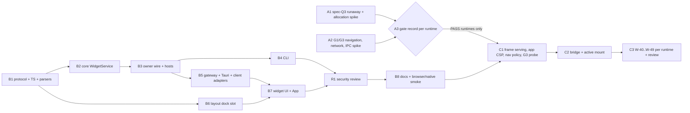

# Agent widgets: implementation plan

Status: plan only; nothing in it is built or run. Authorities, in order: the accepted UX in [`01-ux-spec.md`](01-ux-spec.md) and [`examples/cli-transcripts.md`](examples/cli-transcripts.md), current repository rules (`DECISIONS.md`, `CODE_GUIDE.md`, `.omp/RULES.md`), then this plan. Shared interfaces that slices must not reinvent are in [`examples/implementation-contracts.md`](examples/implementation-contracts.md). The mock and examples in this folder are not evidence (spec section 11). This plan does not change the UX. Section 3 states where the plan narrows or fills in something the spec left open, and section 4 lists what still needs a user decision.

## 1. Outcome

An agent in a Herdr pane runs `cockpit widget show|close|list|selection`, which works as specified in the CLI transcripts. The Cockpit owner runtime keeps widgets in memory, keyed `(Space, tab, id)`. A repeated id replaces the widget in place. Different ids share one dock leaf per tab. A user removal leaves a tombstone, and only `show --reopen` brings the widget back. The publishing agent's own displayed tab docks the widget unselected. Any other target waits behind a tab dot or the Widgets button. Nothing moves DOM focus, Herdr focus, tab or Space. Browser (`cockpit serve`) and native (Tauri) share one core, one owner socket protocol and one `CockpitClient` contract.

**What ships, and what stays gated:**

- **Phase B ships everywhere.** HTML widgets show as an **inert static preview**: the existing `sandbox=""` renderer, with scripts stripped twice. **Declarative choice widgets** are the real selection path: Cockpit renders a list from agent JSON, a click stores the selection, and `cockpit widget selection` reads it.
- **Phase C (active HTML) is gated.** It is built and enabled only on a runtime that passes the Phase A gate record (spec Q3 runaway isolation, G1 navigation and network blocking, IPC isolation) and then the per-start G3 runtime probe. A runtime that cannot prove every gate never mounts agent scripts, and its UI never claims network isolation. My guess is that native WebKitGTK will fail spec Q3 and that Chromium may fail on WebRTC (D14 and OQ2), so Phase C may never start. Phase B is the useful v1 on its own. `[INFERENCE]`

## 2. Evidence

### 2.1 Owner runtime, CLI and core

| # | Fact | Evidence |
| --- | --- | --- |
| E1 | The CLI has `Status`, `Serve`, `Configuration` and `Browser` subcommands. Every error exits with status 1 and prints `cockpit: …`. Nothing yet produces the distinct exit codes the transcripts need. | `crates/cockpit-host/src/bin/cockpit.rs:35-45,478-484` |
| E2 | `--current` checks `HERDR_ENV=1`, runs `herdr pane current --current` with the effective socket or session, and keeps only `pane_id`. Explicit targets need session, socket and `--tab`. | `cockpit.rs:312-392` (guard `329-334`, lookup `336-363`, explicit `373-391`) |
| E3 | The CLI reaches the owner with `BrowserRuntime::connect` (observer). `serve` and native call `BrowserRuntime::start`; only the process that wins the lock becomes owner. | `cockpit.rs:208-228,408-410`; `src-tauri/src/lib.rs:1733-1739`; `browser_runtime.rs:155-306` |
| E4 | The owner socket is a 0700 directory with a 0600 socket. The owner accepts peers with a matching uid, up to 32 at once. Request frames are capped at 6 MiB and response frames at 129 MiB. | `browser_runtime.rs:37-38,53,184-221,259-263` |
| E5 | Wire protocol: `WireRequest`/`WireResponse` are tagged enums. Requests go through `dispatch` in the owner or `forward` in an observer. `serve_peer` already streams one long-lived event channel (`BrowserViewEvents`), and `forward_view_events` relays it for observers. | `browser_runtime.rs:82-116,529-541,823-892,980-1060` |
| E6 | The owner loop runs `BrowserService::reconcile` every 15 s. Reconcile retires a tab only on a fresh snapshot of the same session (endpoint changed, tab absent, or no panes); a failed snapshot is skipped. | `browser_runtime.rs:236-252`; `crates/cockpit-core/src/browser.rs:526-551` |
| E7 | When an observer's read times out or the owner hangs up, `forward` reports `browser_outcome_unknown`. Read timeouts are set per request kind. | `browser_runtime.rs:56-63,944-971` |
| E8 | Fresh-only Herdr authority is `BrowserHerdrAdapter::browser_snapshot(session)` → `{endpoint_identity, endpoint_path, SessionSnapshotResponse}`. Pane → tab → Space resolution and the error codes `invalid_browser_target`, `pane_not_visible`, `space_not_visible` and `stale_endpoint` exist. | `browser.rs:51-77,611-656` |
| E9 | Agent label and fingerprint come from a fresh raw snapshot through `CommentPasteAdapter::comment_paste_targets`. The fingerprint is built from terminal id, agent and agent session. | `crates/cockpit-core/src/paste_adapter.rs:8-13`; `crates/cockpit-herdr/src/paste.rs:196-209` |
| E10 | The Herdr adapter copies a tab's `focused` flag straight from Herdr. Whether it means focused within the Space or focused overall is not established. | `crates/cockpit-herdr/src/cli.rs:261-269`; `crates/cockpit-protocol/src/v1.rs:197-206` |
| E11 | The owner-start reset clears only `browser`, `comments` and `review`. | `crates/cockpit-core/src/ephemeral.rs:7-14` |
| E12 | No HTML parser crate is in the workspace. Security-relevant crates are exact-pinned. | `Cargo.toml:25-55` (no match for `ammonia\|html5ever\|lol_html\|scraper` under `crates/`) |
| E13 | The protocol crate depends only on serde, serde_json and ts-rs, and no DTO carries a `serde_json::Value`. TypeScript declarations are listed explicitly in `render_v1`. | `crates/cockpit-protocol/Cargo.toml:6-9`; `crates/cockpit-protocol/src/typescript.rs:136-334` |

### 2.2 Hosts and transports

| # | Fact | Evidence |
| --- | --- | --- |
| E14 | Gateway routes are merged per module. The authority guard requires the exact Host and, when an Origin header is present, the exact Origin. Mutating requests without an Origin are rejected only on routes that use `require_origin`. | `crates/cockpit-host/src/server.rs:61-67,165-252,279-300` |
| E15 | Browser-view WebSocket routes take `Extension<Option<Arc<BrowserRuntime>>>`. | `crates/cockpit-host/src/browser_view.rs:102-110,171-175` |
| E16 | A new Tauri command must be listed in `build.rs`, carry an `allow-*` permission in `capabilities/default.json`, and be registered in `generate_handler!`. | `src-tauri/build.rs:2-83`; `src-tauri/capabilities/default.json:8-88`; `src-tauri/src/lib.rs:1811-1893`; skill `cockpit-native-smoke-and-limited-worker-fallback` |
| E17 | There is no app CSP: `tauri.conf.json` `security` holds only `capabilities`, and `index.html` sets no policy. Tauri is pinned to `=2.11.5`, and workspace lints forbid `unsafe`. | `src-tauri/tauri.conf.json:25-27`; `index.html:3-8`; `Cargo.toml:54,57-58` |
| E18 | The app never navigates its own window (no `window.open`, `location.href =` or `target="_blank"` under `src/`). | grep over `src/` returned no match |
| E19 | The client contract has stream subscriptions (`subscribeSession`, `openTerminal`, `openBrowserView`). Native streams use Tauri `Channel` plus `cockpit_stream_cancel`; the browser build uses WebSocket. | `src/client/CockpitClient.ts:294-375`; `src/client/native.ts:121-129,394-418,1027`; `src/client/browser.ts:142-146,1130` |
| E20 | External (not verified at runtime here): after CVE-2024-35222, Tauri 2 injects its init script into the main frame only and rejects IPC from uninitialized frames. The advisory recommends against script-enabled iframes on Linux. | GHSA-57fm-592m-34r7 (`https://github.com/tauri-apps/tauri/security/advisories/GHSA-57fm-592m-34r7`) |
| E21 | External: a `srcdoc` frame inherits a copy of its parent's CSP, so a parent `script-src` without `'unsafe-inline'` would block the agent's inline scripts and Mermaid's nonce script. | CSP Level 3 (`https://www.w3.org/TR/CSP/`) |
| E22 | External, unverified: wry's WebKitGTK navigation handler is wired to `decide-policy` for navigation actions, which can include subframes. Its callback sees only the URL, not the frame. | wry source (`https://docs.rs/wry/latest/src/wry/webkitgtk/mod.rs.html`) |

### 2.3 Frontend

| # | Fact | Evidence |
| --- | --- | --- |
| E23 | Leaf kinds are `terminal\|files\|review\|browser`. A viewer leaf id is `${tabId}:${kind}`. `insertViewer` splits 50/50 beside a target and is used together with `selectTabLeaf`. | `src/app/layout/splitTree.ts:3-4,86-92`; `src/app/layout/tabLayoutStore.ts:89-95,142-174` |
| E24 | `closeLocal` removes a viewer and, if that viewer was selected, selects the absorbing sibling. | `tabLayoutStore.ts:75-87` |
| E25 | Retirement effects run only on confirmed loss or a change of server instance. | `src/app/layout/reconcile.ts:39-48,79-93,133-134` |
| E26 | `LeafHost` picks the component by kind. `PaneChrome` owns the badge, the scope chip and the close label. Badge letters live in `PANE_BADGE`. | `src/app/layout/LeafHost.tsx:23-38`; `src/app/layout/PaneChrome.tsx:4,28-45` |
| E27 | `focusLeaf` focuses the leaf's first `[tabindex="0"]` or editable element, so a wrapper with `tabIndex=0` gets focus. `TabCanvas` has an `announce` prop. | `src/app/layout/TabCanvas.tsx:8-16,29-33` |
| E28 | One minimum width applies to every leaf: `MIN_W = 160`. | `src/app/layout/solveLayout.ts:3,14-15` |
| E29 | Tab-strip actions are Browser, Library, LibraryProblems and Commands. The last-terminal confirmation text names "Files, Review and Browser". Commands rows are a local `CommandAction` list. Announcements go through an `aria-live` region. | `src/app/App.tsx:227,229-231,731,949-952,1071,1087,1355` |
| E30 | The inert preview strips `script` and `on*`, uses a meta CSP and `sandbox=""`, and `htmlPreviewDocument` is exported. The Mermaid frame checks `event.source` and a nonce and times out after 5 s. | `src/app/context/HtmlPreview.tsx:1-29`; `src/app/context/MermaidView.tsx:14-27` |
| E31 | Commands-only actions live in the static registry with a `note` and no `prefix`. The keyboard document is generated from `renderShortcutDocs`, and a test fails on drift. | `src/app/input/shortcuts.ts:40-47,126`; `docs/keyboard-shortcuts.md:3,9,100` |

### 2.4 Process rules

| # | Fact | Evidence |
| --- | --- | --- |
| E32 | Disposable fixture: `ui_polish_runtime.py start` creates `/tmp/cpol-*` with private XDG directories, `COCKPIT_CONFIG`, a fixture session and socket, and starts the gateway with `target/debug/cockpit serve`. | `scripts/verify/ui_polish_runtime.py:19-30,103-155` |
| E33 | UI changes are verified in the browser build against a disposable fixture, plus one native run for native changes. Security-relevant work gets one independent review. The user's Herdr session is never used. | `.omp/AGENTS.md:6`; `.omp/RULES.md:5,8`; `CODE_GUIDE.md:72-74` |
| E34 | Generated TypeScript and the checks at integration boundaries. | `CODE_GUIDE.md:59-70` |

## 3. Decisions

| # | Decision | Rejected alternatives |
| --- | --- | --- |
| D1 | **Three phases with a hard gate.** Phase A runs throwaway gate spikes first and records verdicts. Phase B ships static preview plus declarative choices on every runtime. Phase C (active HTML) starts only for runtimes whose Phase A verdict is PASS, and at runtime it mounts active content only after that start's G3 probe passes. Phase B never runs agent scripts, so it can proceed while Phase A runs. | Building active mode first and gating it later, which ships unproven isolation. Holding the whole feature until the spikes finish, which delays a safe, useful v1. |
| D2 | **The owner keeps the widget store in memory only.** No `widgets/` directory, and no change to `ephemeral.rs`. Widgets end with the owner process, which meets the run-local rule (`DECISIONS.md:73-74`) without a new on-disk format or reset path. | A disk store under `state_root/widgets` plus an `ephemeral.rs` reset (spec C10 assumed this): more failure modes, crash leftovers, and a new no-follow deletion scope. |
| D3 | **`WidgetService` is a new core service hosted by the existing owner `BrowserRuntime`.** It gets new wire variants on the same socket and the same owner/observer split (E3–E5). | A second socket or lock for widgets, which means a second owner election. Folding it into `BrowserService`, which mixes unrelated lifecycles. |
| D4 | **CLI operations (`show/close/list/selection`) travel only over the owner socket.** Windows get only `events/content/remove/select/report` over HTTP/WebSocket and Tauri. No HTTP route can publish a widget. | Exposing publish over the gateway, a new loopback write surface the spec does not need. |
| D5 | **Content is copied once.** The CLI reads the file or stdin, sends `content_base64` with its SHA-256 (base64 keeps 1 MiB well under the 6 MiB frame, E4), and the owner preflights and stores the result. Events carry metadata only. A window fetches content with `widgetContent(key, revision)`, and a revision mismatch returns `widget_stale`. | Pushing HTML inside events, which multiplies memory per window and per lagged receiver. Raw JSON strings, where escaping can bloat 1 MiB of control characters past 6 MiB. |
| D6 | **G2 preflight runs in Rust with `html5ever` + `markup5ever_rcdom`** (new exact-pinned dependencies of `cockpit-core`). It applies the strip lists of `HtmlPreview.tsx:7-19`, strips `url()`/`@import` references in `style` that are not `data:`, caps 100 000 nodes and depth 256, produces warnings, and uses `<title>` as the default title. The renderer then sanitizes again with `htmlPreviewDocument` (parser-differential defence). | `ammonia`, which cannot express the Phase C policy (it never allows `script`), so it would mean a second parser later. Renderer-only sanitizing, which gives the agent no warnings and leaves no owner-side G2. |
| D7 | **Static presentation reuses the shipped inert renderer** (E30). The UI claims only "Scripts do not run", backed by script removal in the owner and in the renderer, with `sandbox=""` as a third layer. It makes no network claim. | Claiming network isolation from the meta CSP. |
| D8 | **A declarative choices widget is its own content kind.** `show --choices-file F` (exclusive with `--file`/`--stdin`) uses the schema in contracts §1. Cockpit renders a native radio group, and a click stores `{"id","label"}` as the selection (last write wins). There is no Send control (spec P1) and no agent HTML (spec 5.8 table). Chip text: `◔ omp · choices`. | HTML plus choices in one widget: two presentations to design. A `multiple` mode: each toggle would end `--wait` early. |
| D9 | **The selection travels as canonical JSON text** (`value_json`, ≤ 16 KiB, depth ≤ 32). The CLI embeds it back as `value`. | `serde_json::Value` in ts-rs DTOs, which the protocol crate does not use today (E13). |
| D10 | **`displayed` is computed from window reports.** Each window subscription registers a window (removed when its stream drops) and reports `{session_id, displayed_tab_id, blocker}` whenever that changes. No windows gives `no_window`; cross-source gives `when_opened`; displayed with no blocker gives `now`; displayed with a blocker gives `when_visible`; otherwise `when_tab_selected`. This is the owner's best knowledge at publish time. Each window still decides docking itself (D13). | Guessing from Herdr's focused tab, which cannot see the Library, zoom or a drag (F2). |
| D11 | **Retirement runs on the owner's reconcile tick.** On every 15 s tick (E6), with one fresh snapshot per session, the owner retires a tab's widgets and tombstones when the endpoint changed, the tab is absent, or the tab has no panes. A failed snapshot retires nothing. Waiters get `retired`. Every CLI operation also revalidates against a fresh snapshot. The source status (`present/closed/restarted`) is recomputed on the same tick from the paste adapter's fingerprints. The trade-off: a closed tab can take up to one interval to retire. | A retirement path driven by the frontend, which fails when no window is open (F7). |
| D12 | **One CLI error type.** `cockpit.rs` gets a `CliError { exit: i32, text: String }`. Existing commands keep exit 1 and their `cockpit: …` text. Widget failures print `error: <code>: <message>` and use the contracts §4 table. | Calling `process::exit` from inside `run_widget`, which skips the owner-observer shutdown. |
| D13 | **The frontend splits widget state from layout.** Docking, presence and the current id live in the layout store as a `viewers.widget` dock slot (B8 container). Summaries, order, the unseen/undisplayed/awaiting-click sets, the content cache and window reports live in a new per-client module, `src/app/widgets/widgetStore.ts` (same `WeakMap` pattern as `browserLifecycle.ts:6-13`). Spec F1–F9 is a pure `decideArrival` with unit tests. Docking never calls `selectTabLeaf`. | Widget data in the layout reducer, which mixes owner facts with local placement. |
| D14 | **The Phase C candidate mechanism is fixed now (M1).** It is built only after Phase A proves it: (a) the frame document is served by the host from a per-mount single-use token URL (gateway `/widget-frame/<token>`; native custom scheme `cockpit-widget`) with a **response-header** CSP that includes the CSP `sandbox allow-scripts` directive and `connect-src 'none'`, plus `sandbox="allow-scripts"` on the element; (b) the app document carries a CSP made of **only** `frame-src` (and `child-src`), which limits every subframe navigation to the widget-frame source, so `srcdoc` frames such as Mermaid and HTML preview keep working; (c) native adds a Tauri plugin `on_navigation` allowlist (app origin, live widget tokens, `about:srcdoc`, `about:blank`; everything else is denied and counted); (d) on every start, the G3 runtime probe loads a host-authored probe frame. Its verdict comes from host-side observers (a canary listener, gateway/scheme logs, the navigation-deny log, Tauri IPC logging) plus a bounded 400 ms busy-loop responsiveness check measured by the trusted parent. | `srcdoc` with a meta CSP only: request blocking would live inside the agent document and navigation would not be blocked (spec S2/S4). A full app CSP (`script-src` …): `srcdoc` inheritance (E21) would force `'unsafe-inline'` on the IPC-bearing main window and break Mermaid's nonce frame. A separate Tauri webview per widget: no browser-build equivalent and a new window/focus model (spec O1-D). The Browser leaf: needs a server and URL (spec O1-B). |
| D15 | **Caps** (contracts §1): 1 MiB HTML, 64 KiB choices, 16 KiB selection, 8 live widgets and 64 tombstones per tab, 64 MiB of HTML per owner, 6 creates or reopens per source per minute (replacements are never rate-limited), at most 8 concurrent `--wait` calls so waits cannot exhaust the 32 peer slots (E4). | Rate-limiting replacements, which would break the "refine" loop. |
| D16 | **Commands.** `Show widgets`, `Next widget`, `Previous widget` and `Remove widget` are static Commands-only registry entries (E31). `Go to widget…` becomes one dynamic App Commands row per widget, `Go to widget: <title> — <Space> · <tab>`, which selects the tab through the existing tab-selection path. | A new picker dialog (more UI for no gain). Fake static registry entries (CODE_GUIDE forbids them). |
| D17 | **One current-pane resolver** in `cockpit.rs`, used by both `browser` and `widget`. It is lifted unchanged out of `run_browser` (`cockpit.rs:313-363`). | A copied resolver. |
| D18 | **Dock placement.** The dock is inserted beside the source pane, or the tab's last real terminal when there is no source in the tab, with `splitLeaf(..., share = tab.widgetShare)` (default 0.4). The share is remembered when the dock is removed, for the rest of the run. The too-narrow blocker applies when `besideWidth * share < 320`. The global `MIN_W` is unchanged. | A per-kind minimum in `solveLayout` (wider blast radius). Root-edge insertion (the dock would not sit beside the conversation). |

## 4. Open questions

The default in each row is what the slices implement unless the user overrides it.

| # | Question | Options | Recommendation / default used |
| --- | --- | --- | --- |
| OQ1 | Choices schema and CLI flag (the spec defers the schema to its Q15) | (a) `--choices-file` plus the schema in contracts §1; (b) choices embedded in the HTML; (c) no choices in v1 | **(a)**. It is the only safe selection path while active mode is gated. |
| OQ2 | Channels the CSP cannot block (WebRTC/STUN, DNS prefetch) | (a) strict: any unblocked exercised channel fails G1 on that runtime; (b) accept as a documented residual and narrow the wording | **(a)**, as the contract says ("only if all … network … gates proved"). Expect Chromium to fail on WebRTC unless Phase A shows otherwise. |
| OQ3 | Popover `Blocked` counts and the "navigation blocked" overlay when the host cannot tell which frame was blocked (E22) | (a) show them only where per-mount attribution is proven (per-token CSP `report-uri`); (b) count per window | **(a)**. Show nothing rather than a misattributed number. "Left its page" (iframe `load` count above 1) and "not responding" stay. |
| OQ4 | Exit status of `selection` returning `dismissed` | 0 with a status; 15 | **0 with `status: "dismissed"`.** The transcript prints JSON with no error line. |
| OQ5 | `presentation` values | `active`/`static_preview` only; add `choices` | **Add `choices`** for choice widgets. It is an extension of the transcript contract. |
| OQ6 | Dock width rule (spec 4.1 says both "beside the source pane" and "40% of the canvas") | 40% of the source pane's slot; 40% of the canvas | **Beside the source pane, 40% of its slot (D18)**. With one terminal the two are identical. |
| OQ7 | Running the CLI from a fixture pane needs that pane's environment to reach the fixture's owner (`COCKPIT_CONFIG`, XDG) | inherit from the fixture Herdr server; pass `--config` explicitly | **Verify inheritance in B8 step 2. If it is missing, pass `--config <root>/cockpit.toml`.** Never fall back to the user's configuration. |

## 5. Critical path



Parallel groups: {A1, A2, B1}, then {B2, B6}, then {B4, B5} after B3. The critical path is B1 → B2 → B3 → B5 → B7 → R1 → B8. Phase C cannot start before both A3 and B8.

## 6. Slices

Rules for every slice: no mid-flight project-wide builds, tests, formatters or linters (Main validates once after a group lands). A scoped run of the slice's own tests is allowed. Use only the disposable fixture and never the user's Herdr session. Contracts §1–§6 are fixed, so a slice that thinks one is wrong messages Main instead of changing it.

### Phase A — gate spikes (throwaway code, evidence only; nothing merges)

Both spikes run in a throwaway worktree (`git worktree add ../cockpit-widget-spike HEAD`). Each uses its own fixture root from `python3 scripts/verify/ui_polish_runtime.py start` and its own gateway port. Native runs follow the private-compositor and WebKitWebDriver recipe in skill `cockpit-native-smoke-and-limited-worker-fallback`. Runtimes to cover: **native release build** (`frontendDist`), **native debug** (`devUrl`, which may handle CSP differently, `tauri.conf.json:9`), and **browser build in Chromium** (Playwright). Evidence goes to `planning/agent-widgets-2026-10-01/evidence/` (new folder). The worktree, canary processes and fixtures are removed afterwards.

#### A1 — spec Q3: runaway script and large allocation

- **Goal:** for each runtime, decide whether a script-running frame can freeze Cockpit or crash it.
- **Setup:** a throwaway `TestFrame` leaf (spike only) mounts three frame variants:
  - V1 `srcdoc` + `sandbox="allow-scripts"`, the Mermaid shape;
  - V2 a host-served URL on the app origin (gateway route / native custom scheme);
  - V3, browser build only, a host-served URL on a different site (`http://localhost:<port>/…` while the app runs on `127.0.0.1:<port>`; a throwaway Host exception for that one path) to test whether an out-of-process frame avoids the freeze. `[INFERENCE]`
  
  One fixture terminal runs `while true; do date +%s.%N; sleep 0.05; done`.
- **Steps:**
  1. Load `<script>while(true){}</script>` in each variant.
  2. For 10 s, sample main-page responsiveness from the driver every 200 ms (Playwright `page.evaluate(() => performance.now())` with a 1 s timeout; WebDriver `execute_script`), whether terminal text keeps advancing, and whether a click on the terminal pane header and a `Ctrl+B Tab` still respond.
  3. Remove the frame from the driver and record recovery.
  4. Repeat with `const a=[]; for(;;) a.push(new Uint8Array(64<<20))`. Record whether the frame dies alone or the whole renderer crashes or gets OOM-killed (native: count and RSS of `WebKitWebProcess`; Chromium: `page.on('crash')` and the process list).
  5. Run the bounded responsiveness probe: the frame busy-loops for 400 ms while the trusted parent records the longest gap of a 10 ms `setInterval`. Record whether a gap ≥ 200 ms matches the freeze seen in step 2. This validates D14(d).
- **Verdict per runtime and variant:** `ISOLATED` (main page, terminals and input live; only the frame dies) or `SHARED`.
- **Non-goals:** any product code; mitigations beyond V3.
- **Acceptance:** `evidence/A1-runaway.md` has the table, the commands, raw timing samples, and screenshots before and after for each runtime and variant.

#### A2 — spec Q4/G1/G3: navigation, network and IPC, with a G3 probe prototype

- **Goal:** for each runtime, prove or disprove that mechanism M1 (D14) blocks every exercised navigation and request **outside the agent document**, and that the frame has no Tauri IPC and no gateway authority.
- **Throwaway build:**
  - Gateway: `GET /widget-frame/<token>` serving a host-built document with the header CSP `sandbox allow-scripts; default-src 'none'; script-src 'unsafe-inline'; style-src 'unsafe-inline'; img-src data:; font-src data:; media-src data:; connect-src 'none'; frame-src 'none'; child-src 'none'; worker-src 'none'; form-action 'none'; base-uri 'none'; object-src 'none'; manifest-src 'none'; report-uri /widget-frame/<token>/csp`, plus `Referrer-Policy: no-referrer`, `X-Content-Type-Options: nosniff` and `Cache-Control: no-store`. The token is single-use.
  - The `index.html` response carries a CSP made only of `frame-src <frame source>; child-src <frame source>; report-uri /api/v1/widgets/csp-report`.
  - Native: an inline Tauri plugin that registers `cockpit-widget` with the same document and headers, `app.security.csp` set to the matching `frame-src` (test the `cockpit-widget://localhost` and `http://cockpit-widget.localhost` forms), and `on_navigation` that allows only the app origin, live tokens, `about:srcdoc` and `about:blank`, and logs every denial.
  - A canary listener outside the webview (Python or Rust): HTTP on a free loopback port that logs every request, plus UDP on another port for STUN.
- **Probe document (host-authored; attempts each and posts `{done, attempts}` to its parent):**
  - Navigation: `location=` canary and `https://example.test/`, a meta refresh inserted through the DOM, `a.click()` on a link to the canary, `window.open`, `form.submit()` to the canary, `top.location`, a `history.pushState` to another origin.
  - Requests: fetch, XHR, WebSocket, EventSource, `sendBeacon`, `img`, CSS `background:url()`, `@import`, `@font-face`, `<link rel=prefetch|dns-prefetch>` (inserted through the DOM), `new Worker(blob:)`, `navigator.serviceWorker.register`, `RTCPeerConnection` with STUN to the canary's UDP port.
  - APIs: `alert/confirm/print`, `localStorage`, `document.cookie`.
  - IPC and parent access: `window.__TAURI_INTERNALS__`, `window.ipc`, `window.webkit?.messageHandlers`, `fetch('ipc://localhost/cockpit_status')`, `fetch('http://ipc.localhost/cockpit_status')`, a Tauri-shaped `parent.postMessage` (the spike parent logs and ignores it), `parent.document`.
  - Gateway: `GET /api/v1/status` and `/api/v1/sessions`, WS `/api/v1/sessions/x/events`, ``, POST to a mutating route.
- **Observers (host side; the verdict never comes from the probe's own report):**
  - canary TCP and UDP hit logs;
  - the gateway access log, filtered to requests from the frame;
  - the native navigation-deny log and custom-scheme request log;
  - Tauri command execution (a throwaway `eprintln!` in a wrapper around `cockpit_status`, or Tauri IPC tracing);
  - the trusted parent's count of iframe `load` events.
- **Positive controls:** (1) a permissive control frame (no CSP headers, no sandbox, navigation allowed) must hit the canary for every attempt type, which proves each observer can see traffic; (2) the probe's `done` message proves its script ran.
- **Regression controls with the app CSP on:** Cockpit loads, native IPC works (session list, terminal attach), a Mermaid diagram renders, the Files HTML preview renders, and the Browser leaf canvas shows a page. Check specifically whether Tauri's CSP rewriting adds a `script-src` that breaks the bundle; if so, record the `dangerousDisableAssetCspModification` setting that fixes it.
- **Verdict per runtime:**
  - `PASS` requires all of these: zero canary TCP and UDP hits from the protected frame; the gateway saw only the one document GET; no Tauri command ran; the parent's load count stayed at 1; the control frame produced hits; the regression controls work.
  - Anything else is `FAIL`, with the failing attempts listed (OQ2 default: an unblocked WebRTC hit is a FAIL).
- **G3 feasibility:** also run the probe automatically at app start in the spike build and record how long the host-side verdict takes and whether anything shows to the user.
- **Non-goals:** product code, the bridge, active widgets.
- **Acceptance:** `evidence/A2-isolation.md` with each attempt × runtime × observer result, both controls, the regression checks, the exact header and CSP strings, and the Tauri configuration used.

#### A3 — gate record (Main)

- **Goal:** `evidence/gates.md` lists, for each runtime, A1 (`ISOLATED` with which variant, or `SHARED`), A2 (`PASS`/`FAIL`) and the resulting **active mode allowed: yes/no**.
- **Rule:** yes only when A1 is `ISOLATED` **and** A2 is `PASS`.
- If no runtime gets a yes, Phase C is not started, and DECISIONS.md (B8) records that active HTML is unavailable, with the evidence path.

### Phase B — v1 for every runtime (static preview + declarative choices)

#### B1 — Protocol, TypeScript export and client parsers

- **Goal:** the shared contract (contracts §1).
- **Files and symbols:**
  - new `crates/cockpit-protocol/src/widget.rs`;
  - `crates/cockpit-protocol/src/lib.rs` (`pub mod widget`);
  - `crates/cockpit-protocol/src/typescript.rs` (one `decl` per new type in `render_v1`);
  - regenerated `src/protocol/generated/v1.ts`;
  - new `src/client/widgetProtocol.ts` (`parseWidgetEvent`, `parseWidgetSummary`, `parseWidgetContent`, `parseWidgetRemoveResponse`, `parseWidgetSelectResponse`, `matchWidgetContent(value, request)` for key and revision identity) and `src/client/widgetProtocol.test.ts`.
- **Steps:**
  1. Define the DTOs and the limit constants exactly as in contracts §1, with no Phase C variants.
  2. Add the decls.
  3. Regenerate with `cargo run -q -p cockpit-protocol --bin export-typescript -- --write src/protocol/generated/v1.ts` (CODE_GUIDE:62).
  4. Write parsers in the style of `quotaProtocol.ts`: bounded strings (id ≤ 48, title ≤ 80, warning ≤ 512, at most 32 warnings), reject unknown enum values, and a size check on `value_json`.
- **Non-goals:** transports, service logic.
- **Acceptance:** the protocol exporter `--check` passes; `widgetProtocol.test.ts` covers a well-formed event of each kind, unknown `type` → `malformed_response`, an oversized title, and a content identity mismatch.

#### B2 — Core `WidgetService` (store, targeting, preflight, choices, waiters, retirement)

- **Goal:** all owner semantics of spec 3.4–3.8 and 5.6, Herdr-pure and testable with fakes.
- **Files:**
  - new `crates/cockpit-core/src/widget.rs` (the service API in contracts §2);
  - `crates/cockpit-core/src/widget/store.rs` (`Store`, `TabWidgets`, `Widget`, `Tombstone`, windows registry, rate windows);
  - `widget/target.rs` (resolution);
  - `widget/preflight.rs` (D6);
  - `widget/choices.rs` (schema validation and the choice value);
  - `widget/text.rs` (plain-text sanitizing: strip C0/C1 and bidi controls U+202A–U+202E and U+2066–U+2069, collapse whitespace, truncate with `…`);
  - `crates/cockpit-core/src/lib.rs` (`pub mod widget`);
  - `crates/cockpit-core/Cargo.toml` (`html5ever`, `markup5ever_rcdom`, exact-pinned).
- **Store model:**
  - The tab key is `(endpoint_identity, session_id, tab_id)`.
  - Each `TabWidgets` holds `space_id`, `live: Vec<Widget>` in `created_seq` order, and `tombstones: VecDeque<Tombstone>` (≤ 64, oldest dropped).
  - A `Widget` holds:
    - identity and text: `id`, `title`, `revision`, `created_seq`;
    - content: `kind`, `sha256`, `bytes`, `from`, `name`, `body` (preflighted document or `WidgetChoicesSpec`), `warnings`;
    - source and targeting: `source: Option<SourceRecord{pane_id, tab_id, space_id, terminal_id, agent_label, fingerprint}>`, `arrival`, `resolved_from`;
    - time and selection: `created_at_ms`, `updated_at_ms`, `selection: Option<{revision, value_json, at_ms}>`, `selection_read_at_ms`.
  - A `Tombstone` holds `{id, revision, removed_at_ms, source_key}`.
  - The source key is the fingerprint when there is one, else `pane:<pane_id>`, else `unattributed`.
  - The lock is `parking_lot::Mutex`. Herdr calls happen **outside** it, and every check is repeated under the lock before mutating.
- **Targeting** (spec 3.5.2 and 3.5.4):
  1. Take one fresh `browser_snapshot(session)`. Check the session and `endpoint_path` (`stale_endpoint` → `widget_target_not_found`, with the message "Herdr endpoint differs from Cockpit's").
  2. Resolve the source pane if given (absent → `widget_target_not_found`).
  3. Resolve the locator:
     - `CurrentPane` → the source pane's tab;
     - `Pane` → that pane's tab;
     - `Tab` → the tab must exist and have a pane;
     - `Space` → if a live widget or tombstone with this id from the same source already exists in that Space, use its stored tab (`resolved_from: stored`); otherwise the single tab in the Space with `focused == true`, and zero or several such tabs → `widget_target_no_focused_tab`.
  4. Check `space_check` → `widget_target_mismatch`.
  5. A stored widget whose tab now reports a different `space_id` → `widget_target_changed` (the widget stays readable).
  6. Arrival is `OwnTab` iff a source exists and `source.tab_id == target tab`.
  7. Fetch the agent label and fingerprint through `comment_paste_targets(session)`. A source pane that is not an agent is allowed and simply has no fingerprint.
  8. Any adapter error that is not a `widget_*` code → `widget_herdr_unavailable`.
- **Show:**
  1. Validate the id slug.
  2. Decode the base64 and check the SHA-256 (mismatch → `widget_usage`). Validate UTF-8 and the size.
  3. Run the preflight or choices validation.
  4. Under the lock, if the id is live: a different source key → `widget_not_owner`; an identical SHA → `Unchanged` (no event); otherwise `Replaced` with `revision + 1`, the selection kept unless `clear_selection`, the order kept, and `Upserted{change: replaced}`.
  5. If the id is tombstoned: without `reopen` → `widget_dismissed`, with the removal time and revision in the message (the exact transcript text). With `reopen`: drop the tombstone, revision = tombstone revision + 1, empty selection, new `created_seq`, `Reopened`.
  6. If the id is new: check the tab cap (8), the global byte cap (64 MiB) and the rate cap (6/min per source key, creates and reopens only).
  7. Compute `displayed` per D10 and `location` from the Herdr Space label and the tab number.
  8. Warnings: preflight warnings; `unattributed: …` when there is no source; `target tab <id> is not Herdr's focused tab; the user will see only that tab's marker` when the target tab is not `focused`.
- **Close:** Remove with no tombstone and emit `Removed{Agent}`. Unknown, already removed or tombstoned ids → `AlreadyRemoved`, and no tombstone is created. A different source → `widget_not_owner`.
- **List:** Return live widgets and tombstones in the target tab whose source key matches the caller's.
- **Selection:**
  - Not found → `widget_target_not_found`. Tombstoned → `Dismissed` with `removed_at`.
  - An HTML widget in Phase B → `widget_selection_unavailable`.
  - Otherwise return `None` or `Selected` at once and set `selection_read_at_ms` (emitting `Upserted{updated}`).
  - With `wait_seconds`, wait on the broadcast for this key until a selection (`Selected`), a removal (`Dismissed` for a user removal, a not-found result for an agent close), retirement (`Retired`) or the timeout (`Timeout`).
  - More than 8 waiters → `widget_busy`. A lagged receiver re-reads the state under the lock.
- **Window operations:**
  - `subscribe` mints a `window_id` and returns the snapshot plus a receiver; the guard's `Drop` deregisters the window.
  - `report_window` updates the registry.
  - `content` returns the body, or `widget_stale` when the revision differs.
  - `remove` creates the tombstone and emits `Removed{User}`.
  - `select` with `Choice{choice_id}` requires a choices widget, the current revision (else `widget_stale`) and a known choice id (else `widget_usage`). It stores `{"id","label"}` and emits `Upserted{updated}`.
- **Reconcile:**
  - Per session: one fresh snapshot plus paste targets.
  - Retire per D11.
  - Recompute the source status: pane absent → `Closed`; fingerprint differs → `Restarted`; else `Present`. Emit only on a change.
  - A failed snapshot does nothing.
  - `shutdown` resolves every waiter with `Retired`.
- **Preflight:**
  - The static policy removes `script`, `noscript`, `template`, `iframe`, `frame`, `frameset`, `object`, `embed`, `applet`, `base`, `form`, `meta`, `link`, `portal` and the SVG `animate`, `set`, `animateMotion`, `animateTransform`, `mpath` and `foreignObject`.
  - It removes the attributes `on*`, `action`, `formaction`, `href`, `xlink:href`, `src` (except `data:image/(avif|gif|jpeg|png|webp)`), `srcset`, `srcdoc`, `target`, `ping`, `background` and `poster`. In `style` attributes and elements it rewrites any non-`data:` `url(...)` and every `@import`.
  - Each external URL produces the warning `external_reference_removed: <url> (preflight stripped it; scripts do not run in the static preview)`, deduplicated and capped at 20. Removed scripts produce one `scripts_not_run: <n> script(s) removed; this runtime shows a static preview`.
  - More than 100 000 nodes or depth beyond 256 → `widget_too_complex`.
  - The output is the serialized sanitized document.
- **Tests** (Rust unit tests in the modules, using a fake `BrowserHerdrAdapter` and `CommentPasteAdapter` like `browser/lifecycle_tests.rs:10-14`, and a fake clock):
  - Lifecycle: a same-id replace keeps the order, keeps the selection, and bumps the revision; identical bytes → `Unchanged` with no event; user removal → tombstone, then a plain `show` → `widget_dismissed` carrying the time and revision; `--reopen` continues the revision with an empty selection and appends to the order; agent `close` → no tombstone, and a second close gives `AlreadyRemoved`.
  - Ownership and caps: a different source → `widget_not_owner`; the ninth live id → `widget_limit`, and a replace does not count; the seventh create in one minute → `widget_rate_limited`, while replaces are not limited; the 65th tombstone drops the oldest.
  - Targeting:
    - every row of spec 3.5.2;
    - `--space` with a stored tab (`resolved_from: stored`);
    - `space_focused_tab` with zero or two focused tabs;
    - a mismatch;
    - an endpoint mismatch;
    - a target in another tab → `CrossSource` plus the not-focused warning.
  - Retirement:
    - a tab that is absent, has no panes, or whose endpoint changed is retired, and waiters get `Retired`;
    - a failed snapshot retires nothing;
    - the source status moves to closed or restarted.
  - Selection: `None` → `Selected` with `read_at` set; a waiter returns on a select, on a user removal (`Dismissed`) and on a timeout; a ninth waiter → `widget_busy`; choice validation; an HTML widget → `widget_selection_unavailable`.
  - Preflight: each banned element and attribute; a `<meta http-equiv=refresh>`; external `src`/`href`/`url()`/`@import` → stripped with warnings; mixed-case and namespaced tags (`<SCRIPT>`, `<svg><script>`); malformed nesting; node and depth caps; the title default.
  - Text: bidi and control stripping; the 80-character truncation.
- **Non-goals:** sockets, hosts, CLI, UI, any active policy.
- **Acceptance:** `cargo test -p cockpit-core widget` passes (scoped run by this slice is allowed).

#### B3 — Owner runtime wiring and host composition

- **Goal:** make `WidgetService` reachable from the CLI and from windows through the existing owner/observer runtime.
- **Files:**
  - `crates/cockpit-host/src/browser_runtime.rs` (wire variants, `dispatch`, `serve_peer` streaming branch, read timeouts, the `widget_*` methods, a `widgets.reconcile()` call in the owner tick, `widgets.shutdown()` in `shutdown`, and `start(state_root, service, widgets)`);
  - `crates/cockpit-host/src/bin/cockpit.rs`, lines `browser_owner_runtime` `208-228` only (construct `WidgetService::new(adapter.clone(), adapter.paste_adapter())`), plus whatever `run_browser` needs to keep compiling after the `start` signature change (none: it uses `connect`);
  - `src-tauri/src/lib.rs`, lines `1721-1739` only (construct and pass it);
  - `browser_runtime.rs` tests.
- **Interface:** contracts §3.
- **Steps:**
  1. In the owner, call `self.widgets` directly; in an observer, `forward`. For `WidgetEvents`, the owner path returns an in-process subscription, and the observer path mirrors `forward_view_events` (the first frame is `WidgetSubscribed{window_id}`, then the `Snapshot` event).
  2. `serve_peer` streams events until the peer reaches EOF, then drops the guard.
  3. Map an observer's `browser_outcome_unknown` on `WidgetSelection` to `widget_retired`.
- **Non-goals:** HTTP and Tauri commands (B5), CLI (B4).
- **Acceptance:**
  - Owner and observer tests in `browser_runtime.rs` with an in-memory service fake: an observer `widget_show` reaches the owner store; an observer event stream receives `Snapshot` and then `Upserted`; closing the observer stream deregisters its window (`displayed` returns to `no_window`); owner shutdown wakes a forwarded `--wait` with `widget_retired`.
  - The existing reset test (`browser_runtime.rs:1361-1389`) still passes, unchanged.

#### B4 — CLI `cockpit widget`

- **Goal:** the grammar, ingestion, output and exit codes of the transcripts.
- **Files:**
  - `crates/cockpit-host/src/bin/cockpit.rs` (`Command::Widget`, `WidgetArgs`/subcommands, `run_widget`, `CliError` per D12, and the shared `resolve_current_pane` lifted from `run_browser` per D17, which `run_browser` then calls);
  - new `crates/cockpit-host/src/widget_cli.rs` (input reading, address building, output rendering, the exit table, RFC 3339 formatting);
  - `crates/cockpit-host/src/lib.rs` (`pub mod widget_cli`).
- **Grammar:**
  ```
  cockpit widget show --id ID [--title T] (--file P | --stdin | --choices-file P) [--reopen] [--clear-selection] TARGET
  cockpit widget close --id ID TARGET
  cockpit widget list TARGET
  cockpit widget selection --id ID [--wait [--timeout SECONDS]] TARGET
  TARGET := [--current | --pane P | --tab T] [--space S] [--herdr-session …] [--herdr-socket …] [--herdr …] [--config P]
  ```
  `--current` conflicts with `--pane` and `--tab`, and `--pane` conflicts with `--tab` (clap). `--id` is `Option` and is validated by hand, so that a missing or invalid id prints the transcript wording `widget_usage: --id is required`. Exactly one content flag; `--timeout` defaults to 300 and is capped at 3600; `--timeout` without `--wait` is a `widget_usage` error.
- **Address rules** (spec 3.5.2):
  - `HERDR_ENV=1` with no target flag → `CurrentPane` with the resolved source.
  - `--current` without `HERDR_ENV=1` → `widget --current requires HERDR_ENV=1 in the inherited Herdr caller environment` (exit 2).
  - Explicit flags with `HERDR_ENV=1` → the source is the resolved current pane, and a failed lookup is an error.
  - Explicit flags without it → no source; a session and a socket are required (same messages as `cockpit.rs:374-385`, with the wording adapted to widgets).
  - Neither → `widget_target_required` with the transcript text.
  - `COCKPIT_*` values other than the `HerdrArgs` env fallbacks are never read for targeting.
- **Ingestion** (spec 3.5.6): open the path, `fstat` must report a regular file (directory, FIFO, `/dev/zero` → `widget_usage: --file must be a regular file`), read at most limit + 1 bytes (over the limit → `widget_too_large: <size> exceeds the 1 MiB limit…`, exit 21, before connecting), validate UTF-8, compute SHA-256, keep the basename only. `--stdin` on a TTY (`std::io::IsTerminal`) → `widget_usage: --stdin needs piped input`. `--choices-file` is read the same way with the 64 KiB limit and JSON-parsed locally (malformed → `widget_usage`).
- **Connect:** `BrowserRuntime::connect` as `run_browser` does (`cockpit.rs:393-410`). `browser_owner_unavailable`/`browser_owner_timeout` → `widget_no_owner`, with the transcript text.
- **Output:** contracts §4.
- **Tests** (`#[cfg(test)]` in `cockpit.rs` and `widget_cli.rs`):
  - clap conflicts and the usage errors;
  - the regular-file and TTY checks (using a temporary directory, a FIFO via `nix::unistd::mkfifo`, and `/dev/zero`);
  - the size limit applied before connecting;
  - the exit table mapping;
  - RFC 3339 formatting (epoch, leap day, `2026-10-02T14:03:07Z`);
  - an unchanged `browser --current` lookup via the shared resolver (pure parsing of a captured `herdr pane current` JSON).
- **Non-goals:** owner semantics (B2).
- **Acceptance:** the scoped `cargo test -p cockpit-host widget` passes, and `cockpit widget --help` shows the agent rules from transcripts §2 and §6 as `long_about` (this is the agent-side guide; there is no new doc file).

#### B5 — Window transports and client adapters

- **Goal:** windows can subscribe, report, fetch content, remove and select, with the same behavior in the browser and native builds (C11).
- **Files:**
  - new `crates/cockpit-host/src/server/widgets.rs` (`routes()`);
  - `crates/cockpit-host/src/server.rs` (one `mod widgets;` line and one `.merge(widgets::routes())` line);
  - new `src-tauri/src/widgets.rs` (commands);
  - `src-tauri/src/lib.rs` (`mod widgets;` plus five names in `generate_handler!`);
  - `src-tauri/build.rs` (five command names);
  - `src-tauri/capabilities/default.json` (`allow-cockpit-widget-subscribe`, `-report`, `-content`, `-remove`, `-select`);
  - `src/client/CockpitClient.ts` (interface plus type re-exports);
  - `src/client/native.ts` and `src/client/browser.ts` (adapters);
  - `src/client/client.test.ts` (adapter cases).
- **Gateway:**
  - `GET /api/v1/widgets/events` is a WebSocket that sends `WidgetEvent` text frames. It accepts client `WidgetWindowReport` frames of at most 4 KiB, applied with `runtime.widget_report(window_id, …)`; anything malformed closes the socket with code 1008.
  - `POST /api/v1/widgets/content`, `POST /api/v1/widgets/remove` and `POST /api/v1/widgets/select`; the last two use the `require_origin` layer, as `server.rs:212-217` does.
  - Without a runtime (`--test-mode`), every route returns `widget_no_owner`.
  - A lagged receiver ends the stream with close code 1011, and the client resubscribes and gets a fresh `Snapshot` (CODE_GUIDE:3, "resnapshot on gaps").
- **Tauri:**
  - `cockpit_widget_subscribe(channel)` registers in `StreamRegistry` and relays events to the channel; a lagged receiver or a closed stream ends it and sends an error message.
  - `cockpit_widget_report(stream_id, report)`.
  - `content/remove/select` forward to the runtime.
- **Client:** contracts §5. `report` coalesces to at most one send per 100 ms and resends the last report after a reconnect.
- **Non-goals:** UI.
- **Acceptance:**
  - `client.test.ts` cases for both adapters: subscribe yields a parsed `Snapshot`; a malformed event → `malformed_response` and the stream closes; `report` is coalesced; content identity is matched.
  - A server test in the host crate's tests: `remove` without an Origin is refused; a WebSocket upgrade with a foreign Origin is refused (existing guard).

#### B6 — Layout dock slot (pure layout state)

- **Goal:** the dock exists as a tab-local leaf that is never selected by arrival.
- **Files:**
  - `src/app/layout/splitTree.ts` (`ViewerKind += "widget"`, `splitLeaf(..., share)`);
  - `src/app/layout/tabLayoutStore.ts` (`WidgetDockSlot`, `widgetShare`, the actions in contracts §6, `insertViewer(..., share)`, `closeLocal` for `widget`, and recording `previousSelectedLeafId` when `select-leaf` selects the dock);
  - `src/app/layout/reconcile.ts` (new tabs initialise `widgetShare: 0.4`; `retirement()` is unchanged, because the owner retires the store, D11);
  - `src/app/styles.css` (`--pane-kind-widget: #cba6f7`);
  - `src/app/layout/tabCanvas.css` (the `[data-kind="widget"]` badge/rule colour next to the existing kinds);
  - tests `splitTree.test.ts`, `tabLayoutStore.test.tsx`, `reconcile.test.ts`.
- **Steps:**
  - `widget/dock` inserts `${tabId}:widget` beside `besideLeafId` with `share = widgetShare` and sets `currentId`. `selectedLeafId`, `selectionRevision`, `zoomLeafId` and `lastRealLeafId` stay unchanged. It is a no-op if the beside leaf is missing.
  - `widget/current` updates the id only.
  - `widget/undock` first stores the dock's weight share, then removes the leaf. If the dock was selected, it selects `previousSelectedLeafId` when that leaf still exists, else the beside terminal. Otherwise the selection is untouched.
- **Tests:**
  - dock does not change the selection or the selection revision;
  - the share 0.4 is applied and a remembered share is reused;
  - undock with the dock unselected → the selection is unchanged;
  - undock with the dock selected → the previous leaf is selected;
  - dock while zoom is on another leaf leaves the zoom unchanged (the arrival decision prevents this case, and the reducer stays neutral);
  - `closeLocal` deletes `viewers.widget`.
- **Non-goals:** components and App.
- **Acceptance:** the scoped vitest run of the three files passes.

#### B7 — Widget UI, store and App integration

- **Goal:** spec sections 4 and 5 for static and choices presentation.
- **Files:**
  - new `src/app/widgets/{widgetStore.ts, arrival.ts, WidgetDock.tsx, WidgetFrame.tsx, WidgetChoices.tsx, WidgetTabs.tsx, WidgetChip.tsx, widgets.css}` with tests `arrival.test.ts`, `widgetStore.test.ts` and `WidgetDock.test.tsx`;
  - `src/app/layout/LeafHost.tsx` (the widget branch);
  - `src/app/layout/PaneChrome.tsx` (`PANE_BADGE.widget = "W"`; optional `titleContent` and `controls` render slots; no `pane-scope` chip for `widget`; close label `Remove widget: <title>`);
  - `src/app/App.tsx` (tab dot, conditional Widgets button, Commands rows, `closeLeaf` for the widget leaf, the last-terminal text at `731` → "Files, Review, Browser and widgets", announcements, the subscription, blockers and window reports);
  - `src/app/input/shortcuts.ts` (`show-widgets`, `next-widget`, `previous-widget` and `remove-widget` as Commands-only entries with notes);
  - `docs/keyboard-shortcuts.md` (regenerate the block between `shortcuts:begin` and `shortcuts:end` from `renderShortcutDocs`).
- **widgetStore:**
  - One subscription per client and session (`subscribeWidgets`).
  - State: `byKey`, the per-tab order (`created_seq`), `undisplayedOwn` (tab dots), `awaitingClick` (Widgets button), `unseen` (dots in the header) and `everDisplayed`. The content cache holds only docked widgets and is dropped when a widget is removed or replaced.
  - `useSyncExternalStore` hooks.
  - It reports `{session_id, displayed_tab_id, blocker}` whenever the selected tab, Library state, zoom, drag (`body.is-pane-dragging`), narrowness (D18) or `document.visibilityState` changes.
  - On a `Snapshot` after a reconnect, it reapplies arrival for widgets this window has never displayed.
- **arrival.ts:** `decideArrival` (contracts §6) encodes F1–F9 and the current-widget rule (spec 4.4: a new or reopened id becomes current unless `focusInsideFrame`, i.e. `document.activeElement` is this dock's iframe).
- **Docking:**
  - A `useLayoutEffect` keyed on the selected tab, the Library and the zoom applies pending own-tab docks before paint (F3/F4: the dock is already there when the tab is selected) and dispatches `widget/dock`. It never calls `select-leaf`, `focus` or any Herdr request.
  - A drag defers until `pointerup`; the Library defers until it closes; zoom or too-narrow shows the Widgets button.
  - When the last widget of a tab is removed (a `Removed` event), dispatch `widget/undock`. When the current widget is removed, make its right neighbour current, or the left one if it was last.
- **WidgetDock:**
  - The wrapper `div[tabIndex=0][role=group]` is named `Widget: <title>, from <agent>`. `Enter` moves focus into the frame, or the first choice for a choices widget.
  - `WidgetFrame` (static) renders `<iframe sandbox="" referrerPolicy="no-referrer" title="Widget content from <agent>" srcDoc={htmlPreviewDocument(document)}>`. A replace is double-buffered: the new frame is hidden until `load`, then swapped in, and the old frame is removed. If focus was inside the old frame, it moves to the wrapper. Pointer events are off under `body.is-pane-dragging` and while `inputBlocked` (C8).
  - `WidgetChoices` renders a native `role="radiogroup"` with the prompt as its label. A click or Space calls `widgetSelect(Choice)`. A pending request disables the group with `aria-busy`; an error shows inline on the group (B16) with a Retry button.
  - `WidgetTabs`: no strip for 1 widget; a tablist with roving tabindex and arrow/Home/End for 2–4; title plus a `▾` menu for 5–8 or a container ≤ 420 px; unseen dots carry the hidden text `updated`.
  - `WidgetChip`: chip text `◔ <agent> · preview only` / `◔ <agent> · choices` / `pane closed · …` / `<agent> restarted · …` / `CLI · …`, reduced to the glyph at ≤ 340 px. The popover is non-modal (`role=dialog`, `aria-modal=false`, `Esc` returns focus to the chip) and shows:
    - Page wording: "Preview only. Scripts do not run. Cockpit can't confirm it could isolate scripts in this runtime." For choices: "Choices drawn by Cockpit from the agent's list. No agent page runs."
    - Where: Space · Tab · id · revision; `Published from …` for cross-source widgets.
    - Selection facts.
    - `Go to agent`: the existing `focus` request with kind `pane`. It is absent when the source is closed, restarted or missing, and disabled with a reason when Herdr is not live.
    - `<details>` Technical details: id, revision, SHA-256, size against the limit, input kind and basename, source pane and fingerprint prefix, target and `resolved_from`, warnings, and the gate status "Active mode: not available in this build".
- **App:**
  - Tab dot: a 6 px span inside the tab button with sr-only `widget`, for `undisplayedOwn` and `awaitingClick` widgets in that tab.
  - Widgets button: placed before Browser at `App.tsx:227`, rendered only while the selected tab has a widget in `awaitingClick`. One click docks the newest awaiting widget (un-zooming first if zoom is the blocker).
  - Commands: `Show widgets` (only when that button would show), `Next/Previous widget` and `Remove widget` (only when a dock exists in the selected tab), plus one `Go to widget: …` row per widget (D16).
  - Announcements through `setAnnouncement`: on `opened`/`reopened` only, with the spec 4.5 wording.
- **Tests:**
  - `arrival.test.ts`: the F1–F9 table row by row, plus W-22 (focus inside the frame → not made current, unseen dot).
  - `widgetStore.test.ts`: the event sequence `Snapshot` → `Upserted(opened)` → `Upserted(replaced)` → `Removed(user)` updates the sets correctly; reconnect re-snapshots; window reports are emitted on blocker changes.
  - `WidgetDock.test.tsx`:
    - a replace keeps exactly one iframe after the swap;
    - removing the current widget picks the right neighbour (left if last);
    - the chip text for each state;
    - `Esc` closes the popover and focus returns to the chip;
    - a choices click calls `widgetSelect` with the current revision;
    - no iframe for a choices widget.
  - Existing `App.integration.test.tsx`: add one case where an own-tab `opened` event docks without changing the selected leaf or calling `focus`.
- **Non-goals:** active frames, the bridge, the probe.
- **Acceptance:** the scoped vitest run of the new and touched test files passes; the shortcut doc parity test passes.

#### R1 — Independent security review (one round, high severity only; `.omp/RULES.md:5`)

- **Scope:** B2–B5 and B7.
  - Owner-socket input validation and caps.
  - Preflight bypass. The renderer re-sanitizing and `sandbox=""` still have to hold; the reviewer tries mixed-case, namespaced, malformed and entity-encoded scripts and `javascript:` URLs.
  - Authorization on content/remove/select: same-user only, and Origin enforced on mutations.
  - That no widget path calls Herdr focus or paste, or writes to a terminal. Only `Go to agent` calls focus.
  - DoS: waiters, the event fan-out, the memory caps.
- **Output:** the reviewer's findings are appended to `evidence/B-review.md`. Main fixes or rejects each high-severity item before B8.

#### B8 — Docs and live verification

- **Docs:**
  - `CONTEXT.md` §5.5: a Widget viewer paragraph (dock, identity, removal, static/choices presentation, run-local owner store).
  - `CONTEXT.md` §8: `cockpit widget show|close|list|selection`.
  - `DECISIONS.md`: a new **Agent widgets** block based on the spec's proposed text, amended to the actual gate state: "active HTML is unavailable until … (`planning/agent-widgets-2026-10-01/evidence/gates.md`)"; the in-memory store; owner-socket-only publishing.
  - `CODE_GUIDE.md`: a "Where to change behavior" row for widgets (protocol `widget.rs`, core `widget/`, owner wire, `server/widgets.rs`, `src-tauri/src/widgets.rs`, `src/app/widgets/`) and a short paragraph covering preflight and the static-only rule.
  - The shortcut docs were already regenerated in B7.
- **Verification runbook** (record everything in `evidence/B8-verification.md`):
  1. Build separately (skill `cockpit-native-smoke-and-limited-worker-fallback`): `bun run build`; `cargo build -p cockpit-host --bin cockpit`; `cargo build -p cockpit-tauri --bin cockpit-tauri`.
  2. Run `python3 scripts/verify/ui_polish_runtime.py start` and read the gateway port from `<root>/gateway.log`.
     - Confirm that a fixture pane has `HERDR_ENV=1` and `COCKPIT_CONFIG=<root>/cockpit.toml`. If not, apply OQ7: pass `--config`.
     - Run the CLI by absolute path (`<repo>/target/debug/cockpit widget …`), typed into the fixture terminal through the browser automation, so that `herdr pane current` resolves the real fixture pane. Commands outside a pane use `COCKPIT_HERDR_SESSION`/`COCKPIT_HERDR_SOCKET` from `runtime.json`.
  3. Browser build (Playwright, skill `cockpit-browser-smoke-on-disposable-fixture`): run W-01–W-05, W-10–W-14, W-20–W-26, W-30–W-35, W-36–W-38 (choices widgets), W-39, W-48, W-49 (static: `presentation`, `selection` exit 23 for HTML, the chip text), W-50–W-55, W-60–W-67.
     - W-02/W-04: record the fixture terminal's PTY size before and after (`stty size` in the pane) to prove one resize when the dock is inserted and one when it is removed.
     - W-05: snapshot the pane's input path (no bytes from Cockpit; `script`/typescript capture of the pane) to prove that Cockpit writes nothing to the terminal.
     - W-01: assert from the Herdr focus triple in snapshots before and after that no Herdr focus request was made.
  4. Native: the same core loop W-01, W-03, W-04, W-10, W-30, W-31, W-36, plus two windows (W-35: the native app and a browser tab on the same owner) under the private compositor with WebKitWebDriver.
  5. Stop: `ui_polish_runtime.py stop <root>`, remove the root, and confirm the user's `~/.config/herdr/plugins.json` mtime is unchanged (skill step 7).
- **Acceptance:** every listed scenario is recorded as observed, or as failing with its cause. Main runs the integration checks in CODE_GUIDE:61-68 once before the commit.

### Phase C — active HTML (only for runtimes with "active mode allowed: yes" in A3; starts after B8)

#### C1 — Frame serving, app CSP, navigation policy and the G3 runtime probe

- **Goal:** productize mechanism M1 as proven in A2, and nothing more.
- **Files:**
  - `crates/cockpit-protocol/src/widget.rs` (add `WidgetPresentation::Active`, `WidgetRuntimeProof { engine, outcome: passed|failed|not_run, checked_at_ms, failures: Vec<String> }`, and `WidgetWindowReport.runtime_proof`);
  - core `widget/preflight.rs` (the active policy keeps inline `<script>` without `src` and `on*` handlers, strips everything else the same way, and prepends nothing: the host builds the head);
  - core `widget/frame.rs` (per-mount single-use tokens bound to `(key, revision, window_id)` with a 30 s TTL, plus the host-built document: `<!doctype html><html><head><meta charset=utf-8><script>/* prelude */</script></head><body>…</body></html>`);
  - `crates/cockpit-host/src/server/widgets.rs` (`GET /widget-frame/{token}` with the A2 header set; a CSP report sink per token; the `index.html` header layer in `server.rs`, `frame-src`/`child-src` only, with values copied from A2 evidence);
  - `src-tauri/src/widgets.rs` (the `cockpit-widget` scheme handler and a `tauri::plugin::Builder` with `on_navigation` registered in `lib.rs`);
  - `src-tauri/tauri.conf.json` (`app.security.csp`, plus the CSP-modification setting if A2 required it);
  - new `src/app/widgets/runtimeProbe.ts` (mounts the host-authored probe once per start in an off-screen frame, runs the bounded responsiveness check, and asks the host for the observer verdict through a new `widgetProbeVerdict` client method).
  
  The probe document and canary are host-only. The canary listener exists only during the probe, bound to loopback, on a random port.
- **Mount rule:** a window mounts an active frame only if its own `runtime_proof.outcome == passed` and the build allowlist (from A3) contains its engine. Otherwise it shows the static preview, and the chip reads `preview only`. The owner reports `presentation: active` iff at least one subscribed window has passed. `selection` returns `widget_selection_unavailable` for an HTML widget while no subscribed window has passed.
- **Acceptance:**
  - W-46: a test build with the app CSP or navigation policy removed → the probe fails → `static_only`, and no agent script runs.
  - W-47 on every runtime in the allowlist.
  - Mermaid and the HTML preview still render.

#### C2 — Bridge and active mount

- **Files:**
  - `src/app/widgets/{WidgetFrame.tsx (active branch), bridge.ts, prelude.ts}`;
  - core `select` gains `WidgetSelectValue::Page { value_json }`;
  - `WidgetChip.tsx` gets the active wording, shown only while the window's proof passed.
- **Bridge:**
  - Messages are JSON-RPC-shaped (spec O5): `ui/initialize` from host to frame with `{theme tokens, id, revision, selection}`; `cockpit/select` (≤ 16 KiB, coalesced to ≤ 4/s); `cockpit/prefix` (`Ctrl+B` plus the key, routed through the existing prefix router); `cockpit/heartbeat` (1 s).
  - Acceptance check: `event.source === frame.contentWindow` and the per-mount nonce (E30 pattern).
  - Unknown or malformed messages are counted and ignored.
- **Overlays:** "not responding" after 5 s without a heartbeat; "left its page" when the iframe fires `load` more than once. "Navigation blocked" and the `Blocked` row appear only if A2 proved per-token report attribution (OQ3).
- **Acceptance:**
  - W-36/W-37/W-38 with a page selection.
  - W-44 (1000 selects per second, `__proto__`, oversize).
  - W-50 keyboard (prefix forwarding, `Esc` belongs to the page).
  - W-43 spoof (header, chip and remove stay outside the frame).

#### C3 — Active verification and review

- W-40–W-49 on every allowlisted runtime, using the A2 observers (now product code: the probe canary and the host logs), plus a second independent security review limited to C1/C2.
- Record in `evidence/C-verification.md`.
- Update `DECISIONS.md` and `CONTEXT.md` to name the runtimes where active mode exists.

## 7. Scenario-to-test map

| Spec scenario | Unit or component test (slice) | Live check (B8/C3) |
| --- | --- | --- |
| W-01, W-02, W-04, W-05 | B6 reducer (no select); B7 `App.integration` (no `focus` call) | B8 browser + native, PTY size, focus triple, pane input capture |
| W-03, W-20, W-21, W-22, W-24, W-26 | B2 lifecycle; B7 dock and arrival tests | B8 browser |
| W-10–W-14 | B7 `arrival.test.ts` F1–F7; B2 `displayed` | B8 browser (W-14: `serve` without a window) |
| W-23, W-55, W-66, W-67 | B2 caps; B4 ingestion tests | B8 browser/CLI |
| W-30–W-34 | B2 tombstone, reopen, close, retire | B8 browser; W-34 restarts the gateway |
| W-35 | B3 observer stream test | B8 native + browser on one owner |
| W-36–W-38 | B2 selection/wait; B7 choices | B8 with choices; C2 with a page select |
| W-39 | B2 reconcile source status | B8 (close the agent pane, restart it) |
| W-40–W-47 | — (runtime only) | A2 (spike), C1/C3 (product) |
| W-48, W-49 | B2 preflight tests; B7 static chip | B8 |
| W-50–W-54 | B7 component tests | B8 keyboard-only run; contrast measured (W-54) |
| W-60–W-65 | B2 targeting; B4 address rules | B8 (unset all `COCKPIT_*` except the config path for W-60) |

## 8. Risks and verification

| Risk | Where | Mitigation | How a slice proves no regression |
| --- | --- | --- | --- |
| Agent HTML executes in Cockpit (security) | B2/B7 | Static policy: removal in the owner and in the renderer, plus `sandbox=""`. Active mode only after A3 and C1 gates. | B2 preflight tests; R1 review; B8 W-48/W-49; C3 W-40–W-47 |
| Frame reaches Tauri IPC or the gateway | C1/C2 | Main-frame-only Tauri init and invoke key (E20) are not trusted on their own; A2 must show no command executes | A2/C3 W-40/W-41 with a host-side command log |
| Runaway script freezes the terminals | C | A1 verdict, plus the bounded responsiveness check in G3 | A1 evidence; C1 W-46 |
| App CSP breaks the app (Tauri CSP rewriting, `srcdoc` inheritance) | C1 | `frame-src`/`child-src`-only app CSP; A2 regression controls | A2/C1 regression list (Mermaid, HTML preview, IPC, Browser canvas) |
| Concurrency in the owner store (racing show/remove/close/wait) | B2 | Herdr calls outside the lock, revalidation under it; waiters re-read on lag | B2 tests for show racing remove and wait racing close; B3 observer tests |
| Waits exhaust owner peers (32) | B2/B3 | ≤ 8 waiters (`widget_busy`) | B2 waiter-cap test |
| Memory growth | B2 | Byte, tab, tombstone and rate caps; replace drops old bytes | B2 cap tests |
| Focus or layout regressions (dock steals selection, Herdr focus requested) | B6/B7 | Docking reducer never selects; no `focus` in widget paths except `Go to agent` | B6 reducer tests; B7 integration test; B8 W-01 focus triple |
| More than one terminal resize per dock lifetime | B6/B7 | Dock inserted once; replacements are frame-only | B8 W-02 `stty size` log |
| `TabSummary.focused` semantics (E10) | B2 | `--space` alone fails closed unless exactly one focused tab exists in the Space | B2 tests; B8 W-64 records Herdr's actual flags in a two-Space fixture |
| The CLI reaches the wrong owner or the user's session | B4/B8 | Fixture-only env and config (OQ7); `resource_guard.py` before fixture Herdr commands (CODE_GUIDE:74) | B8 step 2 and step 5 checks |
| No data loss surface | all | The store is in memory; no new reset paths; `ephemeral.rs` is untouched (D2) | B3 asserts the existing reset test is unchanged |
| Pre-existing untracked spec, mock and examples overwritten | all | Slices only add new files in this folder (`02-implementation-plan.md`, `examples/implementation-contracts.md`, `evidence/`) and never edit `01-ux-spec.md`, `mocks/` or the existing `examples/` files | `git status` shows only additions under `planning/agent-widgets-2026-10-01/` |
