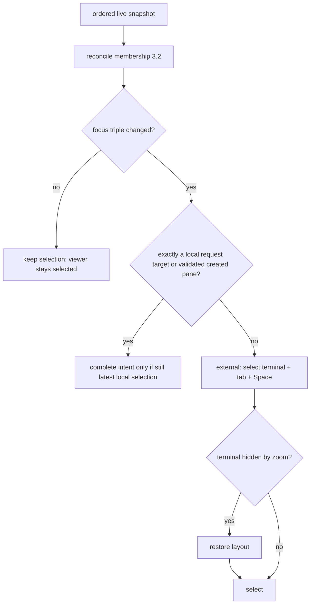

# Cockpit-owned tab layout: interaction and state design

Status: implemented design reference. Authority order: [`00-contract.md`](00-contract.md) (user decisions C1-C19 and the approved reference), then this design, then the implementation plan. [`03-contract-evidence.md`](03-contract-evidence.md) records exercised product scenarios and verification limits; the full acceptance matrix below is not a claim that every scenario was run.

Notation: `demo:N` (and `D:N` inside the acceptance tables) is a line in the approved reference [`mocks/tab-layout/demo.html`](mocks/tab-layout/demo.html) (commit `6aa0331`); `path:N` is a repository line read for this design. `[INFERENCE]` marks a claim that was not observed. **No runtime, screenshot or performance number was measured for this design** (no screenshot was captured; the visual evidence is the demo source lines); every number below is either quoted from the demo source or is a design value that the acceptance matrix asks the implementation to observe.

---

## 1. Goal and users

**Goal.** Inside each Herdr tab, Cockpit owns *placement*: one tree of leaves (real Herdr terminals plus at most one local Files, one Review and one Browser viewer) that the user arranges by header dragging, divider resizing and zoom. Herdr keeps owning Spaces, tabs, terminal existence/membership, focus identity and PTYs (C1).

**Users and entry points.**

| User | Task | Entry |
| --- | --- | --- |
| Developer working in Cockpit | Arrange terminals and viewers side by side, switch tabs, keep the arrangement for the run | Pane headers, dividers, `Ctrl+B` commands, Commands palette, tab strip Browser button |
| Same developer with the Herdr TUI open concurrently | Create/close/focus/move real terminals from the TUI and have Cockpit follow | Herdr snapshots/stream (no Cockpit UI) |
| Agents creating panes through Herdr commands | Appear as ordinary externally created terminals | Herdr snapshots/stream |

Non-goals (contract): persisted layouts, hint merging, observer attach mode, moving viewers between tabs/Spaces, any change to Herdr geometry from a layout action.

---

## 2. Evidence

### 2.1 Approved reference (mandatory, not redesigned)

The user approved the demo's drag and drop, resizing, look and control icons (`00-contract.md:5-13`). Everything in sections 4.2-4.6 restates demo behaviour with exact source lines. Where production needs something the demo does not have (stable DOM, focus, attachments, real lifecycles) that is called out as an **addition**. Places where this design deliberately differs from the demo are collected in section 4.9. Not approved and not carried over: mock content, the banner, simulation toolbar, missing focus preservation, `Reset` buttons, the `ResizeObserver` size readout (`demo:409-414`, illustrative `floor(w/8) x floor(h/18)`), and the event log/status sidebar.

Demo constants (`demo:174`): `MIN_W=160`, `MIN_H=100`, `DIV=8`, `RIM=14`, `EDGE=0.25`, `DRAG_PX=4`. Layout model: leaves and `{t:'split', dir:'row'|'col', kids, w}` nodes with sibling weights `w` (`demo:190-263`).

### 2.2 Current repository behaviour that this design replaces or reuses

| Area | Observed today | Reference |
| --- | --- | --- |
| Layout source | Selected tab's Herdr rectangles projected to percent bounds, with equal-width fallback tiling when rectangles are unusable | `src/app/App.tsx:644-648,1375-1380`; `src/app/layout/layoutProjection.ts:58-70` |
| Zoom | Herdr zoom via `pane_zoom`; `projectedPaneIds` shows only the focused pane when `layout.zoomed` | `layoutProjection.ts:58-64`; `App.tsx:357,1230,1321` |
| Resize | Derived handles emit Herdr `pane_resize` after release; a preview `translate` is shown while dragging | `layoutProjection.ts:21-56`; `App.tsx:382-400` |
| Split/swap/move | Herdr `pane_split` (`ratio: null`), `pane_swap`, `pane_move` (`existing_tab` direction right, `new_tab`, `new_space`) | `App.tsx:488-491,1227-1243,1321-1335`; `crates/cockpit-protocol/src/v1.rs:272-287,323-351` |
| Pane chrome | Header 33px, selected border plus inset shadow, header hidden for a lone terminal, single expand button | `src/app/styles.css:558-595,1149-1160,1648-1669`; `App.tsx:274-380` (352 hides solo header) |
| Selection | Every snapshot change re-derives selection from `focused_space/tab/pane_id` (`authoritativeSelection`) unless a focus request is pending. A viewer with no Herdr pane id would be overwritten by any routine snapshot | `App.tsx:65-68,1699-1705` |
| Focus | One request at a time queued, pending/error states, `prepare` gate up to 300 ms for tab switches, reconcile to release intent | `src/app/session/focusCoordinator.ts:6-8,94-155` |
| Mutations | One pending mutation at a time; response carries a snapshot, not a created-pane receipt; `focusFromSnapshot` marks focus that a local mutation intends | `mutationCoordinator.ts:60-125`; `crates/cockpit-herdr/src/cli.rs:1387-1388` (raw result validated then discarded); `cli.rs:2085` (`zoomed_tab` refusal for `pane_move`) |
| Workbench lifetime | `Workbench` has `key={state.epoch}`; `epoch` changes only on a session switch (`sessionStore.ts:107-113`), so layout state that must survive reconnect/resync must live above `Workbench` and be keyed per session | `App.tsx:1730`; `sessionStore.ts:105-113` |
| Attach mode | `wantsControl = controlAllowed || (controlPending && selected)`; every other terminal attaches with `mode: "observe"` | `src/app/TerminalPane.tsx:405,718-721`; `terminal_wire.rs:223-231` |
| Tab switch sequencing | Attach target tab's terminals at Cockpit's grid before asking Herdr to focus; old tab stays attached until painted | `DECISIONS.md:16`; `App.tsx:1073-1088,1394-1402` |
| Viewers | Files/Review/Context are graphical replacements of verified addon panes with a "Show terminal view" toggle; one pane per addon launch | `paneRenderers.ts:15-21`; `App.tsx:1320-1336`; `CONTEXT.md:216-218` |
| Browser | Space-scoped association (`BrowserTarget{space_id, pane_id:null}`), separate splitter and `browser_only`, presentation and ratio persisted per session+Space, close guarded by draft durability, retained-work "outgoing" recovery strip | `App.tsx:756-758,845-851,1111-1177,1443-1452`; `crates/cockpit-protocol/src/browser.rs:4-21` |
| Library | Global view replacing the pane canvas; visible renderers/subscriptions unmounted; D13 focus policy | `DECISIONS.md:48-51`; `App.tsx:651-653,1443` |
| Live splitter precedent | `TreeSplitter` writes width straight to layout once per frame and never re-renders React | `CODE_GUIDE.md:141` |
| Narrow window | `innerWidth <= 800` is "narrow" (sidebar becomes a drawer) | `App.tsx:606-608` |
| Creation identity | Raw `pane.split` result is `{type:"pane_info", pane:{pane_id, terminal_id, workspace_id, tab_id, focused}}`; the adapter can validate and return it | `03-contract-evidence.md:18-38` |

### 2.3 Consequences that drive the design

1. Selection can no longer be "whatever the snapshot says": viewers are selectable but unknown to Herdr (sections 5.1-5.3).
2. Movement must not re-create DOM. The demo rebuilds the workspace on every render (`renderWorkspace` does `ws.replaceChildren()`, `demo:477-497`; `buildPane` runs for every leaf on every render, `demo:442-459`). Production must render a flat keyed list (section 4.7).
3. Placement is Cockpit-only, so `pane_zoom`, `pane_resize` and `pane_swap` are no longer sent by layout actions. Only create/close/move/focus remain remote (C1, "layout does not mutate Herdr geometry").
4. `epoch`-keyed remounting and the browser's Space keying are both incompatible with per-tab, per-run state.

---

## 3. Data and state model (design-level; Plan formalises names)

```
TabLayout {
  key:            (sessionId, serverInstance, tabId)     // never label text
  root:           Node | null                            // null only while retiring
  selectedLeafId: string | null
  lastRealLeafId: string | null                          // last-selected real terminal leaf
  zoomLeafId:     string | null
  viewers:        { files?: {source}, review?: {source}, browser?: {phase} }
  revision:       number                                 // bumped by any structural change
}
Node  = Split{ id, dir:'row'|'col', kids: Node[], w } | Leaf
Leaf  = Terminal{ id:paneId, terminalId, w } | Viewer{ id:`${tabId}:files|review|browser`, kind, w }
```

Rules:

* Sibling weights `w` sum to 1 after every operation; a split with one child collapses; a child split with the same direction as its parent is flattened and its weights multiplied through (`demo:227-241`). Split nodes additionally carry a stable `id` (the demo has none) so divider elements can be keyed.
* A terminal leaf is valid only while Herdr confirms both `pane_id` and `terminal_id` in that tab (id reuse with a different `terminal_id` = remove leaf + insert newcomer).
* State lives in memory for the run, above `Workbench`, keyed per session/server instance/tab. A different `serverInstance` for the same session drops all its layouts (C5, "do not persist layouts"). Nothing is written to disk.
* Viewer leaf ids are deterministic per tab, so "at most one per kind per tab" is structural (`demo:199-202`).
* **"Visible layout leaves"** (C8) means leaves in `root`, i.e. unzoomed layout membership: real terminals and viewers alike, whether or not a zoom currently paints only one of them. The demo counts `allLeaves(tab).length` with zoom ignored (`demo:274-278,362-376`).

### 3.1 First load: balanced grid for 1..N (C6)

Applies exactly once per (session, serverInstance, tab), the first time the tab is seen with at least one confirmed terminal member. It never re-runs when snapshot enumeration or Herdr rectangles change afterwards.

1. Members = confirmed terminals of the tab.
2. Sort by stable pane id: numeric-aware comparison (digit runs compare as integers, other text by UTF-16 code unit; ties by code-unit order of the whole string). Herdr rectangles, snapshot array order and layout order are ignored (parent decision; the probe showed no documented ordering guarantee, `03-contract-evidence.md:38`).
3. `cols = ceil(sqrt(N))`, `rows = ceil(N/cols)`, `base = floor(N/rows)`, `extra = N mod rows`; the first `extra` rows hold `base+1` leaves, the rest `base`; fill row-major.
4. Every child of every split gets weight 1. One row: `row{...}` (N=2 is two terminals side by side, as C6 requires); several rows: `col{ row{...}, ... }`; a one-leaf row is the bare leaf (so N=3 has a full-width bottom terminal).

Table and pictures: [`examples/first-load-grids.md`](examples/first-load-grids.md). N = 1-6, 8, 9, 11, 12, 15, 16 equal the demo's `buildGrid` (`demo:203-212`); N = 7, 10, 13, 14, 17 differ in that the even-row rule avoids a lone wide last-row terminal (deliberate, see 4.9). Selection: first sorted terminal (`demo:213-222`), unless Herdr focus identity names another terminal of that tab, in which case that one (identity, not geometry).

### 3.2 Membership reconciliation (per ordered live snapshot, before focus handling)

1. **Prune**: leaves whose terminal is not confirmed in this tab are removed (`removeLeaf`: siblings scale proportionally, `demo:265-273`). Disconnect, stale or loading state is *not* loss: reconciliation only runs on a `live` ordered snapshot from the same `serverInstance`; otherwise layout is frozen and terminals show their existing stale/reconnect status.
2. **Insert newcomers**: members not in the tree.
   * Attributed newcomers (created by a Cockpit action that has a creation receipt, section 5.6) go beside their target with a 50:50 split (`splitLeaf`, `demo:256-263`).
   * Everything else is *external*: inserted one at a time in sorted pane-id order at the full-height right edge with share `1/(N+1)`, `N` = leaves currently in `root` including viewers and zoom-hidden leaves (`insertRootEdge`, `demo:274-288`). Old subtrees keep their internal proportions (all siblings scale by `N/(N+1)`; if the root is a `col` split or a leaf the old root becomes one child of a new `row` root). Worked example: `[A .7 | B .3]` + external C gives `A .4667, B .2, C .3333`; two newcomers in one snapshot end with equal `1/(N+2)` shares.
   * While a Cockpit creation request for this tab is still in flight, newly appearing members of that tab are *held* (not inserted) until the response settles, so a stream snapshot that outruns the HTTP response cannot mis-attribute the Cockpit-created terminal as external. Held members are released as external if the response fails or is an unknown outcome.
3. **Tab moved between Spaces / reordered**: layout follows the tab id; Space changes need no layout action.
4. **Tab gone** (confirmed absent from a live snapshot) or **zero confirmed terminals** (C14): retire the layout: viewers close, that tab's managed browser session stops and its managed profile/runtime artifacts are removed (section 5.7). Durable comments/drafts are not touched.
5. **Selection/zoom/lastReal repair**: if a removed leaf was `selected`, `zoom` or `lastReal`, apply section 5.4/5.5 rules.

### 3.3 Split, close, swap, edge placement (pure tree operations, all from the demo)

| Operation | Behaviour (source) |
| --- | --- |
| Split leaf `a` with newcomer | `a.w = .5`, newcomer `.5`, group inherits `a`'s old weight; right/down = newcomer after `a`, left/top = before; other siblings unchanged; same-direction groups are flattened (`demo:256-263,228-241`) |
| Remove leaf | Remaining siblings scale proportionally (renormalise), a single remaining child replaces its split; selection neighbour = previous sibling else next, first leaf of it (`demo:265-273`) |
| Swap two leaves | Nodes exchange places; each *slot* keeps its size (weights swap with the slot) (`demo:289-294`) |
| Root-edge insert | Section 3.2; share `1/(n+1)`, `n` counted after the moved leaf was lifted (`demo:274-288,592-593`) |
| Edge drop on a pane | Remove the source, then `splitLeaf(target, dir, before, source)`: the target gives up half, the source's old space is absorbed proportionally by its former siblings (`demo:648-652`) |
| Resize divider `i` | Only the two adjacent siblings trade weight; their pair total is preserved (`demo:547-555`) |

Unrelated ratios are never touched by moves (contract design default).

### 3.4 Layout solver (production addition)

The demo lets CSS flexbox compute sizes (`flex: w 1 0px` plus explicit `min-width/height` from `minSize`, `demo:460-475`). Production computes rectangles itself so leaves can be a flat list (4.7). The solver MUST be equivalent to that flexbox behaviour:

* Per split: available = size along axis minus `DIV * (children-1)`; each child's minimum = `minSize(child, axis)`: leaf `MIN_W`/`MIN_H`; along the split's own axis the sum of children minima plus `DIV` per gap; across it the maximum of children minima (`demo:295-300`).
* Distribute by weight; children below their minimum are frozen at the minimum and the remainder redistributed among unfrozen children by weight (CSS flexible-length resolution with `flex-basis: 0`).
* **Degradation (addition)**: if the minima cannot fit (many panes, small window, externally imposed membership), the demo's `#ws{overflow:hidden}` would silently clip panes (`demo:36`). Production instead scales every minimum by `available / sum(minima)` for that split, so no leaf is clipped, hidden or removed. A neutral `role="status"` strip above the workspace (same style as the zoom bar, wording in 4.6) says "Panes are smaller than their usual minimum in this window. Zoom a pane or enlarge the window." It disappears when minima fit again. User-initiated divider drags and drops still refuse to go below minima (4.4-4.5); only externally imposed membership, header splits and viewer opens can push a layout into degradation.
* Rectangles are rounded to whole CSS pixels with the remainder given to the last child so edges are gap-free.
* Divider rectangles are the `DIV`-wide gaps between sibling rectangles across that split's cross extent.

---

## 4. Screens and components

### 4.1 Composition

```
+--------------------------------------------------------------------------+
| tab strip (existing)                       [Browser][Library][Commands]  |
+--------------------------------------------------------------------------+
| zoom bar (only while zoomed)   Zoomed: Terminal 2. 3 other panes ...      |
| minimum-size strip (only while degraded)                                  |
+--------------------------------------------------------------------------+
| workspace (.pane-canvas, position:relative; overflow:hidden)              |
|  +------------------+ | +----------------------+                          |
|  | header 28px      | | | header               |   flat keyed leaves,     |
|  |  body            | 8 |  body                |   absolutely positioned  |
|  +------------------+ px+----------------------+   from solved rects      |
|  divider overlay (separators)   drop-preview overlay   Library covers all |
+--------------------------------------------------------------------------+
```

The workspace keeps the existing `.pane-canvas` (`styles.css:495-502`, margin 12px, `--terminal-bg`) and the existing tab strip. The Browser button in the strip stays but toggles that tab's browser leaf (5.7). No separate browser region, browser splitter or `browser_only` presentation remains.

### 4.2 Pane chrome (visual reference `demo:63-105`, tokens mapped)

| Element | Demo value | Production token / value |
| --- | --- | --- |
| Pane | `background:var(--pane)#1b1e24; border:1px solid var(--border)#2e333d` (`demo:63`) | `--terminal-bg` (#0c1016), `1px solid var(--border)` (#2b3543) |
| Selected pane | `box-shadow: inset 0 0 0 2px var(--accent); border-color: var(--accent)` (`demo:65`) | `inset 0 0 0 2px var(--focus-strong)` + `border-color: var(--focus-strong)`; replaces today's 1px border + 42% inset (`styles.css:1157-1160`) and the header top-line (`styles.css:1648`) |
| Header | `height:28px; gap:6px; padding:0 4px 0 6px; background:var(--head)#232730; border-bottom:1px solid var(--border); cursor:grab; touch-action:none; user-select:none` (`demo:67`) | height 28px (replaces 33px, `styles.css:578-591`), `--surface`, same gap/padding, same cursor/touch/user-select |
| Selected header | `--head-sel #2c3442` (`demo:68`) | `--surface-selected` (#23354c) |
| Kind badge | 18x18, radius 3, `font:700 11px mono`, text `#0b0e12`; T `--ok`, F `--accent`, R `--warn`, B `--teal` (`demo:71-75`, letters `demo:178`) | 18x18, `--radius-small`, `--font-size-2xs` mono 700, text `--app-bg`; T `--idle`, F `--accent`, R `--warning`, B `--done` via new alias tokens `--pane-kind-*` so kind color never reuses agent-state meaning by accident; the letter is the non-color cue |
| Title | flex 1, ellipsis, weight 500 (`demo:76`) | same; `--font-size-xs` (13px equals the demo's body size) |
| Scope pill | 10px, muted, 1px border, radius 9, hidden when pane container <= 330px (`demo:77-78`) | `--font-size-2xs` (11px nearest token), `--text-muted`, `--border`, `--radius-pill`; text: terminal "Herdr terminal", viewers "local to this tab"; same `@container (max-width:330px)` rule (pane is `container-type:inline-size`, `demo:63`) |
| Header buttons | 22x22, no border/background, `--muted` icon, hover text `--text` on `#343b49`; icon 14x14, stroke 1.4, round caps/joins (`demo:79-81`) | 22x22, transparent, `--text-muted`; hover `--text-primary` on `--surface-hover`; icon 14px stroke 1.4 |
| Drag ghost | fixed, +12/+12 from pointer, `--head-sel`, 1px `--accent`, radius 4, shadow `0 4px 14px #0008`, badge 16px, `pointer-events:none`, z 1000 (`demo:99-100,681`) | same; z `--z-indicator` |
| Dragged pane | `opacity:.5` (`demo:66`) | same |
| Drop preview | absolute, `background:rgba(76,154,255,.2)`, 2px `--accent` border, centred pill (`--accent` bg, dark text, bold 11px, radius 9), `pointer-events:none`, z 20 (`demo:101-102`) | `color-mix(in srgb, var(--focus-strong) 20%, transparent)`, `--focus-strong` border, pill text `--app-bg`, z `--z-dropdown-top` inside the workspace |
| Divider | 8px flex item, z 3, `::after` 1px `--border` centred at 3.5px; hover/active/`data-active` 2px `--accent`; cursor col/row-resize; `touch-action:none`; focus outline 2px accent offset -2 (`demo:54-62`) | 8px overlay separator, z `--z-floating-top` (3), same hairline colors mapped (`--border`, `--focus-strong`) |
| Flash on reuse | header `flash .3s` from accent to head-sel (`demo:69-70`) | same; disabled under `prefers-reduced-motion` (addition) |
| Zoom bar | `#20304a` background, 1px accent bottom border, 12px text, button "Restore layout (Esc)" (`demo:35,146-149`) | `--surface-selected` background, `--focus-strong` border; button label "Restore layout", tooltip includes `Ctrl+B z`; Esc only when focus is on chrome (5.8) |
| Divider readout | fixed pill, accent background, dark bold 11px mono text `A \| B` (px), +14/+14 from pointer, z 1000 (`demo:103,563-570`) | same |
| Sizes | header 28, button 22, gap 6 | 22px targets are below the 24px WCAG 2.2 target size; kept because the user approved the icons/appearance (contract). Best-effort accessibility per `CONTEXT.md:246`; the four buttons remain individually tabbable and labelled |

**Control icons (approved appearance), exact demo geometry (`demo:180-186`)**, 16x16 viewBox, `fill:none`:

* split right: `rect x=2 y=3 w=12 h=10 rx=1` + `M8 3v10`
* split down: same rect + `M2 8h12`
* zoom: `M6 2H2v4M10 2h4v4M6 14H2v-4M10 14h4v-4`
* restore: `M2 6h4V2M14 6h-4V2M2 10h4v4M14 10h-4v4`
* close: `M4 4l8 8M12 4l-8 8`

Header order left to right: badge, title, (viewer source subtitle), scope pill, focus status (existing pending `⟳`/error `!` + retry `↻`, `App.tsx:349`), split-right, split-down, zoom/restore, close (`demo:449-457`). The header is shown for every leaf including a lone terminal (demo shows it; the header split buttons are the primary pointer affordance). This replaces today's hidden solo-terminal header (`App.tsx:277,352`); see 4.9.

Button labels (demo `demo:452-456`): "Split right: new terminal", "Split down: new terminal", "Zoom this pane" / "Restore layout", "Close {title}", and for the last real terminal "Close last terminal (closes all viewers in this tab)". Split buttons on a viewer create a **terminal**, never another viewer (`demo:124`).

### 4.3 Leaf content

| Leaf | Body | Title / subtitle |
| --- | --- | --- |
| Terminal | Existing xterm surface (`TerminalPane`), fitted to the leaf body; existing stale/retry/resync overlays and focus status remain | Herdr title, else `Pane {n}` where n is the index in *sorted-pane-id* order (stable under drags, unlike visual order) |
| Files | Existing Context/Files viewer bound to a *source* (repository, companion or folder root); no terminal toggle, no launch of an addon TUI (C3) | "Files", subtitle = source label (today's `viewerTitle(...).subtitle`, `App.tsx:354`) |
| Review | Existing Review viewer bound to an authorised checkout/comparison source | "Review", subtitle = source label |
| Browser | Existing `BrowserPane` for this tab's managed session, with its own toolbar, recovery strip and annotation tools | "Browser", subtitle = current host when known |

Viewer content is interactive whenever the leaf is painted; the graphical-pane `controlAllowed` gate (`App.tsx:360-373`) exists only because viewers used to be real Herdr panes and is removed for viewers. Viewer-local view state (`ContextViewState`, review view state, browser URL/tab) lives in the tab layout store keyed by leaf id, not in component state, so unmounting (zoom, Library, tab switch) is lossless.

### 4.4 Header dragging, centre swap, edge placement (reference `demo:589-689`)

Behaviour is the demo's, with the additions marked.

1. **Start.** `pointerdown` on any pane selects it first (`demo:661-664`), then, if the target is inside the header and not a `button`/`input`, and the tab is not zoomed and has at least 2 leaves, arms a drag (`demo:665-669`). Content areas never start a drag (C9: headers, not content selections). The drag activates after the pointer moves at least `DRAG_PX = 4` (`demo:672`). Pointer listeners are on `window`; `pointercancel` cancels; **Esc cancels** with a capture-phase handler that stops propagation so the key never reaches a terminal (`demo:684-688`).
2. **Feedback.** Body gets the grabbing cursor and `user-select:none` (`demo:98`); the source pane dims to 50%; a ghost follows at +12/+12 (`demo:673-682`).
3. **Drop target computation** (`computeDrop`, `demo:589-623`), evaluated on every move and once more on release:
   * Outside the workspace rectangle: no target, drop cancels.
   * **Outer rim**: within `RIM = 14` px of a workspace side (nearest side wins) targets that root edge: preview is a full-height (left/right) or full-width (top/bottom) strip of share `1/(n+1)`, `n` = leaves after the source is lifted; label `Outer {side} edge ({pct}%)` (`demo:594-602`).
   * Otherwise the pane under the pointer (`elementFromPoint(...).closest('.pane')`); over the source itself or no pane: no target (`demo:603-604`). Production hit-tests against the solved rectangles instead of the DOM, same result.
   * **Centre**: pointer fractions `fx, fy` both within `[EDGE, 1-EDGE] = [0.25, 0.75]` gives **Swap**; preview = the whole target pane, label "Swap" (`demo:606-609`).
   * **Edge**: otherwise axis = X if `min(fx,1-fx) < min(fy,1-fy)` else Y; side by which half of that axis the pointer is in. If that axis cannot hold two minimum panes (`width < 2*MIN_W + DIV` or `height < 2*MIN_H + DIV`) it falls back to the other axis, and if neither fits, to Swap labelled "Swap (pane too small to split)" (`demo:610-617`). Preview = the half of the target on that side, label `Left`/`Right`/`Above`/`Below` (`demo:618-622`).
4. **Commit** (`applyDrop`, `demo:643-660`): swap exchanges slots; edge = remove source + split target (before for left/top); root = remove source + root-edge insert (`before` for left/top). The moved leaf becomes selected; a terminal also becomes `lastReal`. No Herdr request is sent for any of this.
5. **Additions.** (a) The commit is validated against `revision`: if membership changed during the drag so the source or target no longer exists, the drop is cancelled silently and the preview removed. (b) Dragging is disabled while zoomed (demo: no drag when `zoomId`, `demo:668`). (c) The drag never blurs the moved leaf's DOM focus because nothing is re-created (4.7).

Keyboard route (no new command): `Ctrl+B Shift+H/J/K/L` swap with the neighbour leaf (existing ids, local geometry). Edge and outer-edge repositioning stay pointer-only, as in the approved demo.

### 4.5 Divider resizing (reference `demo:536-585`)

* A divider sits between two adjacent siblings of one split; dragging changes only those two siblings' weights and preserves their total (`demo:547-555`).
* `pointerdown` (primary button) captures the pointer, marks the divider active, shows the readout `A | B` in rounded pixels at +14/+14, and puts the body in grabbing mode (`demo:557-565`). Sizes are measured from the actual rendered pixel sizes of the two neighbours at drag start (`demo:543-546`).
* Target size of A = start size + pointer delta along the axis, clamped to `[minSize(A), total - minSize(B)]`; **nested minimums** come from `minSize`'s recursion (sum along the split's own axis plus dividers, max across). If `total < minSize(A) + minSize(B)` the pair splits 50:50 (`demo:549-551`).
* **Live**: panes resize on every pointer move (`demo:566-571`). Production follows the `TreeSplitter` precedent (`CODE_GUIDE.md:141`): write the two rectangles once per animation frame straight to styles, no React re-render, commit the weights to the store on release or cancel. Each terminal body's existing `ResizeObserver`/rAF fit then updates its grid. **Unmeasured**: how often the shared PTY is resized during a drag; the acceptance run records resize count per drag and, only if it is visibly harmful, coalesces PTY sizing to a trailing throttle while the divider is active with one exact final size on release.
* Double-click resets the pair to 50:50 (`demo:578`). Arrow keys on a focused divider move by 24 px along the split axis; the perpendicular arrows are ignored (`demo:579-583`). Shift multiplies the step by 4 (addition, following today's 5/20 convention, `App.tsx:394`). Dividers are `role="separator"`, `tabindex=0`, `aria-orientation`, label "Resize panes (arrow keys, double-click resets to 50:50)" (`demo:537-540`).
* `Ctrl+B r` focuses the divider adjacent to the selected leaf: the divider after it along the first available axis (right, then below), else the one before it. Arrow keys then resize; `Esc` returns DOM focus to the selected leaf.

### 4.6 Zoom, restore, tab hiding

* **Zoom** (header button, header double-click, `Ctrl+B z`, palette): `zoomLeafId` set, selection moves to that leaf, only that leaf is painted at the full workspace size, dividers and drag are disabled, and the zoom bar shows "Zoomed: {title}. {n} other pane(s) are hidden, not closed." with "Restore layout" (`demo:395-402,518-521`, dbl-click `demo:696-699`).
* **Restore** (header button, zoom bar, `Ctrl+B z`, or `Esc` only from chrome focus) clears `zoomLeafId`; layout tree and weights were never touched.
* **Any selection of a leaf that is not painted because of zoom restores the layout first**, then selects it. That single rule covers opening or reusing a viewer (`demo:344-348`), header split buttons (`demo:328`), external focus into a hidden terminal (`demo:368`), sidebar/agent focus, and keyboard pane cycling/directional focus (which therefore leave zoom rather than cycling inside it).
* **Zoom ownership**: local only. Herdr's `zoomed` flag and `pane_zoom` are ignored and never sent (C5, C9). If the user zoomed a pane in the Herdr TUI, Cockpit does not follow; a `pane_move` while Herdr has the tab zoomed is refused by Herdr (`cli.rs:2085`) and surfaces its existing inline error "Herdr has this tab zoomed; restore it in Herdr" (wording proposed; the refusal code `zoomed_tab` is observed).
* **Hidden-leaf lifecycle** (leaves hidden by zoom, by an inactive tab or by the Library):

| Leaf | Painted, tab active | Hidden by zoom / inactive tab / Library |
| --- | --- | --- |
| Terminal | Attached, `mode: control` at the leaf's fitted grid | Renderer and stream released (`DECISIONS.md:15`); Herdr process, scrollback and membership untouched; Herdr reverts the PTY size to its TUI size on detach (`DECISIONS.md:16`, accepted per C13); reattach needs a fresh full baseline (`CONTEXT.md:208`) |
| Files / Review | Mounted, interactive | Unmounted; view state kept in the store; drafts remain durable |
| Browser | View attached, frames streaming | View **hidden**: capture resources released, managed session stays open (`CONTEXT.md:238`); shown again when painted |

* **Attach sequencing on tab switch** keeps `DECISIONS.md:16` unchanged: attach the target tab's painted terminals at Cockpit's grid, release the Herdr tab-focus request on the first frame of the tab's Herdr-focused terminal (max 300 ms, `focusCoordinator.ts:8,94-131`); with no painted terminal (zoomed onto a viewer) no gate is needed.
* **Attachment mode**: every terminal leaf painted in an active, unzoomed (or zoomed-onto-it) tab attaches with `mode: control` and Cockpit's grid; there is no observe attachment (C13). Whether a terminal *accepts input* remains a separate gate: DOM focus in that terminal, Herdr-confirmed focus on it and ownership `owned` (existing `controlAllowed`, `App.tsx:1404`). A control-attached terminal that is not selected receives no keystrokes.

### 4.7 Stable DOM, content and state across movement (production requirement; the demo does not do this)

* Render **one flat list** of leaf components, keyed by leaf id (`paneId` for terminals; `${tabId}:kind` for viewers), inside the workspace. Each leaf is absolutely positioned (`left/top/width/height`) from the solver. This is today's pattern (`App.tsx:1375-1404`, `styles.css:558-567`), now fed by Cockpit rectangles instead of Herdr's. Tree changes therefore only change style values.
* Never render the tree as nested elements and never key a leaf by its position or parent. Never include layout position in a key or in `rendererKey`/`paneRenderKey`-style identity strings.
* **Structural and geometric edits preserve mounted content identity.** A drag commit, swap, split, divider resize, external insertion and pruning MUST NOT unmount or remount any surviving painted leaf: xterm instance and scrollback view, selection/scroll inside Files/Review, in-progress typing in a comment editor or the browser URL field, DOM focus and the browser view stream all survive; only style values change. Every leaf container (keyed by leaf id) stays in the DOM for the whole life of the leaf, including while it is hidden by zoom.
* **Intentional hiding is a lifecycle event, not a structural edit.** Zoom, an inactive tab and the Library follow the lifecycle table in 4.6: the zoomed (painted) leaf keeps its mounted content and only refits; hidden terminals detach their renderer/stream and hidden viewers unmount while their view state stays in the store; on restore they reattach (terminals need a fresh full baseline) and restore view state. The design does **not** promise a persistent xterm DOM across zoom for leaves that are hidden. (The demo's `renderWorkspace` recreates every pane element and `ResizeObserver`, `demo:477-497`, and loses input focus; that is a known non-approved gap, contract line 12.)
* Dividers and drop preview live in separate overlay layers so they never wrap leaves.
* Native Tab order follows DOM (leaf creation) order, not visual order. Primary pane navigation is `Ctrl+B h/j/k/l` and `Ctrl+B Tab` in visual order (5.8). Best-effort accessibility per `CONTEXT.md:246`.
* Header buttons keep DOM identity across selection changes; selection only toggles `data-selected`/`aria-current`.

### 4.8 Wireframes and states

Selected terminal, viewer, zoom, drop preview (tokens per 4.2):

```
Normal, 3 leaves (Terminal 1 selected)

  +---------------------+-+------------------+
  |[T] Terminal 1 [pill]|8|[F] Files [pill]  |   header 28px, selected leaf has 2px ring
  +---------------------+p+------------------+
  |  xterm              |x|  viewer          |
  +---------------------+-+------------------+
  |[T] Terminal 2                            |
  +------------------------------------------+

Drag in progress (source Terminal 1 at 50% opacity, ghost "[T] Terminal 1" follows the pointer)

  +---------------------+-+------------------+
  |[T] Terminal 1 (dim) | |[F] Files         |
  +---------------------+ +------------------+
  |  ...                | |  +----[Right]----+  half-pane preview: 2px accent border,
  +---------------------+-+  |  20% accent   |  20% accent fill, pill label
  |[T] Terminal 2         | |  fill         |
  +-----------------------+ +---------------+
```

```
Zoomed (zoom bar above, other leaves not painted)
+---------------------------------------------------------------+
| Zoomed: Files. 2 other pane(s) are hidden, not closed. [Restore layout] |
+---------------------------------------------------------------+
|[F] Files subtitle    [pill]                    [ ][ ][restore][x] |
|  ...                                                           |
+---------------------------------------------------------------+
```

State table (each is a visible, non-modal state; copy is proposed unless quoted from the demo):

| Surface | State | Presentation |
| --- | --- | --- |
| Terminal leaf | Attached, unfocused | Normal; no input accepted |
| | Herdr focus pending | Existing header `⟳` "Waiting for Herdr focus confirmation" |
| | Focus error | Existing `!` + `↻` "Retry focus" |
| | Stale/disconnected/attach failure | Existing stale overlay with retry/resync; leaf stays in place; never treated as closed (C14) |
| | Control lost / taken by another client | There is no observe fallback: the stream closes and the leaf shows "Control taken by another client" with explicit `Take control` and `Retry`; nothing is retaken automatically |
| Viewer leaf | Source unavailable/unauthorised | Inline message in the body naming the failed operation, with retry; leaf stays |
| | Viewer context missing (`viewer_not_found`) | Body message with an explicit `Reopen`; never reopened automatically |
| | Viewer limit reached (`viewer_limit`) | The open is refused with a status message naming the limit (no viewer is evicted); closing a viewer, retiring a tab or switching session releases contexts |
| Browser leaf | Opening | Leaf appears immediately with body "Starting browser for this tab..." and a spinner; header close works and cancels |
| | Open | BrowserPane |
| | Open failed / outcome unknown | Body error with the existing action message and `Retry` / `Close`; leaf stays until closed; outcome unknown is not retried automatically |
| | Session stale/disconnected | Existing recovery strip ("Reconnect"/"Resync", `App.tsx:1450`) inside the leaf |
| | Close pending | Header close disabled with "Closing browser..."; close guard failure (drafts not durable) keeps the leaf and shows the existing guard message and retained-work strip (`App.tsx:1126-1137,1448`) |
| | Close failed / stop outcome unknown | Leaf stays with body message, `Retry close` / `Dismiss` (5.7) |
| | Profile/artifact cleanup incomplete or cutover cleanup running | Cleanup strip (`role="alert"` on failure, `role="status"` while running) with `Retry cleanup` / `Dismiss`; Open for the affected tab disabled while it applies (5.7) |
| Workspace | Empty tab (zero confirmed terminals but the tab still listed) | "No terminal in this tab" with text "Files, Review and Browser closed with the last terminal." and a `Close tab` button (existing `tab_close` with confirmation). Differs from the demo's "New terminal" button because Cockpit has no real terminal to use as a Herdr runtime source. `[INFERENCE]` Herdr closes an emptied tab, so this state is expected to be transient or never shown; it is specified so the UI is never blank |
| | Degraded minimums | Strip above the workspace (4.6/3.4) |
| | Live but Herdr session stale | Layout frozen, existing session stale banner/actions; no membership pruning |
| Library | Open | Covers the workspace (5.10) |

Narrow window (`innerWidth <= 800`): same layout, same drag/resize; minima degrade when they cannot fit (3.4) and the strip suggests zoom. No separate stacked layout. The Library and sidebar drawer behave as today.

### 4.9 Deliberate differences from the demo (each with reason)

| Difference | Reason |
| --- | --- |
| Flat keyed absolute leaves instead of nested flex DOM rebuilt on every render | C-requirement "stable DOM" (4.7) |
| Even-row first-load rule for N = 7, 10, 13, 14, 17 | "Balanced" (C6); demo leaves a short last row |
| Colors mapped to product tokens; header 28px instead of 33px; selected treatment from the demo replaces the 1px product treatment | Contract: adapt tokens, keep approved model/icons |
| No `Reset` buttons, mock bodies, banner, event log, status panel, `Place new pane` toolbar (viewer placement uses palette right/below rows, section 5.5) | Simulation only, contract line 12 |
| Esc restores zoom only from chrome focus | `DECISIONS.md:25` and `docs/keyboard-shortcuts.md:108`: in terminal/browser Esc belongs to the program |
| Degraded minima and status strip instead of clipping | Never hide a live terminal |
| "Empty tab" offers `Close tab`, not `New terminal` | 4.8 |
| Drop cancelled when membership changed during drag | Membership is externally driven |
| Header always visible for a lone terminal | Demo parity; header buttons are the pointer split affordance |

---

## 5. Interaction, focus, lifecycle

### 5.1 Four separate concepts (C11, C13; `CONTEXT.md:183`, `DECISIONS.md:10`)

| Concept | Owner | Values | Changes when |
| --- | --- | --- | --- |
| Layout selection | Cockpit per tab (`selectedLeafId`) | any leaf, viewer or terminal | user selects a leaf; drop/zoom/open; external focus follow |
| Herdr semantic focus | Herdr snapshot `focused_space/tab/pane_id` | a terminal | Cockpit sends a focus request; anyone else focuses in Herdr |
| Terminal attachment/input ownership | attach stream + `controlAllowed` gate | per terminal | attach lifecycle, confirmed focus, ownership state |
| DOM focus | browser | any element | user input, programmatic `focus()` |

Rules: selecting a **terminal** leaf sends the Herdr focus request (existing pending/timeout/error path) unless the latest ordered snapshot already reports it focused, in which case no pending state is created (`[INFERENCE]` that Herdr may not emit an event for a redundant focus; runtime check listed in section 8). Selecting a **viewer** sends **no** Herdr focus request, clears terminal input ownership intent, and moves DOM focus to the viewer; Herdr's focus stays on the tab's last real terminal. DOM focus moves into a terminal only after it is painted and Herdr has confirmed control (existing `focusOnAttach` rules, `DECISIONS.md:17`, `TerminalPane.tsx:559-567`).

### 5.2 Classifying focus changes (always follow deliberate external focus, never steal on repeats)

Track `observedFocus = (focused_space_id, focused_tab_id, focused_pane_id)` from the last applied ordered snapshot. For each new ordered live snapshot, **after membership reconciliation (3.2)**:

1. **Unchanged triple** (the common routine snapshot): do nothing to selection. A selected viewer stays selected. (Fixes today's per-snapshot re-derivation, `App.tsx:1699-1705`.)
2. **Changed triple that exactly equals the target of an in-flight or just-acknowledged local request**: a pane/agent request whose target is the focused pane, a tab request whose target is the focused tab, a space request whose target is the focused space, or a Cockpit creation whose validated `created.pane_id` is the focused pane (`focusCoordinator.ts:94-155`; a mutation's `focusFromSnapshot` flag alone is not enough): local echo. An echo completes its intent only if that intent is still the latest local selection in that tab: for a tab request select the tab's stored `selectedLeafId`; for a pane request select that pane. A later local selection (for example the user clicks terminal T2, then a viewer before Herdr confirms T2) supersedes the earlier intent: the echo is consumed, control/focus confirmation state is updated, and layout selection is left unchanged, so a selected viewer is never overwritten by an echo or attach churn. Focus that names a held, unknown new member (3.2) is buffered until that creation settles, then classified; focus on any known pane is classified immediately.
3. **Any other changed triple**: external. Select the focused real terminal, its tab and its Space (even if a viewer was selected there). Update `lastRealLeafId`. An external change supersedes a pending local request (`CONTEXT.md:183`).

Notes: a repeated snapshot that still names the same focus never re-applies, so nothing steals selection back from a viewer. Re-focusing the already-focused pane in the TUI produces no change and cannot be observed; that is inherent, not a defect. If the external target terminal is hidden by zoom in that tab, restore the layout first (4.6, "including zoomed hidden terminal"). If a different Space/tab was showing, switch to it; that tab's other leaves keep their state. If the Library is open, selection changes underneath and DOM focus stays put (5.10). External focus that arrives with a newly created external terminal (membership newcomer in the same snapshot) selects that new terminal after it is inserted.



### 5.3 Selecting, closing and tab switching

* Click anywhere in a leaf selects it (`demo:661-664`); header controls select first.
* Tab switch: local intent `focus tab`, existing sequencing (4.6), selection = that tab's remembered `selectedLeafId` (in-memory across the run, C5). External tab switch: selects Herdr's focused terminal there (5.2 rule 3).
* Close a **viewer** leaf: local; selection goes to the neighbour that absorbs its space (previous sibling else next, first leaf of it, `demo:265-273,387-393`). Closing the zoomed leaf restores the layout. No Herdr request. Files/Review close without confirmation (durable comments/drafts are untouched); Browser close follows 5.7.
* Close a **terminal** leaf: existing confirmation and `pane_close` (`App.tsx:1106-1110`); the leaf is removed on confirmed membership loss; selection follows Herdr's resulting focus (5.2 rule 2 for a mutation, rule 3 for external closure). Close of the last real terminal uses the destructive wording in 5.6.
* `lastRealLeafId` updates when a terminal becomes selected, is focused externally, is created and selected, or is dropped (`demo:311-315,658`).

### 5.4 Creating terminals beside any leaf (C12)

* Sources of intent: header split buttons (target = that leaf), `Ctrl+B v` / `Ctrl+B -` (target = selected leaf), palette "Split pane right/below". Direction right = `row` after, down = `col` after (`demo:325-336`).
* **Herdr runtime source** (which real terminal is passed as `pane_split.pane_id`, deterministic): (1) the target leaf if it is a terminal; (2) `lastRealLeafId` if still a member; (3) the tab's Herdr-focused terminal per the latest snapshot if a member; (4) the first terminal in in-order tree traversal; (5) none, then the action is disabled with reason "No terminal in this tab". The Herdr direction parameter is the requested direction (right/down); Herdr's own geometry is irrelevant to Cockpit.
* **Placement**: the new terminal goes beside the *target leaf* (viewer or terminal), 50:50 with that leaf (3.3), regardless of which terminal was the runtime source. Restores zoom first (`demo:328`). Selection moves to the new terminal, which becomes `lastReal` (`demo:333`).
* **Attribution by identity, not focus**: the mutation response returns the created pane (`created: {pane_id, terminal_id, space_id, tab_id}` from Herdr's own result, validated against the post-mutation snapshot, `03-contract-evidence.md:36`). The intent (target leaf id, direction, before/after) is recorded against `pane_id`. Insertion happens when that pane appears as a confirmed member (3.2, including the hold while the request is in flight). No receipt, no attribution: the terminal is handled as external (right edge). Uncertain outcome is never retried automatically; Cockpit re-snapshots.
* A new tab's root terminal starts that tab's layout (3.1, N=1).

### 5.5 Opening, reusing and switching source of viewers (C3, C4, C7)

* One per kind per tab. Open requests: palette rows "Open Files right/below", "Open Context right/below" (Files viewer, companion source), "Open Review right/below", "Open Browser right/below"; tab-strip Browser button; `Ctrl+B Shift+B` (5.7); pane context menu "Open view". The existing `rendererActionDefinitions` ids (`App.tsx:414-421`) are reused; Files/Context/Review no longer call `plugin.pane.open` and never start an addon TUI (C3).
* **New**: split the selected leaf (right or down), viewer leaf gets the second half, becomes selected and DOM focus enters it (`demo:351-357`). Zoom restored first.
* **Existing**: no new split. Restore zoom if it is hidden, select and flash the header, and for Files/Review switch source (`demo:341-349`).
* **Source of a Files/Review open**: the *source terminal* = the selected leaf if it is a terminal, else the same fallback chain as 5.4 (lastReal, Herdr-focused, first terminal). Its cwd/root evidence feeds the existing authorisation (repository, companion or folder root; review checkout). If none is eligible the row is disabled with the existing reason text (`rendererReasonFor`, `App.tsx:405-411`). No source picker inside the viewer is added.
* **Source switch retains durable draft identity**: comments/drafts stay bound to the source they were created against and stay reachable when switching back; switching never deletes or re-labels them. Ephemeral view state (picker query, scroll, selected file) resets to the new source's default. In-progress unsaved comment text must not be lost silently: it is covered by the existing draft persistence or the switch is not applied until it is (Plan verifies which viewer states are durable).
* Terminal/renderer toggles removed for viewers: no "Show terminal view", "Render document" or "Refresh renderer detection" (C3, C16).

### 5.6 Real terminal lifecycle, moves, last-real closure (C10, C14)

* **Move within the tab**: every leaf via drag or the swap keys; no Herdr call.
* **Move across tabs/Spaces**: terminals only, through the existing "Move..." dialog and `pane_move` (`App.tsx:489-491`). The dialog and pane context menu **omit** Move for viewers (the item is absent, not disabled), so no viewer move is ever offered. The moved terminal disappears from the source tab (siblings absorb space) and lands in the destination like an external terminal: full-height right edge, `1/(N+1)` (3.2). Moves to a new tab/Space start that tab's grid with one terminal. Selection follows the mutation's focus (5.2 rule 2). Never duplicated.
* **Last real member** (C14): if a move or close would leave the tab with no real terminal **and** the tab has viewer leaves, the confirmation says: "This is the last terminal in {tab}. Closing it also closes Files, Review and Browser in this tab{, and deletes the browser's profile (cookies, logins, site data)}. Drafts and comments you saved stay." (the braced clause appears only when the tab has a browser leaf). Confirmed loss of the last real member (own action, TUI, or agent) retires the layout: viewers close (no confirmation for external loss), the tab's browser session stops and its managed profile is removed (5.7), durable comments/drafts are untouched. Stale or disconnected state, a failed/uncertain close and a moved-then-failed request are not loss.
* **Herdr requirement** "at least one real pane per tab" is enforced by observation, never by creating fake members.

### 5.7 Per-tab browser (C15)

* **Keying**: association per (endpoint, session, Herdr tab); a tab's browser and another tab's browser are independent sessions. The browser leaf id is `${tabId}:browser`. Space-level `browserPresentation`, `browserSplitRatio` storage and `browser_only` presentation (`App.tsx:756-758,845-852,1443-1452`) are removed: presentation is the leaf's position/zoom; size is its tree weight.
* **Open** (tab-strip button, `Ctrl+B Shift+B`, palette): if the tab has no browser leaf, split the selected leaf (right; palette row for below), insert the leaf in *Opening* state and request the tab's session with `url: null`. `url: null` means the **configured default URL** (parent decision: optional `[browser] default_url`, absent means `about:blank`). If the leaf exists (visible or hidden by zoom) the action selects it and restores zoom (never a second browser). While the Herdr session is not `live`, Open is disabled with "Herdr is not live".
* **Hide** is never a lifecycle command any more; it is what happens when the leaf is not painted (tab switch, zoom onto another leaf, Library): view hidden, session open, drafts intact (`CONTEXT.md:238`). The palette rows "Show/Hide browser view" are removed; "Open browser" (open or focus) and "Close browser" remain.
* **Close** (header x, tab-strip button when a leaf exists, `Ctrl+B Shift+B`, palette, or `Ctrl+B x` with the browser selected): run the existing close guard (draft durability, `App.tsx:1126-1137`), then stop that tab's session, **remove that tab's managed profile and runtime/launch artifacts**, then remove the leaf. `Ctrl+B Shift+B` toggles: no leaf = open, leaf = close (existing toggle semantics; label becomes "Toggle browser for tab"). The header close tooltip discloses the effect: "Close Browser (stops it and deletes its profile: cookies, logins, site data)"; no extra confirmation for the ordinary close, because the user chose this semantics. Reopening always starts a fresh session at the default URL, never the last URL. Closing tab A's browser does not touch tab B's session.
* **Removal scope**: only artifacts recorded as created by Cockpit for that association are removed. The Library, the OS vault (provider tokens), other tabs' browsers, user-owned browsers/profiles and saved drafts/comments (durable comments, Review drafts, browser drafts already saved) are never touched. The guard runs first so unsaved browser annotations become durable or the close is refused, exactly as today.
* **Last-real-pane closure or tab removal**: the layout retirement (3.2, 5.6) performs the same guard, stop and removal through the existing outgoing retained-work path (`App.tsx:1448`, `browserHandoff`): if drafts cannot be made durable, the recovery strip is offered; if stop or removal fails, the cleanup strip below keeps the failure visible and retryable.
* **Reload/restart (C17)**: layouts are memory-only, so after a Cockpit reload/restart no browser leaf exists. A tab-owned session that survived is not adopted and is not touched until the user opens Browser in that tab: Open then shows the normal Opening state while it stops the surviving session, removes its proven managed profile, and starts a fresh one at the default URL. `[INFERENCE]` an unopened survivor keeps running until then, as the contract specifies; closing or losing the tab stops it through the normal close path if Cockpit can identify it.
* **Cutover (C18)**: legacy Space-scoped sessions are explicitly stopped once by the cutover routine, and their Cockpit-owned receipts and artifacts with independent provenance are removed; Space-level browser UI/state (5.7 first bullet) is gone. Artifacts lacking independent provenance follow the review-and-authorize rule below; failures surface through the cleanup strip. The mechanism (discovery, ownership proof, helper calls) belongs to the plan.
* **Cleanup pending and failure UX** (no new feature beyond one status strip, reusing the existing browser recovery-strip styling, `App.tsx:1448-1450`): (1) *stop failed or outcome unknown*: the leaf stays with body message and `Retry close` / `Dismiss`; unknown outcome inspects status before repeating; (2) *stopped but profile/artifact removal incomplete* (close, last-real removal, restart-on-Open or cutover): the leaf disappears (nothing is running) and a `role="alert"` strip in that tab's workspace (or, if the tab no longer exists or the cleanup belongs to a legacy Space session, in the currently selected tab's workspace) reads "Browser stopped, but its profile could not be fully removed: {reason}." with `Retry cleanup` and `Dismiss`; the strip is in memory, survives tab switches, and Open for the affected tab stays disabled until cleanup succeeds or is dismissed; (3) *cutover cleanup running*: neutral `role="status"` "Removing previous browser sessions..." then disappears. Dismiss never deletes anything; while a failure is unresolved the Commands list shows a "Retry browser cleanup" row.
* **Legacy artifacts without independent provenance (review-and-authorize)**: old Space receipts recorded no creation-time artifact identities, so after the legacy session is stopped Cockpit cannot prove which on-disk objects it created. Capturing an inode now is not historical proof. Such artifacts are never auto-deleted. The cleanup strip expands ("Review N items") into a list from an explicit no-follow scan of the current candidate manifest: each row shows path, type (directory/file/symlink) and identity, under the warning "These items were left by an older Cockpit browser and cannot be proven to be Cockpit's. Removing them is permanent." The operator can `Remove these items` (authorizing exactly the listed objects) or `Keep` (dismiss). Immediately before each deletion the object is re-checked (no-follow, same type and identity as listed); a changed, replaced or symlinked entry is preserved and reported in the strip. Nothing outside the listed manifest is touched. Exact API and receipt handling belong to the plan.
* **Legacy saved work recovery**: after cutover, saved browser drafts/feedback keyed by the old Space scope would otherwise be unreachable through tab keys. They are listed in a "Saved before tabs" section inside the cleanup strip's expansion, reusing the existing saved-feedback/drafts view (extracted from the browser pane), each row showing its immutable original source (Space id/label, archived time, saved counts). Legacy comment batches stay in the existing "Saved batches" (detached) and move to a viewer only through the existing Reattach. Cockpit never assigns legacy browser work to a tab; a send of legacy feedback goes only to a recipient the user explicitly picks from the agents of the currently focused tab, under the existing source checks. No new global feature: it reuses existing views.
* **Pending and errors**: Opening/Close pending and failure copy in 4.8. Outcome-unknown states re-inspect via status before any repeat.
* No browser cross-tab/Space move exists (menu omits it).

### 5.8 Keyboard, pointer parity and conflicts

No new prefix keys. Registry ids in `src/app/input/shortcuts.ts:102-123` keep their keys; semantics change as follows (labels/notes updated in the single registry, tooltips and `docs/keyboard-shortcuts.md` regenerate):

| Key | Today | New behaviour |
| --- | --- | --- |
| `Ctrl+B v` / `Ctrl+B -` | Herdr `pane_split` of selected pane | New Herdr terminal beside the selected leaf (5.4); works when a viewer is selected |
| `Ctrl+B x` | Confirm + `pane_close` | Terminal: confirm + `pane_close`. Viewer: close leaf (browser per 5.7) |
| `Ctrl+B z` | `pane_zoom` | Local zoom toggle for the selected leaf |
| `Ctrl+B r` | Focus first `.resize-handle` | Focus divider adjacent to the selected leaf (4.5) |
| `Ctrl+B h/j/k/l` | Herdr-rect neighbour | Neighbour by solved local rectangles, over all leaves (restores zoom if needed) |
| `Ctrl+B Shift+H/J/K/L` | `pane_swap` | Local swap with the neighbour leaf in that direction (all leaf kinds) |
| `Ctrl+B Tab` / `Shift+Tab` | Cycle real panes | Cycle all leaves in in-order tree traversal (top-left first) |
| `Ctrl+B Shift+B` | Toggle Space browser | Toggle the selected tab's browser (5.7) |
| `Ctrl+B Shift+P` | Rename pane | Terminals only (viewers have fixed titles) |
| `Ctrl+B f` | Open picker in viewers | Unchanged (acts inside Files/Review/Context/Library) |
| Palette | rows above | Add "Open Browser right/below" (same pattern as the existing Files/Review rows); remove "Show/Hide browser view", "Show terminal view/Render document", "Refresh renderer detection"; the `Swap...` dialog becomes local |

Conflicts and ownership:

* `Esc` in a terminal, browser surface or viewer content belongs to that surface (`DECISIONS.md:25`, `docs/keyboard-shortcuts.md:108`). Zoom restore by `Esc` works only with DOM focus on chrome (header controls, zoom bar, dividers). During a drag `Esc` cancels the drag first (capture, `demo:686`).
* Drag has no keyboard emulation; the existing swap keys are the keyboard route for exchanging positions.
* Divider keys are only active on a focused divider; they cannot fire from a terminal.
* Pane commands still close the Library first, then act (`DECISIONS.md:27`, `App.tsx:1273-1280`).
* Pointer/keyboard parity, limited to what exists today: split (button/keys/palette), zoom (button/dblclick/keys/palette), close (button/keys/menu), resize (drag/keys), swap (drag centre/keys), select (click/keys/sidebar), open viewer (palette/keys/menu). Edge repositioning is pointer-only, as in the approved demo; no new keyboard command is added for it.

### 5.9 Decisions shared with the implementation plan (TabLayoutPlan)

Confirmed by message: state key `(sessionId, serverInstance, tabId)` with a new opaque `server_instance` on the snapshot and terminal leaf validity `pane_id + terminal_id`; flat keyed rendering; solver equivalent to flex; creation receipt `created` on `ResourceMutationResponse` for `pane_split` only (`tab_create`, `space_create` and `pane_move` return none: a new tab is a first load, a moved terminal follows the external rule); focus classification by triple; no new prefix keys; browser association key includes tab and `[browser] default_url` (absent `about:blank`); GUI Open of a new leaf uses a fresh-open action that stops and cleans a surviving session first, while leaf Reconnect and CLI agents attach; first-load ordering by stable pane id; cleanup status and retry are backend endpoints the cleanup strip consumes. Not repeated here: Plan owns names, DTOs, module layout and caller migration.

### 5.10 Library overlay (C2)

Library stays global and outside every tab's layout. Opening it does not change any layout, selection, zoom or Herdr focus (`DECISIONS.md:49`); it covers the workspace and unmounts visible renderers, terminal attachments and the browser view (`DECISIONS.md:50`), keeping viewer state in the store and the browser session open. Closing restores the tab exactly. Focus policy D13 is unchanged (`DECISIONS.md:51`, toggle key returns DOM focus to the originating leaf if still selected; Esc/pointer close suppresses attach focus). While it is open: membership reconciliation and focus classification still run (layout changes underneath), a created/closed/external terminal does not dismiss Library or steal DOM focus, and an external focus change updates the selected Space/tab/leaf used when Library closes and the Library's Space target label. Pane-scoped commands close Library first. Library never appears in leaf cycling.

### 5.11 Legacy addon terminals (C16)

Existing Reviewr/file-viewer panes are ordinary terminals (badge `T`, title from Herdr). No process inspection, launch-provenance binding or renderer polling runs for them (the 2.5 s inspection loop in `paneRenderers.ts:72-113` is removed); nothing stops or converts their processes; they can be closed, moved and zoomed like any terminal. A Files/Review viewer opened while such a terminal exists is independent of it.

### 5.12 Reconnect, stale and server identity

* Stream `stale`/`disconnected` or `sync !== "live"` freezes reconciliation; leaves stay and terminals show the existing stale/reconnect affordances with recovery (`DECISIONS.md:19`).
* Layout state survives resync and reconnect within the same `serverInstance` (it lives above `Workbench`, which remounts on `epoch`). A session switch keeps other sessions' layouts only while they are held in memory for the run; returning to a session re-validates membership and `serverInstance` first.
* Different `serverInstance` (Herdr restarted): drop that session's layouts, rebuild first-load grids from fresh members. A managed browser session left over from the old instance is not adopted; the next Open for that tab stops it and restarts (5.7).
* Fresh membership after reconnect prunes confirmed-missing leaves, inserts unknown members as external, and never re-runs first-load for a known tab.

---

## 6. Accessibility

* Each leaf is `role="group"` with label "{Kind} pane: {title}" and `aria-current="true"` on the selected leaf (`demo:443-445`).
* Header controls are native buttons with the labels in 4.2; the select button (existing `.pane-header-select`) remains the header's primary focus target and its `onClick` selects. Dividers: `role="separator"`, `aria-orientation`, `tabindex=0`, `aria-valuenow`/`aria-valuetext` (percent of the pair) added for screen readers (addition; the demo exposes label only).
* Focus never moves as a side effect of layout changes; the moved/split/zoomed leaf keeps DOM focus if it had it. Opening or reusing a viewer moves DOM focus into it deliberately. Terminal DOM focus rules are unchanged.
* `aria-live="polite"` status for: zoom entered/restored, "Layout restored: focus moved to {terminal} from Herdr", degraded minimums, browser opening/failed, last-terminal closure closing viewers.
* Selection is not color-only: 2px ring plus `aria-current`; kind badges carry letters; focus rings use `--focus-strong` outlines (`demo:17`).
* Contrast: badge text on kind colors, muted icon on header, and pill text follow existing product tokens; not measured here.
* `prefers-reduced-motion` disables the header flash. Pointer targets 22px, keyboard alternatives exist for every pointer action (5.8).
* Native Tab order follows DOM order, not visual order (4.7); `Ctrl+B` traversal is in visual order.

---

## 7. Options considered

| Decision | Options | Recommendation and trade-off |
| --- | --- | --- |
| Render structure | (a) nested flex tree as in the demo; (b) flat keyed absolutely positioned leaves from a solver | (b). Stable DOM/xterm/focus across moves is a contract requirement; costs a solver that must match flex semantics |
| Zoom-hidden terminals | (a) detach hidden terminals (D15); (b) keep attached but parked | (a). Keeps the existing "only painted panes attach" rule and avoids N hidden streams; cost: PTY sizes revert to the TUI's on zoom and re-fit on restore (same as tab switches today). (b) avoids size flapping but holds hidden subscriptions and hidden xterms; revisit only if flapping proves harmful in acceptance |
| External focus into a zoom-hidden leaf | (a) restore layout then select; (b) move zoom to the new leaf; (c) select while staying zoomed (selection invisible) | (a). Same as demo's focus-taking cases and one uniform rule; loses the user's zoom but never hides the focused terminal. (b) needs a second rule for cycling; (c) is unusable |
| Focus-change detection | (a) triple comparison against last observed; (b) rely on explicit events; (c) always follow snapshot | (a). Only snapshots exist in the frontend; (c) is today's viewer-stealing bug; (b) not available |
| Created-terminal attribution | (a) creation receipt from Herdr result; (b) heuristic "single new member"; (c) current focus | (a). (b) and (c) are wrong under concurrent creation (contract 12). Requires the adapter change in the Plan |
| Browser open feedback | (a) leaf appears immediately in Opening state; (b) leaf only after success | (a). Visible pending/error, cancel path; cost: a leaf that may fail and needs Retry/Close |
| Lone terminal header | (a) always header (demo); (b) hide (today) | (a). Header buttons are the split/zoom/close affordance; cost: 28px of chrome for a single terminal; the existing solo-header test is deleted, not re-pinned |
| Grid algorithm | (a) demo chunking; (b) even rows | (b) for N >= 7 only where the demo leaves a short last row; equal elsewhere |
| Below-minimum sizes | (a) clip (demo overflow hidden); (b) degrade proportionally + strip; (c) refuse creation | (b). External terminals cannot be refused; clipping hides live terminals |
| Cycling while zoomed | (a) restore layout and select; (b) cycle inside zoom | (a). One rule (4.6); (b) is a plausible later refinement, not approved |
| Browser after Cockpit reload / when the pane closes | (a) adopt the surviving session and keep its profile; (b) stop, remove the managed profile and restart at the default URL | (b), the user's final answer. Cookies, logins and site storage of the managed profile are lost by design; adoption is never attempted; only Cockpit-recorded artifacts are removed |
| Terminal close focus | (a) follow Herdr's resulting focus; (b) local neighbour then re-focus Herdr | (a). Herdr owns focus; avoids an extra request and a race. Viewer close uses the neighbour rule |

---

## 8. Runtime verification tasks (no open product questions)

| # | Verification task | Default used by this design |
| --- | --- | --- |
| Q1 | Does Herdr emit a focus event or snapshot change for a redundant focus request on the already-focused pane? | Resolve locally without pending state when the latest snapshot already names the target; Plan adds a disposable-fixture check that a redundant request neither hangs nor times out |
| Q2 | Can Herdr keep a tab with zero panes after the last pane closes/moves? | Handle both: tab disappears (normal) or persists (empty-tab state in 4.8) |
| Q3 | PTY resize rate during a live divider drag | Use existing per-frame fit; measure resize count; add trailing throttle only if visibly harmful |
| Q4 | Wheel/scroll on a control-attached but unselected terminal | Keep today's `AttachScroll` gating; Plan verifies it still works (or is deliberately gated) when every terminal is control-attached |
| Q5 | `takeover` semantics when every painted terminal control-attaches | Keep today's explicit-interaction takeover; Plan verifies ownership states with the TUI attached; awkward TUI sizes are accepted (C13) |
| Q6 | Which viewer-local ephemeral states are already durable | Assume comments/drafts durable, view state ephemeral; Plan enumerates before cutover |
| Q7 | Proof of Cockpit ownership for browser profiles/receipts/launch artifacts before removal (guarded identity), including legacy Space-scoped ones | Remove only artifacts with recorded Cockpit ownership evidence; anything unproven is left alone and reported in the cleanup strip; Plan defines the evidence |
| Q8 | Profile removal while the browser process is exiting (locked files, slow exit) | Stop first, remove after exit is confirmed, surface incomplete removal through the cleanup strip with Retry cleanup (5.7) |
| Q9 | Where legacy Space-keyed browser drafts/feedback and old comment batches are stored, and which existing recovery surfaces (retained-work strip, "Saved batches" Reattach) can list them without a new global feature | Plan enumerates the locations, lists them through the existing surfaces with the original source, and never rewrites their source identity |

Everything in this table is a runtime verification task for the implementation, not a product question; the contract decisions and the final user answers (browser cleanup) are settled. The strings proposed in this document (last-terminal confirmation, Herdr-zoomed move refusal, Opening/cleanup browser states, degraded strip, "Herdr terminal" pill) are the design defaults.

---

## 9. Proposed DECISIONS.md changes (text only; not applied)

Add under **Herdr authority & compatibility**, replacing the layout half of the first bullet and the "Herdr… layout" phrase in the tenth:

* **Tab layout.** Herdr owns Spaces, tabs, real terminal existence/membership, focus identity and PTYs. Cockpit owns placement inside each tab: a split tree of terminal leaves and local Files/Review/Browser viewer leaves, kept in memory for the run keyed by session, server instance and tab id, never persisted. Herdr rectangles, zoom and positioning hints are ignored, and layout actions send no `pane_resize`, `pane_swap` or `pane_zoom`. First load is a balanced grid of terminals ordered by stable pane id; externally created terminals insert at the full-height right edge with share 1/(leaves in the tab + 1) (hidden-by-zoom leaves count). Terminals created by Cockpit are placed beside the leaf the user acted on, identified by Herdr's creation result, never by current focus.
* **Focus identity.** A change of Herdr's focused space/tab/pane is followed (real terminal, tab and Space selected; a zoom that hides that terminal is restored) unless it is the echo of a Cockpit request. An unchanged focus in a routine snapshot never changes selection. Selecting a viewer sends no Herdr focus request. Layout selection, Herdr focus, attach/input ownership and DOM focus are four separate states.
* **Membership.** Confirmed loss of a tab's last real terminal, by close or move, closes its viewers and stops its browser session; durable comments and drafts stay. Stale, disconnected or loading state is never membership loss.

Amend **Terminal attachment & input**:

* Every terminal painted in the active tab attaches with `mode: control` at Cockpit's fitted grid; there is no observe attachment. Input additionally requires DOM focus, Herdr-confirmed focus and owned control. Terminals hidden by zoom, an inactive tab or the Library are detached (Herdr keeps process and scrollback); viewers hidden the same way keep their state in the layout store and the browser view is hidden, not closed. The tab-switch sequencing above is unchanged.

Amend **Keyboard**:

* Existing prefix keys keep their meaning; pane commands act on the selected leaf of any kind, splitting creates terminals, swap/focus/cycle use local geometry, zoom is local. Esc restores zoom only when focus is on layout chrome; in a terminal, browser or viewer Esc belongs to that surface, and a drag cancels on Esc.

Replace **Context & Review** first bullet:

* Files, Review and Browser are Cockpit-owned tab-local panes (one of each per tab); opening an existing one focuses it, and Files/Review switch to the requested source. Viewers never launch an addon TUI, have no terminal/renderer toggle, and cannot move between tabs or Spaces. Existing addon panes are ordinary terminals. Comments/drafts keep the source identity they were created against.

Replace the first **Inline browser** bullet:

* The browser is a Cockpit-owned tab-local pane with one independent managed session per Herdr tab. Not being painted (tab switch, zoom, Library) hides its view. Closing the pane, or losing the tab's last real terminal (close or move), stops that tab's session **and removes its proven pane-owned profile and launch artifacts** (cookies, logins and site storage are disposable by design); reopening starts a fresh session at the configured default URL (`[browser] default_url`, absent `about:blank`). If a tab-owned session survived a Cockpit reload/restart, opening Browser stops it and restarts at the default URL; its navigation is never adopted. Legacy Space-scoped sessions are explicitly stopped at cutover. Their Cockpit-owned artifacts are removed only where provenance is independently proven; artifacts whose provenance cannot be proven are listed with their current no-follow paths, types and identities and are deleted only if the operator authorizes exactly those objects, re-checked immediately before deletion (an identity captured now is not historical proof; changed or unproven entries are preserved and reported). Never-proven or unrelated resources, the Library, the credential vault and saved drafts/comments/feedback (under their existing retention rules) are never deleted automatically. Legacy Space-keyed saved browser drafts/feedback stay reachable through the existing saved-work recovery surface with their immutable original source and are never assigned to a guessed tab. Closing one tab's browser never affects another tab's.

Amend **Library** bullets: unchanged, plus "Opening the Library never changes any tab layout; membership and focus reconciliation continue while it is open."

Later doc edits (not proposed here as text): `CONTEXT.md` sections 5.3-5.5 and `docs/keyboard-shortcuts.md` (generated).

---

## 10. Acceptance matrix

References: C-n = contract user decision n; R = approved reference; Dn:line = demo source evidence. "Runtime: unmeasured" means the implementation must observe it; nothing below was run. Every check is a user-visible observation on the built Cockpit against a disposable Herdr fixture unless it says otherwise, and each pointer scenario also compares against the runnable demo.

### 10.1 Contract traceability

| Contract | Scenario ids |
| --- | --- |
| R (approved reference) | A01-A14, A50 |
| C1 | A20, A21, A46, A65 |
| C2 | A40-A42 |
| C3 | A27, A28, A47 |
| C4 | A26, A29, A30 |
| C5 | A22, A23, A24, A48 |
| C6 | A15, A16, A17 |
| C7 | A26, A31 |
| C8 | A18, A19, A32 |
| C9 | A01-A07, A10 |
| C10 | A33, A34, A35 |
| C11 | A36, A37, A38, A39, A46, A64, A65 |
| C12 | A43, A44, A45 |
| C13 | A49, A51, A52, A53 |
| C14 | A54, A55, A56 |
| C15 | A57-A61, A66, A67 |
| C16 | A62, A63 |
| C17 | A68 |
| C18 | A69, A70, A72, A73 |
| C19 | A66, A67, A70 |

### 10.2 Reference behaviour (R, C9) - compare with `demo.html`

| ID | Scenario | Observable result | Evidence |
| --- | --- | --- | --- |
| A01 | Drag a header 4+ px, release over another pane's centre (25-75% both axes) | Preview covers the whole target, pill "Swap"; release swaps contents, each slot keeps its size; moved leaf selected | D:606-609,289-294,643-647 |
| A02 | Drop near a pane's left/right/top/bottom quarter | Half-pane preview with pill Left/Right/Above/Below; release places the leaf there, target gives half, source's old space absorbed by former siblings | D:610-622,648-652 |
| A03 | Drop within 14 px of a workspace side | Full-height/width strip preview `1/(n+1)` labelled "Outer {side} edge ({pct}%)"; release inserts at the root edge; other ratios keep proportions | D:594-602,274-288,653-656 |
| A04 | Drop on a pane too small for two minimum panes on the nearest axis | Falls back to the other axis, else pill "Swap (pane too small to split)" | D:610-617 |
| A05 | Press Esc mid-drag | Ghost and preview vanish, nothing moves, key does not reach a terminal | D:686 |
| A06 | Drag a header on a zoomed tab / a single-leaf tab | No drag starts | D:668 |
| A07 | Pointer down inside a terminal or viewer body and drag | Text selection/content interaction only; no pane drag | C9 |
| A08 | Drag a divider | Two neighbours resize live, readout `A \| B` px follows pointer, cursor col/row-resize, hairline turns 2px accent, clamped to nested minimums | D:557-571,549-551 |
| A09 | Double-click a divider; press Left/Right or Up/Down on a focused divider | 50:50 of the pair; 24 px steps (Shift 96 px); perpendicular arrows ignored | D:578-583 |
| A10 | Compare header, selected ring, badges, pills, drop preview, ghost, divider against demo side by side | 28px header, 22px 14px-icon buttons with exact five SVGs, 2px selected ring, T/F/R/B badge letters; colors are mapped tokens (not identical hex) | D:63-105,180-186 |
| A11 | Split right / split down button in a header | New terminal takes half of that leaf on the chosen axis; unrelated ratios unchanged | D:256-263,325-336 |
| A12 | Zoom button, header double-click, `Ctrl+B z` | Only that leaf painted; zoom bar text and Restore; other leaves hidden not closed; dividers/drag gone | D:395-402,518-521,696-699 |
| A13 | Restore via button, zoom bar, `Ctrl+B z`; Esc with focus on the zoom bar | Original arrangement and weights back exactly | D:322,700-702 |
| A14 | Move a leaf by drag, resize a divider, swap, split a neighbour, insert an external terminal, prune a leaf | Every surviving painted leaf keeps its mounted content and DOM node: terminal scrollback view, viewer scroll/typed text, browser URL field text, browser view stream and DOM focus are unchanged (only style values change) | Contract line 12; 4.7 |

### 10.3 Layout algorithms

| ID | Scenario | Observable result | Evidence |
| --- | --- | --- | --- |
| A15 | Load tabs with N = 1..9 terminals with pane ids in shuffled snapshot order | Shapes match `examples/first-load-grids.md`; N=2 side by side; leaves in sorted pane-id order, including `p10` after `p9` | C6; D:203-212 |
| A16 | Reload with same members but different snapshot array order/Herdr rectangles | Identical arrangement | C5, C6 |
| A17 | After first load, Herdr snapshot enumeration or rectangles change | Existing layout untouched | C5 |
| A18 | External terminal into a row of A (0.7) and B (0.3) | C at right edge full height width 1/3 (`A .4667, B .2`), heights unchanged | D:274-288 |
| A19 | External terminal into a `col` root and into a single terminal | Old root scales by N/(N+1); newcomer is a full-height right column | D:283-286 |
| A20 | Any layout action (drag, resize, zoom) with Herdr TUI attached | TUI arrangement/zoom unchanged; no `pane_resize/swap/zoom` on the wire (inspect adapter log) | C1, C5 |
| A21 | Create terminal/close terminal | Only create/close/focus/move are remote; layout is Cockpit-local | C1 |
| A22 | Switch tabs and back during a run | Arrangement, zoom, selection, viewer source and browser presence per tab unchanged | C5 |
| A23 | Restart Cockpit | Layouts rebuilt from first-load rule; viewers gone; saved drafts/comments still present; Library and vault unaffected; browser sessions per A68 |
| A24 | Reconnect/resync and session switch back within one Herdr run | Layout retained; no re-seed; prune/insert only for confirmed membership changes | 5.12 |
| A32 | Zoom a leaf in a 4-leaf tab, then an external terminal appears without focus | Stays zoomed; on restore, newcomer occupies 1/5 (N counts hidden leaves) | C8; D:374 |
| A48 | Herdr restarts (new server instance) | Layouts for that session dropped and rebuilt; no stale viewers | 5.12 |
| A49 | Window too small for the minima (e.g. 6 panes at 800 px) | No pane clipped/removed; strip with zoom suggestion; recovers when enlarged | 3.4 |
| A50 | Header drag/resize/zoom on touch input | Same operations via pointer events (`touch-action:none`); no page scroll while dragging | D:54,67 |

### 10.4 Viewers (C3, C4, C7, C10, C16)

| ID | Scenario | Observable result |
| --- | --- | --- |
| A26 | Open Files (right) with a terminal selected; open Files again | First splits the selected leaf right; second creates no split, focuses and flashes it, restores zoom if hidden, switches source if different (D:337-358) |
| A27 | Open Files/Review/Browser | No addon pane is created in Herdr; no new terminal appears in the sidebar/Herdr tree; no terminal/renderer toggle in any menu |
| A28 | Open a viewer in a tab whose terminals include an old addon TUI | Old TUI is just a terminal; not converted or stopped |
| A29 | Open Review for source S1, comment (durable), switch to S2, back to S1 | Drafts/comments stay attached to S1; S2 has its own; none lost; view state reset to source default |
| A30 | Open a viewer while a viewer is selected | New viewer splits the *selected* viewer leaf (right/down per command) |
| A31 | Palette: Open Files below / Open Browser below | Viewer on the lower half of the selected leaf |
| A33 | Drag a viewer to swap/edge/rim within its tab | Works; no Herdr request |
| A34 | Look for Move-to-tab/Space on a viewer (menus, dialog, palette, shortcuts) | Not offered anywhere (absent) |
| A35 | Move a terminal to another tab, another Space, a new tab, a new Space | Leaves source (siblings absorb), lands at right edge 1/(N+1) in destination, never duplicated; source viewers stay unless it was the last terminal |
| A47 | Viewer close | No confirmation; comments/drafts remain; selection goes to absorbing neighbour |
| A62 | Existing Reviewr/file-viewer panes on load | Ordinary terminals with title/`T` badge; no graphical replacement, no polling requests |
| A63 | Pane menu of any terminal | No "Show terminal view/Render document/Refresh renderer detection" |

### 10.5 Focus and selection (C11, C12)

| ID | Scenario | Observable result |
| --- | --- | --- |
| A36 | Viewer selected; routine snapshots arrive (output, agent status changes) | Selection stays on the viewer; DOM focus unmoved |
| A37 | Viewer selected; focus a different terminal in the Herdr TUI | Cockpit selects that terminal, its tab and Space even if in another tab; `lastReal` updated |
| A38 | Same, target terminal hidden by zoom | Layout restored, terminal selected, polite status "Layout restored: focus moved to ..." |
| A39 | Viewer selected; Herdr focus returns to the previously focused terminal via TUI (T2 then T1) | Each real change is followed |
| A43 | Viewer selected; `Ctrl+B v` and header split on the viewer | Herdr `pane_split` is sent with the deterministic runtime source (target terminal, else `lastReal`, else Herdr-focused, else first); new terminal appears beside the *viewer* and is selected |
| A44 | `lastReal` terminal closed, then split from a viewer | Fallback chain source used; new terminal still beside the viewer; if no terminal remains, action disabled |
| A45 | External terminal is created at the same moment as a Cockpit split | Cockpit terminal beside its target (matched by returned pane id), external at right edge; neither mistaken for the other; stream snapshot arriving before the HTTP response causes no mis-placement |
| A46 | Select a viewer | No Herdr focus request is sent; Herdr TUI focus unchanged |
| A64 | Click a terminal already focused in Herdr while a viewer is selected | Selection moves; no stuck pending spinner or timeout error (Q1) |
| A65 | Cockpit closes the selected terminal | Selection follows Herdr's resulting focus; layout absorbs the space |

### 10.6 Attachments, Library, lifecycle (C2, C13, C14, C15)

| ID | Scenario | Observable result (runtime numbers unmeasured) |
| --- | --- | --- |
| A40 | Open Library with a mixed layout, close by toggle key and by Esc | Layout, selection and zoom exactly as before; renderers/attachments unmounted meanwhile; D13 focus rules unchanged |
| A41 | While Library open: external terminal created, external focus change, terminal closed | Layout/selection update underneath; Library stays open; DOM focus stays in Library; on close the new state is shown |
| A42 | Pane command while Library open | Library closes first, command acts on the selected leaf |
| A51 | Two terminals painted | Both attach `mode: control` (check attach log); only the selected, confirmed terminal accepts keystrokes; the other's input remains gated |
| A52 | Zoom a terminal / zoom onto a viewer | Only painted terminals attached; others detached; Herdr processes alive; restore reattaches with fresh baselines; browser view hidden, session open |
| A53 | Switch tabs with mixed layouts | Existing sequencing: target terminals attach at Cockpit grid before Herdr tab focus (≤300 ms gate); viewers/browser mount per painted state |
| A54 | Close the last terminal with viewers open | Confirmation mentions viewers; viewers closed; that tab's browser session stopped; comments intact |
| A55 | Move the last terminal out of a tab | Same as A54 (loss through move) |
| A56 | Disconnect Herdr; reconnect | Leaves stay with stale/retry states; nothing closed; after resync membership reconciles; browser sessions untouched |
| A57 | Open Browser in tab A and tab B | Two independent sessions |
| A58 | Close tab A's browser | Tab B's session and page unaffected |
| A59 | Reopen browser after closing | Starts at configured default URL, not last URL, with no cookies/logins from the closed session |
| A60 | Switch tab, zoom another leaf, open Library | Browser view hidden; session survives; visible again on return |
| A61 | Browser open fails / outcome unknown / close guard refuses | Opening leaf shows inline error with Retry/Close; unknown outcome not auto-repeated (status inspected first); guard message and retained-work strip shown; leaf remains |
| A66 | Close the browser leaf (header x); then inspect the managed profile/runtime artifacts for that tab | Session stopped; that tab's managed profile and runtime/launch artifacts removed (cookies, logins, site storage gone); other tabs' browsers, the Library, vault entries and saved drafts/comments untouched; reopening shows the default URL, signed out |
| A67 | Close the last real terminal (or move it out) while a browser leaf is open | Same removal as A66 for that tab, after the guard; viewers closed; saved drafts/comments remain |
| A68 | Reload/restart Cockpit while a tab's managed browser session is still running, then press Open Browser in that tab | Current navigation is not adopted: Open shows the Opening state, stops the surviving session, removes its proven managed profile, starts a fresh session at the default URL, signed out (C17) |
| A69 | First start after cutover with a legacy Space-scoped browser session and its managed profile/launch artifacts | Session explicitly stopped once; artifacts with independent provenance removed; artifacts without it follow A72; no Space-level browser UI remains; user-owned profiles/browsers not touched |
| A70 | Force the stop or the profile removal to fail (locked file, unreachable helper); then retry; then switch tabs | Failure shown in the cleanup strip with Retry cleanup and Dismiss; state survives tab switches; Open for that tab is disabled until cleanup succeeds; retry succeeds and clears the strip; a failed stop keeps the leaf with Retry close |
| A71 | Zoom a terminal, then restore; zoom onto a viewer, then restore | While zoomed the zoomed leaf keeps its mounted xterm/viewer and DOM focus and only refits; hidden terminals detach (processes alive) and reattach on restore with a fresh baseline; hidden viewers restore their view state; every leaf container keeps its DOM identity and position style only changes |
| A72 | Cutover with a legacy Space receipt whose profile/launch artifacts have no independent provenance (receipt has no creation-time identities) | Session stopped; artifacts are not auto-deleted; the cleanup strip lists the current no-follow candidate paths with type and identity and the warning; Dismiss leaves everything; authorizing removes only those exact objects after they are re-checked immediately before deletion; a candidate whose type/identity changed, or a symlink, is preserved and reported; nothing outside the listed set is touched |
| A73 | After cutover, look for browser drafts/feedback saved under the old Space-scoped keys | They appear under "Saved before tabs" in the cleanup strip (existing saved-feedback view) showing their immutable original source (Space id/label, archived time, counts); none is assigned to a tab; a send requires an explicitly chosen recipient among the focused tab's agents; legacy comment batches remain in "Saved batches" until an explicit Reattach; Library, vault and other saved work unchanged |

### 10.7 Runtime measurements to record (currently unmeasured)

Divider-drag PTY resize count and frame time with 4 terminals; drag start-to-preview latency; memory/CPU with 9 painted terminals control-attached; effect of zoom on PTY size flapping in the TUI; time to first frame on tab switch. No pass/fail thresholds are set because none were observed.

---

## 11. Examples (design artifacts, not product)

* [`examples/first-load-grids.md`](examples/first-load-grids.md): N = 1..17 shapes, comparison with the demo rule.
* Approved runnable reference: [`mocks/tab-layout/demo.html`](mocks/tab-layout/demo.html) (unchanged by this design).
