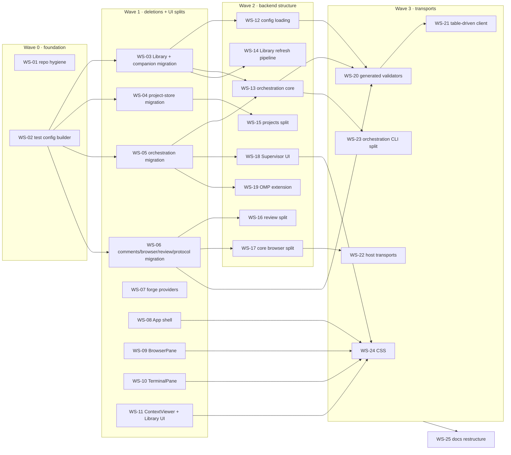

# Code cleanup: clean, understandable app and code

Status: plan, ready for handoff. Nothing in this directory has been implemented yet.
Source: the 2026-10-09 complexity review (frontend, Library/providers, supervisor, core/hosts, repo hygiene) and the migration inventory in [`migration-inventory.md`](migration-inventory.md).

## 1. Outcome

- **Migration code is gone.** The owner confirmed there is no legacy data or config. Every path that only reads, upgrades, prunes or tolerates old persisted formats, retired config keys or old wire shapes is deleted, along with the tests that exist only for those paths.
- **The code is smaller in the places that change most.** The giant components and functions are split along their real responsibilities. Repeated plumbing (transports, launch CAS checks, forge CLI runners, refresh pipelines) exists once.
- **Docs are short and each has one job.** CONTEXT explains the model, DECISIONS lists the rules, CODE_GUIDE says where to change things. Dated verification logs move out.
- **The repo carries only product code.** Experiments and one-off artefacts live in `archive/`.
- **Behaviour does not change** except in the places listed in §3.

Measured baseline from `python3 planning/code-cleanup-2026-10-09/measure_functions.py`: 4,025 production functions, of which 204 are over 80 lines, 75 over 150 and 22 over 300. The heuristic misses `mutate_with_review` (about 1,060 lines). Targets are in §8.

## 2. Out of scope (feature-creep candidates, deferred by the owner)

Do not change any of these, even when you are working in the same file:

- the `[library_sync]` setting count and the Live vs Accumulate follow modes;
- the browser annotation → agent feedback loop (it is restructured in WS-09 and WS-17 but stays fully functional);
- the supervisor repair-action set (RetryLaunch, ReconcileRun, CancelRun, IntentResolve, TaskAssignmentResolve), `RunAdopt`/Adopted runs, and the SpaceWorktree target;
- the top-bar buttons and palette contents;
- the context*/library* client method pairs;
- the notes CAS helpers, quota parser and widget placement rules.

## 3. Intentional contract changes (the only allowed ones)

| Change | Workstream | Consequence |
|---|---|---|
| `companion_root` / `COCKPIT_COMPANION_ROOT` removed from config, `ProjectConfiguration` DTO and agent env | WS-03 | A TOML file that still contains `companion_root` is rejected (`deny_unknown_fields`). Update the owner's config and `scripts/verify/ui_polish_runtime.py`. |
| Helpful rejections of retired keys removed (Jira/Confluence `executable`/`login`) | WS-03 | Those keys now fail as generic unknown/invalid fields. |
| Library index upgrades 2→3→4 and `legacy.rs` removed | WS-03 | Only schema-4 indexes open; anything older is an ordinary corrupt-index error. |
| Project-store journal upgrades removed | WS-04 | Only current typed journals decode. |
| Checklist "Track checklist" (`TaskStepsAdopt`) removed end to end | WS-05 | Untracked Markdown bullets stay visible and read-only. **Owner decision D1.** |
| `CommentOwner::LegacyPane` removed | WS-06 | Viewer is the only comment owner. |
| `origins` provenance map removed from config DTO | WS-12 | Nothing displays it today. |
| Provider-token entry points reduced to one label | WS-11 | UI copy and tests change. |

Persisted formats otherwise stay byte-compatible. In particular, keep the `legacy_migrated` and `relations_captured` fields in the Library records: they are still written today, and the records are strict (`deny_unknown_fields`), so removing the fields would reject current files. Only the code that consumes them for upgrades is removed.

## 4. Workstreams and order

| ID | Workstream | Size | Depends on | Brief |
|---|---|---|---|---|
| WS-01 | Repo hygiene | S | – | [workstreams/WS-01-repo-hygiene.md](workstreams/WS-01-repo-hygiene.md) |
| WS-02 | Shared `ProjectConfiguration` test builder | S | – | [WS-02](workstreams/WS-02-test-config-builder.md) |
| WS-03 | Library + companion-root migration removal | L | WS-02 | [WS-03](workstreams/WS-03-library-companion-migration.md) |
| WS-04 | Project-store migration removal | M | WS-02 | [WS-04](workstreams/WS-04-project-store-migration.md) |
| WS-05 | Orchestration migration removal (incl. checklist adoption) | M | WS-02 | [WS-05](workstreams/WS-05-orchestration-migration.md) |
| WS-06 | Comments/browser/review/quota/protocol migration removal | M | WS-02 | [WS-06](workstreams/WS-06-misc-migration.md) |
| WS-07 | Forge provider consolidation | M | – | [WS-07](workstreams/WS-07-forge-providers.md) |
| WS-08 | App shell split (`App.tsx`) | L | – | [WS-08](workstreams/WS-08-app-shell.md) |
| WS-09 | `BrowserPane` split | L | – | [WS-09](workstreams/WS-09-browser-pane.md) |
| WS-10 | `TerminalPane` split | M | – | [WS-10](workstreams/WS-10-terminal-pane.md) |
| WS-11 | `ContextViewer` split + provider-token entry points | L | – | [WS-11](workstreams/WS-11-context-viewer-library-ui.md) |
| WS-12 | Config loading | M | WS-03 | [WS-12](workstreams/WS-12-config-loading.md) |
| WS-13 | Orchestration core decomposition | L | WS-03, WS-05 | [WS-13](workstreams/WS-13-orchestration-core.md) |
| WS-14 | Library refresh + related-traversal unification | L | WS-03 | [WS-14](workstreams/WS-14-library-refresh-pipeline.md) |
| WS-15 | `projects.rs` split | M | WS-04 | [WS-15](workstreams/WS-15-projects-split.md) |
| WS-16 | `review.rs` split | M | WS-06 | [WS-16](workstreams/WS-16-review-split.md) |
| WS-17 | Core browser module split | M | WS-06 | [WS-17](workstreams/WS-17-core-browser-split.md) |
| WS-18 | Supervisor UI split | L | WS-05 | [WS-18](workstreams/WS-18-supervisor-ui.md) |
| WS-19 | OMP extension split | M | WS-05 | [WS-19](workstreams/WS-19-omp-extension.md) |
| WS-20 | Generated TS response validators | L | WS-06, WS-12, WS-13 | [WS-20](workstreams/WS-20-generated-validators.md) |
| WS-21 | Table-driven frontend client | M | WS-20 | [WS-21](workstreams/WS-21-table-driven-client.md) |
| WS-22 | Host transport consolidation (axum + Tauri) | L | WS-17 | [WS-22](workstreams/WS-22-host-transports.md) |
| WS-23 | Orchestration CLI split | M | WS-13 | [WS-23](workstreams/WS-23-orchestration-cli.md) |
| WS-24 | CSS consolidation | M | WS-08–11, WS-18 | [WS-24](workstreams/WS-24-css.md) |
| WS-25 | Docs restructure | M | all | [WS-25](workstreams/WS-25-docs.md) |

The waves are a scheduling guide; the arrows are the real dependencies. A workstream may start as soon as everything it depends on has been merged.

## 5. Rules for every worker

1. **Read first:** this file, your brief, `.omp/AGENTS.md`, `.omp/RULES.md`, and the relevant skill (`skill://cockpit-fix-verify-commit`, plus whatever your brief names).
2. **Preserve behaviour.** Refactors keep wire shapes, route names, Tauri command names, persisted formats, DOM class names, ARIA labels and keyboard behaviour unless §3 lists the change. If a split forces a visible change, stop and report it.
3. **Stay inside your files.** Edit only what your brief lists under "Owns". To change anything under "Coordinate", message the owning workstream first. Never touch files owned by a workstream in the same wave.
4. **Never hand-edit `src/protocol/generated/v1.ts`.** Change the Rust DTO, then regenerate (`cargo run -q -p cockpit-protocol --bin export-typescript -- --write src/protocol/generated/v1.ts`). If branches conflict in the generated file, resolve by regenerating.
5. **Clean cutover.** No aliases, shims, re-exports, compatibility defaults or "kept for old data" comments. Delete migration-only tests. Do not re-pin wording or implementation details in new tests.
6. **Don't touch the three root docs** (CONTEXT/DECISIONS/CODE_GUIDE). List the doc changes your work needs in your handoff; WS-25 applies them. Exceptions are a path fix in WS-01 and anything your brief explicitly allows.
7. **Work in an isolated worktree:** `git worktree add ../cockpit-ws-NN -b cleanup/ws-NN <integration-branch>`. Share one Cargo target dir per wave (`CARGO_TARGET_DIR=<repo>/target/cleanup`) instead of one per worktree, because disk is limited (§7).
8. **Verify once, when your edits are complete.** Run the affected checks and the smoke named in your brief. Testing only in disposable Herdr sessions (`python3 scripts/verify/ui_polish_runtime.py start|stop <root>`) is mandatory. Native changes need a native run. Library/provider changes need the live Jira/Confluence run. Never automate the default session.
9. **Handoff:** commit on your branch with explicit paths. Then report:
   - the outcome of every item in your brief;
   - the checks you ran, with results;
   - any skipped item, with its reason;
   - the doc notes for WS-25;
   - the before/after `measure_functions.py` numbers for your files.

## 6. Integration protocol (integration owner)

Per wave:

1. Merge the branches in dependency order. Wave 0 is merged before any Wave 1 branch is cut. Within Wave 1, merge the migration branches in the order WS-03 → WS-04 → WS-05 → WS-06: they edit disjoint hunks of `crates/cockpit-protocol/src/projects.rs` and `orchestration/dispatch.rs`, so a later branch rebases onto an earlier one rather than both resolving conflicts.
2. Regenerate the TypeScript protocol.
3. Run the integration gate from `CODE_GUIDE.md`, "Development loop":
   - `bun run typecheck`
   - `bun run test`
   - `cargo test --workspace --exclude cockpit-tauri`
   - `cargo check -p cockpit-tauri`
   - `bun run build`
   - `cargo fmt --check` on the changed Rust files only (the repo is not rustfmt-clean; don't mass-format).
4. Smoke the merged result: a browser build against a disposable fixture, plus one native run if `src-tauri/` or a transport changed.
5. Compare every handoff against its brief's acceptance list. Return missing items to the owning worker.
6. Commit the merge, then start the next workstreams in the graph.

Use `skill://cockpit-isolated-merge-verification-concurrent-work` if the main checkout has unrelated edits.

## 7. Prerequisites (owner action)

- **Disk:** `/home` is 94% full (127 GB free); `target/` is about 195 GB and `poc/` about 17 GB, mostly build output. Run `cargo clean` (and clear the PoC build output after WS-01) before starting parallel worktrees. This is the owner's call: it costs one full rebuild.
- **Config:** remove `companion_root` from your Cockpit TOML when WS-03 lands.
- **Live test credentials** for Jira/Confluence must still be in the private keyring (WS-03, WS-14). See `skill://cockpit-library-confluence-e2e` and `skill://cockpit-library-jira-e2e`.

## 8. Done when

- Every brief's acceptance list is met and the integration gate is green on the final merge.
- `measure_functions.py` reports at most **5 production functions over 300 lines** (from 22) and at most **40 over 150** (from 75).
- None of the files named in the briefs exceeds 1,500 production lines.
- `rg -i 'legacy|migrat|upgrade_v'` over `crates/ src/ src-tauri/ integrations/` returns only hits that `migration-inventory.md` classifies as CURRENT, or hits that were renamed.
- Browser and native smoke pass on the merged result.
- The docs follow the WS-25 structure.

## 9. Open decisions

- **D1 — checklist adoption (WS-05).** The inventory classifies "Track checklist" (`TaskStepsAdopt`, in-place UUID insertion into untracked bullets) as migration, because current authoring always writes tracked rows. The default is to remove it. If you still use it on hand-written bullets, WS-05 skips that phase.
- **D2 — config cutover.** Removing `companion_root` makes TOML files that still contain it fail to load. The default is to remove it (no alias).
