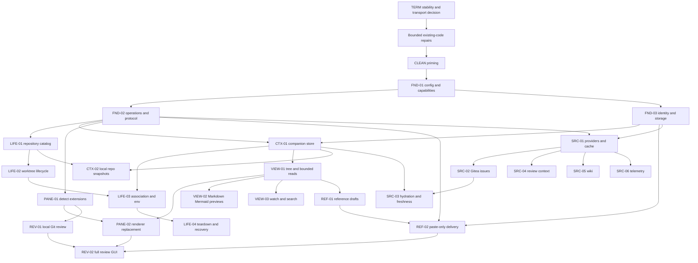

# Delivery sequence and parallel work

This is an implementation sequence for later work. The current task delivers plans and mockups only. Estimates are rough engineering effort, not deadlines; they assume one integrator and up to three bounded contributors familiar with Rust and React. Runtime discoveries can change the sequence at the named gates.

## Terminal stability and existing-code repairs first

The user reports severe whole-view flicker during terminal redraw, including active agent output and `/pets`; images may amplify it but are not the only suspected trigger. [TERM-01/02](13-terminal-stability.md) now precedes the milestones below. The custom protocol-22 build and renderer are not an accepted stable baseline. Reproduce and compare compatible build pairs, then select a bounded repair or stable fallback without changing the user’s running setup during planning. Re-probe downstream capabilities if the Herdr target changes.

The [existing-code review](../../research/next-level-existing-code-review.md) also identifies ordering, sequence validation, input routing, attachment identity, and request-lifetime repairs. Capture them in CLEAN-01, fix them as separately reviewed correctness increments, and only then preserve the corrected behavior through extraction. Frontend ordering/input and Rust request/attachment work can proceed in separate lanes once shared protocol/renderer ownership is fixed.

## Milestones

| Milestone | Stories | User-visible result | Required gate |
|---|---|---|---|
| M−1: maintainability priming | CLEAN-01-05 bounded first pass | Clear code ownership and a short personal tweak/test loop, same behavior | Existing gates, deterministic changed-code quality reports, and before/after disposable runtime proof |
| M0: contracts and runtime probes | FND-01-03, PANE-01, first LIFE-03/REF-02 probes | Known config/capabilities; proven env and paste paths | Disposable Herdr probes establish context-env handoff and paste-without-submit before building their UI promises |
| M1: useful local context | LIFE-01-03, CTX-01, PANE-02, VIEW-01-02, LIFE-04 | Create/open task worktree, attach context, browse local Markdown/Mermaid, safely remove owned resources | End-to-end native/browser lifecycle, partial recovery, provenance and deletion tests |
| M2: reference loop | REF-01-02, VIEW-03 | Collect comments across files, search context, paste to same-tab agent | Real multi-file payload, focus changes, reconnect uncertainty, no Enter |
| M3: source hydration | CTX-02, SRC-01-03 | Gitea issue/comment downloads and local repository snapshots, explicit freshness and retry | Real configured Tea read-only fixture, copy isolation, cache conflicts and provider-failure recovery |
| M4: full graphical review and richer sources | REV-01/02; independently SRC-04-05, optionally SRC-06 | Complete Reviewr GUI replacement; review/wiki downloads can ship separately | Per-capability provider fixtures and a real read-only source run |
| M5+: elective blocks | Individually selected OPT stories | Additional product capabilities | Each optional block's own acceptance and authority gate |

M1 does not need a provider. A user-created Markdown file in the companion is enough to exercise the whole viewer. M2 can therefore ship while provider adapters are still being built. M3 is part of the requested main idea and must not be dropped just because M1/M2 are useful.

## Dependency graph

The early LIFE-03 environment and REF-02 paste probes are deliberately ahead of their full implementation. A failed probe must alter the contract before UI work depends on it. They do not require production lifecycle/draft services, only disposable fixtures and precise byte/environment observations.

## Work waves

### Wave −1: prime maintainability

Run CLEAN-01 first to record behavior and existing checks. Prime [CLEAN-05 quality infrastructure](11-quality-gates.md) next: pin tools, verify metric mappings, establish a reviewed legacy baseline, and prove failures with known bad fixtures. This gives cleanup and feature agents deterministic feedback before they broaden the central files. Tool compatibility and coverage adapters can be investigated alongside CLEAN-01; one integrator owns dependency/configuration changes and the final gate. Then run the bounded frontend and Rust extractions in CLEAN-02/03 in parallel, using those gates. Finish CLEAN-04 code map/style audit and the real regression check. No new feature DTOs or presentation changes belong in this increment; test/metric dependencies are explicitly within CLEAN-05. Rough effort: 3–6 person-days for cleanup plus a provisional 3–5 for quality infrastructure, subject to the Rust/TypeScript adapter probes. Larger follow-up cleanup stays elective.

### Wave 0: freeze the smallest useful contracts

Integration owner writes configuration types, capability states, identity types, and operation/result envelopes. One contributor verifies the installed Herdr worktree/env behavior in a disposable session. Another verifies paste framing and no-submit behavior with a harmless input-capture program and the installed agent. A third probes `plugin.list`, `plugin.pane.open`, and `pane.process_info` to prove detection of the installed file viewer and Reviewr without extension communication. Derive file containment/copy-isolation fixtures alongside the storage contracts.

Do not freeze all optional provider fields up front. Freeze the main identity/error/operation vocabulary and the first file/lifecycle/paste DTOs. Add optional domain contracts when the matching story is selected.

Deliver one reviewed increment with exact protocol generation and compatibility gates. Rough effort: 3-5 person-days, plus runtime probe uncertainty.

### Wave 1: three independent implementation lanes

| Lane | Owns | Works on | Must not edit independently |
|---|---|---|---|
| Lifecycle | `core/repositories.rs`, `core/workspace_setup.rs`, `herdr/worktrees.rs` proposed modules | LIFE-01/02 and reviewed plan/recovery | Protocol exports, route registries, `App.tsx` |
| Context filesystem | Proposed `core/context/` modules and tests | CTX-01, file policy, read/tree contract, then CTX-02 | Provider implementations, worktree adapter, generated TS |
| Viewer | Proposed `src/app/context/`, shared view tokens | VIEW-01/02 using contract fixtures and selected design | Session reducer, terminal wire, resource mutation semantics |
| Integration | Existing client/host entrypoints and protocol exporter | Transport parity, composition, configuration, runtime fixtures | Does not duplicate domain logic in hosts |

Core traits and DTOs let viewer work proceed on honest fixtures while filesystem code lands. Fixtures are not a substitute for the integration gate. Rough effort: 8-14 person-days across the lanes.

### Wave 2: connect the local loop

Integrate LIFE-03 with CTX-01. Carry context env through Cockpit-created tabs/panes and display the initial-pane limitation. Build LIFE-04 before calling the lifecycle complete. Wire real viewer reads to the new services. Add REF-01 draft collection independently of paste delivery. Build VIEW-03 watcher/search concurrently with setup UI because the modules and DTOs are separate.

The integrator owns the `App.tsx` composition edit that adds the renderer choice inside existing Herdr pane rectangles and routes DOM focus; the viewer contributor supplies the component. PANE-01/02 must prove detection without hiding a same-title ordinary terminal. Preserve the client-shell complete-surface geometry, visible-pane subscription lifetime, and external focus reconciliation. Rough effort: 6-10 person-days.

### Wave 3: references and provider ingestion in parallel

One lane implements REF-02 using the proven paste operation and same-tab target guard. A separate lane implements SRC-01/02 behind the provider boundary. A third completes CTX-02 isolation and scale handling or tests lifecycle recovery from crashes. They share identity and operation envelopes, not mutable implementation files.

Integrate comment UI with the actual target terminal before expanding provider scope. Integrate SRC-03 after canonical snapshots, cache ownership, and companion replacement are proven. Rough effort: 8-14 person-days, sensitive to the configured Tea version's actual capability.

### Wave 4: richer context or elective blocks

REV-01 local review core can run beside source ingestion; REV-02 follows renderer/comment contracts and its local diff fixtures. It is independent of remote reviews. After SRC-01's contracts stabilize, Gitea reviews and wiki can proceed independently. Telemetry needs a selected source/provider and its own redaction/volume contract. Settings can proceed once config validation is stable. Packaging can proceed after the native application gates are reliable. Remote access and credentials are deliberately separate architectural work and must not be slipped into a “small settings” change.

M0-M3 is approximately 28-48 person-days before contingency, including the added extension detection/replacement work. The separate CLEAN priming estimate is 3–6 person-days for cleanup plus 3–5 for CLEAN-05 metric/test infrastructure; re-estimate if source-to-function mapping needs another tool. Re-estimate REV-01/02 after a local-diff spike; an initial range is 6-10 person-days independent of remote review adapters. Parallelism reduces elapsed time but does not divide it by the number of contributors: protocol review, integration, real runtime checks, and recovery fixes are serial work. Re-estimate after M0 with measured uncertainties.

## Contract and Git ownership

One integration owner controls these shared paths per wave:

- `crates/cockpit-protocol/src/v1.rs`, exporter and generated TypeScript;
- `src/client/CockpitClient.ts`, `browser.ts`, `native.ts`;
- host route/native command registries and Tauri capabilities;
- `src/app/App.tsx` composition and shared token additions;
- Cargo/frontend manifests and lockfiles.

Use separate branches/worktrees for active implementation lanes when possible. Each lane reports base commit, owned paths, DTO assumptions, tests, and integration requirements. A lane may propose a shared-file patch, but the integrator applies it once. Never run concurrent formatters or dependency updates against shared manifests.

Each increment should contain one coherent behavior and its validation, not “all backend” followed by “all frontend.” Merge foundations, then a thin end-to-end slice, then independent extensions. Check staged paths before committing and preserve unrelated user work.

## Runtime and acceptance matrix

| Area | Automated proof | Real browser proof | Native-specific proof |
|---|---|---|---|
| Configuration | Precedence, schema errors, capability isolation | Unavailable Tea leaves context/terminals usable | Same effective config and capability reasons |
| Lifecycle | Idempotency, duplicate calls, dirty/borrowed checkout refusal, crash at each step | Create/open/recover/remove in disposable repo/session | Same flow via Tauri, process/env observation |
| Context store | Containment, symlink race, atomic replacement, independent reflink/copy, concurrent writers | Add files externally; tree refresh and readable source | File watching and external-open capability |
| Markdown/Mermaid | Original line map, frontmatter offsets, malicious HTML/URLs, invalid/oversized diagrams | Render, select source lines, show errors without blocking text | Actual WebKit Mermaid rendering and resource policy |
| Comments | Stable excerpts, edit/remove, changed/deleted file, serialized format, UTF-8 byte bounds | Multi-file collect/preview, target selection, local drafts | Paste framing, clipboard fallback if offered |
| Delivery | At-most-once intent, rejected/unknown states, target mismatch, no auto retry | Actual agent input retains batch until user submits | Same operation path, focus/error mapping |
| Providers | Pagination, auth/unavailable, cycles, bounds, version/hash changes, user-edit conflict | Add/refresh a real read-only issue and secondary failure | Same progress, cancellation, retained old snapshot |
| Extension replacement | Manifest/process detection, same-title false match, independent GUI state | Open both extensions from Herdr, replace/move/switch renderer with no IPC | Same detection and full-surface terminal continuity |
| Layout/input | Focus and visibility reducers, no cross-tab send | 1440×900 and 1024×640; external focus, resize, switch, magic escape | Real terminal font/graphics and native key routing |

Use named disposable Herdr sessions and record every created workspace/worktree/pane/context path. Never drive the user's active agent during automated tests. Finish by cleaning up only test-owned resources; report residual artifacts if cleanup fails.

Run relevant gates for each change, not every test after every edit. Full main-path completion uses `cargo fmt --all -- --check`, appropriate `cargo test` workspace suites, generated protocol drift tests, `bun run typecheck`, `bun run test`, `bun run build`, and an explicit `cargo check -p cockpit-tauri` as confirmed in `src-tauri/Cargo.toml`. Native build success alone is not native runtime proof. Use the repository's installed scripts/toolchain; do not upgrade dependencies as incidental cleanup.

## Milestone exit and rollback

A milestone exits only when its real user loop works and its required failure cases preserve state. Capture screenshots, operation logs with secrets redacted, test commands, fixture identities, and resource cleanup. Keep reports under a dated verification folder near this plan.

Rollback of a code release must not erase companion files, snapshots, or drafts. Version manifests and reject newer unsupported schemas read-only. Forward migrations write backups and atomically replace manifests; irreversible content migrations belong in a separate reviewed story. Feature capability flags can hide incomplete UI, but cannot conceal an unsafe schema or quietly discard operations.

## Stop conditions that require a design change

- Herdr capabilities differ from inspected source/schema. Re-run the bounded compatibility probe, not undocumented requests.
- No supported operation can prove paste-only semantics for the target. Keep draft preview/copy available and do not pretend delivery works.
- Context identity cannot be reconciled with current Herdr provenance. Show an unassociated companion and require explicit reattachment.
- A source cannot provide the promised content through its configured wrapper. Report unavailable capability; do not silently introduce a direct HTTP credential path.
- A feature needs a Herdr-server change. Reframe it as Cockpit presentation or a separately deferred upstream dependency; server implementation remains outside this plan's authorized scope.

## Interaction-design follow-up

After committing this initial plan, build one consolidated workflow mock covering the planned main loop and graphical review. Use it for a second user discussion focused on reducing repeated clicks, GUI-scoped keyboard navigation/shortcuts, sensible mouse gestures, target selection, and pane behavior. This is a planning/design increment, not feature implementation. Its outcomes update 08-ui-design.md and the affected stories without reopening established Herdr authority or detect-and-replace decisions.

## Deterministic feedback for implementation agents

Every implementation lane consumes the same pinned quality policy and stable JSON/human reports from [CLEAN-05](11-quality-gates.md). Run fast checks while editing, changed-function complexity/coverage before handoff, and bounded mutation checks for changed production logic before completion. A Luna agent at high reasoning can own these bounded changes when contracts and patterns are clear; the integrator still owns behavioral acceptance, scope, and exceptions. Passing a metric does not replace native/browser/Herdr proof or architectural review.

Legacy debt is baselined explicitly so this infrastructure does not demand a whole-project rewrite. New code must satisfy the selected thresholds; touched legacy code must not regress. Unmapped coverage, missing tools, failing baseline tests, and incomplete mutation execution remain visible incomplete results, never an empty green report.

The earlier feature/cleanup estimates exclude TERM stabilization and the newly identified existing-code repairs. Re-estimate after the temporal reproduction and target selection; do not conceal this work inside the previous cleanup estimate. Quality tooling probes and static architecture inventory may proceed during diagnosis, but feature integration waits for the stable baseline.
