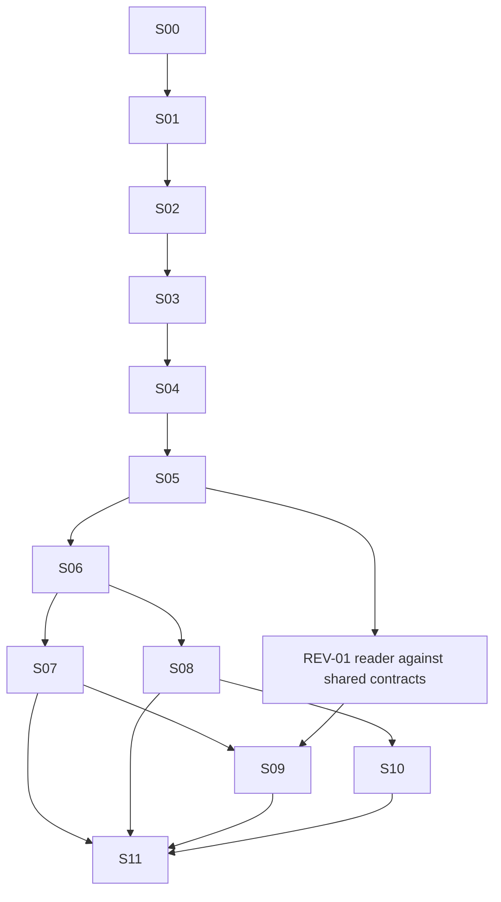

# Execution timeline and autonomous decisions

This is the implementation order for a future orchestrated run. It supersedes the older wave labels in [06-delivery-sequence.md](06-delivery-sequence.md) where terminal stability and existing-code repairs changed the order. The current task writes plans only.

Detailed repairs are in [14](14-existing-code-repairs.md). Verifiable goals and evidence contracts are in [16](16-verification-goals.md). The orchestrator starts from [IMPLEMENTATION_HANDOFF.md](../../IMPLEMENTATION_HANDOFF.md).

## Selected scope and finish line

The default implementation run includes BOOT-01, TERM-01/02/03, REPAIR-01 through REPAIR-05, CLEAN-01 through CLEAN-05, FND-01/02/03, PANE-01/02, LIFE-01 through LIFE-04, CTX-01/02, VIEW-01/02/03, REF-01/02, SRC-01 through SRC-05, and REV-01/02. Source downloads and complete local graphical review are required outcomes, not removed to shorten the run.

SRC-06 telemetry, PANE-03 TUI backport, OPT-01 through OPT-13, side-by-side diff, and larger follow-up cleanup remain planned but parked by default. Their omission must appear explicitly in the final scope report. The orchestrator need not ask which to build before starting. A later explicit scope change can select them with their own gates.

Finish means the selected stories are implemented, their required goals pass with recorded evidence, the integrated tree is committed, and a verified release candidate is launchable through documented commands. Build outputs, fixture resources, and remaining environmental limitations are accounted for. Replacing the user's installed Herdr/Cockpit, restarting active sessions, pushing, publishing, and tagging are separate activation actions, not required to finish this implementation run.

## Stage map

| Stage | Stories / result | Dependencies and gate | Practical parallel work |
|---|---|---|---|
| S00: establish the run | CLEAN-01 read-only inventory, protect default session, immutable source baseline, installed stable identity | G00A | Luna inventories tests/tools and checks links; Terra maps the current runtime; Astra fixes scope/ownership |
| S01: restore protocol compatibility | BOOT-01, actual stable transport/decoder plus matching gates, first terminal smoke | G00B, before any frontend-dependent smoke | Terra owns compatibility/bootstrap; Luna supplies schema and guard fixtures; no default-session mutations |
| S02: stabilize redraw, scrolling, and mouse | TERM-01/02/03, temporal fixture and verified stable presentation | G01 complete, selected target recorded | One Terra lane owns stable transport/renderer/mouse integration; a Luna lane verifies stable build identities/capabilities; no second writer to terminal wire |
| S03: correct current state/input/transport behavior | REPAIR-01/02/03/04/05 | G02; rerun G01 on integrated changes | Frontend ordering/input versus Rust finite request runner can run in parallel; serialize attachment/registry changes with terminal work |
| S04: make feedback deterministic, then extract | CLEAN-05 then CLEAN-02/03/04 | G03 | Quality adapters can be developed in separate paths; one owner integrates manifests; frontend and Rust extractions follow the working gate |
| S05: establish next-slice contracts and capabilities | FND-01/02/03, PANE-01; early LIFE-03 and REF-02 probes | G04 | Isolated env, paste, and detection probes can run in parallel; Astra approves one shared DTO/interface revision |
| S06: deliver local setup and reading | LIFE-01/02/03/04, CTX-01, PANE-02, VIEW-01/02 | G05 | Lifecycle, bounded filesystem, and viewer lanes consume frozen interfaces; integrator owns composition |
| S07: complete the reference loop | REF-01/02, VIEW-03 | G06 | Draft/formatting and search/watch can run separately; same-tab delivery integrates with actual input before completion |
| S08: hydrate sources and local references | CTX-02, SRC-01/02/03 | G07 | Local snapshot lane and Gitea/cache lane can proceed alongside late S07 after their contracts pass |
| S09: full local graphical review | REV-01/02 | G08 | Git reader can start after G04/shared document contracts; full UI integration waits for PANE-02 and reference contracts |
| S10: richer source downloads | SRC-04/05 | G09 | Review imports and wiki imports can run separately after SRC-01/02; neither blocks local review implementation |
| S11: integrated daily-use release candidate | All selected stories, documentation, migration/rollback, cleanup, commits | G10 and every selected prerequisite goal | One integrator runs the full acceptance set at the final commit; reviewers audit evidence and scope |

S08/S09/S10 are scheduling lanes, not a forced serial queue. Implement a local review reader while provider work is underway if its prerequisites are satisfied. A missing provider credential cannot justify idling an independent local-review lane. An unresolved core terminal/focus contract does block feature integration that depends on it.

## S00-S03: concrete early increments

First inspect the already-downgraded stable environment and restore Cockpit protocol compatibility through BOOT-01. A smoke of the currently incompatible frontend is not a prerequisite. Then establish the temporal baseline before renderer repair. The previous commit `582792e` is a comparison candidate only; use a matching server protocol and verify its behavior. Do not reset the current worktree to it or replace the installed server. Build comparison pairs in isolated directories/worktrees.

The user selected stable Herdr and parked protocol 22. Implement that decision without requesting it again:

1. Preserve the reachable protocol-22 commit and protect the orchestrator’s `default` session.
2. Verify the installed stable protocol/schema, implement BOOT-01, and smoke only a disposable named session. Then reproduce/record the redraw workload; use archived replay or detector negative controls when old live comparison is unavailable.
3. Recover/adapt the stable-compatible terminal path, retaining the existing mouse click/focus, application mouse, scroll, and keyboard behavior.
4. Park unsupported terminal TGP explicitly. Do not silently restore protocol 22 to make image tests pass or disable mouse to make migration pass.
5. Complete G01 and re-probe downstream capabilities. If stable APIs cannot support a required behavior, Astra investigates compatible existing APIs and records the blocker; it does not modify Herdr-server or claim the requirement complete.

A useful bounded investigation budget is two competing minimal hypotheses per experiment round, each with a falsifiable result. After two unsuccessful repair rounds, Astra reviews the trace and revises the approach before another worker is dispatched. This is an escalation to the orchestrator, not permission to lower the gate or abandon the feature.

Repair sequence after the renderer/transport identity is understood:

- REPAIR-04 finite request/subprocess runner can be implemented while renderer diagnosis proceeds if exclusive paths are assigned and its integration is tested against the selected target.
- REPAIR-01 orders snapshots/events and closes generation gaps before new focus-sensitive interactions.
- REPAIR-02 consumes workbench keys in the actual DOM input path; preserve ordinary terminal typing.
- REPAIR-03 fixes attachment tokens, pending-open cancellation, and the real terminal controller. This must share one owner with any active terminal-wire/presenter edits.
- REPAIR-05 consolidates validation/error policy and reconnect compatibility, then verifies capability invalidation against the selected target.

Each repair has its own narrow commit and before/after failure evidence. Do not bury behavior changes inside a file-moving cleanup commit. G02 includes all five repair groups even if they land in several commits.

## S04: quality infrastructure without circular dependencies

Capture the original source baseline before any repair. Tool probes may happen during S00-S03, but baseline inventory must not start or alter the user's Herdr sessions.

Implement CLEAN-05 as small verified increments: exact tool pins and probe; report schema and changed-source resolution; coverage/complexity joins; bounded mutation; baseline comparison and command integration. Adopt ordinary tests and regression fixtures immediately while these tools are being built.

Once the gate exists, evaluate code introduced by S02/S03 against the original baseline as well as new S04 code. Earlier repairs are not automatically grandfathered into legacy debt. New functions use the planned CRAP/coverage policy; narrowly reviewed exceptions remain explicit. A missing metric provider is inconclusive, not a reason to mark G03 passed.

Then perform CLEAN-02/03 extractions using the working gate and finish CLEAN-04's actual edit/test/run guide. The unused attachment reducer must be removed or replaced by the production controller's state path; merely moving both versions does not satisfy the goal.

## S05-S10: keep contracts local and integrate continuously

Freeze the identity/error/operation vocabulary once, then freeze each feature's DTOs immediately before parallel consumers use them. Keep later provider/optional operations as documented proposals until their stage begins. Do not generate placeholder methods for every planned feature at S05.

Document/comment contracts must support companion files, authorized checkout files, and Git revisions from the beginning. Persist batch IDs independently of connection epochs. Source freshness never silently changes captured excerpts.

Complete a thin real native/browser path in S06 before filling every viewer affordance. Finish teardown/recovery before declaring setup complete. S07 integrates actual paste acknowledgement/framing and same-tab focus, not just a textarea simulation. Run the real-task fixture after G06 without waiting for a human checkpoint; use the already accepted mock interactions as the default. Record unresolved visual styling as refinement work within the owning story, not as permission to lose keyboard or mouse paths.

S08 remains required even when the providerless local loop is already useful. Start with one bounded issue import and its comments; integrate bounded reference hydration/freshness next in SRC-03. Keep recursive traversal limited by the planned policy. S09 is the complete local read-only review workflow, including multi-file comments and old/deleted lines. It does not stage, commit, or post remote comments. S10 adds review/wiki ingestion through configured supported providers.

## Integration ownership and concurrency

Astra owns the task graph, the chosen architecture, evidence assessment, and merge/commit decisions. A designated Terra integrator may perform shared composition changes under an exact contract. Workers receive exclusive paths or symbols and a base commit.

Use isolated worktrees for concurrent writers when practical. When sharing a checkout, prohibit overlapping writers and reserve generated exports, manifests, lockfiles, host registries, `App.tsx`, and terminal-wire/presenter integration for one owner at a time. Run formatters/builds/integration tests only after the wave's edits are settled. Worker verification requests go to the integrator to avoid overlapping native sessions, port use, or global fixtures.

A wave has at most the available worker slots and never assumes a fixed unlimited pool. Terra owns stateful/cross-module work and independent review. Luna-high owns narrow pure modules, fixture cases, documentation, small provider adapters after examples exist, and repair tasks with precise tests. Increase supervision or split a task before switching models merely because its first attempt failed.

## Environmental blocks and autonomous recovery

A missing executable can be installed at an exact version in a run-owned tool directory, then probed. Build comparison binaries at explicit paths. Use isolated fixtures and test sessions. Do not replace user binaries, change active server configuration, or send input to an active user agent to avoid a test setup problem.

If provider credentials or native display/development prerequisites are unavailable, exhaust supported local setup paths that do not require new credentials or destructive/system changes. Implement and test the fixture path, record real integration as `blocked_external`, and continue independent stages. Never convert fixture success into live integration success. Ask one concise bundled question only when the missing input is essential and independent work is exhausted; the final report must list any still-unmet mandatory goals.

An unavailable optional feature stays parked. An unavailable mandatory outcome keeps its goal incomplete. The orchestrator does not silently reduce scope to obtain an all-green report.

## Estimates and re-estimation

The previous main-feature estimate of 28-48 person-days excludes terminal stabilization, newly identified repairs, cleanup/quality infrastructure, and richer review/source work. Do not use it as a deadline. At each gate record actual engineering time, test runtime, unresolved uncertainty, and the next bounded wave. Re-estimate after G00B, G01, G03, and G06. Model token counts and wall time are execution costs, not evidence that a goal is complete.

The orchestrator runs in Herdr `default`, already downgraded by the user. It never changes that server/session. Automated runtime scripts require a recorded run-owned non-default session and fail closed when the target is missing, ambiguous, or default. Environment setup must not use frontend compatibility as a prerequisite for BOOT-01; inspect the stable API directly first.
