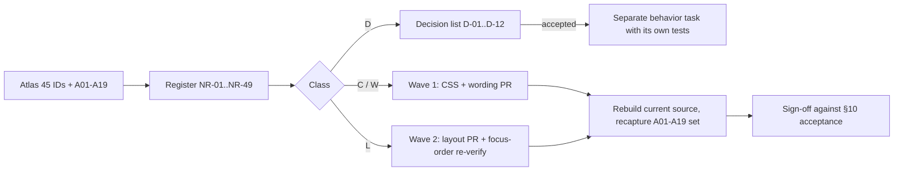

# Notes UI/UX design review — behavior-preserving polish

Date 2026-10-07. Author: design review worker (run 8297690c). Input: [`planning/notes-atlas-2026-10-07/ATLAS.md`](../notes-atlas-2026-10-07/ATLAS.md), its five slices, [`evidence/INDEX.md`](../notes-atlas-2026-10-07/evidence/INDEX.md), 19 actual screenshots (A01–A19) and the current Notes source. Companion deliverable: [`PRESENTATION.html`](PRESENTATION.html) (self-contained; illustrative concepts only).

No product code, tests, config, user Notes or bindings were touched. No build, test, lint, formatter or browser run was executed by this review.

---

## 1. Goal & users

**Goal.** Make the existing Notes workbench easier to read, scan, operate and trust **without changing what it does**: same persistence, identity, source order, adoption, drafts, CAS, unknown-outcome and decision-history behavior. Every recommendation is mapped to stable atlas surface IDs, to evidence, to the invariant it must not break, and to a testable acceptance check.

**Users and entry points** (from atlas N-SHELL-01/02):

| User | Entry | Primary tasks |
|---|---|---|
| Developer working in a Space | top-bar **Notes** or Commands → Open Notes (`App.tsx:239`, `App.tsx:1099`) | jot in Scratchpad, track todos/board, record decisions |
| Same developer, first run / new machine | unbound state → Create or Attach | bind notes to a Space; move an existing Notes folder between Spaces |
| Developer recovering from conflict/uncertainty | shared alerts, retained-draft disclosures | decide between Keep mine and Reload; check saved state after an unconfirmed write |
| Agent owner (reads `cockpit-cli` text) | Agent access footer | copy pinned commands |

**Scope = presentation only.** Anything that changes focus, navigation, persistence, mutation gates, counting semantics or adds a control/indicator is **not** in the polish set; it is listed in [§9 Separate decisions](#9-open-questions-and-separate-decisions).

### 1.1 Change classes used throughout

| Class | Meaning | Allowed in this polish pass |
|---|---|---|
| **C** | Cosmetic: CSS tokens, spacing, alignment, icon swap with an existing glyph, emphasis. No DOM-order, focus, handler or label-semantics change. | Yes |
| **W** | Wording / accessible-name / title only. Same handler, same state. | Yes |
| **L** | Layout that moves or re-parents DOM, or changes stacking (overlay → in-flow). No handler change, but **focus order / scroll anchoring must be re-verified**. | Yes, with the stated acceptance |
| **D** | Needs a separate product/behavior decision: focus transfer, navigation, new indicator/control, counting basis, guard/disabled semantics, recovery policy. | **No** — decision first |

Severity: **P1** = defect or comprehension hazard in a recovery/safety-relevant or first-run flow; **P2** = clear usability, hierarchy or accessibility gap; **P3** = polish. Confidence: **H** observed *and* explained by source, or unambiguous source fact; **M** well-supported but one leg missing; **L** inference.

---

## 2. Evidence (existing patterns reused) and provenance

### 2.1 Evidence classes — keep them separate

| Tag | Meaning | Rule |
|---|---|---|
| **A##** | Actual disposable-app screenshot, `evidence/NN-*.png`, from the **existing bundle `index-CssAnWz1.js`** (INDEX.md "Provenance and limits") | Proves only the visible state in that capture, not the actions leading to it |
| **S** | Current source coordinate (`path:line`) as checked in ATLAS "Source coordinate validation" and re-read here | Establishes implemented contract, not rendered behavior |
| **I** | Illustrative concept authored in `PRESENTATION.html` | Never proof; never a screenshot; never shipped UI |

**Provenance caveat that must stay attached to every A-based finding.** INDEX.md records that the loaded bundle is *newer than the inspected CSS/editor source timestamps* but is **not proven to be a build of the current source**. Where a finding cites both A and S, the screenshot shows the observed geometry and the source offers the explanation; they agree, but a rebuilt current-source capture is required before visual acceptance sign-off. Findings with **S-only** evidence are marked *(S-only)* and have never been seen rendered. Screenshot 02's filename says "empty" but it is an actual **catalog error** (`notes_not_found`); a successful empty catalog was not captured.

### 2.2 Existing patterns and tokens the proposals reuse (observed, not invented)

| Pattern | Where | Reused for |
|---|---|---|
| Back-with-label button (`back` icon + "Back to decisions") shown only ≤719px container | `Decisions.tsx:108`, `notes.css:221,264` | NR-08 detail → list affordance |
| `.notes-error-row:empty{min-height:0}` | `notes.css:206` | NR-24 collapse reserved empty row |
| Selection language: `--select-fill` + 2px `--select-edge` | `styles.css:21-24`, `notes.css:23,124,199` | all selected states; unchanged |
| Warning rule: 2px left border `--warning`/`--blocked` on inline groups | `notes.css:69,184` | NR-02 attached transfer confirmation |
| Global focus ring `2px solid var(--focus-strong)`, offset 1px on button/input/select/summary; textarea/CodeMirror inset ring | `styles.css:123-130`, `notes.css:12` | unchanged; verified good in A05, A19 |
| Icon inventory includes `trash`, `edit`, `back`, `down`, `info`, `more`, no grip glyph | `UiIcon.tsx:2-34` | NR-22 uses `trash`; NR-30 avoids a new asset |
| Type scale tokens `--font-size-2xs 11px … -2xl 23px`; `--compact-control-size 28px`; `--tab-strip-height 41px` | `styles.css:46-55,64,86` | NR-48 token floor |
| Coarse-pointer rule revealing hover-only controls | `notes.css:286` | NR-15, NR-33 |
| Container-query breakpoints 900 / 719 / 520 | `notes.css:256-285` | all responsive remedies (container widths, not viewport widths) |

### 2.3 What is already good — keep unchanged (verified A or S)

- Unbound state (A01): single icon, headline, 52ch explanation, **Create notes** primary + **Attach existing notes…** secondary. Clear, explicit, no implicit setup.
- Tab bar: accent underline + `--select-fill`, roving tabindex, arrow/Home/End (`NotesView.tsx:129-135`); focus ring clearly visible (A19).
- Kanban: lane dots, counts, **empty lanes already show "No cards."** (`Kanban.tsx:185`; A05 Done lane); all lane `+` buttons intentionally focus the single Backlog composer (`Kanban.tsx:133,185`). Narrow board: horizontal scroll with next-lane peek, document `scrollWidth=420` (A07 per INDEX). Focus ring on the handle clear (A05).
- Decision rows: selection edge, title weight, status text (A08).
- Inline delete confirmation with Keep autofocused and red rule (A18).
- Scratchpad Saved/Draft/Saving status dot (A19, A11).

---

## 3. Flow

### 3.1 Review → implementation flow



### 3.2 Navigation/focus map under review (unchanged by this work)

```mermaid
flowchart TD
  T[Top-bar Notes / Commands] --> R[Notes root focus]
  R -->|unbound| U[Create | Attach...]
  U -->|Attach| P[Picker: Cancel/Retry/radios]
  P -->|bound candidate| X[Inline transfer confirm: Keep focused]
  R -->|bound| TB[Tablist: Scratchpad Todos Kanban Decisions]
  TB --> SC[Source/Preview + Save]
  TB --> TD[Todos list] --> DT[Task detail heading focused]
  TB --> KB[Board cards] --> DT
  TB --> DC[Decisions list/detail/forms]
  DT -->|Escape: delete-cancel, edit-keep, close| TD
  R -->|Escape: transfer, picker, then close| T
```

Polish must not alter any arrow in this map. Items that would are in §9.

---

## 4. Screens/components — findings, concepts and remedies

Register conventions: `Sev/Conf/Class` per §1.1. Evidence column lists actual captures first, then source. Atlas IDs link to [ATLAS.md](../notes-atlas-2026-10-07/ATLAS.md#surface-registry). Illustrative before/proposed for each domain is in [`PRESENTATION.html`](PRESENTATION.html) (cited as *Concept Cn*).

### 4.1 Shell: unbound, create, attach, catalog, transfer (Concept C1)

Before (A12, A02): heading centered on its own line; the 52ch helper text and the 600px catalog card sit **side by side on one row**; the transfer warning is a full-width band spanning the whole content area at the bottom; **Cancel** is a lone centered button; in the error case the message, **Retry reading catalog**, disabled **Attach** and **Cancel** run on one line. The picker reads as five unrelated fragments.

| ID | Atlas | Finding | Evidence | Sev/Conf/Class | Conservative remedy | Preserve |
|---|---|---|---|---|---|---|
| **NR-01** | N-SHELL-03 | Picker content does not stack. `.notes-binding` is a wrapping row (`justify-content:center`); `.notes-binding>p` is `width:100%` but capped `max-width:52ch`, `.notes-catalog` is `flex:1 1 100%` capped `max-width:600px`, so the two fit on one flex line. | A12, A02; `notes.css:239-249`; picker JSX `NotesView.tsx:269-278` | **P1 / H / C** | In picker mode lay out one centered column (same direction rule as `.notes-binding-empty`), content width ≈ catalog width: heading → helper → catalog → confirmation → actions. | Picker initial focus targets, Escape order, exact-UUID selection |
| **NR-02** | N-SHELL-03, N-SHELL-06 | Transfer confirmation is a full-width band detached from the selected entry; **Attach here** and **Keep current association** have identical weight, so the consequential action is visually indistinct from the safe one. | A12; `NotesView.tsx:273`; `notes.css:69` | **P2 / H / C+W** | Render the confirmation directly under the catalog at catalog width; keep warning rule; keep **Keep current association** first and focused; give **Attach here** a quiet warning border (not accent). Wording unchanged. | Safe-choice focus, "Files are not moved or deleted", no focus trap |
| **NR-03** | N-SHELL-03 | Action row inconsistent: Attach/Cancel stacked and centered (A12) or merged with the error line (A02). | A12, A02; `NotesView.tsx:273-275` | **P2 / H / C** | One right-aligned row under the card: `[Cancel] [Attach]`; error case: alert block above, then the same row. DOM order unchanged (Attach, then Cancel). | Cancel restores opener focus; Attach disabled without candidate |
| **NR-04** | N-SHELL-03 | Catalog error is one run-in sentence: message + `notes_not_found` code + Retry. Backend wording ("Notes path does not exist") is accurate but reads like a fault on a clean machine. | A02; `NotesView.tsx:272` | P3 / M / C | Render as the standard alert block (message primary, code secondary mono, **Retry reading catalog** adjacent). **Do not rewrite backend message text** (D-class if wanted). | Error persists until Retry/Cancel; no auto retry |
| **NR-05** | N-SHELL-03 | A refreshed catalog that no longer contains the selected UUID silently disables Attach (S-only). | `NotesView.tsx:240-278` (`candidate`) | P3 / L / W | Derived hint under the list when `selected` is set and `candidate` is absent: "The selected notes are no longer in the catalog." No selection mutation. | Never auto-attach or auto-create |

### 4.2 Shell chrome, tabs and navigation (Concept C7)

| ID | Atlas | Finding | Evidence | Sev/Conf/Class | Remedy | Preserve |
|---|---|---|---|---|---|---|
| **NR-06** | N-SHELL-04, N-REC-09 | Tab counts mean three different things — Todos = **open** (`!done`), Kanban = **on board incl. Done**, Decisions = **all records incl. History** — and are `aria-hidden`, so AT users get none and sighted users cannot tell. Visible in A08→A09 (Decisions 1→2 when History is chosen, same Space) and A13 (Todos 3 vs Kanban 2). | A08, A09, A13; `NotesView.tsx:135` | P2 / H / W | Add `title` (and a visually-hidden suffix) per tab: "Todos — 3 open", "Kanban — 2 on board", "Decisions — 2 records (Current and History)". **Count basis unchanged.** | Counting semantics (changing them = D-01) |
| **NR-07** | N-SHELL-01, N-SHELL-04, N-REC-09 | Two stacked chrome bands (header + tablist) before content, both at the 41px strip height; at 420px ~90px of 900px is chrome before the first control. | A05, A07; `notes.css:16,21`; `styles.css:64` | P3 / M / L → D-11 | **Not recommended now.** Keep two rows; only trim header horizontal padding at ≤520. Merging rows changes landmarks and Escape/Close geometry. | Header Close, root Escape |
| **NR-08** | N-TODO-06, N-KAN-05, N-SHELL-01 | Two identical `✕` glyphs stacked: **Close Notes** (header) directly above **Close task details** (detail header), different scope. At ≤719 the detail replaces the list, so the second ✕ reads as "dismiss everything". | A04, A16; `TaskDetail.tsx:180`; `NotesView.tsx:270`; `notes.css:152,260` | **P2 / H / C+W** | At container ≤719 render the detail close as the existing Back pattern (`back` icon + "Back to tasks"), same `onClose` handler and focus-return; at wide keep ✕ but add visible tooltip text (already `title`). | Close handler, opener focus return, Escape order (delete → edit → close) |

### 4.3 Scratchpad: source, preview, save, conflict (Concept C2)

Before (A19, A03, A11): the `markdown` label sits at the far left edge and the mode toggle at the far right edge of a 76ch centered text column — the toolbar belongs to the container, the text to the column, so they look unrelated. Conflict (A11): the saved-Markdown disclosure renders the **saved preview centered with 15px/1.8 body styling** inside a 12px alert, and the destructive-overwrite action is the accent-filled primary.

| ID | Atlas | Finding | Evidence | Sev/Conf/Class | Remedy | Preserve |
|---|---|---|---|---|---|---|
| **NR-09** | N-SCR-02, N-SHELL-04 | Toolbar/column misalignment (label far-left, mode toggle far-right, text at ~76ch center). | A19, A03, A11; `notes.css:36-37,41` | P2 / H / C | Constrain the Scratchpad toolbar and the save-status row to the same centered column box (same `max-width` as `.cm-scroller` padding rule) so label, text and save controls align. | Session/caret/scroll cache, Mod-S |
| **NR-10** | N-SCR-02 | Source/Preview are icon-only (`code`, `eye`) 30×25px; names only in `title`/`aria-label`. | A19; `MarkdownEditor.tsx:90`; `notes.css:31` | P3 / M / W+C | At container ≥520 show text labels "Source" / "Preview" beside the icons; ≤520 icons only. `aria-pressed` unchanged. | No focus handoff change (D-05) |
| **NR-11** | N-SCR-01, N-REC-02 | "Saving…" appears for **any** Notes write on that UUID (shared `busy`), not only Scratchpad save (S-only). | `NotesView.tsx:138`; `useNotes.ts:98-106` | P3 / M / W | Say "Saving Notes…" (honest scope). **Do not** change pending ownership. | Serialized per-UUID writes |
| **NR-12** | N-SCR-03, N-REC-03 | Conflict review inherits the Scratchpad reading-column style: `.notes-scratchpad .notes-markdown{max-width:72ch;margin:auto;font-size:md;line-height:1.8}` applies inside the alert's `<details>`; saved version looks like page content, offset ~260px from the alert's own text. | A11; `notes.css:41,70`; `NotesView.tsx:138` | **P2 / H / C** | Scope-reset inside `.notes-conflict .notes-markdown`: `max-width:none; margin:0; font-size:sm; line-height:1.55`; add a muted label "Saved version (read-only)" and keep max-height scroll. Keep **Show saved Markdown** disclosure. | Draft retained above, saved preview is the *saved* content |
| **NR-13** | N-SCR-03, N-TODO-03, N-COM-03, N-DEC-04, N-KAN-04 | Emphasis inconsistent: Scratchpad **Keep mine and save** is `notes-primary` (accent) while the equivalent control in todo-title, comment and decision conflicts is neutral. The overwrite action gets the most visual pull only here. | A11; `NotesView.tsx:138` vs `TaskDetail.tsx:206`, `Decisions.tsx:112`, `TodoTitle.tsx:57-73` | P2 / M / C | Make Scratchpad Keep mine / Reload equal-weight neutral; add one muted consequence line under the pair: "Keep mine overwrites the saved version. Reload discards your draft." Same order, same handlers. | Explicit overwrite requires explicit click; labels unchanged |
| **NR-14** | N-SCR-02, N-COM-02, N-COM-03 | CodeMirror line-number gutter is hidden only inside `.notes-scratchpad`; in comment composer/edit the placeholder reads "1 Add a comment…". | A04, A15, A16; `MarkdownEditor.tsx:48`; `notes.css:38` | P3 / H / C | Hide `.cm-gutters` in `.notes-comment-composer` and `.notes-comment-edit`; leave the decision body editor's gutter. | Editor state/keymap |

### 4.4 Todos: list, filter, adoption (Concept C3)

| ID | Atlas | Finding | Evidence | Sev/Conf/Class | Remedy | Preserve |
|---|---|---|---|---|---|---|
| **NR-15** | N-TODO-01, N-TODO-04, N-KAN-03 | Board membership is invisible at rest: the On-board chip is `opacity:0` until hover/focus (A04 row 1 is on the board; nothing shows it). The hidden control still reserves width, leaving the comment count floating ~50px from the row edge (also A14). | A04, A13, A14 vs A05; `notes.css:103-108`; `NotesView.tsx:145` | **P2 / H / C** | Keep on-board chip at reduced opacity (~.65, full on hover/focus) with lane initial/title; fixed-width trailing action column so counts align. Promote (+ Board) button stays hover/focus-reveal. Coarse-pointer rule unchanged. | Chip still switches to Kanban and focuses the card title |
| **NR-16** | N-TODO-05, N-KAN-03, N-REC-04 | **Adoption is disguised as Comments.** A task without an ID shows the same comment icon as an adopted task; only the `aria-label` says "Adopt task & comments". Activating it **writes an `id` into `todos.md`** (atlas: explicit adoption, `NotesView.tsx:91-101`). A13 row 3 vs row 1 are visually identical. | A13; `NotesView.tsx:145`; `Kanban.tsx:61`; atlas N-TODO-05 | **P1 / H / W+C** | Visible differentiation without behavior change: for unadopted/duplicate-ID tasks render the button with a short text "Adopt" (≥520) or a distinct `plus-in-comment` treatment, plus `title`: "Adopt task & comments — adds an id to this task in todos.md". Same handler. A pre-click confirmation would be **D-02**, not included. | Adoption only on explicit action; ref repair; no read-time adoption |
| **NR-17** | N-TODO-01 | "Hide completed" flips its **label** *and* sets `aria-pressed` (label becomes "Show completed" when pressed). AT hears a toggle whose name and state contradict ("Show completed, pressed"). | A04; `NotesView.tsx:142` | P2 / H / W | Fixed label "Hide completed" with `aria-pressed`. Visual state unchanged (filled pill when active). | View-only filter, persisted preference |
| **NR-18** | N-TODO-01 | All tasks completed + hidden → blank list; empty prompt uses `!model.todos.length` only (S-only). | `NotesView.tsx:143,147` | P2 / M / W | Derived zero-result text: "All tasks are completed and hidden." + the existing toggle focus. No new control. | Filter remains view-only |
| **NR-19** | N-TODO-03, N-KAN-04 | Editable titles look like static text until hover (transparent textarea border). | A04, A13 row 3 (hover shows field); `notes.css:99-100` | P3 / M / C | Add `cursor:text`; keep transparent resting border. No resting borders (density). | Enter-to-save, no blur-save |
| **NR-20** | N-TODO-01, N-REC-04 | Markdown-source popover trigger is an icon-only `</>` at the toolbar far right. | A04, A13; `NotesView.tsx:142`; `notes.css:84-92` | P3 / L / W | Add text label "todos.md" beside the icon at ≥720. | Popover is read-only |
| **NR-21** | N-TODO-01 | Nesting is conveyed only by inline `padding-inline-start` (+12px/level, cap 6); no guide line (S-only, no nested fixture captured). | `NotesView.tsx:144` | P3 / L / C | 1px left guide per depth via CSS only; verify with a nested fixture first. | Source order/nesting from Markdown |

### 4.5 Task detail and comments (Concept C3)

| ID | Atlas | Finding | Evidence | Sev/Conf/Class | Remedy | Preserve |
|---|---|---|---|---|---|---|
| **NR-22** | N-COM-04 | Comment **Delete** uses the `close` glyph — the same glyph as Close task details 250px above; `trash` exists in the icon inventory. Pencil + ✕ adjacent. | A18 (highlighted ✕); `TaskDetail.tsx:203`; `UiIcon.tsx:6` | **P2 / H / C** | Swap to `trash`; hover tint `--blocked`; `aria-label="Delete"` unchanged; confirmation unchanged. | Inline confirmation, Keep autofocus, CAS refusal |
| **NR-23** | N-COM-01 | Comment provenance hierarchy: author/date at 11px muted; **Record details** disclosure (info icon + 11px) sits *between* header and body, pushing the body down; "unverified author" only in a `title`. | A04, A17; `TaskDetail.tsx:202,205`; `notes.css:166,173` | P2 / M / C+W | Header 12px; move disclosure below the body; append a muted "label" qualifier to the author ("Local user · unverified label"). Disclosure content unchanged. | Provenance disclosed, never implied authenticated |
| **NR-24** | N-COM-01, N-TODO-06 | A permanently reserved empty `.notes-error-row` (min-height 28px) creates a dead band between "Comments" and the first comment. Also in A14 the empty-comments state is left-aligned (icon + text) whereas the other empty states (`.notes-empty-actionable`, board, decisions) are centered, because `.notes-comment-empty` is not in that selector list. | A04, A14, A15, A16; `notes.css:71,75,163`; `TaskDetail.tsx:188,194` | P3 / H / C | Collapse the row when empty, as Decisions already does (`notes.css:206`); add `.notes-comment-empty` to the centered empty-state selector. Retry alert still appears in-flow. | Retry reading, aria-busy |
| **NR-25** | N-TODO-04, N-KAN-06 | Detail summary controls wrap into three rows; **Remove from board** (non-destructive) has the same visual weight as the primary-neutral buttons; Completed and Move=Done both express done-state (A16). | A04, A16; `TaskDetail.tsx:181-186`; `notes.css:154-161` | P3 / M / C | Group "Board" row: lane select + de-emphasized text-style **Remove from board** + hint, aligned baseline. **Do not remove either control.** | Done keeps remembered lane; unboard keeps comments |
| **NR-26** | N-COM-02 | Author field shows the default value "Local user"; "optional · unverified" exists only as an empty-state placeholder and `title`. | A04; `TaskDetail.tsx:217` | P3 / M / W | Visible muted suffix "unverified" next to the "author" label. | Author is an explicit label |
| **NR-27** | N-COM-01, N-COM-03, N-REC-05, N-TODO-03 | Several states render with **no stylesheet rule** at all (no match in any `src/**/*.css`): `.notes-new-comments` (new-below action), `.notes-task-removed`, `.notes-thread-loading`, `.notes-item-problems`, `.notes-retained-comment`, `.notes-comment-discard`, `.is-unboarded`. They render as default buttons/plain paragraphs. (S-only; none observed.) | `TaskDetail.tsx:186,194,203,212,214`; `TodoTitle.tsx:57-73`; grep of `src/**/*.css` | P3 / H (absence) / M (impact) / C | Give each a minimal rule from existing tokens: new-comments = sticky pill; removed-task = info band with warning rule; loading = muted text with `aria-busy`; item-problems = `--warning` text; retained comment = left warning rule. | States, strings and handlers unchanged |
| **NR-28** | N-SCR-01, N-TODO-02, N-COM-02 | Disabled primaries are `.5` opacity over a tinted fill (Add, Comment, Save scratchpad) — very faint, no reason given. | A04, A19, A13; `notes.css:6-7` | P3 / M / C | Disabled primary: keep fill, drop opacity to ~.6 and desaturate text; no tooltips (reason is obvious or alerted elsewhere). | Disabled gates unchanged |

### 4.6 Kanban (Concept C4)

| ID | Atlas | Finding | Evidence | Sev/Conf/Class | Remedy | Preserve |
|---|---|---|---|---|---|---|
| **NR-29** | N-KAN-03, N-KAN-01 | Card density: a one-line card is ~100px tall because the actions row (28px menu + 10px padding) is reserved even when empty — Backlog card in A05/A06 has a blank bottom row holding only `···`. | A05, A06; `notes.css:122,133`; `Kanban.tsx:61` | P2 / H / C | Pull the menu summary into the title row (CSS absolute to the top-right, **DOM order unchanged**) and render the lower row only when a comment count/draft dot exists. | Tab order, whitespace-click open, drag handle |
| **NR-30** | N-KAN-03, N-KAN-08 | One glyph, two jobs: the **drag handle** (rotated `more`, top-right) and the **card actions** summary (`more`, bottom-right) are the same three-dot icon. A05 shows the handle focused next to the menu. No grip glyph exists. | A05, A06; `Kanban.tsx:60,61`; `UiIcon.tsx:2`; `notes.css:128-130` | **P2 / H / C** | Keep the handle as is (cursor `grab`, 24×28); switch the menu summary to the existing `down` disclosure chevron. Zero new assets. Names (`Move card: …`, `Card actions: …`) unchanged. | Keyboard drag contract, Space/Enter/arrows/Escape |
| **NR-31** | N-KAN-01 | Lane jump chips (≤899 container) look like plain text: `background/border: transparent !important`; no hover/focus-visible shape beyond global ring; no indication of the visible lane. | A06, A07; `notes.css:111`; `Kanban.tsx:170-187` | **P2 / H / C** | Chip shape: 1px `--border`, `--radius-pill`, hover fill, count badge. **No current-lane tracking** (would be new state, D-12). | Chips remain valid drop zones |
| **NR-32** | N-KAN-02 | Lane `+` is named "Add a card from Doing/Done" (aria-label) while its `title` and the field say **Backlog**; all three focus the Backlog composer. | A05; `Kanban.tsx:185,133` | P2 / H / W | Make all three `aria-label` = "Add a card to Backlog" (match `title`). **Do not remove** the Doing/Done buttons (D-07) and **do not** add per-lane creation (feature). | Focus target `#kanbanAddInput`; Backlog-only creation |
| **NR-33** | N-KAN-03 | Card whitespace opens detail but gives no cursor/affordance cue; handle and comment button are `opacity:0` until hover/focus (revealed always on coarse pointers). | A05; `Kanban.tsx:44-48`; `notes.css:128-143,286` | P3 / M / C | `cursor:pointer` on non-control card area; reveal handle at 40% on hover-capable devices when the card is selected. | No new activation semantics |
| **NR-34** | N-KAN-01, N-SHELL-04 | At the medium width the third lane is clipped (46% basis) with no edge cue beyond chips (A06 "No ca"). | A06; `notes.css:257` | P3 / M / C | Edge fade on the board's scrollable side; scroll-snap unchanged. | Scroll memory, snap |
| **NR-35** | N-KAN-08 | The live status stays under the board as 11px muted text after a gesture (A05: "…moved to Doing. File order kept."). Informative; small. | A05, A07; `notes.css:150` | P3 / L / C | Raise to 12px; leave persistence as is. A timed clear is behavior (not proposed). | `role=status` politeness |

### 4.7 Decisions (Concept C5)

| ID | Atlas | Finding | Evidence | Sev/Conf/Class | Remedy | Preserve |
|---|---|---|---|---|---|---|
| **NR-36** | N-DEC-01, N-DEC-08 | The sort button's visible text is its **current** state ("Newest"/"Oldest", accent-filled) but its `aria-label` is the fixed "Decision sort order", which **replaces** the visible text for AT: the state is never announced, and sighted users can't tell whether the label is state or action. | A08, A09; `Decisions.tsx:105` | **P2 / H / W** | Visible "Sort: Newest"; `aria-label` "Sort order: Newest first. Activate to show oldest first." | Ordering by recorded instant then ID |
| **NR-37** | N-DEC-01, N-DEC-02 | After switching to History, the detail pane still shows the previously selected **Current successor** while the list shows only its **Replaced predecessor**; no row is selected and nothing explains it. | A09 (INDEX A09 note); `Decisions.tsx:106-114` | P2 / H / W | Derived context line above the detail when selected id ∉ list: "This record isn't in the current list filter." No selection/filter mutation. | Selected ID persistence; no auto-jump |
| **NR-38** | N-DEC-06 | Date hierarchy: the list chip is the **recorded** date; the user-meaningful **decided** date exists only inside collapsed **Details** (A08 shows it expanded: decided 2026-10-01 vs recorded 2026-10-07). Formats differ (date vs date-time). | A08; `Decisions.tsx:106,113` | P2 / H / W+C | Label the chip "Recorded 10/7/2026" (or title) and show "Decided 2026-10-01" in the footer meta line when present. **Ordering stays recorded-based.** | Immutable recorded, optional decided, no invented dates |
| **NR-39** | N-DEC-02, N-DEC-05, N-DEC-08 | Detail layout: body at top, footer pinned to the bottom with a ~450px void between (A08/A09/A10); the additive **Replace with a new decision** lifecycle action is a full-width neutral button buried inside **Details**. | A08, A10; `notes.css:213,215`; `Decisions.tsx:113` | P2 / H / C+W (L option) | Now: rename the summary to "Details & replacement"; cap footer void with `justify-content:flex-start` for the footer under the body when body is short. **Option (L):** move Replace beside Edit — same gating, DOM order Edit → Replace; needs focus-order review. | Replace gating, source CAS, predecessor bytes untouched |
| **NR-40** | N-DEC-01 | Vocabulary: filter says **Current/History**, rows say **Current/Replaced**. | A09; `Decisions.tsx:105-106` | P3 / M / W | Filter option text "History (replaced)". Values unchanged. | Derived status |
| **NR-41** | N-DEC-03, N-DEC-04, N-REC-06 | New/edit forms: action cluster mixes Save, "Back / keep edit" and "Discard edits" at equal weight; "Draft kept" at 11px. **No A capture** of these forms (S-only). | `Decisions.tsx:110-112`; `notes.css:209-212` | P3 / M / C | Primary Save; neutral Back/Cancel; Discard gets `--blocked` text colour on hover/focus; "Draft kept" 12px. Labels unchanged. | Retention vs discard semantics |
| **NR-42** | N-DEC-02, N-DEC-08 | Narrow: Back to decisions + Edit read well (A10); list-view at 420 was **not captured**; no focus transfer on list→detail. | A10; `Decisions.tsx:108`; `notes.css:258-269` | P3 / L / — | Visual: none. Focus transfer is **D-05**. | Back keeps record/draft |

### 4.8 Shared recovery, errors and footers (Concept C6)

| ID | Atlas | Finding | Evidence | Sev/Conf/Class | Remedy | Preserve |
|---|---|---|---|---|---|---|
| **NR-43** | N-KAN-09, N-DEC-07, N-REC-02 | The shared problem slot is `position:absolute; bottom:0` over `.notes-panels` (max 160px/45%). Bottom-anchored controls — **Save scratchpad**, the comment composer's **Comment**, Kanban live status — sit exactly where an alert appears, and `pointer-events:auto` makes the alert cover them. For known errors those controls are actionable and get covered; for unknown outcome they are already refused by the existing guard (the model blocks every write until a successful saved-state read and explicit acknowledgement), and the overlay can additionally obscure the recovery controls. Not observed (no error capture). | *(S-only)* `notes.css:62-64`; `NotesView.tsx:152-156,138`; `TaskDetail.tsx:215-220` | **P1 / M / L** | Make the slot an in-flow flex child below `.notes-panels` (content pushes up, never covered). Same 160px/45% cap and scroll. **Layout only: no gate, disabled-state or handler change.** Verify scroll anchoring of the editor/thread. | Alert role, unknown guard (writes stay refused until check + explicit ack), drafts kept |
| **NR-44** | N-REC-07, N-DEC-07 | The unknown-outcome alert is one run-in paragraph + code + buttons that appear conditionally; the three-step process (what happened → check → acknowledge) is implicit. (S-only) | `NotesView.tsx:154`; `notes.css:65-68` | P2 / M / C+W | Present as three ordered rows with the **same strings and buttons**: ① "Could not confirm whether the change was saved…" ② **Check saved state** ③ (after read) review sentence + **I checked saved state; allow next write**. Acknowledge stays disabled until the read succeeded (unchanged). | Check = read not retry; ack explicit; no auto-replay |
| **NR-45** | N-REC-04, N-REC-06, N-REC-09 | Retained-source drafts live in a **collapsed** disclosure with "N source draft(s) kept" — user text exists but is not visible, and the copy is pluralized with "(s)". (S-only) | `RetainedDrafts.tsx:12-19`; `notes.css:250-255` | P2 / M / W+C | Summary: "N unsaved edit(s) kept — source no longer exists" with correct plural; warning-tinted summary. Default-open is **D-08**. | Never auto-retarget; explicit discard |
| **NR-46** | N-SHELL-05 | Agent access overlay is a wall of 11–12px text and 14+ commands in a flat 2-column grid. Not captured expanded. (S-only) | `AgentAccess.tsx:55-72`; `notes.css:229-238` | P3 / L / C | Group commands under surface headings (Scratchpad, Todos, Board, Decisions, Comments) using existing labels; keep copy buttons and readonly inputs. | Pinned UUID, no execution, no replay text |
| **NR-47** | cross-cutting | Persistent informational text at 11px (`--font-size-2xs`): counts, "Draft kept", comment header, hints, Reference inputs. | A04, A05, A08; `notes.css:14,24,150,166,173,220`; `styles.css:46` | P3 / M / C | Raise **functional** 11px text (draft/status/provenance/hint) to `--font-size-control` 12px. Decorative counts may stay. | Layout at 420px |
| **NR-48** | cross-cutting | Hit targets: native checkboxes 16×16, drag handle 24×28; WCAG 2.2 SC 2.5.8 sets a 24 CSS-px minimum unless spacing exempts. [INFERENCE: spacing may exempt rows.] | A04, A05 (small boxes visible); `notes.css:11,128,286` | P3 / M / C | Expand the checkbox hit area to ≥24px (padding on the wrapping control/pseudo-element); no visual enlargement of the box. | Row/card click semantics |
| **NR-49** | N-SHELL-01 (App chrome) | Observation, **not a Notes finding**: the top-bar **Notes** trigger carries `aria-pressed={notesOpen}` (`App.tsx:239`) and shows a filled state in A01 but not in A02–A19. Could be hover/focus residue. | A01 vs A02–A19; `App.tsx:239`; pressed style defined for `.tab-icon-button` only (`styles.css:1647`) | P3 / L / C | Main to verify on rebuild; if confirmed, give `.tab-strip-action[aria-pressed=true]` the shared selection language. Out of the Notes stylesheet. | Trigger toggles Notes |

---

## 5. Interaction & keyboard

All keyboard contracts in atlas "Navigation/focus map" are **frozen** for the polish pass:

- Notes root Escape order: transfer → picker → close. Detail Escape: delete-cancel → edit-keep → close. Tabs: Left/Right wrap, Home/End, roving tabindex. Mod-S saves the focused editor's surface; Ctrl/Cmd+Enter posts/saves comments. Kanban Space/Enter pick-up/drop, Left/Right lane, Escape/Tab cancel.
- **L-class items change DOM position, so each needs a focus-order check:** NR-08 (detail close presentation at narrow, same element), NR-39 option (Replace placement), NR-43 (slot becomes in-flow), NR-29 (visual-only move; DOM order must stay *handle → checkbox → title → comments → menu*). Re-run the existing safety suites listed in the atlas (`NotesView.behavior.test.tsx`, `notesState.test.ts`) — *references, not executed here*.
- No new shortcuts. No Notes chord exists in the shortcut registry (atlas) and none is proposed.
- Pointer/keyboard parity: every remedy keeps the same control reachable by both. Hover-reveal remedies (NR-15, NR-33) must keep `:focus-within` reveal and the coarse-pointer override.

## 6. Accessibility

| Topic | Finding | Remedy |
|---|---|---|
| Names vs state | NR-06 counts hidden; NR-17 label+pressed contradiction; NR-36 aria-label masks sort state | Titles/hidden suffix; stable label; state in aria-label |
| Color-only meaning | Lane dots, saved/draft dot (labels present), board-chip hidden state (NR-15) | Keep text labels; chip gets text/title |
| Focus visibility | Global 2px `--focus-strong` ring verified (A05, A19). Hover-hidden controls become visible via `:focus-within` | Preserve; do not remove `opacity` reveal on focus |
| Contrast | `--text-muted #a6adc8` on `--app-bg #0b0e12` ≈ 8.7:1 (computed from `styles.css:13,29`) — fine; the issue is **size** (11px) and **disabled opacity .5** (NR-28, NR-47) | Raise functional text to 12px; soften disabled |
| Target size | 16px checkboxes (NR-48) | ≥24px hit area |
| Landmarks/roles | Tabs/panels/dialog-less inline groups correct per atlas | No change |
| Reduced motion/coarse | `notes.css:286-291` present | Preserve |
| Not verified | Screen-reader pass, touch hardware, native renderer, forced-colors | Listed as unverified |

---

## 7. Options considered (consequential choices)

| Choice | Option A (recommended) | Option B | Tradeoff |
|---|---|---|---|
| Picker layout (NR-01/02) | Single centered column; confirmation under the card | Modal dialog for transfer | B adds a focus trap and removes the inline pattern the atlas contract and tests cover; A is CSS/DOM-local |
| Adoption affordance (NR-16) | Visible "Adopt" label + title, same handler | Pre-click confirmation | B is a behavior change (D-02); A removes the disguise cheaply |
| Problem slot (NR-43) | In-flow bar | Keep overlay, add bottom padding to panels | Padding trick still blocks content when the alert is taller than the padding; in-flow is robust |
| Card menu glyph (NR-30) | Menu → `down` chevron | New grip icon asset | B adds an asset and ambiguity with other `more`s; A reuses inventory |
| Replace discoverability (NR-39) | Rename Details summary now | Move Replace beside Edit | B better discovery, changes focus order and risks accidental clicks next to Edit; do after A if still needed |
| Chrome density (NR-07) | Keep two rows | Merge header into tab row | B saves 41px but changes landmarks and Close geometry |
| Conflict emphasis (NR-13) | Equal weight + consequence line | Reorder buttons | Reordering changes tab order; unnecessary |

## 8. Preserved invariants (every remedy checked against these)

I-1 Notes are ordinary Cockpit-local Markdown; opening/closing is not create/attach. I-2 UUID folder identity; binding = endpoint+session+Space; transfer moves only the association. I-3 Resolve once, pin UUID; late responses never retarget. I-4 Canonical bytes ≠ drafts ≠ view state. I-5 CAS by revision (byte hashes, item revision, whole-document ref). I-6 Adoption only on explicit mutation. I-7 Source order = task/board order; no ranks; Done keeps remembered lane. I-8 Dirty text keeps its original revision until explicit review; Keep mine overwrites only on click. I-9 Unknown outcome ≠ success or failure; no auto-replay; read-then-explicit-ack, persists across remount. I-10 Comments are durable records independent of membership; author is an unauthenticated label. I-11 Decision history additive; predecessor bytes untouched; recorded immutable. I-12 Bounded/safe storage; browser limits ≠ byte validation.

**Nonrecommendations / no feature expansion.** No per-lane card creation; no decision or task delete control; no auto-save, auto-retry, auto-ack or auto-adopt; no new shortcuts; no change to counts, sort, filter defaults or view-state persistence; no change to unknown-outcome incident scope (D-09); no new recovery UI; no merging Completed with Move; no modal conversion; no rewrite of backend error messages; no change to Kanban drag mechanics, thresholds or file-order semantics; no change to focus-return rules.

---

## 9. Open questions and separate decisions

Each needs an explicit product decision **before** implementation; none is included in the polish set.

| ID | Question | Options | Recommended default | Atlas |
|---|---|---|---|---|
| **D-01** | Should tab counts share a basis? | (a) keep, label (NR-06 only); (b) Todos=all, Kanban=non-done, Decisions=Current | (a) | N-SHELL-04 |
| **D-02** | Confirm before explicit adoption? | (a) none (NR-16 labeling); (b) inline one-time disclosure | (a) | N-TODO-05 |
| **D-03** | Show a draft marker on tabs/rows when a draft is retained elsewhere? | (a) none; (b) dot on tab; (c) dot only on surfaces with existing indicators | (b) after review — drafts are invisible off-tab today | N-REC-01/05 |
| **D-04** | Field-local validation (title bytes, date format) vs the current global alert? | (a) keep; (b) inline messages mirroring backend | (b) later, with backend error mapping | N-DEC-03/07 |
| **D-05** | Focus transfer: Source↔Preview toggle, Decisions list→detail/Back, detail close | (a) keep; (b) define explicit targets | (b) with tests; real editor needed (existing tests mock it) | N-SCR-02, N-DEC-02/08 |
| **D-06** | Warn when draft *reads* or view-preference writes fail (currently silent/warn-on-write only)? | (a) keep; (b) read warning | (b), cosmetic wording only | N-REC-01/09 |
| **D-07** | Doing/Done lane `+` buttons: keep or hide? | (a) keep (NR-32 wording); (b) hide; (c) true per-lane add (feature) | (a) | N-KAN-02 |
| **D-08** | Retained-draft disclosure default-open, and un-gate from Scratchpad load? | (a) keep collapsed; (b) open when count>0 | (b) | N-REC-04/06 |
| **D-09** | Broaden unknown-incident review to every thread? | (a) keep selected-task scope; (b) all threads | (a) until safety review | N-REC-07 |
| **D-10** | Make Save/Keep-mine visibly disabled during unknown outcome (handler already refuses) and consistent card comment opener? | (a) keep; (b) align disabled props | (b) after focus-loss review (disabled buttons lose focus) | N-TODO-03, N-KAN-03 |
| **D-11** | Merge header and tab rows? | (a) keep; (b) merge ≥900 | (a) | N-SHELL-01/04 |
| **D-12** | Visible-lane indicator on jump chips? | (a) none; (b) scroll-tracking state | (a) | N-KAN-01 |

Evidence gaps to close before sign-off: rebuild current source and recapture A01–A19; capture successful empty catalog, expanded Agent access, decision new/edit form, decisions list at 420, an actual alert-over-composer state (NR-43), nested todos, long titles/many cards. Keep these as separate evidence, never as proof of other states.

---

## 10. Acceptance scenarios (observable UI checks)

Run on a rebuilt current source in a disposable fixture, at 1440, 900 and 420 CSS px. Every scenario also requires: no change in `todos.md`/`scratchpad.md`/decision bytes from the polish alone (compare before/after), existing Notes safety suites pass, focus ring visible.

| # | Scenario | Pass condition | Findings |
|---|---|---|---|
| G1 | Open picker with ≥1 entry at 1440 | Heading, helper, card, actions in one column; no side-by-side helper/card | NR-01, NR-03 |
| G2 | Select an attached-elsewhere entry → Attach | Confirmation directly under the card at card width; focus on **Keep current association**; Keep returns focus to Attach; Attach here transfers; text unchanged | NR-02 |
| G3 | Catalog error | Alert block with code + Retry; Attach disabled | NR-04 |
| G4 | Scratchpad at 1440 | Label, text and Save row share one column edge | NR-09 |
| G5 | External edit → conflict | Saved preview left-aligned at alert text size; Keep mine and Reload equal weight; both buttons work as before | NR-12, NR-13 |
| G6 | Todos with an unadopted task | Visible "Adopt" (or distinct) affordance and tooltip; activating still adopts (id appears); adopted rows show comments | NR-16 |
| G7 | Todos on-board task at rest | Board status visible without hover; counts aligned | NR-15 |
| G8 | Hide completed | AT name constant ("Hide completed", pressed state toggles); all-done list shows the zero-result text | NR-17, NR-18 |
| G9 | Comment header | Trash icon on Delete; Close task details still ✕; confirmation unchanged | NR-22 |
| G10 | 420px detail | Back-labelled control replaces ✕; Escape order unchanged; focus returns to opener | NR-08 |
| G11 | Kanban card | Handle vs menu glyphs differ; single-line card height reduced; keyboard drag Space→Right→Space/Escape works byte-identically | NR-29, NR-30 |
| G12 | Lane `+` | All three names say Backlog; focus lands on Backlog composer | NR-32 |
| G13 | Jump chips at 900 | Visible chip affordance; jump still scrolls | NR-31 |
| G14 | Decisions: Newest/Oldest, History | Visible "Sort: …"; AT name includes state; context line when selection is outside filter | NR-36, NR-37 |
| G15 | Decision detail | Decided date visible near recorded; Details summary says "& replacement"; Replace still disabled when replaced | NR-38, NR-39 |
| G16 | Force an unknown outcome in a fixture | Alert is in-flow and does not cover content; Save/Comment stay visible and show their **existing** disabled/handler-refused state (no write becomes actionable before acknowledgement); **Check saved state** and, after a successful read, the acknowledgement control remain unobscured and clickable; three-step layout; ack only after a successful check; writes remain refused until then | NR-43, NR-44 |
| G17 | Retained draft | Summary shows count and reason; text still selectable; Discard works | NR-45 |
| G18 | Tab hover/AT | Tab names expose count basis | NR-06 |
| G19 | Typography/targets | No functional text below 12px; checkbox hit area ≥24px | NR-47, NR-48 |

## 11. Implementation sequencing

1. **Wave 1 (C/W, one PR, CSS + strings):** NR-01–06, NR-09–20, NR-22–28, NR-30–38, NR-39 (summary rename and void tightening only), NR-40, NR-41, NR-45–48. NR-21 follows only after a nested-todo fixture is captured; NR-49 is a verification item for App chrome.
2. **Wave 2 (L, separate PR, focus-order and scroll-anchoring re-verification):** NR-08, NR-29, NR-39 (Replace-relocation option only), NR-43, NR-44. Confirm NR-43 on a rebuild first (S-only).
3. **Not now:** NR-07 (D-11), NR-42 (D-05).
4. **Wave 3:** decisions D-01…D-12 individually, each with its own behavior tests.

## 12. Examples

- [`PRESENTATION.html`](PRESENTATION.html): current-vs-proposed illustrative concepts C1–C7, risk/UX register with filters, decision list, and evidence/atlas coverage. Current panels are **schematic redraws of A-captures, not screenshots**; proposed panels are **illustrative, not shipped UI**.
- Actual evidence: [`../notes-atlas-2026-10-07/evidence/`](../notes-atlas-2026-10-07/evidence/INDEX.md).

## 13. Uncertainty

- A-evidence came from an existing bundle; identity with current source is unproven (§2.1).
- S-only findings (NR-05, 11, 18, 21, 27, 41, 43–46) were never seen rendered.
- Contrast figure for muted text computed from the token hexes, not measured in-app.
- No assistive-technology, touch, native-renderer, or forced-colors verification.
- Concept dimensions are illustrative; real values must be derived from tokens during implementation.
