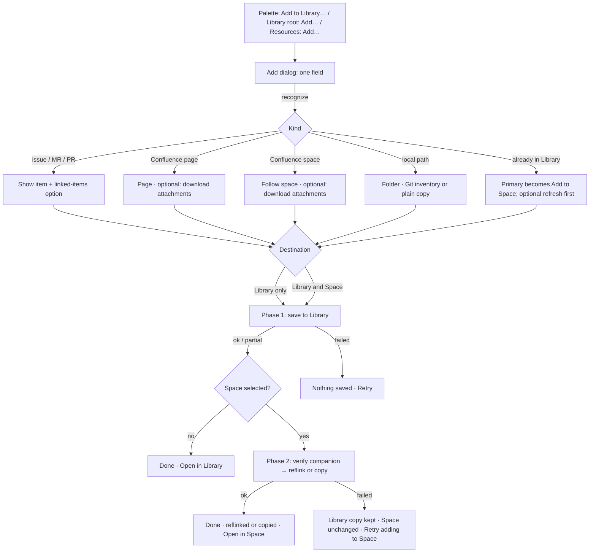
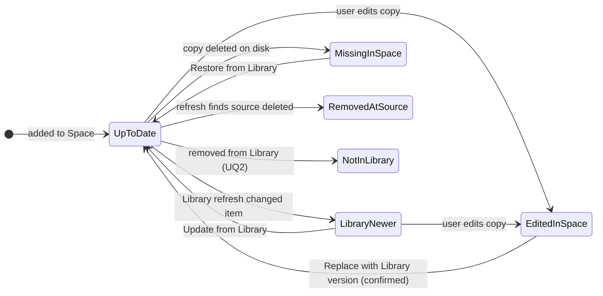

# Shared context Library — interaction design

Status: design, step 2 of 3. Input contract: [FEATURE_PLAN.md](FEATURE_PLAN.md) (U1–U10 settled, P1–P13 proposed, Q1–Q8 open). This design assumes every recommended P/Q. Each place a proposal shapes the UI is tagged `[dep Pn/Qn]`. Prototype: [examples/library-prototype.html](examples/library-prototype.html).

Contents: Goal & users · Evidence · Flow · Screens and components · Interaction & keyboard · Accessibility · Options considered · Open questions · Acceptance scenarios · Examples.

---

## 1. Goal & users

**Goal.** Give the single developer on a trusted workstation one place to keep and read shared context: issues, MRs/PRs, Confluence pages and followed spaces, and copied local folders. Adding any of these takes one short dialog. A Space receives context only as an explicit copy and changes only when the user asks.

**User.** A developer running agents in Herdr Spaces. A typical task combines context from several repositories, a Jira ticket, and a Confluence space.

**Jobs, in order of frequency:**
1. Read context beside a terminal. In a Space, this means the Space copy the agent reads. With no Space, it means the Library.
2. Add a link, key, folder, or Confluence space to the Library, and optionally to the current Space, in one action.
3. After refreshing the Library, see which Spaces are behind and update one of them deliberately.
4. Recover from a provider, sign-in, limit, or companion failure without losing content that was already saved.
5. Remove things safely: from the Library, from a Space, or stop following a space.

**Entry points** (each builds on the existing surface cited in §2):
| Where | Action | Default destination |
|---|---|---|
| Command palette (no Space needed) | `Open Library`, `Add to Library…` | Library only |
| Context pane in a Space, root selector | `Library` root | Library only |
| Context pane in a Space, companion root, `Resources` | `Add…` | Library and this Space |
| Library item header / tree row menu | `Add to <Space>` | this Space (item already in Library) |
| New Space setup, `Link` row | linked artifact | Library and the new Space (existing flow, now central-first) |

---

## 2. Evidence (existing patterns reused)

| Pattern | Where | Reused as |
|---|---|---|
| Root selector in the Context toolbar, shown when a pane has more than one root | `src/app/context/ContextViewer.tsx:1201` | The Library is one more root, labeled `Library`, in every Context pane `[dep P12]` |
| Toolbar order: root, `Files`, file picker, `Resources`, spacer, Preview/Source, Wrap, Refresh files, Show terminal | `ContextViewer.tsx:1199-1211` | Same toolbar. The Library root adds `Add…` and `Refresh all` where `Resources` sits |
| `Resources` exists only for companion roots | `ContextViewer.tsx:1204`, `ContextResources.tsx:37` | Stays companion-only. Its content becomes the per-Space state list |
| Resources dialog: pane-local overlay, focus trap, Escape closes, focus restored on close | `ContextResources.tsx:26-65`, `context.css:247-268` | Space context list, same shell |
| Source rows: title first; provider, kind, freshness, and status chips; `Source details` disclosure; inline diagnostics; per-row refresh | `SourceImport.tsx:248-277`, `context.css:354-385` | Library and Space rows keep this anatomy. Chip colors keep the existing mapping |
| Freshness vocabulary `fresh/changed/unknown/unavailable/conflict`; status `materialized/unchanged/conflict/unsupported/failed` | `src/protocol/generated/v1.ts:532-534` | Extended to the S1 Library states and P7 Space states (§4.6) |
| Explicit refresh that preserves local edits; "Include linked sources … within import limits" | `SourceImport.tsx:234`, `:243` | Same copy and checkbox in Add |
| Repository snapshot: "Copy tracked files and untracked, non-ignored files … Later source edits leave this copy unchanged." | `SnapshotImport.tsx:33-39` | Folder branch of Add `[dep P9]` |
| Setup `Link` row with lookup note (`Looking up the link…`, `✓ MR !482 · title`) and linked-artifact checkboxes | `src/app/projects/SetupDialog.tsx:292-311`, `:778-781` | Add dialog recognition line, same styles (`task-setup-note is-valid/is-error`) |
| Compact task dialog: 600 px, label/field rows, footer Cancel + primary, Escape closes, Enter submits from a text field, Tab loop | `SetupDialog.tsx:738-759`, `:773-815`, `taskSetup.css:1-140` | Add dialog and confirmation dialogs |
| Progress that keeps completed work and retries only the failed step; closing the dialog does not cancel | `SetupDialog.tsx:324-346`, `planning/next-level/08-ui-design.md:97` | Two-phase add progress `[dep P6]` |
| Space-independent durable panel opened from the palette | `TeardownRecoveryPanel.tsx:32-36`, `App.tsx:1495` | Precedent for Library access with no Space |
| Cockpit-owned view that is not a Herdr pane | `DECISIONS.md:37` | Precedent for the Library view being Cockpit-owned. It is not a precedent for keeping hidden panes live (§4.1) |
| Palette actions with groups, disabled state, and reasons | `App.tsx:634`, `:1486-1499` | `Open Library`, `Add to Library…`, `Refresh Library` |
| Prefix keymap | `src/app/input/keymap.ts:9-36` | Proposed `Ctrl+B Shift+L` (§5.2, UQ3) |
| Viewer keys: Ctrl+P picker, Alt+1 tree, Alt+2 content, Alt+Z wrap; tree arrows, Enter, Home/End | `ContextViewer.tsx:964-1005`, `:1192-1197` | Unchanged in the Library root |
| Narrow panes: tree becomes an overlay at pane width ≤ 520 px; editor becomes a sheet at window ≤ 600 or pane ≤ 520 | `src/app/input/useFileOverview.ts:9`, `CommentEditor.tsx:10` | Same thresholds for the Library header and dialogs |
| Workbench narrow breakpoint 800 px (sidebar becomes a drawer) | `src/app/styles.css:2267` | Library view follows the drawer rules |
| Document header with canonical id plus an `info` details disclosure; stale/diagnostic notices under it | `ContextViewer.tsx:1120-1143` | Library item header adds a state chip and actions |
| Empty state with one action | `ContextViewer.tsx:1101-1102`, `research/ui-design-direction.md:208-218` | Empty Library |
| Comments enabled only for companion roots and the default folder | `ContextViewer.tsx:703` | Library root has no comments (UQ4) |
| Errors stay inline with what failed and what is still safe; no toast-only or modal errors for recoverable failures | `research/ui-design-direction.md:228-238`, `:294` | All failure copy |
| State shown by icon plus word, never color alone | `research/ui-design-direction.md:114`, `research/ui-implementation-constraints.md:157` | Every state chip |
| Source overview states and actions | `planning/next-level/08-ui-design.md:101-105` | Space context list |
| Tokens | `src/app/styles.css:12-75` | Prototype uses these values verbatim |
| No synthetic Herdr panes or tabs; no settings screen; secrets stay external | `DECISIONS.md:30`, `:52`, `:47` | Library view is not a tab. Credential guidance points to the CLI |

Not observed, and needed by this design (`[INFERENCE]`, for the implementation plan): a `library` value in `ContextRootKind` (`v1.ts:348`); tree entries that carry a display label and state separate from the file name; per-Space state data for companion rows.

---

## 3. Flow





**Primary path, with a Space open:**
1. The user presses `Resources` → `Add…` in the Context pane. Focus lands in `Link, key, or folder`.
2. The user pastes `https://gitlab.example.com/platform/api/-/merge_requests/482`. The note shows `✓ MR !482 · Fix token refresh race · GitLab · gitlab.example.com`.
3. Destination is preset to `Library and api-review`. The user presses Enter.
4. Progress shows `Saving to Library…`, then `✓ Saved to Library`, then `Adding to api-review…`, then `✓ Added to api-review · reflinked`. Actions: `Open in api-review` · `Add another` · `Close`.
5. The pane tree expands to the new file, the same way `onChanged` expands imported paths today (`ContextViewer.tsx:1245-1249`).

**Primary path, no Space:** Palette → `Add to Library…`. The destination row reads `Library` with the note `Select a Space to also add it there.` There is no Space radio. On success the actions are `Open in Library` · `Add another` · `Close`.

**Update path:** Library view → `Refresh all`. A report strip shows `2 new · 3 updated · 1 failed`. In a Space, the Context toolbar shows `Resources · 3 behind`. The user opens it and presses `Update all (3)`. Only that Space changes.

---

## 4. Screens and components

### 4.1 Library view (no Space needed) `[dep P12]`

A Cockpit-owned view that fills the work area below the tab strip. It is not a Herdr tab or pane, does not appear in the tab strip, and sends no Herdr process, focus, or layout request. This section describes only how the Library surface is presented.

**Pane renderer and subscription lifecycle is unchanged.** Preserve the existing visible-pane/selected-tab rule: terminal renderers and live output subscriptions exist only for visible panes in the selected tab. Hidden tabs detach their renderers/subscriptions while their Herdr processes continue. The Library is an app-owned presentation, not a Herdr pane or tab; do not keep hidden live terminal renderers or subscriptions to support it. When the Library closes, the selected tab's visible panes attach again through the normal attach-and-resync path (`research/ui-design-direction.md:247`, `research/ui-implementation-constraints.md:149`, `:182`).

**Focus and session authority.** The global Library can open without a Herdr session or pane authority. Opening or closing it never asserts Herdr focus, pane selection, or ownership. On close, restore DOM focus to the invoker only if it remains mounted; otherwise move DOM focus to a safe workbench focus target without claiming or changing Herdr selection. With no session, there is no target Space or pane authority: `Add to <Space>` is absent, the Add destination is Library only, and the Library never creates, selects, or implies a session.

```text
┌ LIBRARY  ~/.local/share/cockpit/library                                  [Close] ┐
│ [Files] [⌕] [Add…] [Refresh all]                    [Preview|Source] [Wrap] [↻] │
├────────────────────────────────┬─────────────────────────────────────────────────┤
│ ▾ Confluence · nnexai.atlass…  │ Confluence page  SD / Release process           │
│   ▾ SD · Software Develop…  ◉  │ Release checklist                               │
│     ▸ Architecture overview    │ ↑ Updated 2 h ago · v7   [Refresh] [Add to api-review] [⋯] │
│     ▾ Release process          │ ▸ Metadata                                      │
│         Release checklist   ↑  │ Attachments  3 · 1 downloaded  [Download all]   │
│       ▸ Attachments (3)        │   release-flow.png   84 KB   ✓ downloaded       │
│       Onboarding (old)      ⊘  │   runbook.pdf       1.2 MB   not downloaded [Download] │
│ ▾ GitLab · gitlab.example.com  │   demo.mp4           48 MB   not downloaded: over limit │
│   ▾ platform/api               │ ─────────────────────────────────────────────── │
│       !482 Fix token refre…    │ # Release checklist                              │
│       #1290 Rate limiter …  ✎  │ …rendered Markdown…                              │
│ ▾ Jira · jira.example.com      │                                                  │
│   ▾ OPS                        │                                                  │
│       OPS-311 Rotate sign…  ?  │                                                  │
│ ▾ Folders                      │                                                  │
│     design-notes            ◐  │                                                  │
└────────────────────────────────┴─────────────────────────────────────────────────┘
```

- **Header.** `LIBRARY` uses the sidebar-section uppercase style. The path is `[dep P1, Q4]` and selectable. A `Close` button returns to the panes. DOM focus restoration follows §4.1; this does not assert Herdr focus or selection.
- **Toolbar.** Existing controls, minus `Resources`, `Show terminal`, and the root selector: the view has only the Library root. It adds:
  - `Add…`: opens the Add dialog.
  - `Refresh all`: a provider refresh of every item `[dep P8]`. Kept distinct from the existing `↻` icon, which only re-reads files on disk (`ContextViewer.tsx:1209`, title `Refresh files`).
- **Target Space.** The Library view follows Herdr's selected Space. Selecting another Space in the sidebar keeps the view open and changes the `Add to <Space>` target. Selecting a tab, or focusing a pane through the Agents queue, closes the view, because the user asked to see that pane. With no Space selected, `Add to …` is absent. It is not shown disabled (`research/ui-design-direction.md:297`).
- **Session.** The Library is global, so the view works with no Herdr session and while disconnected.
  - **No session loaded:** there is no Herdr Space or pane authority. There is no target Space, `Add to <Space>` is absent, and the Add destination is `Library` only. The view never creates, selects, or implies a session.
  - **Session loaded but not live:** Space-targeted actions are unavailable, because the target Space and its companion can't be freshly verified. The Add destination row reads `Herdr isn't live, so this adds to the Library only.` This matches the palette's `Herdr is not live` reason (`App.tsx:1496`).
  - Library reading, adding, refreshing, and removal never depend on Herdr.

### 4.2 Library as a root in a Context pane `[dep P12]`

The root selector (`ContextViewer.tsx:1201`) lists `Context` (companion), repository or folder roots as today, and `Library`. Choosing `Library` shows the same tree, header, and actions as §4.1. `Add to <this Space>` targets the pane's own Space, not the sidebar selection. In the Library root:
- `Resources` is absent (companion-only, `:1204`); `Add…` and `Refresh all` take its place.
- Comments are off (UQ4). `Show terminal` remains.
- The pane title stays `Context`. A `Library` breadcrumb segment in the document header shows which root is active.

### 4.3 Library tree `[dep P4, P10, P11]`

Levels: provider instance → container → item. Row labels are display names, not file names. The full path appears in the existing row `title` tooltip and in `Document details`.

| Level | Label | Right-side meta (word + glyph, only when not `Up to date`) |
|---|---|---|
| Provider instance | `GitLab · gitlab.example.com`, `Confluence · nnexai.atlassian.net`, `Jira · jira.example.com` | `Unavailable` if the executable or sign-in failed on the last refresh |
| Container | Forge: `platform/api` · Jira: project key `OPS` · Confluence: `SD · Software Development` · Folders group label `Folders` | Confluence: `◉ Following` or `Pages` (pages added one by one) · `◐ 200 of 312` when partial |
| Item | Forge MR `!482 Fix token refresh race`, issue `#1290 …`, Jira `OPS-311 …`, Confluence page title, folder label | State glyph and short word (§4.6) |
| Confluence page with children | Page title with a disclosure | Same as item |
| Attachments group | `Attachments (3)` | `1 downloaded` |
| Attachment | File name as sanitized for storage; the original name in the tooltip if it differs | `not downloaded` · `not downloaded: over limit` · `downloaded` |

**Page nodes (new row behavior, Library root only).** A Confluence page that has children or attachments needs to be both a document and a folder. The row has two hit targets:
- the disclosure chevron expands or collapses;
- the label opens the page.

Keyboard: Enter opens the page, ArrowRight expands, ArrowLeft collapses or moves to the parent. This matches the existing tree keys (`ContextViewer.tsx:980-1004`); only Enter differs from the plain directory behavior, and only on page nodes.

**Attachments.**
- A downloaded attachment opens in the existing viewer under the safe-media rules: PNG and JPEG through `SafeImage`; PDF shows `PDF preview unavailable`; SVG and HTML are never executed (`ContextViewer.tsx:1144`, `[dep P11]`).
- An attachment that is not downloaded stays in the tree and is focusable. Selecting it shows a document-area notice: `Not downloaded. 1.2 MB · application/pdf · version 3.` with `Download`.

**Ordering.** Provider instances alphabetically, then `Folders` last. Containers alphabetically. Forge and Jira items by id, descending (newest first). Confluence pages in the provider's page-tree order.

**Row context menu.** Right-click, `Shift+F10`, or the Menu key. It reuses the `context-menu` component (`App.tsx:356`). Only applicable items are shown.
| Row | Items |
|---|---|
| Item | `Open` · `Refresh from source` · `Add to <Space>` / `Update in <Space>` · `Copy source link` · separator · `Remove from Library…` |
| Confluence page | above + `Download attachments` / `Remove downloaded attachments` |
| Followed space | `Refresh space` · `Add space to <Space>` · `Download attachments for all pages` toggle (`[dep Q6]`) · `Stop following` · separator · `Remove space from Library…` |
| Pages-only container | `Refresh pages` · `Follow whole space` · `Add pages to <Space>` |
| Provider instance / forge or Jira container | `Refresh all in <name>` · `Add all to <Space>` |
| Folder item | `Re-copy from <origin path>` · `Add to <Space>` · separator · `Remove from Library…` |

### 4.4 Library item header

This extends `context-document-header` (`ContextViewer.tsx:1120-1141`). The existing `info` details disclosure stays at the end.

```text
[Confluence page] SD / Release process                                   (i)
Release checklist
↑ Updated 2 h ago · v7 by M. Rossi   [Refresh] [Add to api-review] [⋯]
▸ Metadata
```

- **Line 1.** A kind chip (`Confluence page`, `GitLab MR`, `GitLab issue`, `Jira issue`, `GitHub PR`, `Folder`) and the container path.
- **Line 2.** Title. It wraps to at most two lines, then ellipsis with a full-title tooltip.
- **Line 3.** State chip, then the freshness phrase, then actions.
- **Space action (only one is shown):**
  - `Add to <Space>` when the item has no copy in that Space.
  - `In <Space> · ✓ Up to date` only when the copy state is up to date.
  - `Update in <Space>` when the copy is `Library newer`.
  - `✎ Edited in Space` when the copy was edited, with `Replace with Library version…` and `View Library version`; append `· Library newer` when both apply.
  - `⊘ Removed at source` when the source is removed; keep the copy and offer its defined removal action.
  - `· Not in Library` when the item was removed from the Library; offer `Remove from this Space…` and `Add to Library again`.
  - `Missing in Space` and `Not linked` are Resources-only states and never appear as a healthy existing copy here.
- **`⋯` menu.** The same items as the row context menu.
- **`Metadata`** stays collapsed, as the design direction specifies (`research/ui-design-direction.md:157`). For Confluence it shows `[dep P10]`: space key and name, page id, parent and ancestors, version, last modified and author, labels.
- **Attachments block** (Confluence only, below `Metadata`). A table with columns name · size · type · state · action. The header row reads `Attachments 3 · 1 downloaded [Download all]`.
- **Width.** At pane width ≤ 520 px, the Space action and `Refresh` move into `⋯`. The state chip stays visible.

**Folder item header.** Line 3 reads `✓ Copied 3 d ago from ~/notes/design · 212 files · 4.1 MB · Git working tree`. `Metadata` then lists the exclusions: `Skipped 3 symlinks, 1 special file, 14 ignored files` `[dep P9]`.

### 4.5 Add dialog `[dep P5, P6, P9, P10, Q6]`

Reuses the compact `task-setup` dialog (600 px, rows labeled at 88 px, footer with `Cancel` and a primary button). Title: `Add context`.

```text
┌ Add context ──────────────────────────────────────────────── ✕ ┐
│ Source       [https://nnexai.atlassian.net/wiki/spaces/SD/pages…] │
│              ✓ Confluence page · Release checklist              │
│                SD · Software Development · nnexai.atlassian.net │
│ Add          (•) Only this page                                 │
│              ( ) Follow the whole space (SD · 38 pages)         │
│              [ ] Download attachments (up to 25 MB each)        │
│ Destination  ( ) Library only                                   │
│              (•) Library and api-review                         │
│              Saved to the Library first, then copied into       │
│              api-review. Later Library refreshes don't change   │
│              api-review until you update it.                    │
│                 [Cancel] [Add to Library and api-review]        │
└──────────────────────────────────────────────────────────────────┘
```

**Field.** Label `Source`, placeholder `Link, issue key, Confluence page or space, or folder path`. One input covers every kind (U7). A `Choose folder…` link button sits under the field and opens the native directory picker where the host provides one `[INFERENCE: Tauri dialog availability not checked]`. Otherwise the typed path works, as setup's `Folder` row does (`SetupDialog.tsx:789-790`).

**Recognition.** On input, debounced, it reuses the `SourceStatus` states (`SetupDialog.tsx:298-303`):
| Input | Note | Options shown |
|---|---|---|
| Forge MR/PR/issue URL of a configured instance | `✓ MR !482 · Fix token refresh race · GitLab · gitlab.example.com` | `Include linked issues and MRs within import limits` (existing copy, `SourceImport.tsx:243`) |
| Jira URL or key (`OPS-311`) | `✓ Jira issue OPS-311 · Rotate signing keys · jira.example.com` | If several Jira instances are configured, a `Provider` select appears |
| Confluence page URL, or numeric page id with a provider select | `✓ Confluence page · Release checklist · SD` | `Only this page` (default) / `Follow the whole space` · attachments checkbox |
| Confluence space URL or `SD` with a Confluence provider | `✓ Confluence space · SD · Software Development · 38 pages` | `Follow the whole space` (only option) · attachments checkbox |
| Absolute or `~` path to a directory | `✓ Folder · Git working tree · platform-api` or `✓ Folder · 212 files` | `Label` (defaults to the directory name) |
| Already in Library | `✓ Already in Library · fetched 3 d ago` | `Refresh from source first` checkbox (off) |
| Already in the target Space | `Already in api-review · Up to date` | Primary becomes `Update in api-review` or is disabled with that note |

**Refusals and failures.** These show as an error block directly under the field. The field is marked `aria-invalid`, and the block is its `aria-describedby` target with `role="alert"`. The block has:
- a short title in `--blocked`;
- one sentence in `--text-secondary` saying what is safe or what to do next;
- `Retry lookup` only when retrying can succeed without changing the input.

The primary button is disabled. The prototype shows each case as a variant in the `Add: provider error` scene.

| Case | Title | Detail | Action |
|---|---|---|---|
| Sign-in failed (U10) | `✕ Confluence sign-in failed` | `nnexai.atlassian.net rejected the confluence CLI's credentials. Cockpit doesn't store credentials: sign in with the CLI's read-only profile, then retry.` | `Retry lookup` |
| Executable missing | `✕ confluence isn't installed` | `Install it with brew install pchuri/tap/confluence-cli, configure a read-only profile, then retry.` | `Retry lookup` |
| No configured instance | `✕ No provider configured for gitlab.other.org` | `Add this instance to the Cockpit configuration file, then retry.` There is no settings screen (`DECISIONS.md:52`). | `Retry lookup` |
| Port in GitLab host `[dep P13]` | `✕ GitLab host with a port isn't supported` | `glab's host selector rejects ports, so gitlab.example.com:8443 can't be read.` | none |
| Data Center capability `[dep P13]` | `✕ Not available on this Confluence Data Center instance` | `<capability> isn't supported by this instance.` | none |
| Cockpit-owned folder `[dep P9]` | `✕ Can't copy this folder` | `It's inside a Cockpit-managed location (a Space context folder or the Library). Choose a folder outside them.` | none |
| Unrecognized | `✕ Not recognized` | `Enter a link, an issue key, a Confluence page or space, or a folder path.` | none |

**Destination.**
- Radios appear only when a Space is the target and has a Cockpit context folder. Labels: `Library only` / `Library and <Space>`.
- The default comes from the entry point (§1).
- With no Space, the row shows `Library` and the note `Select a Space to also add it there.`
- If the Space has no companion, the row shows `<Space> has no Cockpit context folder; this adds to the Library only.`

**Primary label** is built from the choices: `Add to Library` · `Add to Library and api-review` · `Follow space` · `Follow and add to api-review` · `Copy folder to Library` · `Add to api-review` (already in Library).

**Keyboard.** Enter in the field submits when the primary is enabled (`SetupDialog.tsx:748-751`). Escape closes the dialog. Tab loops inside it.

### 4.6 State vocabulary

Every state is a chip with glyph + word (and color, as a supplement only). Colors follow `context.css:370-378`.

**Library item states** (S1 contract):
| State | Chip | Freshness phrase / notice | Color |
|---|---|---|---|
| `fresh` | `✓ Up to date` | `checked 5 min ago` | `--idle` |
| `changed` | `↑ Updated` | `updated on last refresh, 2 h ago · v6 → v7` | `--working` |
| `unknown` | `? Not checked` | `The source has not been checked yet.` | `--text-secondary` |
| `removed_at_source` | `⊘ Removed at source` | `Not found at source on 26 Sep. The Library copy is kept.` | `--text-secondary` |
| `conflict` | `✎ Edited in Library` | `This Library file was changed outside Cockpit. Refresh keeps it and skips updates.` + `Replace with source version…` `[dep P3]` | `--working` |
| `failed` | `✕ Refresh failed` | the reason + `The previous content is kept.` + `Retry` | `--blocked` |
| `partial` | `◐ Partial` | `200 of 312 pages (page limit)` · `512 of 1,204 files (file limit)` · `Body truncated at 4 MiB` `[dep Q7]` | `--working` |
| pending | 12 px spinner + `Refreshing…` / `Adding…` | — | `--text-secondary` |

**Space copy states** (P7) — used in the companion tree meta column, `Resources` rows, and the Space-copy document notice:
| State | Chip | Document notice in the Space copy | Row actions |
|---|---|---|---|
| up to date | `✓ Up to date` | none | `Remove from this Space…` |
| Library newer | `↑ Library newer` | `The Library has a newer version (updated 2 h ago). This copy hasn't changed.` | `Update` |
| edited in Space | `✎ Edited in Space` (+ `· Library newer` when both apply) | `You edited this copy. Updates skip it until you replace it.` | `Replace with Library version…` · `View Library version` |
| removed at source | `⊘ Removed at source` | `Removed at source. This copy and the Library copy are kept.` | `Remove from this Space…` |
| missing in Space | `○ Missing in Space` | (file absent; shown only in `Resources`) | `Restore from Library` |
| not in Library (UQ2) | `· Not in Library` | `This copy's Library item was removed. It won't receive updates.` | `Remove from this Space…` · `Add to Library again` |
| unlinked existing companion item | `· Not linked` | `This existing copy has not been added to the Library.` | `Re-add to Library` |

**Followed space in a Space** is summarized as one row, `SD · Software Development · 38 pages`, with an aggregate chip:
- `↑ Library newer: 1 new, 2 changed page(s)`;
- `✎ 1 page edited in Space` when that also applies.

`Update` adds the new pages, updates changed unedited pages, and lists the skipped edited pages in its result.

### 4.7 Add / update progress (central-first, two-phase) `[dep P6]`

Progress replaces the dialog body, as setup's `Progress` does. It is an ordered list; each step has a glyph, a text status, and optional actions.

| Phase | Running | Done | Failed |
|---|---|---|---|
| 1 Library | `Saving to Library…` / `Fetching page 12 of 38…` / `Copying 140 of 212 files…` + `Cancel` | `✓ Saved to Library` + summary (`38 pages · 12 attachments listed, not downloaded`) or `◐ Saved to Library, partial: 200 of 312 pages (page limit)` | `✕ Not saved. <reason>. Nothing was added.` + `Retry` |
| 2 Space | `Checking api-review's context folder…` → `Adding to api-review…` | `✓ Added to api-review · reflinked`, or `✓ Added to api-review · copied (reflink not supported here)` | `✕ Not added to api-review. Its context folder couldn't be verified. The Library copy is saved; nothing was written to api-review.` + `Retry adding to api-review` · `Open in Library` |

- **Cancel.** Exists only during phase 1 and before publish. If a cancel request arrives after publish, the result reads `Already saved to Library.`
- **Closing the dialog.** Does not cancel. The item row shows the pending spinner. A phase-2 failure stays on the Space's `Resources` row as `✕ Not added — Retry`. It persists across restarts only if the backend records the intent `[INFERENCE: depends on P6 implementation]`.
- **Completion actions.** `Open in <Space>` (companion root, file selected) or `Open in Library` · `Add another` (resets the field, keeps the destination) · `Close`.
- **Update from Library.** Uses the same phase-2 row with the verb `Updating api-review…`. The result lists skipped files: `Skipped 1 page you edited: Release checklist.`

### 4.8 Space context (`Resources` in a companion root) `[dep P7, S2/S3]`

The existing `Context resources` overlay keeps its shell and title. It replaces the `Sources` form and the `Import local snapshot` block (`ContextResources.tsx:61-64`) with the following.

```text
┌ Context resources ───────────────────────────────────────────── ✕ ┐
│ In api-review · 7 items · 3 behind          [Add…] [Update all (3)] │
│ ─────────────────────────────────────────────────────────────────── │
│ !482 Fix token refresh race                               [Update]  │
│ (GitLab) (MR) (↑ Library newer · updated 2 h ago)                   │
│ ▸ Details                                                           │
│ SD · Software Development · 38 pages                      [Update]  │
│ (Confluence) (space) (↑ 1 new, 2 changed) (✎ 1 edited in Space)     │
│ #1290 Rate limiter drops bursts            [Replace with Library…]  │
│ (GitLab) (issue) (✎ Edited in Space · Library newer)                │
│   You edited this copy. Updates skip it until you replace it.       │
│ Onboarding (old)                          [Remove from this Space…] │
│ (Confluence) (page) (⊘ Removed at source)                           │
│ OPS-311 Rotate signing keys                             [Restore]   │
│ (Jira) (issue) (○ Missing in Space)                                 │
│ design-notes                                                        │
│ (Folder) (✓ Up to date)                                             │
└──────────────────────────────────────────────────────────────────────┘
```

- **Order.** Rows needing action first (`Library newer`, `Missing in Space`, `Edited in Space`, `Removed at source`, `Not in Library`), then up-to-date rows. Within a group, by title. Order is recomputed when the dialog opens, never while it is open, so rows don't jump under the pointer (`research/ui-design-direction.md:298`).
- **`Update all (N)`.** N counts `Library newer` and `Missing in Space` rows only. Edited rows are never included. Result: `Updated 3 items in api-review. Skipped 1 edited copy.`
- **Behind indicator.** The toolbar `Resources` button reads `Resources · 3 behind` when N > 0. The count is computed locally from the manifest and the Library, with no provider request, when the pane opens, after `↻`, and after any Library operation completes `[INFERENCE]`. The Herdr Spaces tree gets no badge (§7).
- **Space-copy notices.** A Space copy opened in the companion root shows its §4.6 notice under the document header, using the existing `context-notice` pattern (`ContextViewer.tsx:1142`). The notice carries the same `Update` / `Replace with Library version…` actions, so the user can act where they are reading.
- **Details.** The `▸ Details` disclosure keeps the fields of `SourceImport.tsx:259-276` and adds: `Library item`, `Library path`, `Space copy path`, `Copied as: reflink | copy`, `Library version copied`, `Current Library version`.

### 4.9 Refresh report `[dep P8]`

After `Refresh all`, `Refresh space`, or a container refresh, a one-line strip appears under the toolbar. It uses `context-notice` with `role="status"`:

`Refresh finished: 1 new · 3 updated · 30 unchanged · 1 removed at source · 1 partial · 1 failed   [Show] [Dismiss]`

`Show` expands a bounded list, grouped by outcome. Each row links to its item. Failed and partial rows show their reason inline:
- `Jira · jira.example.com — jira sign-in failed. Previous content kept. [Retry]`
- `SD · Software Development — 200 of 312 pages (page limit 200). Raise pages_per_space in the configuration file to fetch the rest.` `[dep Q7]`
- `confluence executable not found — 12 items not refreshed. [How to install]` (expands the install line from §4.5)

While running, the strip reads `Refreshing 41 items… 12 done [Cancel]`. Cancel stops after the item in flight; finished items keep their new content (`DECISIONS.md:46`). The strip persists until dismissed or until the next refresh. Library refresh never writes to any Space (U4), and the strip says so once: `Spaces aren't changed. Update each Space from its Resources.`

### 4.10 Removal and confirmations

All confirmations use the compact dialog. Focus starts on the safe button. The destructive button is labeled with its effect; there is never a bare `OK`.

| Action | Title | Body | Buttons |
|---|---|---|---|
| Remove item from Library | `Remove "Release checklist" from the Library?` | `Deletes the Library copy and its 1 downloaded attachment. Copies in api-review and docs-sweep stay as they are and stop receiving updates. Confluence isn't changed.` | `Cancel` · `Remove from Library` |
| Remove followed space | `Remove SD · Software Development from the Library?` | `Deletes 38 pages and 4 downloaded attachments from the Library and stops following the space. Copies in 2 Spaces stay as they are. Confluence isn't changed.` | `Cancel` · `Stop following only` · `Remove space` |
| Stop following | none (not destructive) | Result: `Stopped following SD. Its 38 pages stay in the Library; refresh no longer adds new pages.` | — |
| Remove folder copy | `Remove the design-notes copy from the Library?` | `Deletes the Library copy (212 files). The original folder ~/notes/design isn't touched.` | `Cancel` · `Remove from Library` |
| Remove from this Space | `Remove "!482 …" from api-review?` | Unedited: `Deletes api-review's copy. The Library item stays.` Edited: `Deletes api-review's copy, including your edits. The Library item stays, but your edits can't be restored from it.` | `Cancel` · `Remove from api-review` |
| Replace edited Space copy `[dep Q5]` | `Replace your edited copy of "#1290 …"?` | `api-review's copy has edits. Replacing it with the Library version (updated 2 h ago) discards those edits.` + `View Library version` link | `Keep my copy` · `Replace with Library version` |
| Replace edited Library file `[dep P3]` | `Replace the edited Library file?` | `This Library file was changed outside Cockpit. Replacing it fetches the source version and discards those changes. Spaces aren't changed.` | `Keep file` · `Replace with source version` |
| Remove downloaded attachments | none | Result: `Removed 3 downloaded attachments. Their details stay listed.` | — |

**Undo.** There is no undo for deletions. Copy states the recovery path instead:
- a removed Library item can be added again from its link;
- a removed Space copy can be added again from the Library, which restores the Library version, not the user's edits.

Removing a Library item never touches Space copies, origins, or providers `[dep U4, P6]`.

### 4.11 Empty, loading, and unavailable

- **Empty Library.** `The Library is empty` / `Add an issue, MR, Confluence page or space, or a folder. Everything you add can be copied into any Space.` / `[Add context…]`. The Library starts empty; no existing cache is imported. Layout follows `ContextViewer.tsx:1102`.
- **Loading.** Tree `Loading…` (`ContextViewer.tsx:1227`). No skeletons.
- **Library root unavailable** (missing or invalid `library_root`). Uses the root error notice: `Library unavailable: <reason>. Space context is unaffected.` `[dep Q4]`

The obsolete `<state_root>/sources` cache is not surfaced or modified by the Library. It remains on disk for manual removal by the user after confirmation.

---

## 5. Interaction & keyboard

### 5.1 Focus ownership
- **Library view open.** Opening Library detaches covered pane renderers and subscriptions per §4.1, so no terminal receives input while the view is open. DOM focus moves to the tree's selected row, or to the first row. No Herdr focus or control request is sent. On close, restore DOM focus to the invoker only if it is still mounted; otherwise use a safe workbench target. Do not direct focus to a pane unless it is confirmed selected and mounted. Writable control is re-requested only by an explicit local action, per the existing takeover rules (`research/ui-implementation-constraints.md:46`).
- **Library root inside a pane.** Behaves like any root. Pointer-down requests control through the existing `onRequestControl` (`ContextViewer.tsx:1192`).
- **Dialogs.** Add, confirmations, and `Resources` trap focus and restore it on close (`ContextResources.tsx:26-58`). After success, focus moves to `Open in …`. After a phase failure, focus moves to the retry button, and the failure text is announced.

### 5.2 Keys
| Key | Scope | Action | Conflict check |
|---|---|---|---|
| Palette `Open Library` | global | Toggle the Library view | none |
| Palette `Add to Library…` | global | Open the Add dialog, destination defaulting to the selected Space's rule | none |
| Palette `Refresh Library` | global | `Refresh all` | none |
| `Ctrl+B Shift+L` (proposed) | global prefix | Toggle the Library view | Free in `keymap.ts:9-36`. Must be checked against the Herdr TUI prefix keymap before binding (UQ3) |
| `Ctrl+P`, `Alt+1`, `Alt+2`, `Alt+Z` | Library view and root | Unchanged (`ContextViewer.tsx:1194-1197`); Ctrl+P lists Library files | existing |
| ↑ ↓ Home End ← → Enter | tree | Unchanged, plus page nodes: Enter opens, → expands | existing |
| `Shift+F10` / Menu key | tree row | Row context menu | new, no terminal conflict (tree has focus) |
| Escape | innermost first | Menu → dialog → narrow tree overlay → Library view close | follows `08-ui-design.md:137` |
| Enter | Add field | Submit if enabled | `SetupDialog.tsx:748` |

No single-letter shortcuts are added to the Library view. `C` and `Shift+C` stay comment keys in the companion root only.

### 5.3 Pointer / keyboard parity
Every row action is available three ways: the row context menu, the item header `⋯`, and the keyboard menu key. The `Update`, `Restore`, and `Replace` buttons in `Resources` are real buttons in tab order. The attachment `Download` button is in the table row.

### 5.4 Narrow widths
| Width | Behavior |
|---|---|
| Pane ≤ 520 px (Library root or view) | Tree becomes an overlay, closed by default (`useFileOverview.ts:9`). Header actions except the state chip move into `⋯`. The attachments table becomes a list: name, then size · state on a second line |
| Pane ≤ 420 px | Toolbar keeps `Files`, the picker, and `⋯`. `Add…` and `Refresh all` move into the toolbar `⋯` menu, as in `08-ui-design.md:52` |
| Window ≤ 600 px | Add and confirmation dialogs become full-width sheets (`CommentEditor.tsx:10` rule; `taskSetup.css:147` at 480 px) |
| Workbench ≤ 800 px | Sidebar is a drawer (`styles.css:2267`). The Library view fills the main area. Changing the target Space requires opening the drawer; the Add dialog names the target explicitly |
| Minimum workbench 1024×640 (`08-ui-design.md:42`) | Library view tree 232 px default, resizable with the existing `TreeSplitter` |

---

## 6. Accessibility

- **Landmarks.** Library view: `<section aria-label="Library">` with a `<header>`. Tree: `aside aria-label="Library items"`. Document: `main`.
- **Tree rows.** Remain buttons, matching `ContextViewer.tsx:1231`. The accessible name includes the state: `Release checklist, Confluence page, updated on last refresh`. Page nodes expose `aria-expanded` on the chevron button, which is labeled `Expand Release process`.
- **State chips.** Plain text with a glyph; the glyph is `aria-hidden`. Never color-only.
- **Live regions.**
  - Add progress: `aria-live="polite"`, with one announcement per step change, not per page count. Counts update at most every 2 s in the visible text.
  - Refresh strip: `role="status"`.
  - Failures: `role="alert"`, linked to their row with `aria-describedby`.
- **Dialogs.** `role="dialog"`, `aria-modal="true"`, `aria-labelledby` the title. Confirmation bodies are referenced by `aria-describedby`.
- **Focus rings.** `2px var(--focus-strong)`, offset 1 px (`context.css:261-268`). States never change geometry.
- **Contrast.** Chip text uses `--idle`, `--working`, `--blocked`, or `--text-secondary` on `--surface` / `--surface-raised`. These are the existing pairs in `context.css:369-378`; no new color pairs are introduced.
- **Reduced motion.** Spinners become the static `…` glyph, following the existing `prefers-reduced-motion` rule (`styles.css:2305`).
- **Attachment names.** The safe stored name is shown. The original name appears in `title` and the details, and is never used as HTML (P11).

---

## 7. Options considered

**Where the Library lives (no-Space access)** `[dep P12]`:
| Option | Pros | Cons |
|---|---|---|
| **A. Work-area view** hosting `ContextViewer` with the Library root (recommended) | Full reading space; the sidebar stays usable to choose a target Space; Cockpit-owned and outside Herdr like the inline browser (`DECISIONS.md:37`); reading works with no Space or session | New Cockpit-owned work-area surface; needs a `DECISIONS.md` entry. Covered panes must detach and attach again on close (§4.1), costing a resync. With no session there is no Space target |
| B. Modal dialog (like `TeardownRecoveryPanel`) | Existing pattern, trivial focus handling | Reading documents in a modal is cramped; blocks choosing a Space; conflicts with "no modal for recoverable resource errors" once failures appear inside |
| C. Sidebar `LIBRARY` section | Always visible | Adds a fourth sidebar region that isn't a Herdr resource; conflicts with the sidebar's three-region direction (`research/ui-design-direction.md:79-87`) |

Recommendation: **A**, plus the Library root in Context panes (§4.2). Both use the same component, so there is one reader.

**Add entry: one field vs a kind picker first.**
- One field with recognition (recommended): the fastest path for paste-heavy use (U7), and it reuses setup's `Link` recognition.
- Kind tabs (Issue / Confluence / Folder): more discoverable for browsing Confluence without a URL, but one extra decision per add.

Recommendation: one field, plus the `Choose folder…` link. Confluence space browsing is UQ5.

**Showing Space staleness.**
- (a) `Resources · N behind` on the Context toolbar plus a document notice (recommended): local to the resource, no Herdr tree changes.
- (b) A badge on the Spaces tree row: visible from anywhere, but it mixes Cockpit file state into the Herdr hierarchy (`research/ui-design-direction.md:244`; skill: Herdr state is the truth).

Recommendation: (a).

**Edited Space copy on update** `[dep Q5]`. Recommendation: (b), keep plus a confirmed replace. Writing beside the copy (c) creates duplicate files the agent may read by mistake.

---

## 8. Open questions (UX only; each has a recommended default)

- **UQ1. Library work-area view.** This introduces a new Cockpit-owned main-area surface.
  - Options: A, B, C (§7).
  - **Recommend A.** Record it in `DECISIONS.md` under Context & Review, next to the inline-browser rule. The entry must also state:
    - The view is not a Herdr pane or tab and holds no Herdr authority.
    - With no session loaded, there is no Space or pane authority: the view is Library-only, and Space actions are absent.
    - Covered panes follow the visible-pane renderer lifecycle, detaching while covered and attaching again with resync on close. Keeping hidden panes live underneath is prohibited.
- **UQ2. Space copy after its Library item is removed.** P7 has no state for this.
  - Options: (a) new `Not in Library` state, with the copy kept; (b) block Library removal while any Space holds a copy; (c) treat it as `Removed at source`.
  - **Recommend (a).** (b) makes Library cleanup depend on Spaces the user may have forgotten. (c) misstates where the removal happened.
- **UQ3. Shortcut for the Library view.**
  - Options: `Ctrl+B Shift+L`, or palette only.
  - **Recommend binding `Ctrl+B Shift+L`** only after checking the Herdr TUI prefix map for conflicts (`08-ui-design.md:137`). Until then, palette only.
- **UQ4. Comments on Library files.** Comments paste a real file path to a same-tab agent (`08-ui-design.md:73`). A Library path is outside the Space companion.
  - Options: (a) off in the Library root; (b) on, pasting the Library path.
  - **Recommend (a).** The user adds the item to the Space and comments on the Space copy, which the agent is meant to use. This keeps P12's "no Space authority" clean.
- **UQ5. Browsing Confluence without a URL.** Picking a space from the list that `confluence spaces` returns.
  - Options: (a) a `Browse Confluence spaces` disclosure in Add, listing spaces per configured Confluence provider with `Follow` / `Add page by title…`; (b) URL or key only.
  - **Recommend (a)**, in the S6 slice. It is a read-only list, and the prototype shows it collapsed.
- **UQ6. Compare view for `Library newer` / `Edited in Space`.**
  - Options: (a) `View Library version` only, which opens the Library root at the item; (b) a unified diff using the Review renderer.
  - **Recommend (a) for this feature.** Revisit (b) once Review's diff renderer can take two arbitrary files.
- **UQ7. Default destination when adding from the Library root inside a Space pane.**
  - Options: Library only, or Library and this Space.
  - **Recommend Library only.** The user chose to look at the Library, and `Add to <Space>` is one click on the result.

---

## 9. Acceptance scenarios (observable UI checks)

Run in the native app and browser against a disposable Herdr session (`scripts/verify/ui_polish_runtime.py`), at 1440×900 and 1024×640. The Confluence cases run live on `nnexai.atlassian.net`.

1. **No-Space add (S1.1).** No Space is selected. Palette → `Add to Library…`. The destination row reads `Library` and has no Space option. Add a GitLab MR from repository A, then a Jira key. Palette → `Open Library`. Both items appear under `GitLab · <host> › <repo>` and `Jira · <host> › <project>` with `✓ Up to date`. No Herdr focus or pane event is emitted.
   - **No session / renderer lifecycle.** With no session loaded, `Open Library` works, shows no `Add to …` action, and the Add destination is `Library`. With a session and a visible terminal pane, opening the Library view detaches that pane's renderer and output subscription, and the process keeps running. On `Close`, the pane attaches again and resyncs; output produced meanwhile appears. No pane under the view keeps a live subscription.
2. **Restart (S1.2).** Restart Cockpit and open Library. The same rows and states are present.
3. **Refresh changed (S1.3).** Edit the MR remotely. `Refresh all` → the strip reads `1 updated`. The row shows `↑ Updated`, and the document shows the new text.
4. **Library conflict (S1.6).** Edit a Library file on disk, then refresh. The row shows `✎ Edited in Library`, and the file text is unchanged. `Replace with source version…` asks for confirmation, with `Keep file` focused.
5. **Central-first add to Space (S2.1, S2.3).** In a Space's Context pane: `Resources` → `Add…` → a PR from another repo. Progress shows both phases, and step 2 names `reflinked` or `copied`. `Open in <Space>` selects the file in the companion tree.
6. **Unverifiable companion (S2.2).** Make the companion unverifiable, then add. Phase 1 is `✓`. Phase 2 reads `✕ Not added … nothing was written to <Space>`, and focus is on `Retry adding to <Space>`. The item exists in the Library view. Repair, retry: it succeeds without a second phase 1.
7. **Explicit update (S3.1–3).** With the item in Spaces X and Y, refresh it in the Library. Both X and Y show `Resources · 1 behind` and the document notice. The files are byte-identical to before. `Update` in X: X shows `✓`, Y still shows `↑ Library newer`. Edit Y's copy: Y shows `✎ Edited in Space · Library newer`. `Update all` in Y reports `Skipped 1 edited copy`. `Replace with Library version…` asks for confirmation, with `Keep my copy` focused.
8. **Removed at source (S3.4).** Delete the source and refresh. The Library row shows `⊘ Removed at source`. The Space copy keeps its file and shows the notice.
9. **Folder (S4.1, S4.4).** Add `~/notes/design`, which contains a symlink and a FIFO. The recognition note shows `Folder`. The result and `Metadata` read `Skipped 1 symlink, 1 special file`. Entering the Library path or a companion path shows the refusal note, with the primary disabled.
10. **Confluence page (S5.1, S5.3).** Paste a page URL. The recognition note reads `✓ Confluence page · <title> · SD`. After adding, the tree shows `Confluence · nnexai.atlassian.net › SD · Software Development › …ancestors › page`. `Metadata` shows the page id, version, and ancestors. The attachments table shows every file as `not downloaded`. Rename the `confluence` executable: the Add note shows the install message, and no item is created.
11. **Followed space (S6.1–4).** Follow SD. Create one page and edit another remotely. `Refresh space` → strip `1 new · 1 updated`. A Space holding SD shows `↑ 1 new, 1 changed`. `Update` adds the page. The other Space is unchanged. With the page limit below the page count, the container meta reads `◐ N of M` and the strip explains the limit.
12. **Attachments (S7).** `Download all` on a page: PNG preview renders, PDF shows `PDF preview unavailable`, an SVG shows as text or is refused, never rendered. An oversized file reads `not downloaded: over limit`.
13. **Removal.** `Remove from Library…` on an item held in 2 Spaces. The dialog names both Spaces, and `Cancel` is focused. After confirming, the Space rows show `· Not in Library` and keep their files.
14. **Narrow.** Split a Context pane to 480 px with the Library root. The tree is an overlay. The header shows the title, state chip, and `⋯`. Every action is reachable from `⋯` and `Shift+F10`.
15. **Keyboard only.** Complete scenarios 5 and 7 without a pointer. Focus is always visible and returns to the invoker after each dialog.
16. **Credentials.** After each Confluence scenario, grep the Library, the companion, and logs for the token. There are no matches (U10).

---

## 10. Examples

- [examples/library-prototype.html](examples/library-prototype.html) — self-contained prototype using the tokens from `src/app/styles.css:12-75`. Scenes:
  - Library view (tree, Confluence page, attachments);
  - empty Library;
  - Add dialog, recognized Confluence space;
  - Add dialog with a provider error;
  - two-phase progress with a phase-2 failure;
  - Space `Resources` with every per-Space state;
  - refresh report with partial and failed items;
  - remove confirmation;
  - narrow 480 px pane.

  Scene buttons are prototype controls, not product chrome. Data is illustrative. The SD space name matches the live test site; the page titles are invented, because the live site was not read during this design.
