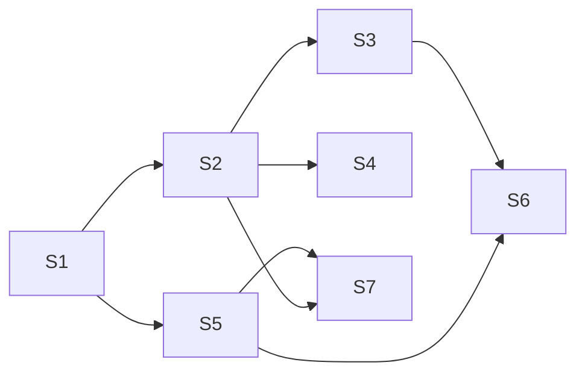

# Shared context Library — feature model

Status: feature model, step 1 of 3. It describes product behavior and ownership for the design agent. It does not choose UI layout, code modules, or implementation tasks. The later plan pass breaks these slices into work.

Decisions are split into two groups: **settled by the user** (fixed) and **proposed** (recommended defaults the user has not accepted). Choices with real consequences stay under Open questions.

## Outcome

One global, durable **Library** holds context shared across every repository and Herdr Space:

- managed **provider snapshots**: issues/work items, merge/pull requests, Confluence pages, and their downloadable attachments, from any configured provider instance;
- **followed Confluence spaces** (provider → space → pages); an explicit refresh adds new pages and updates changed ones;
- **copied local folders**: independent copies, never links.

The user can add an issue, a folder, a Confluence page, or a whole Confluence space in one action, with or without a target Space. Adding to a Space always saves to the Library first, then copies or reflinks into that Space's freshly verified companion. Changes in the Library never silently alter a Space's copies. Each Space shows when its copies are behind and updates only when the user asks. The Library starts empty; existing companion files are preserved byte-for-byte and remain unlinked until re-added. The obsolete source cache is left untouched for manual removal by the user after confirmation.

## Evidence

Facts are cited. `[INFERENCE]` marks conclusions not directly observed.

### The current central store is a bounded cache, not a Library
- The source cache lives at `<state_root>/sources` (`crates/cockpit-core/src/sources.rs:482-497`). It holds a JSON index of current pointers plus hash-named immutable records. Directory enumeration never selects those records (`sources.rs:660-668`).
- The cache is hard-bounded and evicts: `MAX_CURRENT = 64`, `MAX_IMMUTABLE = 128` (`sources.rs:31-34`). `trim_index` drops the oldest current pointers and stale records (`sources.rs:1402-1436`).
- `state_root` is internal and also holds browser/helper state (`crates/cockpit-host/src/browser_runtime.rs:174-183`, `browser_helper.rs:1027-1028`).
- The docs describe this cache as the central store. They also say synchronization "atomically updates companion copies" (`CONTEXT.md:281-293`), which conflicts with the settled rule that Spaces update explicitly.
- Central caches survive workspace destruction (`CONTEXT.md:139`, `CONTEXT.md:293`).

### Current import is companion-first and bound to a checkout
- `import_source`, `refresh_source`, and `list_sources` all require a freshly authorized companion root (`crates/cockpit-core/src/context.rs:81-191`).
- Forge authority comes from the companion checkout's `origin` remote (`sources.rs:104-171`). Jira uses its configured site instead (`sources.rs:173-197`, `crates/cockpit-core/src/repositories.rs:907-918`). `CODE_GUIDE.md:74` documents this. As a result, a forge artifact from another repository is rejected today.
- Setup imports artifacts through the same cache→companion path (`crates/cockpit-core/src/projects.rs:2072-2114`, `CONTEXT.md:127-135`).
- Refreshing through one companion moves the global current pointer (`sources.rs:2018-2029`) but rewrites only that companion. Other companions then report `Changed`, because their copy's source hash differs from the current record (`crates/cockpit-core/src/context_assets.rs:263-267`). This already models "Space copy is behind central".

### Companion write safety to reuse
- The companion manifest records each materialized item: logical id, path, last-written hash, source hash, and copy mode (`context_assets.rs:31-64`). Source replacement goes through a durable pending intent and a recheck before replacement, and aborts if the user edited the file late (`context_assets.rs:66-77`, `context_assets.rs:200-204`).
- A generated file the user edited is never overwritten (`source_sync_conflict`, `context_assets.rs:108-115`) and is reported as `Conflict` (`context_assets.rs:256-261`). Frontmatter never grants permission to overwrite (`CODE_GUIDE.md:74`).
- Generated paths are readable: `sources/<provider>/<type>/<id>.md` (`context_assets.rs:121-131`).
- Repository snapshots use descriptor-safe reflink with a byte-copy fallback, report which mode was used, and never hardlink (`context_assets.rs:417-427`, `context_assets.rs:1166-1248`, `CONTEXT.md:141`).
- Snapshots are Git-inventory based, limited to catalog repositories, and capped at 512 files / 4 MiB per file / 32 MiB total (`context_assets.rs:27-29`, `context_assets.rs:292-338`, `context.rs:326-355`).

### Roots, UI, and ownership
- Protocol roots are only `Repository | Companion | Folder` (`crates/cockpit-protocol/src/context.rs:25-29`).
- Resources (source import and snapshot) appear only for companion roots (`src/app/context/ContextViewer.tsx:1204`, `src/app/context/ContextResources.tsx:59-63`). Context browsing is read-only (`CONTEXT.md:219-229`).
- Herdr owns Spaces and panes. Companions are Cockpit-owned files associated with a Space, not a registry of workspaces (`DECISIONS.md:7`, `DECISIONS.md:23`).
- Configured roots are `repository_roots`, `worktree_root`, `companion_root`, `state_root`, plus `providers {id, base_url, executable}` (`crates/cockpit-protocol/src/projects.rs:24-43`). All roots are configurable (`CONTEXT.md:5`). There is no settings screen (`DECISIONS.md:52`).

### Providers, format, and hosting
- Providers are Tea/Gitea, GitLab (`glab`), Jira (`jira`), and GitHub (`gh`) (`CONTEXT.md:311-313`, `crates/cockpit-providers/src/`). There is no Confluence adapter: a repository grep finds no match.
- Jira media renders as `[attachment]` (`crates/cockpit-providers/src/jira.rs:416`). No provider downloads attachments.
- The snapshot envelope fields are listed in `sources.rs:1669-1670` and `CONTEXT.md:295-309`.
- GitLab reads any configured base URL, including a base path, via `glab api --hostname` (`gitlab.rs:54-78`, `gitlab.rs:1227-1263`). The `glab 1.118` host selector rejects ports (`gitlab.rs:72-74`).
- Jira checks the configured site host (`jira.rs:78-85`, `jira.rs:143-147`). The CLI owns authentication (`jira.rs:26-29`). String bodies pass through unchanged (`jira.rs:340-345`).
- User statements in this planning session:
  - "we need self-hosted support for jira / confluence / gitlab - glab supports it acli not as far as i can tell"
  - "jira-cli handles on-prem"
- Main relayed further user clarifications:
  - Self-hosted support for Jira, GitLab, and Confluence is required.
  - Only the Cloud Confluence site `nnexai.atlassian.net` is available for live validation. No real self-hosted instance is available.
  - The user explicitly authorizes installing and configuring `confluence-cli` (via brew) as needed.
  - The user created the Confluence API token for this purpose and authorizes its use. It must never be persisted in plans, logs, snapshots, or artifacts.
- Atlassian's official `acli` command reference lists admin, jira, and rovodev commands, but no confluence commands (https://developer.atlassian.com/cloud/acli/reference/commands/).
- `pchuri/confluence-cli` installs with `brew install pchuri/tap/confluence-cli` and provides the `confluence` executable. Its README documents:
  - Cloud (`/wiki/rest/api`) and Server/Data Center (`/rest/api`, bearer PAT or basic auth, mTLS) configuration;
  - read-only profiles and global `--json`;
  - `spaces`, recursive `children` with id/parent/version/ancestors, `read --format markdown`, and `attachments --download`.

  Source: https://github.com/pchuri/confluence-cli/blob/main/README.md. `[INFERENCE]` Cockpit has not exercised any of this.
- Secrets stay external and never enter snapshots or environment values (`DECISIONS.md:47`). Cockpit performs no remote writes (`CONTEXT.md:255`, `DECISIONS.md:44`).

## Decisions

### Settled by the user
- U1. There is one global Library shared across repositories and Spaces, because providers are configured globally and a task may combine sources across repos, tickets, and Confluence.
- U2. The Library stores managed provider snapshots and copied local folders. It does not store free-form notes. It is distinct from the internal cache.
- U3. A whole Confluence space can be followed. New and changed pages enter the Library on explicit refresh.
- U4. Library changes never silently alter Space copies. Each Space updates explicitly.
- U5. Every add that targets a Space is first saved durably in the Library, then copied or reflinked into a freshly verified companion.
- U6. The Confluence hierarchy is provider → space → documents. Documents use Markdown with Jira-like frontmatter. Attachments are downloadable.
- U7. Adding issues, folders, Confluence pages, and Confluence spaces is easy.
- U8. Jira, Confluence, and GitLab require self-hosted support in addition to Cloud. `acli` is unsuitable. The user reports that `glab` and `jira-cli` cover self-hosted. Live validation is available only on the Cloud Confluence site `nnexai.atlassian.net`. No real self-hosted instance is available, so self-hosted behavior is validated with fixtures and contract checks and must be reported as not live-validated.
- U9. The Confluence provider uses `pchuri/confluence-cli` (`confluence` executable, installed via `brew install pchuri/tap/confluence-cli`). It is selected by executable like the other providers and configured with a read-only profile. The CLI owns the credential.
- U10. **Credential handling.** The user-provided Confluence token is authorized for this purpose. It is set up only through the CLI's own configuration, and a read-only profile is recommended. Cockpit never stores, logs, or places credential material in plans, snapshots, frontmatter, artifacts, or environment values it generates (`DECISIONS.md:47`).

### Proposed (recommended; not yet accepted)
Each proposal names its main rejected alternative.

- P1. **Separate durable root.** The Library is a Cockpit-owned root outside `state_root`, so users can browse it on disk. Items persist until the user removes them, with no eviction. Workspace teardown never touches it.
  *Rejected:* extending `<state_root>/sources`, which is internal, bounded, and evicting (`sources.rs:31-34`, `sources.rs:1402-1436`).
- P2. **Library identity reuses the logical source identity** `source:<provider>:<instance>:<type>:<id>` (`context_assets.rs:96-97`). Existing companion copies can then be matched to Library items without rewriting companion files.
  *Rejected:* a new identity scheme, which would require rewriting every companion manifest.
- P3. **Cockpit is the only writer of Library content.** If a Library file differs from its last-written hash, refresh keeps the file, marks the item *conflict*, and does not update it until the user explicitly replaces it. This mirrors the companion rule (`context_assets.rs:108-115`). Users edit their Space copies instead.
  *Tradeoff:* the user cannot curate Library text in place.
- P4. **Hierarchy.** Items are organized as provider instance → container → item. The container is the repository/project for forge, the project for Jira, and the space for Confluence. Confluence pages keep their page tree. Local folders form their own group under a user-chosen label. Space copies use readable, stable paths that extend `sources/<provider>/<type>/<id>` (`context_assets.rs:121-131`). A page's attachments sit beside it.
- P5. **Global provider access.** Any configured instance can be read without a Space. A forge artifact is authorized by matching a configured instance and the provider's API-verified canonical URL, not the active checkout's origin. A URL still never selects or clones a repository (`DECISIONS.md:26`, `DECISIONS.md:45`). This mechanism serves U1.
  *Rejected:* keeping the checkout-origin binding (`sources.rs:104-171`), which prevents cross-repo tasks.
- P6. **Central-first add is two-phase and retryable.**
  1. Durably publish the complete Library item.
  2. Freshly verify the target companion (`context.rs:87-95` semantics).
  3. Copy or reflink the item through the manifest-owned, no-follow, intent-recorded write path.

  If step 2 or 3 fails, the Library item remains and the add can be retried. Nothing is written to a companion that cannot be verified. Reflink is preferred, with a reported copy fallback. Hardlinks and symlinks are never used (`CONTEXT.md:141`).
- P7. **Per-Space states and update.** Each Library-derived item in a Space is in one state: *up to date*, *Library newer*, *edited in Space*, *removed at source*, or *missing in Space*. "Update from Library" acts on one item or on everything in one Space, and only in that Space. A followed space added to a Space picks up new pages only on that Space's explicit update. This implements U4.
- P8. **Refresh is explicit only.** The user refreshes one item, one followed space, or all items; there is no background polling (`planning/next-level/03-context-and-sources.md:112`). A refresh reports new, changed, unchanged, removed-at-source, failed, and truncated items. A partial failure keeps earlier successful content (`DECISIONS.md:46`).
- P9. **Local folders are copied.**
  - The user may pick any existing local directory except Cockpit-owned roots and their ancestors or descendants.
  - A Git working tree uses the existing inventory policy (`planning/next-level/03-context-and-sources.md:49-54`). A plain folder copies regular files under the default exclusions.
  - Symlinks, special files, and escapes are skipped and reported. Re-copy is an explicit refresh.
  - The existing repository snapshot action becomes "copy into the Library, then add to this Space".

  *Tradeoff:* this is broader than `repository_roots`. It relies on the trusted single-user workstation (`CONTEXT.md:11`).
- P10. **Confluence content model.**
  - A *space* is a followable collection. A *page* is a document with *attachments*.
  - Page frontmatter extends the existing envelope with: space key and name, page id, title, parent id, ancestor path, version number, last-modified time and author, labels, and an attachment list (id, filename, media type, size, version, local path or `not downloaded`).
  - Freshness uses the page version, with content hash as fallback.
  - Cockpit never calls write commands.
- P11. **Attachments are children of their Library item.** Their metadata is always recorded. Their bytes are untrusted and never executed (`CODE_GUIDE.md:79`). They are copied into a Space together with their page. Confluence is the provider in scope. Attachments from other providers are a non-goal of this feature; those providers keep placeholders such as `jira.rs:416`.
- P12. **Library viewing is read-only and grants no Space authority.** The design agent decides where the Library appears.
- P13. **Self-hosted handling (serves U8).**
  - Self-hosted validation uses recorded fixtures and contract checks for each provider: Data Center Confluence (`/rest/api` paths and URL shapes), on-prem Jira, and self-hosted GitLab with a base path. These come from documented CLI/API output and never contact a live instance.
  - Every provider is configured by base URL, including scheme, host, port, and base path. Instance identity and checks come from that URL.
  - A capability a CLI lacks on a given hosting type is reported as unavailable, never substituted (`CONTEXT.md:266`).
  - Known gap: `glab`'s host selector rejects ports (`gitlab.rs:72-74`).
  - `[INFERENCE]` On-prem Jira bodies that arrive as wiki markup will display unconverted (`jira.rs:340-345`).

## Open questions

- Q1. **Resolved: no automatic legacy cache migration.** The Library starts empty; the user re-adds or re-downloads desired items. Existing companion files remain byte-for-byte unchanged and unlinked until re-added. The obsolete `<state_root>/sources` cache is left on disk and untouched: Cockpit does not import, inspect, delete, expose a transition UI/API for, or otherwise change it. After confirming it is no longer needed, the user may remove it manually.
  *Tradeoff:* existing cache contents are not carried into the Library automatically; the user can re-add or re-download them.
- Q2. **Library retention.**
  - (a) Current version only. Space copies freeze what each task used.
  - (b) Keep prior versions per item, with explicit pruning.

  **Recommendation:** (a).
  *Tradeoff:* once a Library item is refreshed, an older provider version exists only in Spaces that copied it.
- Q3. *Resolved as U9* (`pchuri/confluence-cli`), with credential handling per U10.
- Q4. **Library root location.**
  - (a) A new required `library_root` setting.
  - (b) `library_root` defaulting under the platform data directory, e.g. `<XDG_DATA_HOME>/cockpit/library`.

  **Recommendation:** (b), validated like the other roots and never nested under `state_root`, companions, or worktrees.
- Q5. **Updating a Space copy that the user edited.**
  - (a) Never overwrite it.
  - (b) Keep it by default, with an explicit, confirmed "replace with Library version".
  - (c) Write the Library version beside the edited copy.

  **Recommendation:** (b).
- Q6. **Attachment download default.**
  - (a) Record metadata only; download bytes per page or per followed space on request.
  - (b) Download all attachments within limits on every refresh.

  **Recommendation:** (a), plus an explicit per-follow "include attachments" option.
- Q7. **Size limits.** **Recommendation:** configurable per item kind: files and bytes per folder, pages per followed space, and bytes per attachment and per item. Hitting a limit gives a visible *partial* status and never evicts other items. Defaults are set in implementation planning. The current snapshot limit of 512 files / 32 MiB (`context_assets.rs:27-29`) is the starting point.
- Q8. *Resolved as U8.* No real self-hosted instance is available. Self-hosted acceptance is fixture/contract-based and is reported as not live-validated.

## Slices (user-visible, dependency-ordered)

In these slices, "Space" means a Herdr Space with a verified Cockpit companion. A Space without one reports `source_companion_unavailable` (`context.rs:90-95`).

### S1 — Durable global Library with existing providers
- **Goal:** Add a Tea, GitLab, GitHub, or Jira artifact to the Library from any configured instance or repository, without a Space. Browse, refresh, and remove it.
- **Scope:** Library root and item format (P1–P4, Q2, Q4); global provider access (P5); explicit refresh (P8). No source-cache transition.
- **Fixed contracts:**
  - Library item identity is P2.
  - An item is envelope Markdown with Library provenance, plus optional attachment children.
  - Item states: `fresh`, `changed`, `unknown`, `removed_at_source`, `conflict`, `failed`, `partial`.
- **Non-goals:** Space copies, folders, Confluence, attachments, legacy cache import/removal.
- **Acceptance:**
  1. With no Space open, add a GitLab issue from repository A and a Jira issue. Both appear under provider → container.
  2. Both survive a restart.
  3. Refreshing after a remote edit shows *changed* and updates the content.
  4. Adding more than 64 items evicts nothing.
  5. Workspace destruction leaves the Library untouched.
  6. A directly edited Library file is kept and marked *conflict* (P3).
  7. The Library starts empty even when the obsolete source cache exists; cache files and all existing companion files are byte-for-byte unchanged, and companion entries remain unlinked until explicitly re-added.
  8. Contract fixtures pass and show correct instance identity and canonical-URL checks for a self-hosted GitLab with a base path and an on-prem Jira site. The port limitation (P13) is reported explicitly.

### S2 — Central-first add to a Space (after S1)
- **Goal:** Add one or more Library items to a chosen Space. Every Space-scoped import (Resources and setup) now goes through the Library first (P6), and the Space shows the P7 states read-only.
- **Fixed contracts:** The companion manifest entry records the Library item identity and the Library content hash it copied. The Space state is derived from that entry and the current Library item.
- **Non-goals:** Updating existing copies; folders; Confluence.
- **Acceptance:**
  1. Import into a Space a PR from a repository other than the Space's checkout. It appears in both the Library and the Space.
  2. If the companion is unverifiable, the Library item still exists and nothing is written to the Space. A retry after repair succeeds.
  3. The copy mode (reflink or copy) is reported.
  4. Setup with a linked artifact produces the same result.
  5. Two Spaces holding the same item have independent files (`stat` shows no shared inode).

### S3 — Explicit per-Space update (after S2)
- **Goal:** After a Library refresh, Spaces show *Library newer*. "Update from Library" applies to one item or one whole Space and affects only that Space (P7, Q5).
- **Acceptance:**
  1. Refreshing an issue in the Library leaves Spaces X and Y byte-identical, and both show *Library newer*.
  2. Updating X changes only X.
  3. An edited copy in Y is preserved and shown as *edited in Space*. Replace follows Q5.
  4. After a source deletion, Spaces show *removed at source* and keep their copies.

### S4 — Copied local folders (after S2; can run in parallel with S5)
- **Goal:** Copy any permitted local folder or repository working tree into the Library, add it to Spaces, and re-copy explicitly. The repository snapshot action becomes this flow (P9).
- **Non-goals:** Live links; two-way sync.
- **Acceptance:**
  1. From a plain folder containing a symlink, a FIFO, and a nested `.git`: those are excluded, and the exclusions are reported.
  2. A dirty Git tree copies tracked and untracked non-ignored files and omits ignored files.
  3. Editing the original folder leaves the Library copy unchanged until a re-copy. After re-copy, Spaces show *Library newer*.
  4. Choosing a companion or the Library root as a source is refused.

### S5 — Confluence pages (after S1; Space add needs S2)
- **Goal:** Add a Confluence page by URL or id. It appears under provider → space → page tree with the frontmatter from P10, using the U9 executable.
- **Non-goals:** Following spaces; attachment bytes.
- **Prerequisite:** `confluence-cli` is installed and configured per U9/U10 for `nnexai.atlassian.net`.
- **Acceptance (live, on `nnexai.atlassian.net`):**
  1. An added page shows its space key, page id, parent and ancestors, version, and attachment metadata (`not downloaded`).
  2. After the user edits the page, a refresh shows *changed*.
  3. A missing executable or failed login produces an explicit error and no partial item.
  4. Cockpit makes no writes to the site.
- **Acceptance (fixture/contract, self-hosted):** Data Center fixtures (`/rest/api`, DC page URLs, no Cloud folders) normalize to the same Library item shape. A capability unsupported on DC is reported as unavailable. This is recorded as not live-validated.

### S6 — Followed Confluence spaces (after S5 and S3)
- **Goal:** Follow a whole space. An explicit refresh adds new pages, updates changed ones, and marks removed ones. A Space holding the followed space picks up new and changed pages on its own explicit update (P7, P8).
- **Acceptance (live, on `nnexai.atlassian.net`):**
  1. A followed space's page tree appears in the Library.
  2. After the user creates one page and edits another in the test space, a refresh reports 1 new and 1 changed, and the Library matches.
  3. A Space containing the followed space shows *Library newer*. Updating it adds the new page and leaves other Spaces untouched.
  4. A space over the page limit shows *partial* with a count.

### S7 — Confluence attachments (after S5; Space copy needs S2)
- **Goal:** Download page attachments into the Library, per Q6. They are copied with their page into Spaces and viewed under the existing safe-media rules (P11).
- **Acceptance (live on `nnexai.atlassian.net`; hostile-name and limit cases also as fixtures):**
  1. A downloaded PNG and PDF are listed with local paths in the frontmatter and appear beside the page in the Space copy.
  2. An attachment named `../x` or containing `/` is stored under a safe name.
  3. An oversized attachment shows *not downloaded: limit*.
  4. SVG and HTML attachments do not execute when viewed.

## Risks & verification

| Risk | Where it bites | Guard / check |
|---|---|---|
| Existing context | Library cutover | No automatic cache migration/deletion; old cache is untouched and manually removable by user after confirmation. Existing companion files remain byte-for-byte unchanged and unlinked until re-added. S1 acceptance #7. |
| Loss of user edits in Spaces | S2/S3 updates | Manifest last-written hash plus pending intent (`context_assets.rs:66-77`, `200-204`). S3 acceptance #3. |
| Loss of Library data | Teardown, eviction, refresh | No eviction (P1). Teardown excludes the Library (`CONTEXT.md:139`). Edited Library files become *conflict* (P3). S1 acceptance #4–#6. |
| Silent Space change | Library refresh | Refresh never writes to Spaces (U4, P7). S3 acceptance #1 compares bytes. |
| Coupled copies | Reflink/copy | No hardlinks or symlinks. S2 acceptance #5, S4 acceptance #3. |
| Concurrent hosts (`CONTEXT.md:113`) | Library writes | One writer per item; atomic publish of the complete item. A Space copy reads one complete revision. Check: a refresh during an add yields either the old or the new revision, never a mix. |
| Authority widening | P5, P9 | Instance and canonical-URL checks. Cockpit-owned roots are refused as sources. Library viewing grants no companion write (P12). S2 acceptance #2, S4 acceptance #4. |
| Hostile names | Confluence titles, attachments, folders | Safe names, no-follow writes, symlinks skipped. S4 acceptance #1, S7 acceptance #2. |
| Secret leakage | CLI output, URLs, frontmatter, logs | Credential-free instance ids (`sources.rs:53`). Generic redaction check: no credential material appears in the Library, companions, frontmatter, logs, or environment values (`DECISIONS.md:47`). |
| Remote writes | Confluence CLI has write commands | Only read subcommands are invoked, through a read-only profile. S5 acceptance #4. |
| Self-hosted gaps | `glab` port limit (`gitlab.rs:72-74`); on-prem Jira wiki markup (`jira.rs:340-345`, [INFERENCE]); Data Center differences in Confluence | Unsupported capabilities are reported explicitly. Fixture/contract checks (S1 #8, S5 self-hosted) run, but no real self-hosted instance exists, so self-hosted support is reported as not live-validated (U8). |
| Credential exposure | CLI setup, logs, artifacts | U10: the credential exists only in the CLI's own configuration. The generic redaction check (above) also covers plan and verification artifacts. |
| Scale | Large spaces, attachments, folders | Configurable limits with *partial* status (Q7). S6 acceptance #4, S7 acceptance #3. |
| Docs drift | `CONTEXT.md:281-293`, `CODE_GUIDE.md:74`, provider rules in `DECISIONS.md` | Implementation planning updates these once the proposals are accepted. |
