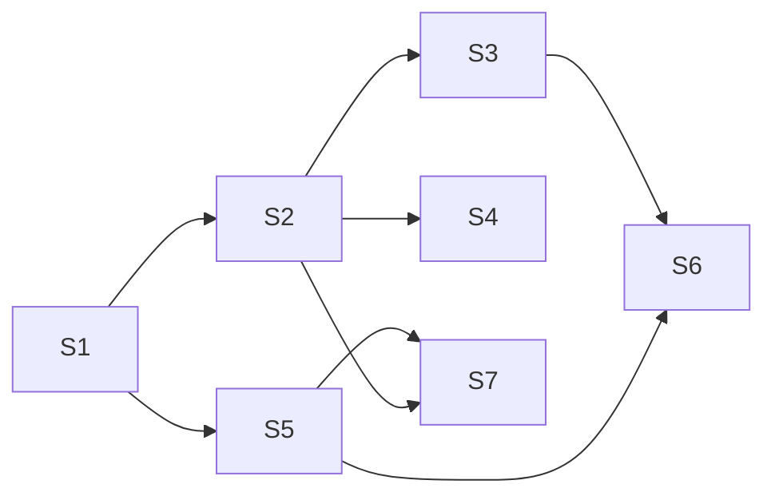

# Shared context Library — implementation plan

Status: step 3 of 3, revision 3 (after independent review R1–R12; closure table in "Risks & verification"). Inputs: [FEATURE_PLAN.md](FEATURE_PLAN.md) (U1–U10 settled; P1–P13 and Q2–Q8 adopted; Q1 resolved to no automatic source-cache migration) and [CONTEXT_LIBRARY_DESIGN.md](CONTEXT_LIBRARY_DESIGN.md) (UQ1–U7 adopted, including §4.1 renderer-lifecycle and focus corrections and the corrected §4.4 Space-action state map). Full DTO/layout/argv sketch: [examples/library-contract-sketch.md](examples/library-contract-sketch.md). Nothing here has been built or run; `[INFERENCE]` marks unobserved claims.

## Outcome

One Cockpit-owned, durable Library at `library_root` holds provider snapshots (Tea, GitLab, GitHub issues and pull requests, Jira, Confluence pages and whole followed spaces, Confluence attachments) and copied local folders. It is read, added to, refreshed and pruned without a Herdr session. Adding to a Space is always Library-first, then a fresh companion verification, then a reflink/copy through the companion manifest; a failed Space step stays visible and retryable across reloads without refetching. Library changes never write to a Space; each Space shows per-item state and updates only on explicit request, per item or per followed space. The Library starts empty; the obsolete `<state_root>/sources` cache is untouched and left for manual user removal after confirmation; existing companion files remain byte-for-byte unchanged and unlinked until re-added.

## Evidence

Every claim below was read in the current tree or the cited upstream source. Line numbers are at the time of writing.

### Current central store and its callers
- `SourceService` stores a bounded, evicting cache at `<state_root>/sources` (`crates/cockpit-core/src/sources.rs:482-497`), limits `MAX_CURRENT=64`, `MAX_IMMUTABLE=128`, 16 MiB (`sources.rs:31-35`), evicted by `trim_index` (`sources.rs:1402-1438`). One global nonblocking import lock spans fetch + cache + companion publish (`sources.rs:870-880`).
- Record identity: `source_id(SourceRef)` = `source:<sha256(provider_id,instance,type,canonical_id)>` (`sources.rs:1709-1721`). Revision: `semantic_hash` over identity, title, `source_url`, `original_url`, `source_revision`, body, complete flag and serialized diagnostics (`sources.rs:1688-1708`). Envelope frontmatter is fixed in `canonical_markdown` and includes a volatile `fetched_at` (`sources.rs:1668-1684`). Freshness: `fresh/changed/unknown` from revision + hash (`sources.rs:1552-1577`). Asset bounds: 1 MiB body, 64 assets per fetch (`sources.rs:27-28`, `1613-1651`).
- A legacy record (`CachedSource`) stores `source`, `title`, URLs, `source_revision`, `complete`, `diagnostics`, `content_hash` and the full `markdown`, not a separate body (`sources.rs:361-378`); `markdown` is `canonical_markdown(asset)` (`sources.rs:1178-1195`), whose tail is `# {title}\n\n{body}\n` (`sources.rs:1670`), and titles contain no control characters (`bounded_text`, `sources.rs:1655-1660`). The body is therefore recoverable exactly.
- `SourceProvider` trait: `provider_id`, `capabilities`, default-unsupported `metadata`, `fetch` (`sources.rs:343-360`). `SourceAsset` has no container, extra frontmatter or attachments (`sources.rs:59-71`). `SourceCapability` = `Issue | IssueComments | Review | Wiki` (`crates/cockpit-protocol/src/sources.rs:8-13`).
- Callers of the cache: `ContextService::import_source/refresh_source/list_sources` (`crates/cockpit-core/src/context.rs:81-191`), setup import (`crates/cockpit-core/src/projects.rs:2050-2143`), setup validation/prefetch (`sources.rs:509-540`, `802-843`). Host routes `/api/v1/sessions/{s}/panes/{p}/sources/{import,refresh,list}` (`crates/cockpit-host/src/server/sources.rs:14-30`); Tauri `cockpit_source_*` (`src-tauri/src/sources.rs:9-53`, registered `src-tauri/src/lib.rs:1774-1776`, allowlisted `src-tauri/build.rs:34-36`, `src-tauri/capabilities/default.json:50-52`); client parsers `src/client/sourceProtocol.ts:1-24`, adapters `src/client/browser.ts:774-791`, `src/client/native.ts:707-727`; UI `src/app/context/SourceImport.tsx:37-213`; fixtures mock these methods (`src/app/App.integration.test.tsx:187`, `src/client/client.test.ts:108`).

### Authority is bound to the checkout today
- `source_authority_for_checkout` derives owner/repository from the companion checkout's `origin` (`sources.rs:108-171`); Jira uses `site_authority` (`sources.rs:174-197`) selected by `provider_is_repository_independent` (`crates/cockpit-core/src/repositories.rs:909-918`).
- Providers compare artifact owner/repo to `authority.owner/repository`: GitLab (`crates/cockpit-providers/src/gitlab.rs:144-221`), GitHub (`github.rs:201-250`), Tea (`tea.rs:475-523`). GitLab verifies API `web_url` (`gitlab.rs:250-252`, `296-302`, `426-432`) and fails with `source_identity_mismatch` (`gitlab.rs:1496-1498`); GitHub and Tea set `source_url` to the request URL, not an API value (`github.rs:423`, `tea.rs:296`, `409`, `794`). Jira checks the record's `self` URL against the configured site (`jira.rs:139-153`).
- `resolve_artifact` maps a URL to a configured provider and canonical id without a checkout (`repositories.rs:549-653`). For any executable other than `glab`/`gh`/`jira` it falls through to Gitea path parsing (`repositories.rs:594-653`), so a `confluence` provider URL would be parsed as a Gitea artifact today.
- Reference hydration is scoped to the request authority's repository (`crates/cockpit-core/src/sources/hydration.rs:367-400`), bounded depth 2 / 32 assets / 4 MiB / 10 s (`hydration.rs:13-16`).
- GitLab: `glab` host selector gets the host without port while the absolute endpoint keeps port and base path (`gitlab.rs:72-74`, `126-136`, `1250-1264`, test `1732-1743`). Jira string bodies pass through unconverted (`jira.rs:340-345`); media becomes `[attachment]` (`jira.rs:416`).

### GitHub pull requests are unsupported today
- `resolve_github_artifact` accepts only `/<owner>/<repo>/issues/<n>` (`repositories.rs:840-899`); its test refuses `/pulls/4` (`repositories.rs:1271-1298`). The provider's `issue_kind` has the same rule (`github.rs:201-250`, test `571-594`); `metadata` and `fetch` call only `gh issue view` (`github.rs:335-430`) and emit `resource_type "issue"`, `canonical_id "<owner>/<repo>#<n>"`, `source_url` = request URL (`github.rs:415-423`); capabilities are `Issue, IssueComments` (`github.rs:331-333`). Conversation comments come from `gh api repos/<repo>/issues/<n>/comments` with Link-header paging (`github.rs:124-185`, `277-315`).
- The Tea review shape to mirror: conversation comments plus review comments (path/line), `resource_type "review"`, `canonical_id "<repo>!<index>"`, `source_revision` = head commit (`tea.rs:232-305`).
- `gh pr view --json` documents `number,title,body,url,updatedAt,headRefName,headRefOid,headRepository,isCrossRepository,baseRefName,state,isDraft` (https://cli.github.com/manual/gh_pr_view); `gh issue view --json` documents `url` (https://cli.github.com/manual/gh_issue_view).
- Setup accepts any `review` artifact through metadata `source_branch`/`source_commit` and `verify_source_branch` (`projects.rs:264-323`); a missing branch fails with `source_branch_unavailable` (`projects.rs:308-313`).

### Companion write safety to reuse
- `ContextManifest{schema_version, companion_id, owner_workspace_id, owner_worktree_path, primary_repository_identity, entries, pending_source_intent?, updated_at}` and `ContextManifestEntry{…, content_hash, copy_mode, source_identity, source_hash_before, source_hash_after}` are `deny_unknown_fields`, schema 1 (`crates/cockpit-core/src/context_assets.rs:23-64`); `read_manifest` rejects any other schema or owner (`context_assets.rs:787-824`).
- `materialize_source_markdown`: companion lock, logical id `source:{provider}:{instance}:{type}:{canonical}`, edited-file refusal, stable readable path, durable pending intent, recheck, rename, manifest commit (`context_assets.rs:81-215`); recovery (`826-881`); state derivation (`220-273`).
- Repository snapshot: catalog-only source, overlap refusal, Git inventory (tracked + untracked non-ignored), staging, publish, reflink-or-copy, 512 files / 4 MiB / 32 MiB, errors on limit (`context_assets.rs:27-29`, `295-445`, `612-734`, `1142-1252`); symlink/special/hardlink/native-binary skip codes (`1062-1140`, `1377-1386`); fixed exclusions `.git node_modules target build dist .next` (`1365-1375`).
- Companion association `manifest.json` (`crates/cockpit-core/src/project_store.rs:35-47`); fresh companion authorization for a Space: `ProjectService::context_companions(session, workspace, endpoint)` (`projects.rs:1149-1282`); pane-scoped `authorize_companion_root` (`context.rs:277-295`).
- Atomic directory primitives already used: Linux-gnu `nix::fcntl::renameat2` with `RenameFlags`, macOS `rustix::fs::renameat_with`, other platforms refused as unsupported (`project_store.rs:15-20`, `1183-1232`); directory fsync (`project_store.rs:1095-1120`); `fs2` locks (`context_assets.rs:13`, `project_store.rs:11`).

### Reading and roots
- `ContextRootKind` = `Repository | Companion | Folder` (`crates/cockpit-protocol/src/context.rs:23-29`). `ContextService::document` reads bounded, no-follow, revision-checked text (`context.rs:548-729`); `find_root` opens a root by path and checks its filesystem identity (`context.rs:1305-1343`); `reserved_context_path` hides companion metadata (`context.rs:1381-1411`). `read_media` is already a free function over `AuthorizedRoot` (`crates/cockpit-core/src/context_media.rs:36-94`); search requires a companion root (`context_search.rs:44-47`).
- All reads are pane-scoped routes (`crates/cockpit-host/src/server/context.rs:22-47`, `context_media.rs:18-23`). Session-independent routes exist only for project configuration/repositories/defaults (`crates/cockpit-host/src/server/projects.rs:24-26`).

### UI surfaces and focus
- `ContextViewer` derives session/pane/binding from `PanePresentation` (`src/app/context/ContextViewer.tsx:122-130`, `623-628`); root selector (`1201`); `Resources` companion-only (`1204`, `1245-1256`); comments only for companion or default folder roots (`703`); empty state (`1101-1102`). `SafeImage` calls pane-scoped `contextMedia` (`src/app/context/SafeImage.tsx:40`). `HtmlPreview` renders in a script-free sandboxed iframe (`src/app/context/HtmlPreview.tsx:1-29`).
- `ContextResources` shell: focus trap, Escape, restore focus (`src/app/context/ContextResources.tsx:26-65`), renders only for companion roots (`:37`), hosting `SourceImport` + `SnapshotImport` (`61-64`).
- Workbench renders only when sessions exist; otherwise a notice (`src/app/App.tsx:1828-1830`). Palette actions and group union (`App.tsx:634`, `1486-1507`); the palette restores focus to its opener on close (`App.tsx:293-305`). Pane layer mounts `PaneView` per visible pane with `deferTerminal` (`App.tsx:1509-1531`) and passes `selected`/`deferTerminal` to `TerminalPane` (`App.tsx:609`); `PaneView` blurs its own focus when deselected (`App.tsx:578-582`). `usePaneRenderers` polls only `visiblePaneIds` (`src/app/paneRenderers.ts:27-104`). Browser-only mode hides the pane canvas with `display:none` while keeping it mounted (`App.tsx:1559`) — the design forbids copying that for the Library (§4.1).
- `TerminalPane` moves DOM focus automatically in two places: whenever `selected && terminalReady && !deferAttachment` (`src/app/TerminalPane.tsx:509-511`), and after attach when `selected && controlAllowed` held at open time (`TerminalPane.tsx:649`, `928`). A third call focuses only when a frame reports retained focus and `document.activeElement === document.body` (`TerminalPane.tsx:758`, `887`); `requestControl` focuses on explicit user action (`TerminalPane.tsx:366-369`).
- Safe DOM targets: TabStrip tab buttons have no `onFocus` handler (`App.tsx:499`), nor does `.tab-sidebar-toggle` (`App.tsx:502`) or `.drawer-toggle` (`App.tsx:1556`); `main.main-workarea` is not focusable (`App.tsx:1555`).
- Tauri has no dialog plugin (`src-tauri/Cargo.toml` has no `plugin`/`dialog` entry).

### Configuration
- `TomlConfiguration`/`TomlLimits` are `deny_unknown_fields` (`crates/cockpit-core/src/config.rs:44-91`); roots via `choose_path` env → TOML → default under `$XDG_STATE_HOME/cockpit` (`config.rs:167-189`, `511-531`, `802-816`); `validate_paths` requires absolute, no `..` (`config.rs:533-548`); the loader never creates directories (`config.rs:93-97`). `ProjectConfiguration`/`ProjectLimits`/`ProjectProvider{id,base_url,executable,login?}` (`crates/cockpit-protocol/src/projects.rs:8-46`); the TS parser checks every field (`src/client/projectProtocol.ts:34-43`). Providers are selected by executable file name (`crates/cockpit-providers/src/lib.rs:20-59`).
- Composition: host `make_service` (`crates/cockpit-host/src/bin/cockpit.rs:133-196`); Tauri (`src-tauri/src/lib.rs:1658-1698`); `CockpitService::with_*` accessors (`crates/cockpit-core/src/lib.rs:122-251`). Router merges (`crates/cockpit-host/src/server.rs:212-218`).
- Disposable runtime isolates `HOME`, `XDG_*_HOME`, `COCKPIT_CONFIG` and strips only `HERDR_*`/`COCKPIT_*` env (`scripts/verify/ui_polish_runtime.py:20-29`); `start` writes `<root>/cockpit.toml` with `state_root=<root>/cockpit-state`, `companion_root=<root>/companions`, creates one Space on a fixture repository, and launches `target/debug/cockpit serve --config <root>/cockpit.toml --static-dir dist` (`ui_polish_runtime.py:54-100`). The default Library therefore lands in `<root>/data/cockpit/library`, and the legacy cache in `<root>/cockpit-state/sources`.

### confluence-cli (pchuri) — upstream docs and source, not yet exercised by Cockpit
Sources: README https://github.com/pchuri/confluence-cli/blob/main/README.md; source files on `main` (CHANGELOG head 2.25.2, 2026-09-22): `bin/commands/attachments.js`, `bin/commands/api.js`, `lib/file-utils.js`, `lib/confluence-client.js`, `lib/config.js`.
- Global `--json` on `info`, `search`, `spaces`, `find`, `children`, `versions`, `comments`, `attachments`; structured error JSON on stderr with `code ∈ {AUTH_FAILED, NOT_FOUND, VALIDATION, API_ERROR, NETWORK, UNKNOWN}` and `status` (README "JSON output", "Structured errors").
- `info <id> --json` → `{id,title,type,status,spaceKey,parentId,version,url}` (README). `children <id> --recursive` lists **descendants of that page only** (README "List Children"), so it cannot see pages in another top-level tree of the space.
- `find <title> --space <KEY> --json` is a documented read command (README command table); it runs CQL `title = "<escaped>" AND space = "<escaped>"` with limit 1 (`findPageByTitle`). The client itself resolves `/display/<KEY>/<title>` URLs through `GET /content?spaceKey&title` (`extractPageId`).
- `attachments <page> --download --dest <dir> [--pattern <glob>] --json` writes each file to `path.join(resolve(dest), sanitizeFilename(title))` with a ` (n)` collision suffix; `sanitizeFilename` takes the basename after mapping `\`→`/`, replaces `\/:*?"<>|` and control characters with `_`, strips leading dots, and yields `unnamed` when empty (`lib/file-utils.js`). With `--json` it prints `{attachmentCount, downloaded, destination, attachments:[{title,id,savedTo}]}`. Downloads use `/content/<page>/child/attachment/<id>/download` on Cloud and the same-origin-checked `_links.download` on Server/DC (`downloadAttachment`). `--pattern` is trimmed and matched case-insensitively with only `*` and `?` as wildcards (`globToRegExp`, `matchesPattern`).
- `api <endpoint>`: with `-f` fields and no `-X`, the method defaults to **POST**; with `-X GET` fields become query parameters; read-only config refuses write methods; the response body is printed as a JSON-pretty or plain string (`bin/commands/api.js`) — not a byte-safe download channel.
- Profile config `config.json` = `{activeProfile, profiles:{<name>:{domain, protocol (http|https), apiPath, authType (basic|bearer|mtls|cookie|none), readOnly, forceCloud, …}}}`; `CONFLUENCE_CONFIG_DIR` overrides the directory; `CONFLUENCE_READ_ONLY` and `CONFLUENCE_FORCE_CLOUD` override the profile (`lib/config.js`). `CONFLUENCE_CLI_ANALYTICS=false` disables local stats (README).
- Cloud v1 `GET /wiki/rest/api/content/search` pages through a cursor in `_links.next`; `start` is deprecated on Cloud (https://developer.atlassian.com/cloud/confluence/rest/v1/api-group-content/, https://developer.atlassian.com/cloud/confluence/change-notice-moderize-search-rest-apis/). Server/DC documents `content/search` with CQL (https://developer.atlassian.com/server/confluence/rest/latest/) [INFERENCE: DC `_links.next` shape confirmed only by hand-written fixture].
- User-reported: `confluence --json spaces` succeeded read-only on `nnexai.atlassian.net`, returning `~5af4129ca857e32dd9db6ce1` and `SD` (`Software Development`). No writes have been made.
- Atlassian deprecated v1 "content for space" endpoints on Cloud (https://community.developer.atlassian.com/t/api-deprecation-v1-get-content-for-space/70608). The plan therefore enumerates spaces with CQL `content/search` (D20), which exists on Cloud and DC and covers every top-level tree.

### Docs that contradict the settled model
- `CONTEXT.md:281-293` says synchronization "atomically updates companion copies" (contradicts U4). `CONTEXT.md:139`, `:293` call the store a "central cache". `CODE_GUIDE.md:74` documents checkout-origin authority (contradicts P5). `CONTEXT.md:311-313` lists providers without Confluence. `DECISIONS.md:37` has no entry for a Library work-area view (UQ1 requires one).

## Decisions

Each decision fixes behavior the slices depend on. Rejected alternatives follow each.

**D1 Library root (P1, Q4b).** `library_root: String` joins `ProjectConfiguration`; TOML `library_root`, env `COCKPIT_LIBRARY_ROOT`, default `$XDG_DATA_HOME/cockpit/library` (fallback `~/.local/share/cockpit/library`) using the existing `choose_path`/`xdg_directory` helpers. The loader validates absolute/no-`..` and rejects equality/nesting (either direction) with `state_root`, `companion_root`, `worktree_root` (`invalid_library_root`). The directory is created lazily by `LibraryService::open` through `prepare_root` (`project_store.rs:902`); an unusable root makes Library routes return `library_unavailable` while every other feature keeps working (design §4.11). *Rejected:* extending `<state_root>/sources` (bounded, evicting, internal); a required setting (breaks existing configs).

**D2 Store format and crash-safe publish (P3, Q2 current-only).** Each item is a directory under a readable path (layout in examples §2) containing its files plus `.cockpit-item.json` (item id, revision, `files[{path,hash,bytes}]` as written). `.cockpit/index.json` (schema 1) lists item and follow records. `.cockpit/library.lock` (fs2): **exclusive** for every index mutation, publish, removal and recovery; **shared** while a reader opens item files (the reader drops the lock after `openat`; the descriptor pins the inode). No eviction; `library_max_items` refuses new items (`library_full`). Before replacing, the current files are re-hashed against the marker; any mismatch → item state `conflict`, nothing replaced.

*Journal.* Every mutation of an indexed item directory writes `.cockpit/journal/<intent_id>.json` (fsynced file + fsynced directory) **before its first rename**: `{schema:1, intent_id, op: publish|remove, method: exchange|two_rename|new_target|remove, item_id, target, staging?, backup?, previous_revision?, new_entry?}`. For publish, `new_entry` is the complete `LibraryIndexEntry`, including folder origin metadata, and is durable before rename. `backup` is always `.cockpit/trash/<intent_id>` (same filesystem). The exclusive lock is held from journal write through index commit, so no lock-holding reader or writer ever observes a missing indexed target. Recovery runs in `open()` under the exclusive lock before any request is served; it uses the recorded entry plus filesystem facts (marker revision at each path), not a stored phase:

| Method | Steps after journal (J) | Crash window → state | Recovery |
|---|---|---|---|
| `exchange` (existing target; `renameat2(RENAME_EXCHANGE)` / `renameat_with(EXCHANGE)`) | E1 exchange staging↔target → E2 fsync parent → E3 commit index → E4 delete journal → E5 delete old tree (now at `staging`) | J..E1: target=old, staging=new | target marker = `previous_revision` → **roll back**: delete staging, delete journal |
| | | E1..E3: target=new, staging=old | target marker = `new_revision` → **roll forward**: commit index, delete journal, delete old |
| | | E3..E5: index=new | delete journal (if present) and old tree |
| `two_rename` (only when exchange fails with `EINVAL`/`ENOSYS`/`EOPNOTSUPP`) | R1 rename target→backup → R2 rename staging→target → fsync parent → commit index → delete journal → delete backup | J..R1: target=old, backup absent | roll back: delete staging, journal |
| | | R1..R2: **target absent**, backup=old, staging=new | verify staging (marker `new_revision`, every file hash matches marker) → **roll forward** R2 then commit; if staging fails verification → **roll back** by renaming backup→target; either way target exists before `open()` returns |
| | | R2..commit: target=new, backup=old | roll forward: commit, delete journal, delete backup |
| `new_target` (no existing target; no-replace rename, same helper family as `project_store.rs:1190-1220`) | N1 rename staging→target → commit index from journaled `new_entry` → delete journal | J..N1 | target absent → delete staging, journal |
| | | N1..commit | target marker = `new_revision` → roll forward by committing the complete `new_entry` (including folder origin metadata), then delete journal |
| `remove` (D17) | M1 rename target→backup → commit index without item → delete journal → delete backup | J..M1 | target present → delete journal (removal not applied) |
| | | M1..commit | backup present, index still lists item → roll forward: commit removal, then delete backup |

A state matching no row (for example target and backup both absent) marks the item `failed` with diagnostic `library_corrupt`, keeps the index record and deletes nothing. Staging is never swept on Library open: each successfully completed or failed operation deletes only its own staging directories. If a process crash leaves orphan staging, it is retained; this bounded orphan-storage tradeoff avoids deleting another host's live in-progress content. Trash with no journal is not deleted blindly. Platforms without `renameat2`/`renameat_with` (neither Linux-gnu nor macOS) get `library_unavailable`, the same policy as companion publication (`project_store.rs:1222-1232`) [INFERENCE: rustix maps `RenameFlags::EXCHANGE` to `renameatx_np(RENAME_SWAP)` on macOS; S1.3 test runs on the host platform only]. `#[cfg(test)]` fault hooks stop after J, E1, R1, R2, N1, M1, index commit and journal delete, plus a switch forcing `two_rename`.
*Rejected:* the previous unjournaled trash fallback (review R2: backup location unrecorded, indexed target could stay missing); symlink pointer swap (Library reads are no-follow, and Cockpit copies must not use symlinks); generation directories behind a pointer file (on-disk paths stop being stable and browsable, P1); content-addressed objects + pointers (duplicates the cache design and is not browsable on disk); one JSON blob per item (not browsable, P1); in-place multi-file writes (a reader could see a mix).

**D3 Identity (P2).** Provider item id = existing `source_id(SourceRef)` (`source:<hex>`); `logical_id` = the companion format `source:{provider}:{instance}:{type}:{canonical}` (`context_assets.rs:96-97`). Folder item id `folder:<uuid v4>`. Follow id `follow:<sha256(provider_id \0 instance \0 space_key)>`. Attachment id `<item_id>#attachment:<provider attachment id>`. *Rejected:* a new scheme (would require rewriting companion manifests).

**D4 Content revision (review R11).** Library `revision` for provider items = `content_revision(asset)`: `sha256:` over identity (provider, instance, type, canonical id), title, `source_revision`, body and `complete`, then `fields` and `attachments` metadata, each only when non-empty. It excludes provenance and presentation metadata: `source_url`, `original_url`, `container`, diagnostics and `fetched_at`. Those are stored in the index/marker; an unchanged `content_revision` with changed provenance updates the index only (no publish, state `fresh`). This matters because S1.2 populates `container` for every forge/Jira item, adds the `source_markup_unconverted` diagnostic and replaces GitHub/Tea request URLs with API-verified URLs; hash only content to avoid a false update. Library `document.md` frontmatter writes `content_hash: <content_revision>`. Folder revision = sha256 of the sorted `(path, file hash)` list. Existing companion entries are not migrated or linked on Library open; when explicitly re-added, an old copied hash that differs from the current revision is reported as behind.
*Rejected:* "hash new fields only when non-empty" (container is always non-empty for forge/Jira); keeping `semantic_hash` as the revision (URLs and diagnostics would make provenance-only changes look like content changes).

**D5 Global provider authority (P5).** For forge and Jira, `sources::instance_authority(configuration, provider_id, artifact_url) -> SourceAuthority` resolves against the configured instance and fills `owner/repository` from the artifact's own canonical id (or leaves them empty for Jira). Confluence does not pass through `resolve_artifact`, which rejects Confluence URLs: S5 provides an explicit `confluence_instance_authority(configuration, selected_provider_id, validated_page_identity, canonical_url) -> SourceAuthority`. It builds authority only from the selected configured Confluence provider instance and the identity/canonical URL returned and validated by that provider. Confluence page and space requests use this path for both add and refresh. Providers verify API-returned canonical URLs; GitHub and Tea gain that check. `source_authority_for_checkout` is deleted in S2 when its last callers move to configured-instance authority. A URL still never selects or clones a repository.
**D6 SourceService becomes fetch-only.** In S2 the cache (index, immutable records, trim, `list_*`, `refresh_cached`, import lock, hydration report persistence) is removed from `sources.rs`. `SourceService` keeps provider lookup, timeouts, `RecentReads` setup reuse and hydration, and returns validated `SourceAsset`s; `LibraryService` owns persistence. The old `<state_root>/sources` cache is not read, imported, exposed, or deleted by this feature; it remains on disk for manual removal by the user after confirmation.


**D8 Space manifest v2.** `MANIFEST_SCHEMA_VERSION` becomes 2; `read_manifest` accepts 1 and 2; any write upgrades the file to 2. `ContextManifestEntry` gains `#[serde(default)]` `library_item_id: Option<String>`, `library_revision: Option<String>`, `library_file: Option<String>` (item-relative path), `library_follow_id: Option<String>`. `ContextManifest` gains `#[serde(default)] library_follows: Vec<SpaceFollowRecord{follow_id, known_page_item_ids: Vec<String>, added_at, updated_at}>`: the set of the follow's pages this Space has already been offered. Removing a follow page from the Space keeps its id in `known_page_item_ids`, so `Update` does not re-add it. A multi-file item has one entry per file; the `document.md` entry keeps the item `logical_id`, other files use `<logical_id>#<library_file>`. Existing v1 companion entries are read without linking or writing; the normal explicit re-add flow links by `source_id` and any needed manifest change occurs only as part of that user-requested operation. An older binary fails closed on a v2 manifest (`context_manifest_owner_mismatch`) rather than misreading it. *Rejected:* keeping schema 1 with extra optional fields (older binaries would fail with an opaque serde error); eager rewrite of existing manifests; a file-less `follow:<id>` manifest entry (entries describe files; follow membership needs a page set).

**D9 Space targeting.** Every Space-scoped request carries `SpaceTarget{session_id, space_id}`. `LibraryService::authorize_space(target)` requires: the Herdr session is reachable and its fresh `session_snapshot` contains `space_id`; `ProjectService::context_companions(session, space, endpoint)` (fresh endpoint identity from `project_endpoint_identity`) returns exactly one companion; the companion directory opens no-follow with the recorded identity. Otherwise `source_companion_unavailable` (no write). The Context pane `Resources` uses the pane's Space id from the session snapshot; the Library view uses Herdr's selected Space. No request ever changes Herdr focus or selection. *Rejected:* pane-scoped authorization only (the Library view has no pane).

**D10 Two-phase operations and durable Space-add attempts (P6, review R6).** Add, refresh, Space add/update and attachment downloads run as `LibraryOperation`s: POST returns a running operation immediately; the client polls `GET operations/{id}` (750 ms while visible) and may `cancel`. Records persist in `.cockpit/operations/` (newest 64 finished kept). Phase 1 (Library) is cancellable until publish starts. Per-item and per-follow nonblocking leases in `.cockpit/locks/` return `library_item_busy`; provider fetches run outside `library.lock`; only publish/index commits hold it. A Space copy reads a Library item under the shared lock, so it sees one complete revision.
*Space-add attempts.* Whenever an add has a `target`, phase 1 writes, **before phase 2 starts**, one record per saved item/follow to `.cockpit/space-adds/<sha256(session_id \0 space_id \0 item_or_follow_id)>.json`: `SpaceAddAttempt{target, space_label?, item_id?|follow_id?, title, state: pending|failed, error?, operation_id, updated_at}`. Phase-2 success deletes the record; failure sets `failed` with the stable error; `open()` turns `pending` records whose operation is not running into `failed` with `space_add_interrupted`. Records live in the Library because the companion may be exactly what failed. `space_listing(target)` always returns the target's attempts, even when the companion cannot be verified (`companion: unavailable{error}`, `rows: []`). Retry = an ordinary `SpaceAdd` for the same ids (phase 2 only, no provider fetch; success clears the record). `space/attempts/dismiss` deletes records. At most 256 records are kept (oldest `failed` dropped first); they are retry hints, never content. Phase 2 is never retried automatically.
*Rejected:* one long synchronous HTTP request (no progress/cancel; closing the dialog would lose the outcome); the current global import lock (serializes unrelated items); finding failures through operation records only (the client may not know the id after reload; operations age out); storing attempts in the companion manifest (unavailable when the companion is the failure).

**D11 Transport.** Session-independent routes under `/api/v1/library/…` in a new `crates/cockpit-host/src/server/library.rs`, mirrored by Tauri commands `cockpit_library_*` in `src-tauri/src/library.rs` (allowlisted in `build.rs` and `capabilities/default.json`). Library reads reuse `ContextDirectory`/`ContextDocument`/`ContextMedia` DTOs with `binding_id = "library"` and `root_id` = the listing root id. Route list is fixed in "Fixed contracts". *Rejected:* adding the Library as a server-side pane root (would make Library reading depend on a pane/session).

**D12 SourceAsset extension.** Add `container: Option<SourceContainer{id,label}>` (all providers, S1; presentation only, excluded from D4), `fields: Vec<FrontmatterField{key, value: FrontmatterValue}>` (bounded extra frontmatter, S5), `attachments: Vec<SourceAttachment>` (S5 metadata; S7 fills local paths). A Library-only renderer `library_markdown(asset, revision)` renders the fixed envelope keys, then `fields`, then `attachments` as a YAML list with `path: attachments/<stored name>` or `not_downloaded: <reason>`; keys are `[a-z0-9_]{1,48}`, at most 32 fields, values bounded like `MAX_METADATA_BYTES`. `LibraryService` appends `library_item_id`/`library_revision`. The legacy `canonical_markdown` stays unchanged until S2 deletes it with the cache.

**D13 UI placement and presentation-remount focus (UQ1 A, UQ4a, UQ7, review R3).** A `LibraryView` covers the work area below the tab strip. While it is open, the Workbench passes `visiblePaneIds = []` to `usePaneRenderers`, does not render `PaneView`s (terminal renderers and output subscriptions unmount), and hides the inline browser (`visible=false`); on close the normal attach/resync path runs. It sends no Herdr request. With no session (`App.tsx:1828-1830` screens) the notice screens gain an `Open Library` button rendering the same `LibraryView` full-screen, Library-only. The Library also appears as a client-side `library` root in every Context pane root selector; `ContextViewer` reads through a new data-source seam (`src/app/context/contextSource.ts`) so the pane and the view share one reader. Comments stay off for the Library root (`ContextViewer.tsx:703`). Palette: `Open Library`, `Add to Library…`, `Refresh Library` under a new `Library` group; no keyboard shortcut (UQ3 default). `DECISIONS.md` records the view (S1).
*Focus policy.* (1) On mount, `LibraryView` stores `invoker = document.activeElement` when that element lies outside the view (after a palette run this is the palette's restored opener, `App.tsx:304`), then focuses the tree's selected row or first row. (2) On close it restores DOM focus **before** the pane layer remounts: the invoker if `isConnected` and not inside an `[inert]` subtree; otherwise the first match of `.tab-button[aria-selected="true"]:not(:disabled)`, `.tab-sidebar-toggle:not(:disabled)`, `.drawer-toggle`; otherwise `document.activeElement.blur()`. None of these targets sends a Herdr request (evidence above). (3) The Workbench sets `attachFocusSuppressed = true` when the Library closes and clears it on an explicit local pane action: `PaneView.onSelect`, `onRequestControl`, a pointer-down inside the pane canvas, or a tab/Space/pane selection through `focusAndSelect`. `PaneView` passes `focusOnAttach={!attachFocusSuppressed}` to `TerminalPane`, which gates its two automatic focus calls on it: the ready effect (`TerminalPane.tsx:509-511`) and the open-time restore (`TerminalPane.tsx:649`, `928`). Explicit `requestControl` (`TerminalPane.tsx:367`) and the retained-frame path (`TerminalPane.tsx:758`, which requires `document.body` to be active) are unchanged. The default `focusOnAttach = true` keeps today's behavior for tab switches and first attach. Owned call sites: `src/app/App.tsx` (Workbench state, `PaneView` prop), `src/app/TerminalPane.tsx` (prop + two gates), `src/app/library/LibraryView.tsx` (capture/restore).
*Rejected:* modal Library (B), sidebar section (C) — design §7; letting the reattached terminal take focus once ready (steals focus from a still-mounted invoker, design §5.1: "Do not direct focus to a pane unless it is confirmed selected and mounted" plus the review's no-theft rule); keeping pane renderers mounted but hidden (forbidden by §4.1).

**D14 Limits (Q7).** New `ProjectLimits` fields with defaults and bounds: `library_folder_files` 512 (1–100 000), `library_folder_bytes` 32 MiB (1 MiB–4 GiB−1), `library_file_bytes` 4 MiB (1 KiB–1 GiB), `library_space_pages` 200 (1–20 000), `library_attachment_bytes` 25 MiB (1 KiB–1 GiB), `library_item_attachment_bytes` 100 MiB (1 MiB–4 GiB−1), `library_max_items` 20 000 (100–1 000 000). Hitting a folder/space/attachment limit yields `partial` with `LibraryPartial` counts, never eviction. Provider body limits stay as today (`sources.rs:28`); a truncated provider body keeps the existing `complete=false` → `unknown` behaviour.

**D15 Local folders (P9).** Allowed: any existing directory, opened no-follow, that neither equals, contains nor lies inside `library_root`, `companion_root`, `state_root` or `worktree_root` (checked on canonical paths). If `git rev-parse --show-toplevel` equals the chosen directory, reuse `git_inventory` (tracked + untracked non-ignored, gitlinks recorded not traversed); otherwise walk regular files with the fixed exclusions (`context_assets.rs:1365-1375`) and skip nested `.git`. Symlinks, special files, hardlinks and native executables are skipped with counts (existing codes, `context_assets.rs:1377-1386`). Over-limit copies the first N paths in byte-wise sorted order and marks `partial` (design §4.6), unlike the current snapshot which errors (`context_assets.rs:333-338`). Re-copy is an explicit refresh. The existing repository-snapshot action is removed and replaced by the folder flow (S4). Folder picking is typed-path only; `Choose folder…` is not built (no Tauri dialog plugin).

**D16 Confluence adapter and exhaustive argv allowlist (U9, U10, review R8).** `crates/cockpit-providers/src/confluence.rs`, selected when the executable file name is `confluence`. `ProjectProvider.login` names the confluence-cli profile. Every invocation is `confluence --profile <login> <subcommand> …`, with env additions `CONFLUENCE_READ_ONLY=true` and `CONFLUENCE_CLI_ANALYTICS=false` and nothing else set by Cockpit. All argv is produced by one typed builder, `confluence_args(ConfluenceCall) -> Vec<OsString>`, over exactly these calls (full table: examples §6):
- `Spaces` → `spaces --all --json`
- `Info{page_id}` → `info <page_id> --json`
- `Read{page_id}` → `read <page_id> --format markdown`
- `Find{space_key, title}` → `find --space <space_key> --json -- <title>` (DC `/display/<KEY>/<title>` resolution)
- `Attachments{page_id}` → `attachments <page_id> --json`
- `DownloadAttachment{page_id, pattern, dest}` → `attachments <page_id> --download --dest <dest> --pattern=<pattern> --json`
- `Api{template, fields}` → `api <endpoint> -X GET -f k=v…`. `-X GET` is always emitted, because fields without `-X` default to POST (`bin/commands/api.js`). Templates: `content/<page_id>` with `expand ∈ {ancestors,version,space,history.lastUpdated,metadata.labels}`; `content/<page_id>/label`; `space/<space_key>` with `expand=homepage`; `content/search` with `cql` equal to `space="<space_key>" and type=page`, `limit` 1–100, `expand` from the same set, and at most one of `cursor`/`start`.
Validation: `page_id` `[0-9]{1,20}`; `space_key` `[A-Za-z0-9~_-]{1,255}` (`~` for personal spaces); `title` 1–255 chars, no control characters, passed after `--`; `cursor` `[A-Za-z0-9._~%+=/-]{1,1024}`; `pattern` from D21; `dest` a Cockpit-created private directory. Anything else is `source_provider_contract` before a process starts. Cockpit never passes `--token`, `--email`, `--cookie`, `--input`, `-H`, `-i`, `--jq`, a write subcommand or a full URL, and never logs argv values that came from CLI config. Instance proof: the `url` in `info --json` must match the configured `base_url` scheme/host/port/path prefix (mirrors `jira.rs:139-153`), else `source_identity_mismatch`. Confluence is repository-independent (`provider_is_repository_independent` extended). `resolve_artifact` gains an explicit Confluence branch returning `unsupported_artifact` ("Confluence pages are added through the Library"), closing the Gitea fall-through. Structured stderr codes map: `AUTH_FAILED→source_auth_failed`, `NOT_FOUND→source_not_found`, `NETWORK→source_provider_unavailable`, others `source_provider_failed`; a missing executable → `source_cli_unavailable`.
Input recognition (`parse_confluence_input`, pure): `…/spaces/<KEY>/pages/<id>[/…]` and `…/pages/viewpage.action?pageId=<id>` → page id; `…/display/<KEY>/<title>` (last segment, `+`→space, percent-decoded, like the CLI's `extractPageId`) → `Find`, then `Info` on the returned id, which must report the same `spaceKey` and `title`, else `source_not_found`; `…/spaces/<KEY>[/overview]`, `…/display/<KEY>` or a bare key with a provider → space; a bare numeric id with a provider → page. Other shapes (for example DC tiny links `/x/<code>`) → `library_input_unrecognized`.
*Rejected:* passing the display URL to `info` (a user-supplied URL in argv); raw `api GET content?spaceKey&title` (a second resolver for the same lookup when a typed read command exists); `children` (not needed after D20; smaller allowlist).

**D17 Removal semantics (UQ2a).** Removing a Library item deletes its directory through the D2 `remove` journal (under lock, marker-checked) and its index record; Space copies become `NotInLibrary` and are untouched. Removing a single page that belongs to a followed space adds its page id to the follow's `excluded_page_ids`, so the next refresh does not bring it back (OQ4 default).

**D18 Security.** No credential material is read, stored, logged, or placed in snapshots/frontmatter/env by Cockpit (`DECISIONS.md:47`). Attachment bytes and folder copies are untrusted: stored as regular files with Cockpit-chosen safe names, never executed; raster PNG/JPEG only through `read_media` (`context_media.rs:36-94`), SVG/HTML only as text or through the script-free sandbox (`HtmlPreview.tsx:1-29`). Library reads apply the same bounded, no-follow, revision-checked rules as Context reads. Cockpit performs no remote writes; the Confluence argv builder is unit-tested and live runs record argv.

**D19 GitHub pull requests (design §1, §4.4 `GitHub PR`, §4.5 forge PR row; review R10).** `resolve_github_artifact` also accepts `/<owner>/<repo>/pull/<n>` (exactly four segments, numeric `n`) → `kind "review"`, `canonical_id "<owner>/<repo>!<n>"`, `canonical_url "https://github.com/<owner>/<repo>/pull/<n>"`. `/pulls/<n>` stays refused, as today's test asserts. In `github.rs`, `issue_kind` becomes `github_artifact(request, base) -> (repository, GithubKind::{Issue|PullRequest}, number)` with the same host/owner/segment checks. PR dispatch:
- `metadata`: `gh pr view <n> --repo <r> --json number,title,url,headRefName,headRefOid,isCrossRepository` → `title`, `source_url = url`, `source_commit = headRefOid`, `source_branch = headRefName` only when `isCrossRepository == false` (fork PRs report none, so setup fails with the existing `source_branch_unavailable`, `projects.rs:308-313`).
- `fetch`: `gh pr view … --json number,title,body,url,updatedAt,headRefName,headRefOid,baseRefName,state,isDraft`; conversation comments from `repos/<r>/issues/<n>/comments`, then review comments from `repos/<r>/pulls/<n>/comments` (same Link-header pager and bounds, rendered like Tea's `## Review comment` sections, `tea.rs:255-287`); asset `resource_type "review"`, `canonical_id "<r>!<n>"`, `source_revision = headRefOid`.
- Both issue and PR paths request `url` and require it to equal `https://github.com/<r>/issues/<n>` or `…/pull/<n>` exactly, else `source_identity_mismatch`; that verified URL becomes `source_url` (D5).
Capabilities add `Review`. Setup gains GitHub PR artifacts through the existing generic review path. *Rejected:* keeping issues only (drops a designed feature); `gh api repos/<r>/pulls/<n>` for the body (the typed `gh pr view` already verifies number and url and matches the issue path).

**D20 Followed-space enumeration (U3; review R1; resolves former OQ1).** A followed space is **every current page in the space the profile can read**, including the homepage tree and every other top-level tree. `list_space_pages` = one `Api{space/<KEY>, expand=homepage}` (homepage id and space name) + paged CQL `Api{content/search, cql=space="<KEY>" and type=page, limit=100, expand=version,ancestors,space}`. Paging follows `_links.next`: the adapter parses its query, requires the path to end in `/rest/api/content/search`, requires `cql` to equal the original, accepts only `cursor` (Cloud) or `start` (DC) plus `limit`/`expand`, and re-issues a **new typed call** with those values, never the server's URL. The loop stops when `next` is absent, at `library_space_pages` (→ `partial{unit:"pages", have, total: totalSize if present}`), or on cancel. Each page yields `{page_id, title, version, ancestors[{id,title,type}], space_key}`. If the homepage id is not in the results, it is fetched with `Info` and included. Folder ancestors (Cloud) become non-document tree nodes; DC has none.
Refresh per follow: a page is fetched (`Info` + `Read` + labels + attachments list) only when new, or when its `version`, `title` or ancestor-id chain differs from the stored item. A move changes the chain → refetch → `ancestors` frontmatter changes → new `content_revision` (D4) → reported `updated`. The Library item directory is never renamed (examples §2). Pages missing from a **complete, non-partial** enumeration are confirmed with `Info`: `NOT_FOUND` → `removed_at_source`; a different `spaceKey` → `removed_at_source` with reason `moved to <KEY>`. Partial or cancelled runs never mark removals. Tree order = ancestor chain; siblings by `extensions.position` when present in the result, else by title [INFERENCE: whether `position` is returned is recorded by S5.1; design §4.3 asks for provider page-tree order]. CQL is served from Confluence's search index, so a page created moments before a refresh can appear only on a later refresh [INFERENCE]; the live acceptance allows one extra refresh after 60 s and records it.
*Rejected:* homepage `children --recursive` (misses other top-level trees; redefining a complete space as homepage descendants contradicts U3); v2 `/wiki/api/v2/spaces/{id}/pages` (Cloud-only, U8 needs DC); v1 `space/<KEY>/content` (deprecated on Cloud).

**D21 Attachment download through the real CLI into a controlled destination (U6, FP S7 #2, review R9; resolves former OQ2).** Download one attachment per CLI call: `DownloadAttachment{page_id, pattern, dest}`, where `dest` is a fresh empty `0700` directory `.cockpit/staging/<op>/dl-<n>/` created by Cockpit on the Library filesystem. `pattern` = the attachment title with every `*`, `?` and leading/trailing whitespace character replaced by `?`, passed as `--pattern=<pattern>` so a leading `-` cannot become an option. Before the call, Cockpit predicts the match set from the page's attachment list with the CLI's own semantics (case-insensitive, `?` = one character, `*` = any run; `globToRegExp`). If the predicted set's total bytes exceed the limits, the request fails as `failed: name matches other attachments over the limit` and nothing is downloaded. After the call Cockpit:
(1) parses the `--json` result and requires `destination` to equal `dest` and `attachments[].{id,savedTo}`;
(2) keeps only the entry whose `id` equals the requested attachment id, and discards overmatched files;
(3) opens `savedTo` relative to `dest` with `openat` no-follow and requires a single path component, a regular file and `nlink == 1`;
(4) checks the size against `library_attachment_bytes`, against metadata `fileSize` when present (mismatch → `failed`) and against the per-page cap;
(5) moves it into the item's staging tree as `attachments/<stored name>`, where the stored name is Cockpit's own `readable_name(original title)` plus a collision suffix — the CLI's sanitized name is never trusted as the final name;
(6) republishes the item through D2.
A result without `savedTo`, or with a `destination` other than `dest`, → `source_capability_unavailable` ("this confluence-cli version cannot download attachments safely") and no bytes are kept. A process crash may leave its staging directory behind; it is retained as an orphan rather than deleted by a later Library open. The operation removes only its own staging after successful completion or handled failure. Hostile names (`../x`, `a/b.png`, `con`, `-rf.png`, `.hidden`) therefore download through the real CLI and are stored safely; nothing is written outside `dest` because the CLI writes `path.join(dest, basename(sanitized))` (evidence).
*Rejected:* `api GET …/download` (stringified body, not byte-safe, `bin/commands/api.js`); `export` (writes page files and title-named folders); never downloading unsafe names (contradicts FP S7 #2); fixture-only proof via a provider mock writing into staging (does not exercise the CLI boundary).

**D22 Shared relative layout for multi-file items (review R5; resolves former OQ6).** Whenever an item has more than one file, the Space copy mirrors the Library item's relative layout, so the same relative path resolves in both roots and files are byte-identical (reflink-eligible). Confluence page: Library `confluence/<host>/<SPACE>/page/<id>-<slug>/{document.md, attachments/<stored>}` → Space `sources/confluence/page/<SPACE>/<id>-<slug>/{document.md, attachments/<stored>}`; frontmatter attachment `path: attachments/<stored>` is relative to `document.md` in both. Folders: `folders/<label-slug>-<8 hex>/<item-relative path>`. Single-file forge/Jira items keep the existing Space file path `sources/<provider>/<type>/<readable id>.md` (`context_assets.rs:121-149`), which v1 entries already use. Every Space file entry records `library_file` (item-relative), `library_revision` (item revision copied) and `content_hash`/`source_hash_after` = the bytes written, equal to the marker hash for that file. Update of a multi-file item: Library-only files are written; unedited files with a different Library hash are replaced; Space-only files (for example a removed downloaded attachment) are deleted if unedited, kept and reported if edited. Body links from `read --format markdown` are not rewritten; the frontmatter paths are the contract. *Rejected:* flat `<id>-<slug>.md` beside `<id>-<slug>.attachments/` (breaks relative references between roots); rewriting Markdown/frontmatter during copy (breaks reflink and makes written hash differ from Library hash, complicating edit detection).

**D23 Exhaustive Space-copy presentation (design §4.4, §4.6, §4.8; review R7).** `src/app/library/spaceCopyPresentation.ts` owns two pure, exhaustive (`switch` with `never` check) functions over `SpaceCopyState`, and nothing else maps states to text:
- `spaceCopyChip(row)` for Resources rows, the companion tree meta and Space-copy notices: `UpToDate ✓ Up to date`, `LibraryNewer ↑ Library newer`, `EditedInSpace ✎ Edited in Space` (+ `· Library newer` when `library_newer`), `RemovedAtSource ⊘ Removed at source`, `MissingInSpace ○ Missing in Space`, `NotInLibrary · Not in Library`, `NotLinked · Not linked`, each with the §4.6 notice and actions.
- `headerSpaceAction(row | undefined)` for the Library item header (the row whose `item_id` equals the item): `undefined → Add to <Space>`; `UpToDate → In <Space> · ✓ Up to date`; `LibraryNewer → Update in <Space>`; `EditedInSpace → ✎ Edited in Space[ · Library newer]` + `Replace with Library version…` + `View Library version`; `RemovedAtSource → ⊘ Removed at source` + `Remove from this Space…`; `NotInLibrary → · Not in Library` + `Remove from this Space…` + `Add to Library again`; `MissingInSpace → Add to <Space>`; `NotLinked` is unreachable in the Library item header because it has no Library item id.
No state ever maps to `Up to date` except `UpToDate`. The failed Space-add attempt row (D10) renders `✕ Not added — Retry` (design §4.7) and sorts first in Resources. It is followed by the §4.8 action group (`Library newer`, `Missing in Space`, `Edited in Space`, `Removed at source`, `Not in Library`), then `UpToDate` and `NotLinked` rows; an unlinked companion row offers `Re-add to Library`; rows sort by title within a group.

## Open questions

Product- or API-dependent choices that tools could not settle. Each slice implements the recommendation; changing it changes only the named slice.

- **OQ1 CQL expansion availability (S5.1 → S6).** Unanswered: does `content/search` honour `expand=version,ancestors,space` on Cloud (verified live in S5.1) and on DC (not live-verifiable)? Options: (a) one CQL stream carrying ancestors; (b) CQL for ids/versions plus `Api{content/<id>, expand=ancestors,version,space}` per page on every follow refresh (bounded by `library_space_pages`), so moves stay detectable. **Rule fixed now:** S5.1 captures one Cloud response; if `results[].ancestors` is present, S6 implements (a) and treats a DC result without ancestors as (b) per response; if absent, S6 implements (b) for both. DC stays fixture-verified either way.
- **OQ2 Minimum confluence-cli version (S5/S7).** Unanswered: which released version first ships `savedTo` in `attachments --download --json` and the current `sanitizeFilename` (observed on `main`, CHANGELOG head 2.25.2). Options: (a) pin a minimum version; (b) feature-detect by result shape. **Recommend (b)** (D21 already refuses unsafe shapes with `source_capability_unavailable`) and record `confluence --version` from S5.1 in `CODE_GUIDE.md` as the tested version.
- **OQ3 GitLab instances with a port (S1).** The design shows a blocking refusal; the code today keeps the port in the endpoint and strips it only from `--hostname` (`gitlab.rs:72-74`). (a) Refuse port-configured GitLab; (b) allow as today, and show the design's message only when `glab` fails with a host/auth error on such an instance. **Recommend (b)** (no regression for working setups); both are not live-validated.
- **OQ4 Removing one page of a followed space (S6).** (a) Exclude it from future refreshes; (b) it returns on the next refresh. **Recommend (a)**; `Follow whole space` clears exclusions.
- **OQ5 Linked items from `Include linked issues and MRs` (S1/S2).** (a) Each linked asset becomes its own Library item, added to the Space together with the primary in the same operation; (b) linked assets are embedded in the primary item. **Recommend (a)**: identity and freshness stay per artifact, matching the companion's per-source files today.
- **OQ6** resolved as D22.
- **OQ7 Library header for a copy that is `Missing in Space` (S2.3).** Design §4.4 says `Missing in Space` is Resources-only and never shown as a healthy copy, but names no header action. (a) `Add to <Space>` (a SpaceAdd restores the missing file; nothing implies a healthy copy); (b) a new `○ Missing in <Space>` + `Restore in <Space>` header state. **Recommend (a)**: it follows the design text without adding UI; Resources keeps the explicit `Restore`.

## Fixed contracts

These are fixed before any slice starts; workers must not change them without updating this section.

### Configuration
`ProjectConfiguration.library_root: String`; `origins["library_root"]`; `ProjectLimits` gains the seven D14 fields. TOML/env per D1/D14. The TS `parseProjectConfiguration` (`src/client/projectProtocol.ts:34-43`) validates the new fields.

### Protocol module `crates/cockpit-protocol/src/library.rs`
Types exactly as in [examples/library-contract-sketch.md §3](examples/library-contract-sketch.md). `ContextRootKind` gains `Library`. All request structs `deny_unknown_fields`. Registered in `typescript.rs` `render_v1()`; `src/protocol/generated/v1.ts` regenerated, never hand-edited.

### Routes and commands (D11)
| Slice | HTTP | Tauri | Core (`LibraryService`) | Returns |
|---|---|---|---|---|
| S1 | `GET /api/v1/library?offset=` | `cockpit_library_listing` | `listing(offset)` | `LibraryListing` |
| S1 | `POST /api/v1/library/resolve` | `cockpit_library_resolve` | `resolve(req)` | `LibraryResolution` |
| S1 | `POST /api/v1/library/add` | `cockpit_library_add` | `start_add(req)` | `LibraryOperation` |
| S1 | `POST /api/v1/library/refresh` | `cockpit_library_refresh` | `start_refresh(req)` | `LibraryOperation` |
| S1 | `GET /api/v1/library/operations/{id}` | `cockpit_library_operation` | `operation(id)` | `LibraryOperation` |
| S1 | `POST /api/v1/library/operations/{id}/cancel` | `cockpit_library_operation_cancel` | `cancel(id)` | `LibraryOperation` |
| S1 | `POST /api/v1/library/replace` | `cockpit_library_replace` | `start_replace(req)` | `LibraryOperation` |
| S1 | `POST /api/v1/library/remove` | `cockpit_library_remove` | `remove(req)` | `LibraryListing` |
| S1 | `POST /api/v1/library/{directory,document,media}` | `cockpit_library_{directory,document,media}` | `directory/document/media` | `ContextDirectory/ContextDocument/ContextMedia` |
| S2 | `POST /api/v1/library/space/list` | `cockpit_library_space_list` | `space_listing(target)` | `SpaceContextListing` (also when the companion is unavailable) |
| S2 | `POST /api/v1/library/space/add` | `cockpit_library_space_add` | `start_space_add(req)` | `LibraryOperation` |
| S2 | `POST /api/v1/library/space/attempts/dismiss` | `cockpit_library_space_attempts_dismiss` | `dismiss_space_attempts(req)` | `SpaceContextListing` |
| S3 | `POST /api/v1/library/space/update` | `cockpit_library_space_update` | `start_space_update(req)` | `LibraryOperation` |
| S3 | `POST /api/v1/library/space/remove` | `cockpit_library_space_remove` | `space_remove(req)` | `SpaceContextListing` |
| S6 | `POST /api/v1/library/confluence/spaces` `{provider_id}` | `cockpit_library_confluence_spaces` | `confluence_spaces(provider_id)` | `Vec<LibraryResolution>` |
| S7 | `POST /api/v1/library/attachments` | `cockpit_library_attachments` | `start_attachments(req)` | `LibraryOperation` |

All routes use `require_origin` and `DefaultBodyLimit::max(MAX_MUTATION_REQUEST_BYTES)` like `server/sources.rs:28-29`. `CockpitClient` methods: `libraryListing, libraryResolve, libraryAdd, libraryRefresh, libraryOperation, libraryOperationCancel, libraryReplace, libraryRemove, libraryDirectory, libraryDocument, libraryMedia` (S1), `librarySpaceList, librarySpaceAdd, librarySpaceAttemptsDismiss` (S2), `librarySpaceUpdate, librarySpaceRemove` (S3), `libraryConfluenceSpaces` (S6), `libraryAttachments` (S7). Parsers live in `src/client/libraryProtocol.ts` and match response identity (operation id, `binding_id="library"`, root id, Space target) like `matchSourceResponse` (`sourceProtocol.ts`).

### Stable error codes (added)
`library_unavailable`, `invalid_library_root`, `library_full`, `library_item_busy`, `library_item_not_found`, `library_conflict`, `library_publish_failed`, `library_corrupt`, `library_input_unrecognized`, `library_folder_refused` (Cockpit-owned path), `library_folder_unavailable`, `source_auth_failed`, `source_capability_unavailable` (e.g. DC folders, a CLI without safe download output), `space_copy_conflict` (edited file, CAS mismatch), `space_add_interrupted` (attempt pending when the process stopped). Existing codes keep their meaning (`source_companion_unavailable`, `source_not_found`, `source_cli_unavailable`, `source_provider_unsupported`, `source_identity_mismatch`, `source_provider_contract`, …).

`crates/cockpit-core/src/library.rs` (service, composition, open/recovery) with submodules `library/store.rs` (index, marker, journal, publish, locks), `library/operations.rs` (records, progress, cancel), `library/reader.rs` (reads under the shared lock), `library/space.rs` (S2/S3, attempts), `library/folder.rs` (S4), `library/follow.rs` (S6), `library/attachments.rs` (S7). `CockpitService` gains `with_library/library()` (pattern `lib.rs:211-223`). S5 owns Confluence provider-instance authority construction and the library add/refresh path; no transition module is created.

### SourceProvider trait additions (S5)
Default-unsupported methods (pattern `sources.rs:347-355`), unsupported → `source_capability_unavailable`:
- `resolve_input(&self, input: &str) -> Result<ProviderResolution>` — page/space recognition, including DC `Find`.
- `list_spaces(&self) -> Result<Vec<SpaceSummary{key, name}>>`.
- `list_space_pages(&self, space_key, max_pages, cancel) -> Result<SpacePageListing{space_name, homepage_id, pages: Vec<SpacePage{page_id, title, version, ancestors, position?}>, total: Option<u64>, complete: bool}>` (D20).
- `page_space(&self, page_id) -> Result<Option<String>>` — `Info`-based removal/move confirmation.
- `download_attachment(&self, page_id, attachment: &AttachmentRef{id, title, bytes?}, siblings: &[AttachmentRef], dest: &cap_std::fs::Dir, dest_path: &Path) -> Result<DownloadedAttachment{attachment_id, file_name}>` (D21; `file_name` is a single component inside `dest`).

## Slices

Dependency graph (true edges only). Work packages inside a slice list their own order; packages marked ∥ may run in parallel.



S4 and S5 can run in parallel once S2 and S1 respectively are done. S5 does not wait for S2; its Space-add acceptance (via the generic S2 path) runs once both have landed.

---

### S1 — Durable global Library with existing providers

**Goal.** Add a Tea/GitLab/GitHub (issue or PR)/Jira artifact from any configured instance with no Space or session; browse it in the Library view and in the Context pane `Library` root; refresh, replace-edited, remove.

**Non-goals.** Space copies and Space states; folders; Confluence; attachments; legacy-cache import or removal; removing `SourceImport`/cache (S2); a keyboard shortcut.

#### S1.1 Contracts (first; blocks all other S1 packages)
- **Files (exclusive):** `crates/cockpit-protocol/src/library.rs` (new), `crates/cockpit-protocol/src/lib.rs`, `crates/cockpit-protocol/src/typescript.rs`, `crates/cockpit-protocol/src/projects.rs` (`ProjectConfiguration.library_root`, `ProjectLimits` D14), `crates/cockpit-protocol/src/context.rs` (`ContextRootKind::Library`), `crates/cockpit-core/src/config.rs` (`TomlConfiguration.library_root`, `TomlLimits` fields, defaults, overlap validation, tests), `src/client/projectProtocol.ts`, `src/protocol/generated/v1.ts` (generated).
- **Steps.** Add DTOs from the contract sketch (all S1–S7 types now, so later slices do not reshuffle the wire). Add config field, env, default, validation (reject nesting either way against the three roots, compare after lexical normalization), limits with bounds. Regenerate TS. Update every Rust `ProjectConfiguration { … }` literal in tests (`grep -n "ProjectConfiguration {"` across crates) and the TS parser.
- **Acceptance.** `cargo test -p cockpit-core config`; `cargo test -p cockpit-protocol`; `cargo run -q -p cockpit-protocol --bin export-typescript -- --write src/protocol/generated/v1.ts` then `git diff --stat src/protocol/generated/v1.ts` shows only additions; `bun run test -- src/client/projectProtocol.test.ts`. New config tests: default path under `XDG_DATA_HOME`; `library_root` inside `state_root` → `invalid_library_root`; `companion_root` inside `library_root` → error.

#### S1.2 Provider authority, GitHub PRs, content revision (∥ S1.3, after S1.1)
- **Files (exclusive):** `crates/cockpit-core/src/sources.rs` (`SourceAsset.container`, `fields`, `attachments` with empty defaults; `instance_authority`; `content_revision`; `library_markdown` per D4/D12; `fetch_assets`), `crates/cockpit-core/src/repositories.rs` (`resolve_github_artifact` PR branch + test update; `provider_is_repository_independent` unchanged in S1), `crates/cockpit-providers/src/{gitlab,github,tea,jira}.rs`.
- **Steps.**
  1. Implement `instance_authority` using `resolve_artifact`; forge owner/repo from the artifact canonical id; Jira via `site_authority`.
  2. Each provider fills `container`: forge `{id: "<owner>/<repo>", label: same}`, Jira `{id: project key, label: project key}`.
  3. GitHub per D19: PR resolution, `github_artifact`, PR `metadata`/`fetch`, review comments, `Review` capability; issue and PR paths request `url` and verify it before using it as `source_url`. Tea: take `html_url` from the API record and verify host/port/base path/owner/repo/index.
  4. Jira: when the description or a comment body is a JSON string (not ADF), add diagnostic `source_markup_unconverted` ("Jira returned wiki markup; shown unconverted"); no conversion.
  5. `content_revision(asset)` per D4 and `library_markdown(asset, revision)` per D12; `semantic_hash`/`canonical_markdown` remain with the source cache until S2 removes it.
  6. Fixture tests: self-hosted GitLab `https://gitlab.test:9443/subfolder` issue + MR from a repository other than any checkout; on-prem Jira `https://jira.internal.test/jira` string body; GitHub PR `https://github.com/other/repo/pull/7` (same repo and `isCrossRepository:true` fork variants) with recorded `gh pr view` JSON and two comment pages each for conversation and review comments. Assert instance identity, canonical-URL acceptance, and that a mismatching API URL is rejected.
- **Also in this package:** add `SourceService::fetch_assets(request, hydrate_references) -> Result<FetchedAssets{assets, diagnostics, hydration}>` — provider lookup, timeout, hydration and `validate_provider_asset`/`validate_asset`, with no cache or companion access and no import lock. The existing cache path calls it internally until S2 deletes the cache, so Library adds in S1 never write `<state_root>/sources`.
- **Non-goals.** Removing `source_authority_for_checkout` (S2).
- **Acceptance.** `cargo test -p cockpit-providers`; `cargo test -p cockpit-core sources repositories`. Tests that catch the review issues:
  - `resolve_artifact(".../pull/4")` → `review`, `nnexai/cockpit!4`, canonical URL `…/pull/4`; `/pulls/4` still `unsupported_artifact`.
  - PR fetch → one asset `review`, body has both comment kinds, `source_revision = headRefOid`; `url` returned for another repo or number → `source_identity_mismatch`; fork PR metadata has `source_branch = None`.
  - `content_revision` is identical for two assets that differ only in `source_url`, `container` or diagnostics, and differs when the body or `fields` differ.
  - Existing companion import tests keep passing while the cache remains in use until S2; the new Library open path never imports or changes legacy cache or companion files.

#### S1.3 Library core (after S1.1; steps 1, 2, 6, 7 ∥ S1.2; step 3 needs S1.2's `fetch_assets`, `instance_authority`, `content_revision`)
- **Files (exclusive):** `crates/cockpit-core/src/library.rs`, `library/{store,operations,reader}.rs` (new), `crates/cockpit-core/src/lib.rs` (`pub mod library`, `with_library/library()`), `crates/cockpit-core/src/context.rs` (only: extract `document`/`directory` bodies into `pub(crate) fn read_document(&AuthorizedRoot, …)`/`read_directory`; add `AuthorizedRoot::library(...)` constructor; extend `reserved_context_path` for `Library` to hide `.cockpit` and `.cockpit-item.json`), `crates/cockpit-core/src/context_media.rs` (make `read_media` `pub(crate)`).
- **Steps.**
  1. `store.rs`: index/marker types, bounded JSON (`read_json_bounded`/`atomic_write_json`, `project_store.rs:1250-1340`), `library.lock` exclusive/shared, per-item leases, the D2 journal with all four methods and the recovery table, fault hooks, conflict recheck, removal, `library_max_items`.
  2. `operations.rs`: operation records, phase progress, cancel flag checked between items/pages, retention 64, worker spawn on the tokio runtime owned by the host.
  3. `library.rs`: `LibraryService::new(configuration, Arc<SourceService>)` → lazy `open()` (journal recovery only; no legacy-cache inspection); `listing` (the server returns items in index order; design §4.3 ordering is applied client-side from `order`/ids); `resolve` for forge/Jira via `resolve_artifact` + `SourceService::metadata` (title); `start_add` (`SourceService::fetch_assets` with `instance_authority`, optional hydration per OQ5 → one item per asset, publish); `start_refresh` scopes Items/Container/All (refetch via each item's stored validated canonical URL, preserving `original_url` like `sources.rs:715-747`); `start_replace` (CAS on `LibraryConflictFile.current_hash`); `remove` (CAS on revision, D2 `remove`).
  4. State rules: fetch ok + `content_revision` equal → `fresh` (provenance-only differences update the index; `complete=false`/no source revision → `unknown`, same as `sources.rs:1552-1577`); different → publish, `changed` until the next unchanged refresh; `source_not_found` → `removed_at_source`, content kept; other fetch errors → `failed` with diagnostic, content kept; marker mismatch → `conflict`, no publish.
  5. `document.md` = `library_markdown` + Library frontmatter keys; written only by the store.
  6. `reader.rs`: open `library_root` as `AuthorizedRoot` (kind `Library`, id `library:<filesystem identity>`); open item files under the shared lock; delegate to `read_directory/read_document/read_media`.
- **Non-goals.** Space code; folder/Confluence logic.
- **Acceptance.** `cargo test -p cockpit-core library`, with tests that exercise consumer-visible behavior:
  - (a) 70 added items are all listed after reopen (no eviction).
  - (b) **Crash matrix.** For each fault point (J, E1, R1, R2, N1, M1, index commit, journal delete) × method (`exchange`, forced `two_rename`, `new_target`, `remove`): drop the service at the fault, reopen, then assert:
    - for a publish retained in the index, the target directory exists and its marker revision equals the index revision; for a completed `remove`, both the item and its index record are absent, while a rollback retains the prior target and index entry;
    - every file hash for a retained target matches its marker;
    - journal recovery completes; operation-owned completed/failed staging is cleaned, while crash-orphan staging is retained rather than swept on open;
    - the outcome matches the table's roll-forward/rollback and the prior or current target stays recoverable through the applicable state.
  - The `new_target` boundary test uses a folder item: after staging→target but before index commit, reopen lists the complete `LibraryIndexEntry` including origin metadata, the folder listing reports refreshable origin metadata, and a subsequent refresh returns the expected updated content.
  - A test also holds the shared lock in a second thread during a forced `two_rename` publish and asserts it never sees the target missing.
  - (c) A byte edit to `document.md` → refresh yields `conflict`, bytes unchanged; replace with a stale `current_hash` → `library_conflict`.
  - (d) Concurrent `start_refresh` on the same item → `library_item_busy`; a reader holding the shared lock during a refresh sees the old or the new marker revision, never mixed files.
  - (e) Opening the Library with a populated `<state_root>/sources` leaves its files byte-for-byte unchanged and imports nothing; existing companion files remain byte-for-byte unchanged and unlinked until explicit re-add.
  - (f) Refresh whose provider returns the same content plus a new `container`, `source_markup_unconverted` diagnostic and API-verified `source_url` → state `fresh`, no publish (marker file unchanged).
  - Two-host race: host A has an active attachment download/in-progress item in `.cockpit/staging/<A>`; host B opens the Library. Host B must not remove or alter A's staging content, and A completes publication successfully. A crash-left orphan is retained.
  - (g) `library_root` unusable → `library_unavailable` while `ContextService` reads still work.

#### S1.4 Transport (after S1.2 and S1.3)
- **Files (exclusive):** `crates/cockpit-host/src/server/library.rs` (new), `crates/cockpit-host/src/server.rs` (merge), `crates/cockpit-host/src/bin/cockpit.rs` (compose `LibraryService`), `crates/cockpit-host/tests/server.rs` (route tests), `src-tauri/src/library.rs` (new), `src-tauri/src/lib.rs` (compose + register), `src-tauri/build.rs`, `src-tauri/capabilities/default.json`, `src/client/libraryProtocol.ts` (new), `src/client/CockpitClient.ts`, `src/client/browser.ts`, `src/client/native.ts`, `src/client/client.test.ts`, `src/app/App.integration.test.tsx` (mock methods only).
- **Steps.** S1 rows of the route table; same DTO decoding (`decode_request`, `src-tauri/src/sources.rs:16`); parsers bound array sizes (≤ 5 000 items per page, ≤ 256 report rows) and reject absolute/`..` paths like `sourceProtocol.ts:18`.
- **Acceptance.** `cargo test -p cockpit-host`; `cargo check -p cockpit-tauri`; `bun run test -- src/client/client.test.ts`; `bun run typecheck`. A host test posts a malformed `LibraryAddRequest` (unknown field) → 400 with stable code; listing with no session parameter succeeds.

#### S1.5 UI (after S1.4)
- **Files (exclusive):**
  - `src/app/context/contextSource.ts` (new): `ContextReader` interface `{directory, document, media, search?, invalidate?}` + `paneReader(client, presentation)` + `libraryReader(client, root)`.
  - `src/app/context/ContextViewer.tsx`: reads through the reader chosen by root kind; accepts extra client-side roots; the Library root toolbar shows `Add…`/`Refresh all` instead of `Resources`; the Library tree is rendered by `LibraryTree`.
  - `src/app/context/SafeImage.tsx`: takes a `media` function instead of session/pane ids.
  - `src/app/library/{LibraryView,LibraryTree,LibraryItemHeader,AddContextDialog,LibraryConfirmDialog,RefreshReport,libraryState,useLibraryOperation}.tsx|ts` and `library.css` (new).
  - `src/app/App.tsx`: palette group `Library`; view toggle; no-session `Open Library`; `attachFocusSuppressed` state and `focusOnAttach` prop per D13.
  - `src/app/TerminalPane.tsx`: `focusOnAttach?: boolean` (default `true`) gating `:509-511` and `:928`.
  - Tests: `src/app/TerminalPane.test.tsx`, `src/app/App.integration.test.tsx` (the mock at `:20-25` records `focusOnAttach`), `src/app/library/*.test.tsx`.
- **Steps.** Implement design §4.1, §4.2 (Library-only add), §4.3 (without attachments/follow rows), §4.4 (kind chip includes `GitHub PR`), §4.5 (forge/Jira recognition; destination `Library` only; linked-items checkbox), §4.6 Library states, §4.7 phase 1 only, §4.9, §4.10 rows for Library item removal and edited-Library replace, §4.11, §5, §6, and the D13 focus policy. `libraryState.ts` holds the Library chip vocabulary and ordering as pure functions.
- **Acceptance.** `bun run test -- src/app/library src/app/context/ContextViewer.test.tsx src/app/TerminalPane.test.tsx src/app/App.integration.test.tsx`; `bun run typecheck`; `bun run build`. Focus tests that catch review R3:
  - `TerminalPane` with `selected`, `controlAllowed`, ready and `focusOnAttach=false` → `terminal.focus` is not called on ready or after open; with `true` it is called (existing behavior).
  - App: focus the sidebar Space button, open the palette, run `Open Library`, `Close`, then fire the mocked terminal `onReady` → `document.activeElement` is still that sidebar button, and the mock received `focusOnAttach=false`.
  - App: open the Library while the (mocked) terminal button is focused, `Close`, `onReady` → `document.activeElement` is the selected `.tab-button`.
  - Clicking the pane (`onSelect`) → the next attach receives `focusOnAttach=true`.
  - No `client.focus` call is recorded in any of these.

  Runtime (below) scenarios 1–4, 11, 14, 15 (Library parts).

#### S1.6 Docs (after S1.5)
- **Files (exclusive):**
  - `CONTEXT.md`: §4.3 line 139 — the Library, not caches, survives teardown; §7.3 rewritten — durable Library, explicit per-Space update, no automatic companion sync (replaces lines 281-293); §7.4 Library frontmatter keys and `content_hash` = content revision; §7.5 note self-hosted = fixture/contract verified, glab port and Jira wiki-markup limits, GitHub PRs.
  - `CODE_GUIDE.md`: table rows for `library.rs`/`library/*`; line 74 authority text per D5; `library_root` + limits config example.
  - `DECISIONS.md`: Context & Review — Library view entry per UQ1 with the three required statements and the D13 focus rule; Providers & setup — instance authority, Library-first, explicit update.
- **Acceptance.** `grep -n "atomically updates companion copies" CONTEXT.md` returns nothing; reviewer reads the three `DECISIONS.md` statements.

**S1 runtime acceptance** (browser build against a disposable session; native once for Tauri wiring):
```sh
cargo build -p cockpit-host && bun run build                  # the script runs target/debug/cockpit and dist/
python3 scripts/verify/ui_polish_runtime.py start             # prints <root>
# Fixture providers: put shim executables named `glab`, `gh` and `jira` in <root>/bin that print recorded
# API JSON (from the S1.2 fixtures) and append argv to <root>/evidence/<name>-argv.log; add
# [[providers]] entries with executable = "<root>/bin/glab" / "<root>/bin/gh" / "<root>/bin/jira" (CODE_GUIDE.md:48-72).
# Restart only the gateway so it reads the edited config, with the script's own environment:
kill "$(cat <root>/gateway.pid)"
python3 -c 'import json,sys; sys.path.insert(0,"scripts/verify"); import ui_polish_runtime as r; from pathlib import Path; root=Path(sys.argv[1]); l=json.loads((root/"runtime.json").read_text()); r.launch(root,"gateway",[str(r.REPO/"target/debug/cockpit"),"serve","--herdr-session",l["session"],"--herdr-socket",l["socket"],"--config",str(root/"cockpit.toml"),"--static-dir",str(r.REPO/"dist")],r.environment(root))' <root>
# the bound port is printed in <root>/gateway.log
```
Live GitLab/Jira instances may replace the shims when available; the report names which was used.
1. No Space selected → palette `Add to Library…`: destination reads `Library`; add an MR from a repository other than the fixture Space's checkout, a GitHub PR URL (`…/pull/7`) and a Jira key → all three appear under `<Provider> · <host> › <container>` with `✓ Up to date`; the PR header chip reads `GitHub PR` (FP S1.1, design 1).
2. Space with a visible terminal: `Open Library` → the pane's terminal WebSocket closes (browser devtools, Network) while `python3 scripts/verify/ui_polish_runtime.py rpc <root> pane.list '{}'` [INFERENCE: method name per the Herdr socket API] still reports the pane; `Close` → the pane reattaches and shows output produced meanwhile (design 1, renderer lifecycle). After the terminal has rendered its first frame, `document.activeElement` (devtools console) is the invoker or the selected tab button, not the terminal; typed keys do not reach the terminal until it is clicked; no focus request appears in the gateway log.
3. Restart the gateway (command above) → rows and states unchanged (FP S1.2).
4. Swap the shim's MR fixture for an edited one → `Refresh all` → strip `1 updated`, row `↑ Updated`, document shows the new text (FP S1.3, design 3).
5. Add 70 items via `curl -s -X POST -H 'Content-Type: application/json' -H 'Origin: http://127.0.0.1:<port>' http://127.0.0.1:<port>/api/v1/library/add -d '{"input":"<url>"}'` in a loop over 70 shim-served issue URLs → listing shows 70 (FP S1.4).
6. `find <root>/data/cockpit/library -type f -print0 | sort -z | xargs -0 sha256sum > before`; tear down the fixture Space via the Teardown dialog; recompute → identical (FP S1.5).
7. Edit a `document.md` on disk → refresh → `✎ Edited in Library`, bytes unchanged; `Replace with source version…` opens with `Keep file` focused (FP S1.6, design 4).
8. **No automatic cache migration.** Seed `<root>/cockpit-state/sources` with a legacy cache and a companion with a v1 generated file; record hashes of both trees. Open the Library → it is empty, with no transition UI/API; both trees still match. The user explicitly re-adds one source → only that ordinary item is linked/added; the cache remains byte-for-byte unchanged. Other companion files remain unchanged (FP S1.7).
9. `cargo test -p cockpit-providers` shows the self-hosted GitLab-with-base-path, on-prem Jira and GitHub PR fixtures passing; the S1 report states "self-hosted: fixture/contract verified, not live-validated; glab's host selector cannot express a port (OQ3); on-prem Jira wiki markup is shown unconverted" (FP S1.8).
10. No session: stop the fixture Herdr session (`kill "$(cat <root>/herdr.pid)"`) and reload → notice screen shows `Open Library` → the Library reads, adds and refreshes; no `Add to …` action exists.
11. Crash recovery smoke: run `kill -9` on the gateway while a 70-item `Refresh all` against slowed shims (`sleep 1` per call) is publishing, then restart → every listed item opens; journal/trash recovery is complete; any orphan staging remains untouched rather than being swept.

---

### S2 — Central-first add to a Space (after S1)

**Goal.** Every Space-scoped add (Library view `Add to <Space>`, Add dialog destination `Library and <Space>`, Context `Resources → Add…`, setup's linked artifacts) saves to the Library, then copies into a freshly verified companion. A phase-2 failure stays durable and retryable after the dialog closes or the app reloads. The Space shows read-only per-item states through the exhaustive D23 map. The old cache path and its UI/transport are removed.

**Non-goals.** Updating/replacing/removing Space copies (S3); folders (S4); Confluence (S5).

#### S2.1 Core Space copy (first)
- **Files (exclusive):** `crates/cockpit-core/src/library/space.rs` (new: copy, state derivation, attempts), `crates/cockpit-core/src/context_assets.rs` (manifest v2 per D8; `materialize_library_item(root, companion_id, item: &LibraryItemView, mode: NewOnly)` generalizing `materialize_source_markdown` to reflink/copy each item file from a Library `Dir` via `open_source_for_clone`/`reflink` into a temp file, then the existing intent → recheck → rename → manifest path; `space_copy_state(...)` derivation), `crates/cockpit-core/src/library.rs` (`with_projects(Arc<ProjectService>)` + `Arc<dyn HerdrAdapter>` for D9, `authorize_space`, `space_listing`, `start_space_add`, `dismiss_space_attempts`, `start_add` with `target`), `crates/cockpit-host/src/bin/cockpit.rs` and `src-tauri/src/lib.rs` (compose those two dependencies only).
- **Steps.**
  1. Manifest v2 read/write; existing v1 entries remain unchanged and NotLinked until a user explicitly re-adds the corresponding item (D8).
  2. Space paths per D22.
  3. `copy_mode` per entry `reflink|copy`, aggregated to `SpaceCopyMode`.
  4. State derivation, a pure function evaluated in this order:
     1. missing file → `MissingInSpace`;
     2. hash ≠ written → `EditedInSpace` (+`library_newer` when the copied revision is not current per D4);
     3. no Library record → `NotInLibrary` (entry has `library_item_id`) or `NotLinked` (legacy without a match);
     4. Library state `removed_at_source` → `RemovedAtSource`;
     5. copied revision not current (D4) → `LibraryNewer`;
     6. else `UpToDate`.

     Multi-file items aggregate with the same precedence.
  5. Attempts per D10: write `pending` before phase 2; clear on success; `failed` on error; interrupted → `failed`.
  6. Phase 2 fails closed with `source_companion_unavailable` before any write; the Library item remains.
  7. An item already in the Space at a current revision → no write, reported unchanged.
  8. `space_listing` returns `companion: unavailable{error}` plus attempts when authorization fails.
- **Acceptance.** `cargo test -p cockpit-core -- library::space context_assets`:
  - A v1 manifest is read with its existing entries byte-for-byte unchanged and reported as `NotLinked`; explicitly re-adding a matching item links it through the normal add flow.
  - Two Spaces receive the same item → distinct inodes (`std::os::unix::fs::MetadataExt::ino`).
  - **Durable failure.** With an unverifiable companion: no file is created, the Library item is present, and a `failed` attempt exists. Drop and reopen the service → `space_listing` returns `companion: unavailable` with the attempt. Restore the companion → `start_space_add` for the attempt's item succeeds with the provider mock call count unchanged, and the attempt is gone.
  - Kill during phase 2 (a fault hook after the attempt write) → reopen → attempt `failed` with `space_add_interrupted`.

#### S2.2 Cutover of old import paths (after S2.1)
- **Files (exclusive):** `crates/cockpit-core/src/sources.rs` (remove the cache per D6, including `semantic_hash`/`canonical_markdown`; delete `source_authority_for_checkout`), `crates/cockpit-core/src/context.rs` (delete `import_source/refresh_source/list_sources`, `with_sources`), `crates/cockpit-core/src/projects.rs` (setup import: `instance_authority` + `LibraryService::add_and_copy` for artifact and linked artifacts; conflict/failed semantics preserved as `source_sync_conflict`), `crates/cockpit-core/src/projects/defaults.rs` (authority via `instance_authority`), `crates/cockpit-core/src/lib.rs`, `crates/cockpit-host/src/server/sources.rs` (delete) + `server.rs` merge, `crates/cockpit-host/src/bin/cockpit.rs`, `src-tauri/src/sources.rs` (delete), `src-tauri/src/lib.rs`, `src-tauri/build.rs`, `src-tauri/capabilities/default.json`, `crates/cockpit-protocol/src/sources.rs` (delete request/response DTOs no longer used; keep only types still referenced), `crates/cockpit-protocol/src/typescript.rs`, `src/client/sourceProtocol.ts` (delete), `src/client/{CockpitClient,browser,native}.ts`, test mocks.
- **Steps.** Remove, then fix compile errors; setup's pre-start validation (`validate_artifact_for_setup`) becomes a metadata/fetch check without persistence; setup import writes Library then companion under the same operation (with an attempt record if the companion step fails). Add S2 routes. Do not inspect, import, report, or delete `<state_root>/sources`; leave it on disk for the user to remove manually after confirming it is no longer needed.
- **Acceptance.** `cargo test --workspace --exclude cockpit-tauri`; `cargo check -p cockpit-tauri`; `grep -rn "source_authority_for_checkout\\|sources/import\\|cockpit_source_\\|fn semantic_hash" crates src src-tauri` → no hits outside retained source-cache code until its S2 removal; setup tests in `projects.rs` updated to assert the Library item and the companion file. Opening the Library does not read or change legacy cache content.

#### S2.3 UI (after S2.2)
- **Files (exclusive):** `src/app/context/ContextResources.tsx` (hosts `SpaceContextList`, keeps the shell), `src/app/library/SpaceContextList.tsx` (new: rows, attempt rows first with `Retry adding to <Space>`/`Dismiss`, companion-unavailable notice), `src/app/library/spaceCopyPresentation.ts` (new, D23), `src/app/library/AddContextDialog.tsx` (destination radios, phase 2 progress/failure/retry, `Open in <Space>`), `src/app/library/LibraryView.tsx`/`LibraryItemHeader.tsx` (Space action via `headerSpaceAction`), `src/app/context/ContextViewer.tsx` (`Resources · N behind` label; expand new paths on success like `ContextViewer.tsx:1245-1249`), `src/app/App.tsx` (Space target from selected Space).
- **Acceptance.** `bun run test -- src/app/library src/app/context`. `spaceCopyPresentation.test.ts` renders every `SpaceCopyState` (enumerated from the generated type) through both functions and asserts:
  - only `UpToDate` yields text containing `Up to date`;
  - `EditedInSpace{library_newer:true}` yields `✎ Edited in Space · Library newer` + `Replace with Library version…`;
  - `NotInLibrary` yields `· Not in Library` + `Remove from this Space…` + `Add to Library again`;
  - `RemovedAtSource` yields `⊘ Removed at source`;
  - `MissingInSpace` in the header yields `Add to <Space>`.

  Plus runtime scenarios below.

**S2 runtime acceptance.**
1. In Space X's Context pane: `Resources → Add…` → a GitHub PR from a repository that is not X's checkout → progress shows both phases, step 2 `reflinked` or `copied`; the file appears in X; the item is in the Library (FP S2.1/S2.3, design 5).
2. **Durable phase-2 failure.**
   1. `chmod 000 <companion>` → add → phase 1 `✓`, phase 2 `✕ … nothing was written`, focus on `Retry adding to X`.
   2. Close the dialog, reload the browser tab and restart the gateway.
   3. The Library view shows the item with `Add to X`; `POST space/list` returns `companion.unavailable` with the failed attempt.
   4. Restore permissions → open X's `Resources` → first row `✕ Not added — Retry` → `Retry adding to X` → success.
   5. The shim argv log shows no second provider call, and the attempt is gone after reload (FP S2.2, design 6).
3. Setup a new Space with a linked artifact → Library item + companion file (FP S2.4).
4. Add the same item to X and Y → `stat -c %i` differs (FP S2.5).
5. Existing v1 companion files remain byte-for-byte unchanged and unlinked until explicitly re-added; no old-cache removal action exists.
6. Keyboard only: complete step 2.4 without a pointer; focus returns to the invoker after the dialog (design 15).

---

### S3 — Explicit per-Space update (after S2)

**Goal.** Library refresh leaves Spaces byte-identical; Spaces show `Library newer`; `Update`/`Update all` change only that Space and only the selected rows; edited copies are preserved unless a confirmed replace; removed-at-source and not-in-Library copies stay.

**Non-goals.** Diff view (UQ6a); background polling; any automatic Space write; follow rows (S6 extends the same request).

- **Files (exclusive):** `crates/cockpit-core/src/library/space.rs` (`start_space_update`, `space_remove`), `crates/cockpit-core/src/context_assets.rs` (`materialize_library_item` modes `Update` (skip edited; multi-file rules of D22) and `Replace{expected_hash}` (CAS: current file hash must equal the confirmed hash; else `space_copy_conflict`), `remove_library_copy` with CAS for edited files), `crates/cockpit-core/src/library.rs` (routes wiring), host/Tauri/client S3 rows (same files as S1.4, S3 rows only), `src/app/library/SpaceContextList.tsx` (rows, ordering computed at open, `Update all (N)` counting `LibraryNewer` + `MissingInSpace`), `src/app/library/LibraryConfirmDialog.tsx` (replace/remove-from-Space rows), `src/app/context/ContextViewer.tsx` (Space-copy document notice under the header, via `spaceCopyChip`, with `Update`/`Replace with Library version…`/`View Library version` which opens the Library root at the item).
- **Steps.** `SpaceUpdateRequest.scope` is `Selection{item_ids, follow_ids}` or `All` (examples §3). S3 implements item ids; a non-empty `follow_ids` returns `source_capability_unavailable` until S6. Update writes each unedited file through the intent path; restores missing files; for `NotInLibrary`/`NotLinked`/`RemovedAtSource` rows, `Update` is not offered. Result `SpacePhaseResult.skipped_edited` feeds `Skipped 1 edited copy`.
- **Acceptance.** `cargo test -p cockpit-core library::space`:
  - Refresh changes the Library revision → X and Y files byte-identical, both `LibraryNewer`.
  - Update X with `Selection{item_ids:[A]}` → X/A `UpToDate`; X/B (also behind) unchanged bytes; Y unchanged bytes.
  - Edit Y → `EditedInSpace{library_newer:true}`; `All` in Y skips it.
  - Replace with a wrong hash → `space_copy_conflict`, file unchanged.
  - Provider returns not found → `RemovedAtSource`, files kept; Library removal → `NotInLibrary`, files kept.

  Runtime: design scenarios 7, 8, 13, 15; FP S3.1–S3.4.

---

### S4 — Copied local folders (after S2; ∥ S5)

**Goal.** Copy any permitted folder or Git working tree into the Library, add it to Spaces, re-copy explicitly. The repository-snapshot action is replaced.

**Non-goals.** Live links, two-way sync, native folder picker.

- **Files (exclusive):**
  - `crates/cockpit-core/src/library/folder.rs` (new): reuses `git_inventory`, `read_stable_source`, `write_new_file`, `excluded_source_path`, made `pub(crate)` in `context_assets.rs`.
  - `crates/cockpit-core/src/context_assets.rs`: visibility changes; delete `snapshot_working_tree`, `snapshot_into_staging`, `publish_manifest`, `snapshot_repository_directory`, `snapshot_generation` once unused — existing `repos/` entries remain readable as `NotLinked` rows.
  - `crates/cockpit-core/src/context.rs`: delete `snapshot_local_repository`.
  - `crates/cockpit-core/src/library.rs`: `resolve` Folder kind; `start_add` folder; refresh = re-copy.
  - Host `server/context.rs`: delete the snapshot route.
  - `src-tauri/src/context_search.rs`: delete `cockpit_context_snapshot`; also `lib.rs`/`build.rs`/`capabilities/default.json`.
  - `crates/cockpit-protocol/src/context_assets.rs`: delete snapshot DTOs; also `typescript.rs`.
  - `src/client/contextSnapshotProtocol.ts` (delete) + `CockpitClient/browser/native.ts`.
  - `src/app/context/SnapshotImport.tsx` (delete).
  - `src/app/library/AddContextDialog.tsx`: folder branch, `Label`.
  - `src/app/library/LibraryItemHeader.tsx`: folder line and skipped counts.
- **Steps.** D15 rules; `~` expansion from `HOME` on the server; Space path per D22 with one manifest entry per file.
- **Acceptance.** `cargo test -p cockpit-core library::folder`:
  - A plain folder with a symlink, a FIFO (`nix::unistd::mkfifo`) and nested `.git` → all three excluded and counted.
  - A dirty Git tree → tracked + untracked non-ignored copied, ignored omitted.
  - Editing the origin leaves the Library copy unchanged until re-copy, after which Spaces show `LibraryNewer`.
  - Choosing `library_root` or a companion path → `library_folder_refused`.
  - 600 files with limit 512 → `partial` `512 of 600 files`.

  Runtime: design scenario 9; FP S4.1–S4.4.

---

### S5 — Confluence pages (after S1; Space add needs S2; ∥ S4)

**Goal.** Add and refresh a Confluence page by URL (Cloud or DC shapes, including DC `/display/<KEY>/<title>`) or id; the provider returns validated page identity and canonical URL, and S5 constructs site authority from that identity plus the selected configured provider instance without calling `resolve_artifact` (which rejects Confluence). The page appears under provider → space → ancestors → page with P10 frontmatter and attachment metadata (`not downloaded`); refresh detects version changes; Cockpit makes no writes.

**Prerequisite.** `confluence` installed (`brew install pchuri/tap/confluence-cli`) and a read-only profile configured for `nnexai.atlassian.net` by the user in the CLI's own config. Cockpit config names the profile via `login`. The token and email never appear in Cockpit config, repo files, fixtures, logs or plan artifacts.

**Non-goals.** Following spaces (S6); attachment bytes (S7); writes of any kind; converting Confluence macros beyond what `read --format markdown` returns.

#### S5.1 Output capture (first; live, read-only)
- **Steps.** With `CONFLUENCE_READ_ONLY=true CONFLUENCE_CLI_ANALYTICS=false`, record `confluence --version` and save stdout/stderr for:
  - `confluence --profile <p> spaces --all --json`;
  - `info <id> --json` and `read <id> --format markdown` for a page in `SD`;
  - `find --space SD --json -- "<that page's title>"`;
  - `api space/SD -X GET -f expand=homepage`;
  - `api content/search -X GET -f 'cql=space="SD" and type=page' -f limit=2 -f expand=version,ancestors,space` and the call built from its `_links.next` (settles OQ1 and whether `extensions.position` is present);
  - `api content/<id> -X GET -f expand=ancestors,version,space,history.lastUpdated`;
  - `api content/<id>/label -X GET`;
  - `attachments <id> --json`;
  - for a page that already has an attachment: `attachments <id> --download --dest <mktemp -d> --pattern=<its exact name> --json`, recording the JSON shape (`destination`, `savedTo`) and `ls -la` of the directory (settles OQ2's shape check);
  - `info 1 --json` (NOT_FOUND shape);
  - one run with a bogus profile (AUTH_FAILED shape).

  Scrub account ids, display names and any email to placeholders; run the examples §5 redaction check over the fixture directory (must exit 0). Store under `crates/cockpit-providers/tests/fixtures/confluence/cloud/`. Hand-write DC fixtures under `…/confluence/dc/` from the README shapes with `/rest/api` URLs, DC page URLs (`/display/ENG/Release+Checklist`, `/pages/viewpage.action?pageId=`), `find` output, `content/search` with `start`-style `_links.next` and `totalSize`, and no folders.
- **Acceptance.** Fixture files exist; redaction check exit 0; the S5 PR description records the CLI version, the fields present (ancestors in search? `position`? attachment `mediaType`, `fileSize`, `version`, `savedTo`) and the OQ1/OQ2 outcome.

#### S5.2 Provider (after S5.1)
- **Files (exclusive):**
  - `crates/cockpit-providers/src/confluence.rs` (new): runner, `ConfluenceCall`/`confluence_args` per D16, `parse_confluence_input`, `resolve_input`, `fetch`, error mapping.
  - `crates/cockpit-providers/src/lib.rs`: selection.
  - `crates/cockpit-core/src/sources.rs`: trait additions; `FrontmatterField`/`SourceAttachment` rendering.
  - `crates/cockpit-core/src/library.rs`: `confluence_instance_authority(configuration, selected_provider_id, validated_page_identity, canonical_url)` and Confluence resolve/add/refresh route through it.
  - `crates/cockpit-core/src/repositories.rs`: `is_confluence_executable`, repository-independence, explicit `resolve_artifact` Confluence refusal.
  - `crates/cockpit-providers/tests/confluence_cli.rs` (new; real-CLI harness, used again in S6/S7) with `tests/support/fake_confluence.rs`: a local HTTP fixture server on `127.0.0.1:0`, following the in-test `TcpListener` server pattern of the `tea.rs` tests (`tea.rs:811-812`, `860-863`, `1059-1062`).
- **Steps.** D16 runner (bounded output via `run_bounded_command`, timeout from `operation_timeout_ms`). `fetch(page)`:
  - `Info` gives identity, version and `url`; validate that the page id and canonical URL belong to the selected configured provider instance before constructing authority.
  - Ancestors, space name, last-modified and labels come from `Api{content/<id>}` / `Api{content/<id>/label}`; attachments from `Attachments`.
  - Asset: `resource_type = "page"`, `canonical_id = <page id>`, `container = {id: space key, label: "<KEY> · <space name>"}`, `source_revision = version number`.
  - Fields per P10: `space_key`, `space_name`, `page_id`, `parent_id`, `ancestors`, `version`, `last_modified`, `last_modified_by` (display name only, never email), `labels`; `attachments` metadata `not_downloaded`.
  - DC uses the same code path; Cloud-only capabilities (folders) → `source_capability_unavailable` diagnostic, not failure.

  The harness writes a temporary `CONFLUENCE_CONFIG_DIR/config.json` profile `{domain:"127.0.0.1:<port>", protocol:"http", apiPath:"/rest/api", authType:"none", readOnly:true}` (DC mode; add `forceCloud:true` + `apiPath:"/wiki/rest/api"` for Cloud mode) and clears every other `CONFLUENCE_*` variable. It runs only when `COCKPIT_CONFLUENCE_CLI=<path to confluence>` is set; otherwise it prints `skipped: COCKPIT_CONFLUENCE_CLI unset` [INFERENCE: `domain` with `:port` is accepted by `normalizeDomainForBaseUrl`; verified when the harness is first run].
- **Acceptance.** `cargo test -p cockpit-providers confluence` (fixture runner):
  - Cloud and DC fixtures normalize to the same item shape.
  - `confluence_args` table test: every `ConfluenceCall` renders exactly the examples §6 argv; unknown subcommand, `-X POST`, `api` without `-X GET`, a full URL, `--input`, a `cql` other than the template, and a page id with non-digits are all rejected before spawn; argv never contains `--token|--email|--cookie`.
  - AUTH_FAILED → `source_auth_failed`; missing executable → `source_cli_unavailable`; `info.url` on another host or a page id/canonical URL mismatch → `source_identity_mismatch`.
  - `resolve_artifact` on a Confluence URL → `unsupported_artifact` (no Gitea parse), while selected-provider resolution succeeds through the explicit Confluence path.
  - The provider returns the validated page identity and canonical URL required by S5's configured-instance authority path; it never calls `resolve_artifact`.
  - **DC display URL through the real validator:** `resolve_input("https://confluence.example.com/confluence/display/ENG/Release+Checklist")` with the DC fixture shim → argv log `find --space ENG --json -- Release Checklist`, then `info <id> --json`, result page id; a `find` result from another space or title → `source_not_found`.

  Then `COCKPIT_CONFLUENCE_CLI=$(command -v confluence) cargo test -p cockpit-providers --test confluence_cli -- display` against the fake server resolves the display URL and a title beginning with `-draft` via `find … -- <title>`.

#### S5.3 Library + UI (after S5.2)
- **Files (exclusive):** `crates/cockpit-core/src/library.rs` (resolve/add for Confluence pages; Library layout per examples §2 and Space layout per D22), `src/app/library/{AddContextDialog,LibraryTree,LibraryItemHeader}.tsx` (page recognition, provider select for numeric ids, Metadata block, read-only attachments table, page-node two hit targets), `CODE_GUIDE.md` (Confluence provider config example; profile via `login`; read-only env; tested CLI version), `CONTEXT.md` §7.5 (Confluence provider).
- **Fixture integration acceptance.** `cargo test -p cockpit-core library::confluence` runs Cloud and DC fixtures end to end through the S5 selected-provider authority path: resolve a page, add it to Library, then refresh after the fixture's version/body changes. Assert the listing retains validated page identity/site metadata and exposes refreshed content; neither add nor refresh calls `resolve_artifact`.
  ```sh
  export CONFLUENCE_CONFIG_DIR=<the user's confluence-cli config dir>   # a path, not a credential; survives the script's HOME override
  cargo build -p cockpit-host && bun run build
  python3 scripts/verify/ui_polish_runtime.py start
  # Wrapper named `confluence` (selection is by file name) at <root>/bin/confluence:
  #   #!/bin/sh
  #   printf '%s\n' "$*" >> <root>/evidence/confluence-argv.log   # argv only, never env
  #   exec <absolute path of the brew-installed confluence> "$@"
  # <root>/cockpit.toml: [[providers]] id="confluence" base_url="https://nnexai.atlassian.net/wiki"
  #                      executable="<root>/bin/confluence" login="<read-only profile name>"
  # restart the gateway with the S1 command
  ```
  1. Paste an SD page URL → note `✓ Confluence page · <title> · SD`; add → tree `Confluence · nnexai.atlassian.net › SD · Software Development › …ancestors › page`; Metadata shows page id, version, ancestors; attachments `not downloaded` (design 10, FP S5.1).
  2. The user edits the page in the Confluence web UI → `Refresh` → `↑ Updated` (FP S5.2).
  3. Point `executable` at a missing path that still ends in `/confluence` → Add shows the install message, no item created; set `login` to a nonexistent profile → `Confluence sign-in failed`, no item (FP S5.3).
  4. `confluence-argv.log` contains only examples §6 shapes (FP S5.4).
  5. Redaction check (examples §5) over `<root>` (Library, companions, evidence, gateway log), `crates/cockpit-providers/tests/fixtures/confluence` and `planning/shared-context-library-2026-09-26` → exit 0 (design 16).

  Record DC as "fixture/contract verified, not live-validated".

---

### S6 — Followed Confluence spaces (after S5 and S3)

**Goal.** Follow a whole space (every top-level tree); explicit refresh adds new, updates changed and moved, marks removed pages; a Space holding the followed space shows an aggregate row and picks up new/changed pages only on its own `Update`, per follow; browse spaces without a URL (UQ5a).

**Non-goals.** Background polling; following page subtrees; v2-only APIs.

- **Files (exclusive):**
  - `crates/cockpit-core/src/library/follow.rs` (new): follow records in the index; refresh per D20 with `library_space_pages`, per-page fetch only when new or version/title/ancestor chain differs, confirmed removals → `removed_at_source`, exclusions per D17/OQ4, report.
  - `crates/cockpit-providers/src/confluence.rs`: `list_spaces`, `list_space_pages`, `page_space`.
  - `crates/cockpit-core/src/library.rs`: `resolve` ConfluenceSpace, `start_add` with `follow_space`, refresh scope `Follow`, remove modes.
  - `crates/cockpit-core/src/library/space.rs`: Space add of a follow writes all current pages with `library_follow_id` and a `library_follows` record (D8). `Update` with `Selection{follow_ids:[F]}` adds F's pages not in `known_page_item_ids`, updates F's changed unedited pages and lists F's skipped edited pages; `All` covers every item and follow.
  - Host/Tauri/client S6 row.
  - `src/app/library/`: `AddContextDialog` (follow option, `Browse Confluence spaces` disclosure), `LibraryTree` (container `◉ Following`, `◐ N of M`, folder ancestor nodes), `SpaceContextList` (aggregate row with its own `Update`), `LibraryConfirmDialog` (remove followed space / stop following), `RefreshReport`.
- **Fixtures (Cloud and DC).** Space `SD`:
  - homepage `H` with children `A` → `A1`;
  - a second top-level page `T` (not under `H`) with child `T1`;
  - Cloud only: a folder ancestor `F` above `T`.

  Refresh 2 of the same space adds page `N` under `T`, bumps `A1`'s version, moves `T1` under `A` with an unchanged version, and deletes `A`'s former sibling `X`.
- **Acceptance.** `cargo test -p cockpit-core library::follow` with the fixture provider:
  - **Enumeration.** First refresh lists `H, A, A1, T, T1` (and `F` as a non-document node on Cloud).
  - **Refresh report.** Refresh 2 reports `1 new · 2 updated (A1 changed, T1 moved) · 1 removed at source`. Only `N`, `A1`, `T1` and the removal confirmation for `X` are fetched (mock call count); `T1`'s tree parent is `A`, and its Library directory path is unchanged.
  - **Limits.** Page limit 3 of 5 → `partial 3 of 5` and no removals marked.
  - **Exclusions.** An excluded page is not re-added.
  - **Paging.** DC and Cloud paging follow `_links.next` via re-built typed calls; a `next` link with a different `cql` → `source_provider_contract`.
  - **Two follows, one updated (review R4).** Space X holds follows F1 (`SD`) and F2 (`OPS`); both gain one new and one changed page after refresh, so X shows two aggregate rows `↑ 1 new, 1 changed`. `Selection{follow_ids:[F1]}` → F1 pages written and F1 row up to date; F2's files are byte-identical and its row still shows `1 new, 1 changed`; Space Y (also holding F1) is untouched.
  - **Known pages.** A page removed from X is not re-added by the next F1 update (`known_page_item_ids`).
  - `COCKPIT_CONFLUENCE_CLI=… cargo test -p cockpit-providers --test confluence_cli -- space` runs the enumeration against the fake server through the real CLI (Cloud cursor and DC start paging).

  Live on `nnexai.atlassian.net`: design scenario 11 / FP S6.1–S6.4. The user creates one page under a top-level page outside the homepage tree, and edits another, in a test area of `SD`. `Refresh space` → `1 new · 1 updated`; if the new page is missing, one more refresh after 60 s (search index lag) must show it, and the report notes it. Cockpit performs only reads (argv log); redaction check exit 0.

---

### S7 — Confluence attachments (after S5; Space copy needs S2)

**Goal.** Download attachments into the Library per Q6 (explicit per page, or per-follow option) through the real CLI with hostile-name safety (D21); copy them with their page into Spaces with a shared relative layout (D22); view them under safe-media rules.

**Non-goals.** Attachments for Jira/GitLab/GitHub/Tea (placeholders stay, `jira.rs:416`); PDF rendering; executing or rendering SVG/HTML as active content; rewriting body links.

- **Files (exclusive):** `crates/cockpit-core/src/library/attachments.rs` (new: per-attachment private dest, match prediction, D21 verification, safe stored names with the original in metadata, size checks before (metadata) and after (disk), per-page total cap, republish through D2 so page + attachments change atomically; `RemoveDownloaded`), `crates/cockpit-providers/src/confluence.rs` (`download_attachment`, pattern builder, CLI glob predictor), `crates/cockpit-core/src/library/follow.rs` (per-follow `include_attachments`), `crates/cockpit-core/src/library/space.rs` (multi-file copy/update per D22), host/Tauri/client S7 row, `src/app/library/LibraryItemHeader.tsx` (Download / Download all / Remove downloaded; `not downloaded: over limit`), `src/app/library/LibraryTree.tsx` (attachment rows, notice for not-downloaded).
- **Acceptance.**
  - **Real CLI boundary (review R9):** `COCKPIT_CONFLUENCE_CLI=$(command -v confluence) cargo test -p cockpit-providers --test confluence_cli -- attachments`, in DC and `forceCloud` modes, against fake attachments titled `../x`, `a/b.png`, `con`, `-rf.png`, `.hidden`, ` pad.txt `, plus the overmatch pairs `x*y.png`/`xzy.png` and `Report.PDF`/`report.pdf`. Each requested attachment:
    - arrives through the real `confluence attachments --download`;
    - lands under `attachments/<Cockpit safe name>` with its original title in metadata;
    - has bytes equal to the served bytes.

    Overmatched siblings are discarded, and a directory walk of the Library root's parent shows no file outside the item and `.cockpit/staging` (then empty).
  - `cargo test -p cockpit-core library::attachments` (shim runner, for cases the real CLI cannot produce):
    - a result whose `savedTo` is `../evil`, a symlink, or whose `destination` differs → `source_capability_unavailable`, nothing kept;
    - oversize by metadata → `OverLimit` without a CLI call;
    - served bytes larger than metadata → `failed`, discarded;
    - per-page total cap → remaining `OverLimit`;
    - SVG stored, but `read_media` refuses it (`context_media.rs` raster-only).
  - **Shared layout (review R5):** a page with a downloaded `release-flow.png` is added to Space X. The Space tree has `sources/confluence/page/SD/<id>-<slug>/document.md` and `…/attachments/release-flow.png`; the frontmatter `path: attachments/release-flow.png` opens the image from both the Library root and the companion root (ContextViewer test with both readers); Space and Library bytes are identical; the manifest entry for the PNG has `library_file = "attachments/release-flow.png"` and `content_hash` = the marker hash.
    - `Remove downloaded` → Library revision changes → X shows `LibraryNewer`.
    - `Update` deletes X's unedited PNG and keeps an edited one (reported).
  - **Live:** design scenario 12 / FP S7.1–S7.4 — PNG renders via SafeImage, PDF shows `PDF preview unavailable`, SVG/HTML shown as source text or sandboxed, never executed; `confluence-argv.log` shows `attachments <id> --download --dest <path under library .cockpit/staging> --pattern=… --json`; redaction check exit 0. Hostile names are verified through the real CLI against the fake server only, because creating such attachments on the live site would be a remote write.

## Risks & verification

| Risk | Where | Guard | Verified by |
|---|---|---|---|
| Existing context on cutover | S1 Library open, S2 cache cutover | No automatic import or deletion; Library starts empty. Old cache remains untouched/manual user removal only after confirmation; companions stay byte-for-byte unchanged and unlinked until re-added (D6/D8). | S1.3 (e), S1 runtime 8, S2 runtime 5 |
| Resurrected cache records | No transition/import exists | Nothing is read or re-imported on reopen, whether Library items are removed or not; no importer/disposition store is created. | S1.3 (e), S1 runtime 8 |
| False `changed`/`Library newer` after metadata changes | S1.2 metadata additions | `content_revision` excludes provenance | S1.2 hash test, S1.3 (f), S1 runtime 4 |
| Loss of Space edits | S2/S3 writes | Existing intent + recheck path; `Update` skips edited; replace/remove require CAS on the confirmed hash | S3 core tests, design scenario 7 |
| Loss of Library data / missing indexed target | refresh, remove, crash | Complete new index entry in journal before rename; recovery table retains prior/current target and rolls forward; shared/exclusive lock (D2); no eviction; marker recheck → `conflict` | S1.3 (a)–(c) crash-boundary assertions, S1 runtime 11 |
| Silent Space change | Library refresh | Refresh code has no companion handle; Space writes only in `library/space.rs` operations with a `SpaceTarget` | S3 test (byte-identical X/Y), design 7 |
| Update fans out across follows | S6 | `Selection{follow_ids}`; per-Space `known_page_item_ids` | S6 two-follow test |
| Lost phase-2 failure | dialog close, reload, crash | Library-side attempt records written before phase 2 (D10) | S2.1 durable-failure test, S2 runtime 2 |
| Mixed revisions | concurrent refresh + Space copy across native/browser hosts | Publish exclusive, reads/copies shared on `library.lock`; per-item leases; fetch outside the lock | S1.3 (d) |
| Coupled copies | reflink/copy | FICLONE or byte copy only; never hardlink/symlink; hardlinked sources refused | S2 runtime 4 (`stat -c %i`), S4 tests |
| Authority widening | P5, folders, Space targeting | Instance + API canonical URL checks (incl. GitHub PR `url`); Cockpit-owned roots refused (D15); fresh `context_companions` + snapshot presence (D9); Library view holds no Herdr authority (D13) | S1.2 fixtures, S4 refusal test, S2 runtime 2 |
| Focus theft / hidden live terminals | Library view close | Renderers unmounted while open; `focusOnAttach=false` after presentation remount; restore to invoker or safe target (D13) | S1.5 focus tests, S1 runtime 2 |
| Incomplete followed space | S6 | Space-wide CQL, homepage included, paging via validated `next`; removals only after complete runs (D20) | S6 fixtures (second top-level tree, move), live S6 |
| Hostile names | Confluence titles, attachments, folders | CLI basename sanitization into a private dest + Cockpit id mapping, no-follow single-component open, Cockpit-chosen stored names (D21); `readable_name`; symlink/special skip | S7 real-CLI harness, S4 tests |
| Broken attachment references in Spaces | S7 Space copy | Shared relative layout, no rewriting (D22) | S7 shared-layout test |
| Credential leakage | CLI invocation, fixtures, logs, artifacts | D16 argv/env rules; fixtures scrubbed; harness uses `authType:"none"` against localhost; redaction check (examples §5) over Library, companions, evidence, logs, fixtures; email never copied | S5.1, S5.3 (5), S6, S7 live runs |
| Remote writes | confluence-cli has write commands; `api` defaults to POST with fields | `CONFLUENCE_READ_ONLY=true`, read-only profile, typed argv builder always emitting `-X GET`, argv log | S5.2 table test, S5.3 (4) |
| Contract migration | protocol, manifests, config | New DTOs added in S1.1; removed DTOs/routes/commands deleted in the same slice as their last caller (S2, S4); manifest v2 fails closed on old binaries; config additions have defaults so existing TOML loads | `export-typescript --write` diff, `cargo test --workspace --exclude cockpit-tauri`, `cargo check -p cockpit-tauri`, `bun run test`, `bun run build` after each slice |
| Self-hosted gaps | GitLab port (OQ3), Jira wiki markup, Confluence DC | Fixture/contract tests; explicit `source_markup_unconverted` and `source_capability_unavailable` diagnostics; real-CLI harness in DC mode; docs state "not live-validated" | S1.2, S5.2, S6, S7 fixtures; CONTEXT.md §7.5 |
| Scale | large spaces/folders | D14 limits → `partial`; paginated listing; per-page version/ancestor skip on follow refresh | S4 limit test, S6 partial test |
| Docs drift | CONTEXT/CODE_GUIDE/DECISIONS | S1.6, S5.3 edits; grep for the old sentence | S1.6 acceptance |

### Review findings closure

| # | Finding | Closed by | Acceptance that catches it |
|---|---|---|---|
| R1 | Homepage `children --recursive` misses other top-level trees | D20 (Space-wide CQL, homepage included, validated paging, move detection); OQ1 is now only an API-shape rule | S6 fixtures (second top-level tree, folder ancestor, move), live S6 page outside homepage tree |
| R2 | Unjournaled two-rename publish | D2 journal, per-boundary recovery table, shared/exclusive lock, fault hooks | S1.3 (b) crash matrix, S1 runtime 11 |
| R3 | Remount focus conflicts with `TerminalPane.tsx:509-511` | D13 focus policy (`focusOnAttach`, restore order, owned call sites) | S1.5 focus tests, S1 runtime 2 `document.activeElement` |
| R4 | Per-follow Update missing from `SpaceUpdateScope` | `Selection{item_ids, follow_ids}` (examples §3), D8 `library_follows` | S6 two-follow test, S3 item selection test |
| R5 | Attachment refs differ between roots | D22 shared relative layout, written-hash semantics | S7 shared-layout test |
| R6 | Phase-2 failure not discoverable after reload | D10 attempts, degraded `SpaceContextListing`, dismiss route | S2.1 durable-failure test, S2 runtime 2 |
| R7 | Generic `Up to date` masking | D23 exhaustive `spaceCopyPresentation.ts` | S2.3 presentation test |
| R8 | DC display URL needs `find` outside allowlist | D16 typed `Find` call with `--` separator and follow-up `Info` check | S5.2 DC display test via validator + real CLI harness |
| R9 | Unsafe attachment names not downloaded | D21 download through the real CLI into a controlled destination with id mapping | S7 real-CLI harness with `../x`, `a/b.png` |
| R10 | GitHub PRs rejected | D19 resolution, dispatch, canonical URL check, fixtures | S1.2 PR tests, S1 runtime 1, S2 runtime 1 |
| R11 | Container in hash changes content identity | D4 `content_revision` excludes container/provenance from content hashing | S1.2 hash test, S1.3 (f), S1 runtime 4 |
| R12 | Skipped legacy record resurrects | Legacy cache transition/import is not implemented; there are no skipped records or importer dispositions | S1.3 (e), S1 runtime 8 (no import/reappearance) |

Remaining unverifiable items, stated rather than assumed: DC behavior (fixture/harness only, U8); OQ1 (Cloud `expand` support, settled by S5.1 capture); OQ2 (earliest CLI version with `savedTo`, handled by shape detection); macOS `RENAME_EXCHANGE` mapping (D2 `[INFERENCE]`); CQL index lag (D20 `[INFERENCE]`).

**Per-slice integration gate** (parent runs once per landed slice, per `CODE_GUIDE.md:30-41`):
```sh
cargo run -q -p cockpit-protocol --bin export-typescript -- --write src/protocol/generated/v1.ts
bun run typecheck && bun run test
cargo test --workspace --exclude cockpit-tauri
cargo check -p cockpit-tauri
bun run build
cargo fmt --check
```
Then the slice's runtime scenarios in a disposable session (`python3 scripts/verify/ui_polish_runtime.py start|stop <root>`), browser first, one native run for slices that touch `src-tauri` (S1, S2, S3, S4, S6, S7). Report self-hosted behavior as fixture/contract verified, not live-validated.
