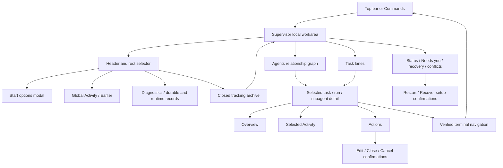
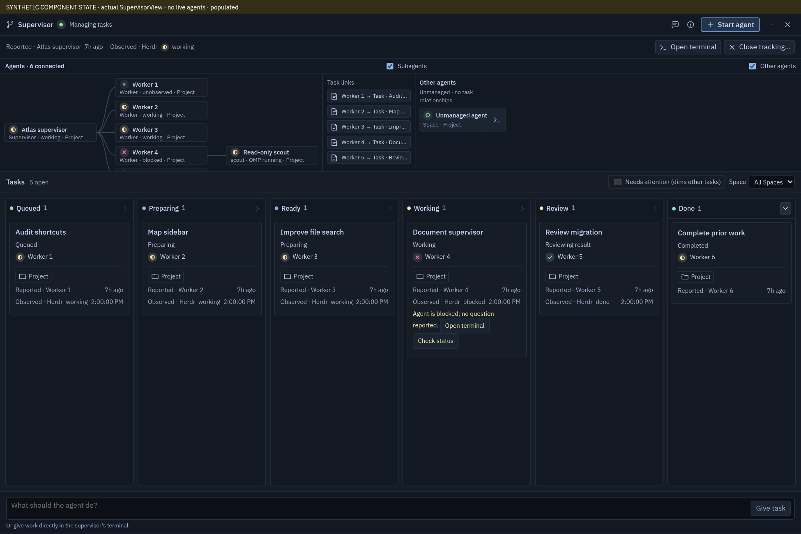

# Supervisor views atlas

Current implementation inventory, compiled by four parallel `openai-codex/gpt-6-luna` agents: three design agents (workarea/Board, graph, details/actions) and one read-only scout (dialogs/recovery/projection). No redesign or product edits.

## Read this atlas

| Artifact | Inventory |
|---|---|
| [01 — Workarea & Board](01-workarea-board.md) | W1–W9: app entry, header/root choice, status region, lanes/cards/filters, responsive views, assignment conflicts, empty/loading and focus |
| [02 — Agents graph](02-agents-graph.md) | G01–G19: forest/run/internal-subagent/task-link/unmanaged nodes, freshness, relationships, highlighting, keyboard, resizing and root selection |
| [03 — Details & actions](03-details-actions.md) | D01–D22: task/run/subagent Overview/Activity/Actions, explicit-result/plan overrides, global Activity/Diagnostics, archived roots, errors and root-scoped focus |
| [04 — Dialogs & recovery](04-dialogs-recovery.md) | R01–R08: six modal modes, runtime/lifecycle recovery matrix, questions, durable conflicts and underlying projection |
| [Visual evidence index](evidence/INDEX.md) | 30 screenshots: 7 actual disposable-browser views, 23 explicitly synthetic component states; two contact sheets |
| [Semantic citation audit](evidence/CITATION-AUDIT.md) | Original-source coordinate method, correction record and 116 literal anchors for all 58 surface IDs |

**Evidence vocabulary:** CODE-DERIVED = source condition, not exercised runtime. LIVE = actual disposable Cockpit browser and Herdr fixture. SYNTHETIC = actual UI components with supplied DTOs, not live agent/process or server-policy proof. Documentation of earlier checks is not fresh evidence.

**Concurrent checkout changes:** SupervisorView changed from 377 to 332 and then 341 lines during this work. The task composer was removed, not extracted. To make the atlas stable despite further edits, final supervisor sources were pinned in [SOURCE.md](evidence/SOURCE.md), with app entry/navigation separately pinned in [APP-SOURCE.md](evidence/APP-SOURCE.md); original source line citations in the slices refer to those documented snapshots. Screenshots retain earlier surface states, including the former composer; the gallery marks this timing boundary. Do not infer a current task-entry control from those images. The pinned workarea says “Give it work here or in its terminal”, but has no task composer in its rendered source. This atlas records that discrepancy rather than changing it.

## Information architecture

Supervisor is a Cockpit-local workarea below the existing tab strip, not a synthetic Herdr tab/pane. On wide/tall layouts, the agent graph and task Board coexist. The narrow Board/Agents switch is not a pair of permanent full-size tabs. Overview/Activity/Actions are selected-detail segments; global Activity is a separate panel showing earlier events. Diagnostics and Closed tracking are disclosures, not additional Herdr resources.

## Complete surface index

| Family | Current screens/parts | Owner IDs |
|---|---|---|
| App entry/exit | Top-bar Supervisor toggle; Commands Show Supervisor/Start agent; local visibility and terminal hand-off; session remount | W1 W9 |
| Header | Brand/status glyph; multiple-root Agent select; Activity/Diagnostics icon toggles; conditional Closed tracking count; Start agent and Start options; Close Supervisor | W2 G19 D17–D20 R01 |
| Status/attention | Root recovery, reported/observed provenance, notices/errors, unanswered question/Answer, failed descendant recovery, blocked without question, unknown start acknowledgement, assignment conflict, acceptance conflict, unidentified task items, orphaned workers | W3 R07 R08 |
| Board | Queued → Preparing → Ready → Working → Review → Done; counts, lane empty copy, horizontal/vertical scrolling, Done disclosure | W4 |
| Task cards | Title/status, worker chip, Needs attention badge, Space/tab evidence, report age, runtime status, no-worker fallback, blocked-without-question controls, runtime Done without explicit Result | W5 |
| Board filters | Needs attention dims (does not remove) cards; Task Space selector dims nonmatching cards; graph/task shared-Space cross-highlighting | W5 G10 G12 |
| Agent graph | Root/worker/internal-subagent forest, parent edges, task links, connected/unobserved count, Subagents and Other agents switches, unmanaged terminal list, empty/unavailable states | G01–G15 |
| Responsive/geometry | Wide graph above Board; graph horizontal divider; narrow or short-height Board/Agents switch; narrow details overlay; wide right panel; overflow scrolling; root-scoped initial-focus guard | W6 G16–G18 D01 D22 |
| Selected details | Header/close; Overview task body, run role/progress/runtime or child role/status/summary; parent terminal link | D01–D04 |
| Selected Activity | Explicit Result and acceptance label, work plan, initialization report; child last send/cancel control receipt or no-receipt copy | D05 D06 |
| Task/run Actions | Edit task, inline Request stop confirmation, follow-up, durable note, explicit-result accept/send-back, close tracking, prepare/execute operator exact-plan override | D07 D08 D11–D16 |
| Child Actions | Message to internal subagent; Cancel subagent confirmation; running eligibility and stored/applied/failed receipt distinction | D09 D10 R06 |
| Global records | Earlier timeline (messages/grants/annotations); Diagnostics canonical path, task diagnostics/identity controls, per-run JSON, expandable inbox delivery/provenance, runtime/intents dumps | D17–D19 |
| Archive | Closed-root list, retained tasks/history/resource disclaimer, selected closed-root board, return to open root and orphan descendants | D20 R08 |
| Modals | Start options (three locations), Edit task (stale/deleted draft recovery), Restart agent, Close tracking, Recover setup, Cancel subagent | R01–R06 |
| Loading/error/disabled | Snapshot loading/error+retry, no roots, empty lanes, missing worker, unknown/offline endpoint and launch/setup recovery; per-control busy/live/revision gating | W8 D21 R07 R08 |
| Current assignment entry | No task composer, task text draft, Give task button or input splitter in current Supervisor; existing assignment conflicts remain inspectable/resolvable | W7 |

There is no additional Supervisor-specific right-click/context-menu implementation in the inventoried graph/Board/details/dialog components. Root, location, Space and filter choices are native selects; Start options is a modal; records use native details/summary. The app-wide Commands menu is the entry surface, not another Supervisor screen. No separate inbox popup or settings screen is asserted.

## State matrix and ownership

State dimensions are intentionally orthogonal; do not collapse them into a single status badge.

| Dimension | Values/conditions | Consumer-visible treatment | Coverage |
|---|---|---|---|
| Canonical task lane | queued/setup/ready/working/review/accepted | Queued/Preparing/Ready/Working/Review/Done; checked task and accepted successful Result are distinct | W4 W5 R08 |
| Run lifecycle | proposed/awaiting_prepare/preparing/initializing/ready/working/reported/active/closed | Preparation/execution/result overrides depend on stage; closed tracking keeps data/resources and descendants | D14–D16 D20 R07 |
| Dispatch | planning/plan_failed/setup_pending/setup_running/setup_unknown/launch_intent/launch_pending/launch_unknown/launched/needs_review | Planning/setup/launch receipts are not live OMP proof; failed setup, unknown launch and restart require distinct controls | R03 R05 R07 |
| Runtime evidence | present/missing/endpoint_changed/unobserved; fresh vs unavailable; actual OMP and bound-session proof | Connected/blocked only with matching fresh proof; offline is not absence; terminal disappearance not task failure | G02 G09 D21 R07 |
| Agent presentation | ready/starting/failure/missing/unknown/offline/closed | State label/detail, check/open/restart/recover/close controls according to predicate order | R07 |
| Reports | progress/ready/result/needs_input; succeeded/failed | Reporter/age/provenance separate from current observation; explicit Result awaiting review separate from runtime Done | W5 D03 D05 R08 |
| Internal subagent | running/done/failed/cancelled | No child terminal; send/cancel rendered but disabled unless eligible/running; last receipt stored/applied/failed | G06 D04 D06 D09 D10 |
| Durable delivery | stored/woken/read/acked; stale message | Per-message Diagnostics and Earlier provenance; wake/read not processed ACK or task completion | D17–D19 R08 |
| User interaction | selected/hover/linked/shared/dimmed/focused; busy/pending/unknown | Selection does not imply DOM or Herdr focus; dimming does not remove rows; unknown writes retain drafts/operation identity | W5 W9 G11–G13 D21 |
| Conflict | task changed/deleted, assignment pending/conflict, acceptance conflict, duplicate/unidentified markers | Review current revision, keep draft or keep unassigned, exact task/plan revision fences; no blind replay | W7 R02 R08 |
| Layout | wide/tall vs container ≤719px or viewport height ≤600px | Simultaneous graph+Board vs switched view; narrow right panel replaces content | W6 G17 |

Lifecycle enums are mapped from `src/protocol/generated/v1.ts:951–1019`; rendering/projection predicates are cited in the slices. The atlas covers every current conditional family; it does not claim exhaustive runtime combinations.

## Navigation and focus relationships

- App entry is Commands or top-bar Supervisor. Static command registry assigns no dedicated shortcut to Show Supervisor/Start agent (`src/app/input/shortcuts.ts:128–129`). Opening/closing is local presentation, not a Herdr focus mutation.
- Agent root select changes scope. Archived-root selection changes scope and closes archive. Graph node and Board task selection are mutually exclusive; choosing the same row toggles details off and choosing a new row resets detail segment to Overview.
- Board arrows move DOM focus within/between lanes, clamping index and skipping empty adjacent lanes; graph uses its own roving row order. This does not drag/move a task or mutate lane/agent state.
- Hover/selection highlights related task/node/edges and shared Space independently of keyboard focus. Internal subagents retain their parent run relationship without creating panes.
- Details close restores the surviving invoker, else the matching task/run/child row. Narrow panel opening focuses its close button. Removed focused tasks move to the next available task or Start agent.
- Escape belongs to editing inputs/composition and modal/armed override first; otherwise selected details close before global panels/archive before Supervisor itself. Modal Tab/Shift+Tab wraps eligible controls; cancellation restores opener when available. LIVE Start options cancellation restored opener.
- Terminal navigation is an explicit action requiring fresh matching Space/tab/pane/endpoint membership and ordered focus acknowledgement. Source describes successful navigation closing Supervisor; no actual agent-terminal navigation was exercised for this atlas.

## Component and authority map

| Layer | Primary files | Responsibility |
|---|---|---|
| App host/entry | `src/app/App.tsx`, `src/app/input/shortcuts.ts` | Local workarea state, entry commands, modal ownership, verified terminal hand-off |
| Workarea/Board | `src/app/supervisor/SupervisorView.tsx`, `boardNavigation.ts` | Scope/selection, header/attention/lanes, details/global panels, focus navigation |
| Graph | `SupervisorGraph.tsx`, `graphLayout.ts`, `RowSplitter.tsx` | Forest geometry/edges, node/list interactions, graph resizing |
| Details/dialogs | `SupervisorActions.tsx`, `SupervisorDialogs.tsx` | Conditional content/actions, exact plan review, six modal flows, user confirmations |
| Refresh/drafts | `useSupervisor.ts`, `useSupervisorDrafts.ts` | Session/root/revision snapshot fences, refresh/wait, message/edit draft retention |
| Presentation | `supervisor.css`, shared `StateGlyph`, `UiIcon`, roving list/focus restore utilities | Dense layout, responsiveness, status glyphs, focus semantics |
| Client contract | `src/client/orchestrationProtocol.ts`, generated v1 types | Validated action/snapshot DTOs and strict transport identities |
| Durable core | `crates/cockpit-core/src/orchestration.rs`, `orchestration/{projection,tasks_md,messages,store,dispatch}.rs` | Authorization, canonical Markdown, intents/revisions, report/delivery/grants, launch/recovery |
| Runtime authority | Herdr and owner orchestration runtime | Actual process/terminal membership and OMP identity; durable records alone cannot establish liveness |

Detailed exact line references are maintained in each slice. Canonical task source remains `<state_root>/orchestration/tasks/<root_id>.md`; Board is a projection, not a second task store. Accept requires explicit successful Result plus current exact task revision. Prepare/Execute bind the exact reviewed plan; subagent receipt is not parent Ready/Result or completed task.

## Coverage checklist

- [x] All workarea/header/root/entry/exit surfaces, including no-session/selection boundaries described by App integration.
- [x] All six lanes, cards/evidence/empty states, filters, completed disclosure, keyboard and focus transitions.
- [x] Root/worker/internal subagent/task-link/unmanaged graph; relationships, scroll/resize, cross-highlights and switch states.
- [x] Task/run/subagent Overview, Activity and Actions, including every conditional control family.
- [x] Global Activity, Diagnostics, raw delivery/plan/runtime records, archive and retained-descendant recovery.
- [x] All six modal modes and three Start locations; focus/validation/pending/unknown/stale/disabled variants.
- [x] Runtime/lifecycle/dispatch/report/delivery/error/empty/conflict/revision provenance and source map.
- [x] Representative actual browser and synthetic component visuals labeled separately; capture/source-change boundary recorded.
- [x] Four requested Luna agents used successfully, no model substitution.
- [x] Temporary verification resources stopped/removed; no product edits, installs, commits, pushes, provider or persistent user-state mutations.

**Verification limit:** One browser build and actual disposable empty/start-options/panel/navigation scenario, plus synthetic component rendering and interaction coverage. No live OMP launch/control, task assignment/acceptance/grant mutation, real backend conflict, native GTK/WebKit run, authorization/security proof, or exhaustive keyboard/predicate permutation. Loading/error branches are code-derived rather than freshly captured. These limits do not remove those surfaces from the atlas.

## Representative visual

This populated view is **synthetic** and predates removal of the bottom composer; current source inventory above is authoritative for that change.

