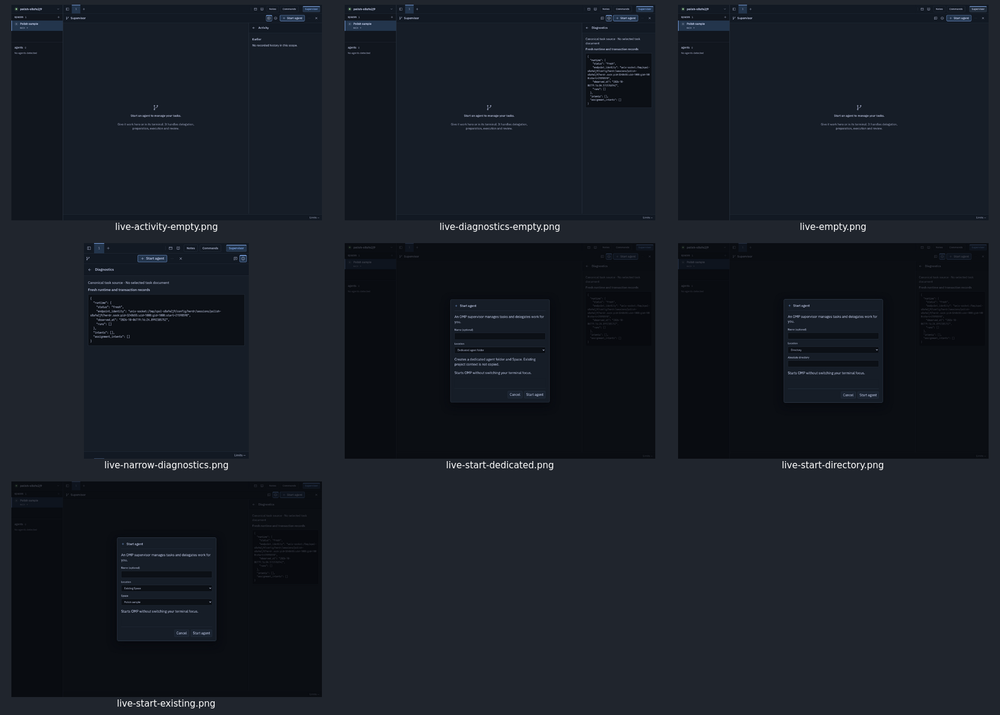
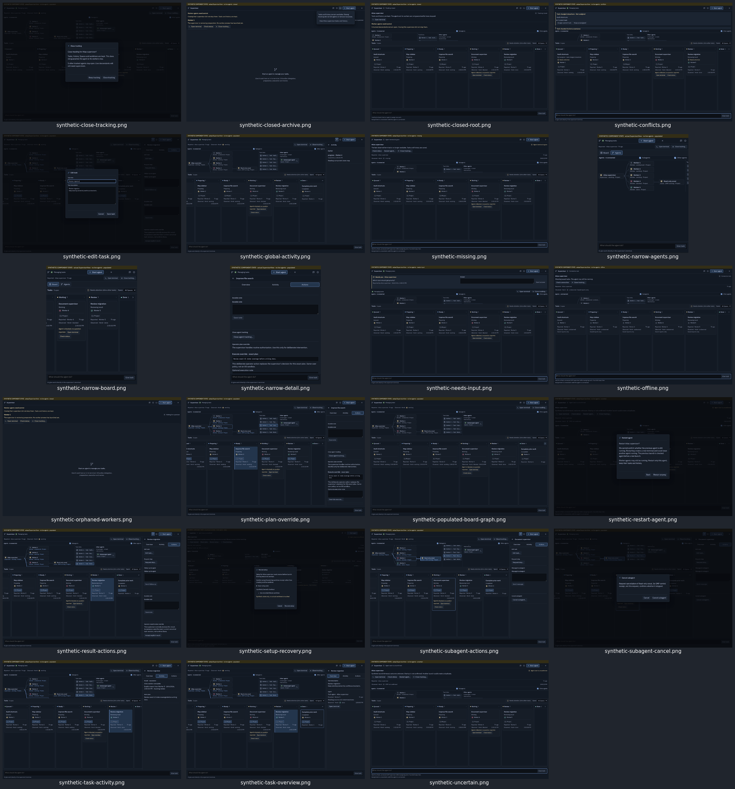

# Supervisor atlas visual evidence

## Evidence classes and capture boundary

- **LIVE**: actual browser build from `bun run build` against owned disposable Herdr session `polish-s8afe2j9`, gateway `http://127.0.0.1:45443`. No tracked OMP runs, agent launch or provider write. Build succeeded (TypeScript and Vite); Vite reported a large-chunk warning.
- **SYNTHETIC**: actual `SupervisorView` and its existing graph/details/dialog components rendered by a temporary Vite harness with explicit synthetic DTOs adapted from consumer test fixtures. Banner marks every image. These are visual/interaction demonstrations, **not** backend lifecycle proofs, live process observations, authorization checks, or successful mutation evidence. Synthetic mutation callback rejected writes; no action was submitted.
- **CODE-DERIVED**: source predicates in the four slice reports. No screenshot implies all those branches ran.

**Concurrent-change boundary:** SupervisorView changed from 377 to 332 and then 341 lines during this work; the task composer was removed, not extracted. LIVE screenshots use the one compiled build taken before that change. SYNTHETIC screenshots loaded then-current source through Vite HMR; most retain the former composer. The final source reports refer to the documented [source snapshot](SOURCE.md), with original source line numbers, rather than chasing later concurrent edits. Visuals are dated evidence across that change, **not** proof that the former composer remains present or one immutable binary matches every citation. No product source was edited by this atlas worker.

## Exercised interactions

Actual disposable app: opened Supervisor; observed empty workarea; opened Activity/Diagnostics; opened Start options and switched Existing Space → Directory → Dedicated agent folder without submission; Cancel restored focus to Start options; resized to 650×850 and observed full-panel Diagnostics; closed Supervisor (not visible), reopened it (visible).

Synthetic components: expanded Done; selected review task and Overview/Activity/Actions; opened/cancelled Edit task, Cancel subagent, Close tracking and Restart dialogs; selected ready-worker execute override; switched narrow Board/Agents; rendered needs-input/missing/unknown/offline/conflict/orphan/closed states; opened archived root; rendered Recover setup modal. No acceptance, grants, messages, cancellation, setup, restart or task saves submitted. Native GTK/WebKit and real OMP lifecycle were not exercised.

Viewport screenshots do not contain all scrollable content. Lower action controls and overflowed graph/cards may be outside the image; source reports remain the complete inventory. Normal screenshot capture stalled for setup recovery; direct Chromium `Page.captureScreenshot` produced that image. Owned browser tabs, harness service and disposable fixture were stopped; the owned temporary fixture/harness directory was removed after evidence preservation.

## Gallery index

| Image | Class | Surface | IDs |
|---|---|---|---|
| [live-empty](live-empty.png) | LIVE | Empty Supervisor below actual tab strip | W1 W2 W8 |
| [live-activity-empty](live-activity-empty.png) | LIVE | Global Activity, empty Earlier timeline | D17 |
| [live-diagnostics-empty](live-diagnostics-empty.png) | LIVE | Fresh disposable runtime; no canonical task document/runs | D18 D19 |
| [live-narrow-diagnostics](live-narrow-diagnostics.png) | LIVE | 650×850; full-workarea Diagnostics | W6 D18 |
| [live-start-existing](live-start-existing.png) | LIVE | Actual disposable Space selected; not submitted | R01 |
| [live-start-directory](live-start-directory.png) | LIVE | Absolute directory input; not submitted | R01 |
| [live-start-dedicated](live-start-dedicated.png) | LIVE | Dedicated-folder option; not submitted | R01 |
| [synthetic-populated-board-graph](synthetic-populated-board-graph.png) | SYNTHETIC | Six lanes, Done expanded, graph/internal subagent/task links/other agent; former composer | W4 W5 G01–G18 |
| [synthetic-task-overview](synthetic-task-overview.png) | SYNTHETIC | Task description and run evidence | D01 D02 D03 |
| [synthetic-task-activity](synthetic-task-activity.png) | SYNTHETIC | Result and exact work plan | D05 |
| [synthetic-result-actions](synthetic-result-actions.png) | SYNTHETIC | Edit/stop/follow-up/note/result review controls | D07 D08 D11 D12 D14 |
| [synthetic-edit-task](synthetic-edit-task.png) | SYNTHETIC | Edit modal, unchanged revision; no save | R02 |
| [synthetic-global-activity](synthetic-global-activity.png) | SYNTHETIC | Earlier worker report | D17 |
| [synthetic-subagent-actions](synthetic-subagent-actions.png) | SYNTHETIC | Child send/cancel controls, no child terminal | D09 D10 |
| [synthetic-subagent-cancel](synthetic-subagent-cancel.png) | SYNTHETIC | Cancellation confirmation only | R06 |
| [synthetic-plan-override](synthetic-plan-override.png) | SYNTHETIC | Execute plan and optional note; not submitted | D15 D16 |
| [synthetic-narrow-detail](synthetic-narrow-detail.png) | SYNTHETIC | 650×850; Actions overlays workarea | W6 D01 |
| [synthetic-narrow-board](synthetic-narrow-board.png) | SYNTHETIC | 650×850; Board, horizontal lane scroll | W4 W6 |
| [synthetic-narrow-agents](synthetic-narrow-agents.png) | SYNTHETIC | 650×850; Agents graph active | G17 |
| [synthetic-needs-input](synthetic-needs-input.png) | SYNTHETIC | Root question and Answer field | R08 |
| [synthetic-missing](synthetic-missing.png) | SYNTHETIC | Root terminal missing, check/restart controls | R07 |
| [synthetic-uncertain](synthetic-uncertain.png) | SYNTHETIC | Unknown launch, duplicate-launch warning | R07 |
| [synthetic-offline](synthetic-offline.png) | SYNTHETIC | Saved reports, unobserved graph, disabled controls | R07 G02 G15 |
| [synthetic-conflicts](synthetic-conflicts.png) | SYNTHETIC | Assignment conflict and unidentified-item UI; no resolution | R08 W7 |
| [synthetic-orphaned-workers](synthetic-orphaned-workers.png) | SYNTHETIC | Closed root unselected; descendants need control | R08 |
| [synthetic-closed-archive](synthetic-closed-archive.png) | SYNTHETIC | Closed tracking disclosure | D20 |
| [synthetic-closed-root](synthetic-closed-root.png) | SYNTHETIC | Archived root selected, retained tasks/descendants | D20 R08 |
| [synthetic-close-tracking](synthetic-close-tracking.png) | SYNTHETIC | Close tracking confirmation only | R04 |
| [synthetic-restart-agent](synthetic-restart-agent.png) | SYNTHETIC | Unknown-launch restart confirmation only | R03 |
| [synthetic-setup-recovery](synthetic-setup-recovery.png) | SYNTHETIC | Existing-worktree receipt recovery confirmation only | R05 |

## Contact sheets

30 original screenshots; two derived contact sheets. Contact sheets visually cover all originals; populated Board, result Actions and setup recovery were additionally inspected at full resolution. Representative coverage, not every predicate combination. State labels in synthetic images are inputs supplied to components, not independently verified server facts.

## Artifact verification

All 32 PNGs (30 originals and two contact sheets) were opened and decoded; screenshots were preserved unchanged during citation correction. The earlier blanket bounds claim was insufficient: its regex missed bare-number source-map cells and did not verify semantic targets. The corrected pass reviewed all four slice descriptions, conditional tables and source maps against source predicates. A final coordinate check covered **664 explicit original-source range occurrences** in seven atlas/audit documents against the frozen Supervisor/App source strings: no out-of-bounds ranges, no ambiguous shorthand and no bare-number source-map cells. Separately, **116 exact literal anchors across all 58 surface IDs** were located in those strings and their source-line coordinates derived from the match, as recorded in [CITATION-AUDIT.md](CITATION-AUDIT.md). Final document link checks found no missing targets. App evidence is in [APP-SOURCE.md](APP-SOURCE.md), Supervisor evidence in [SOURCE.md](SOURCE.md). These source/artifact checks add no runtime coverage.
