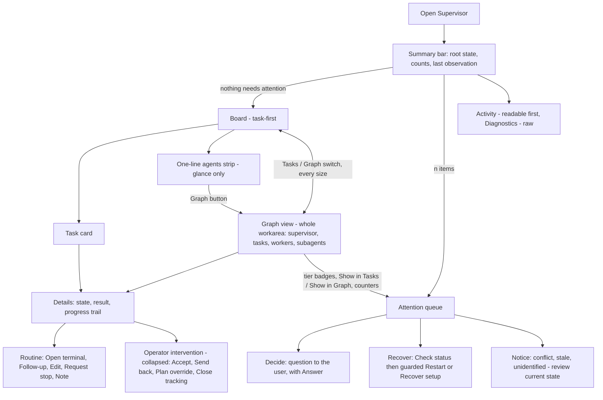

# Supervisor design review — recommendations only

Reviewer: design agent `AtlasDesignReview`, 2026-10-06. Input: `planning/supervisor-atlas-2026-10-06/` (ATLAS.md, slices 01–04, `evidence/*`) plus the **current** `src/app/supervisor/*` checkout. Nothing in the product, tests, docs or user state was changed. Every proposal below is a **concept**; example values in the presentation are illustrative.

Companion: [`PRESENTATION.html`](PRESENTATION.html) shows the representative before/proposed comparisons (task-first work area, **full-workarea Graph view**, attention and recovery, relationships, details and result review, dialogs and narrow layout) and a local working demo of the Tasks/Graph views.

**Revision 2026-10-07 (user feedback).** The attention-first direction (F1/F2) and all other findings stand. New requirement: the full agent/task graph must be *discoverable and usable at the size of the whole Supervisor workarea*, hidden by default but never reduced to a fixed band or chips. F3 is replaced accordingly (no default-height expanded band anywhere in this document); F7, F12, F13, §5, §6, §7, §8, §9 and the coverage appendix were updated to match.

**Bounded revision 2026-10-07 (user feedback on the Graph view).** Two defects reported and accepted as ground truth: (1) *focus in board / focus in graph* wording is confusing; (2) graph nodes lost their status icons and the icon, title and tier overlapped. Changes, all inside F3 and its figures, nothing else is removed or re-decided: navigation between views is now plainly **Show in Tasks** / **Show in Graph** everywhere (details buttons, queue-row action formerly *Locate*, demo, figures, keyboard table, acceptance scenarios); the word *focus* is kept only where it means DOM keyboard focus or Herdr terminal focus (A8, §5.1). The graph node is redesigned from a 200 × 36 px single row to a **240 × 48 px two-row node** with separate icon, title, tier, status and provenance regions (*Node anatomy* under F3), and the presentation's graph stylesheet no longer positions node icons as if they were edges. Tasks-first default, optional full-workarea Graph, queue tiers, result-first details, dialog/recovery polish, topology, details, attention and keyboard model are unchanged.

## 0. Summary — ranked recommendations

| # | Recommendation | Why now | Atlas IDs |
|---|---|---|---|
| **F1** | Replace the fixed-height status strip with an **attention queue** that grows with its content, orders items by who must act, and collapses to one summary line. | The strip is a hard 44 / 164 / 110 px box with internal scroll. Synthetic captures show the second banner and the action row cut off. Five unrelated item kinds share one amber "Needs you" style. | W3 W8 R07 R08 D21 G18 |
| **F2** | One **attention vocabulary and predicate** (Decide / Recover / Notice) shared by queue, card badge and filter; consume the core `attention` list. | The card-level predicate omits runtime-blocked workers that the card itself warns about; the filter then dims them. `snapshot.attention` is never read by the UI. | W3 W5 R07 R08 |
| **F3** | **Task-first work area with an explicit full-workarea Graph view**: *Tasks* is the initial view and owns the height; a labelled `Tasks` / `Graph` switch at every size opens the complete supervisor → task → worker → subagent topology in the whole workarea. | At wide size the graph band takes 220 px (100 px with attention) and still clips nodes while lane bodies are mostly empty; no band height can show the whole topology, and the full-area graph exists only as an undiscoverable ≤719 px / ≤600 px-high fallback (O11). | W4 W5 W6 G01 G05 G16–G19 |
| **F4** | **Review-first details**: lead with state, result and a progress trail; split Actions into *Routine* and a collapsed *Operator intervention* group. | Result review lives under Activity; Actions is a flat stack with duplicated headings where "Accept explicit result" sits beside "Durable note". | D01–D16 |
| **F5** | **Recovery cards** offer one suggested next step, show consequences inline, and demote *Close tracking…* out of the healthy-agent row. | Four same-weight buttons (Open terminal, Check status, Restart…, Close tracking…) with no ordering. | R03 R04 R05 R07 D13 W3 |
| F6 | Card density: two-line default card with a paired *reported / observed* provenance chip. | Up to six lines per card, repeated identical Space chips, lane word repeated as card status. | W5 G09 G10 D03 D21 |
| F7 | **Relationship path** task ↔ worker ↔ subagent, navigable, plus the same chain drawn as columns in the Graph view; selecting from outside the graph reveals the node. | Relationships live in three places (card chip, graph, far-right Task links) and cross-highlight may land outside the visible band. | G05–G08 G10–G13 D04 W5 |
| F8 | Dialog set: unambiguous button labels, field-level validation, honest stale/deleted-edit handling. | *Cancel* sits beside *Cancel subagent*; *Recover setup* covers three different operations; Save stays enabled for a deleted task. | R01–R06 D08–D10 D15 |
| F9 | Header: demote *Start agent* when a verified root exists, label *Hide Supervisor*, show needs-you in the root selector, one name for the activity panel. | Primary-weight Start is the loudest control on a healthy screen; three names for one panel (Activity / History / Earlier). | W1 W2 G19 D17 D20 R01 |
| F10 | Activity and Diagnostics: readable summary first, raw records second, links back to task/run. | Diagnostics opens on a JSON dump; Activity rows have no task link. | D17 D18 D19 R08 |
| F11 | Empty, offline and loading states carry one status each instead of repeating per card or per lane. | Offline shows "Saved reports only" on every card; a root with no tasks shows six "No tasks" lanes. | W7 W8 G02 G15 R07 D21 |
| F12 | Narrow and short layouts: summary bar → attention overlay; lanes as vertical groups instead of one snap-scrolled lane; the same Tasks · Graph switch at every size; the Graph view keeps context with a bottom sheet. | At ≤719 px the header, attention box and switch consume the first screen; only one of six lane counts is visible; opening details in the narrow graph hides the graph. | W6 G17 G18 D01 |
| F13 | Keyboard and accessibility consolidation (details splitter values, dim semantics, disabled reasons, queue roving, graph arrows). | Several gaps are code-derived: splitter has no value attributes, dimmed cards fall to ≈3.4:1 muted text. | W9 G13 G16 D22 W5 |

Strongest three: **F1+F2** (the user must find "what needs me" without scrolling a clipped box), **F3** (observational default: Tasks first, the full graph one labelled switch away), **F4** (supervisor-managed results should read as *being reviewed*, with operator override clearly secondary).

## 1. Goal & users

**Users.** One developer running one or more OMP supervisors across projects. They open Supervisor to answer, in order: (1) does anything need me; (2) what is being worked on and by whom; (3) what finished and was it accepted; (4) when something broke, what is the safe next step; and, on demand, (5) how every agent, subagent and task relates, using the whole screen the Supervisor occupies.

**Product direction being served** (project decisions): Cockpit is an IDE for concurrent projects/agents; the UI is primarily **observational**; the supervisor manages grants, review and acceptance without repeated manual approvals; operator controls exist but are secondary; starting a supervisor launches OMP.

**Out of scope.** No backend changes, no new orchestration actions, no new persistence. Where a proposal needs data the UI does not currently use (core `attention`, `RootSummary.needs_you`, `Run.grants`), the data already exists in the snapshot types (`src/protocol/generated/v1.ts:943,967,1019–1021`).

### 1.1 Authority invariants every proposal preserves

| # | Invariant | Source |
|---|---|---|
| A1 | `<state_root>/orchestration/tasks/<root_id>.md` is the only task store; the Board is a projection; writes carry exact task/document revisions; no copied-card store. | ATLAS component map; `DECISIONS.md:55` |
| A2 | Prepare/Execute are authorized by the bound supervisor session. The operator override stays an explicit, exact-plan-revision, deliberate action with its "same-user policy, not an OS sandbox" statement. The UI never auto-approves and never attributes a supervisor decision to the user. | D15 D16 D17; `SupervisorActions.tsx:114` |
| A3 | Accept needs an explicit **successful Result** and the **current exact task revision**. Runtime Done, a report, or a wake/read is not acceptance. | D14 R08; `DECISIONS.md:61` |
| A4 | Reported ≠ observed ≠ durable receipt. Unavailable observation is not absence; saved reports are not live proof; "unobserved" wording stays. | ATLAS state matrix; `SupervisorActions.tsx:15–16,35` |
| A5 | Close tracking is not a kill; descendants, Spaces, worktrees remain. Check status is a read-only reconcile. Restart only for LaunchUnknown/NeedsReview behind a confirmation. | R03 R04 R07 |
| A6 | Unconfirmed writes keep the draft and operation identity; no blind replay; non-retryable ops require an explicit unlock after review. | D09 D11 D12 R02 |
| A7 | Internal subagents have no terminal; stored ≠ applied ≠ completed; a subagent receipt is not the parent's Ready/Result. | G06 D04 D06 D09 D10 R06 |
| A8 | Selection ≠ DOM focus ≠ Herdr focus. Terminal navigation is explicit and identity-fenced. Viewing or selecting never changes terminal focus. | ATLAS navigation; W1 W9 |
| A9 | The bottom task composer, the "Other agents" filter/unmanaged overview, the empty-state paragraph and the tooltip focus sentence were **removed on purpose** (`docs/supervisor-surfaces.md:15,17`). This review does not reintroduce them. | docs |
| A10 | Pull delivery: nothing is typed into terminals; Stored / Woken / Read / Acked stay distinct. | `DECISIONS.md:59`; D17–D19 |

## 2. Evidence

### 2.1 What was read

All four slices (W1–W9, G01–G19, D01–D22, R01–R08), ATLAS.md, `evidence/INDEX.md`, `CITATION-AUDIT.md` (coordinate method; 116 literal anchors), `SOURCE.md`, `APP-SOURCE.md`, `docs/supervisor-surfaces.md`, `DECISIONS.md` (Supervisor orchestration), and the images `contact-synthetic.png`, `contact-live.png`, `synthetic-populated-board-graph`, `-needs-input`, `-conflicts`, `-result-actions`, `-narrow-detail`, `-offline`, `-setup-recovery`, `-orphaned-workers`. **Current** sources read in full or in the relevant ranges: `SupervisorView.tsx` (all 341 lines), `SupervisorGraph.tsx`, `SupervisorActions.tsx`, `SupervisorDialogs.tsx`, `supervisor.css`, `boardNavigation.ts`, `useSupervisorDrafts.ts`, `shortcuts.ts:127–132`, `src/app/styles.css:13–88` tokens.

Revision 2026-10-07 re-read for the Graph view: `SupervisorGraph.tsx` (all 125 lines), `graphLayout.ts` (constants and forest algorithm), `RowSplitter.tsx` (keys), `SupervisorView.tsx:180–341`, `supervisor.css:1–224` (narrow/short rules at `:149–169,185–193,211–221`).

### 2.2 Evidence classes

CODE-DERIVED = source predicate; LIVE = actual disposable browser (7 empty-state/panel/dialog images); SYNTHETIC = actual components with supplied DTOs (23 images). Historical screenshots predate removal of the composer and (per below) the "Other agents" list; they are **evidence of layout behavior, not of current content**. Contrast numbers marked *computed* are my arithmetic from CSS tokens, not browser measurements.

### 2.3 Current source vs. the frozen atlas (current outranks frozen)

| # | Discrepancy | Evidence | Effect on atlas IDs |
|---|---|---|---|
| X1 | The graph no longer has the **Other agents** checkbox, the unmanaged list, the `onUnmanaged` callback or a `busy` prop. `SupervisorGraph.tsx` is 125 lines (frozen: 141). `ScopeDrafts` has no `showUnmanaged` (frozen `SOURCE.md:1365`). The test asserts only a "Subagents" label and no "Unmanaged agents" region (`SupervisorView.test.tsx:229–231`). Documented as intentional (`docs/supervisor-surfaces.md:17`). | `SupervisorGraph.tsx:78–92`; `useSupervisorDrafts.ts:5–19` | **G04, G14 superseded.** G02, G10, G13, G15 lose their unmanaged clauses. `unmanaged_agents` stays in the snapshot type (`v1.ts:939,941`) but Supervisor does not render it. No recommendation reintroduces it. |
| X2 | The no-root empty state renders only the heading **"Start an agent to manage your tasks."** The frozen source also rendered "Give it work here or in its terminal. It handles delegation, preparation, execution and review." (`SOURCE.md:330`). | `SupervisorView.tsx:323`; `docs/supervisor-surfaces.md:17` | W8 and ATLAS "Current assignment entry" row: the pinned wording "Give it work here or in its terminal" no longer exists. `live-empty.png`, `synthetic-orphaned-workers.png`, `synthetic-closed-archive.png` still show the paragraph. |
| X3 | The Start agent tooltip is destination-only; the sentence "Starts OMP without switching terminal focus." is gone from the header (frozen `SOURCE.md:285`) but remains in the Start options dialog (`SupervisorDialogs.tsx:90`). | `SupervisorView.tsx:278` | W2/R01 copy. |
| X4 | `supervisor.css` is 224 lines (frozen: 243): unmanaged and `.supervisor-graph-node-space` rules are gone. | `supervisor.css:170–224` vs `SOURCE.md:1146–1215` | Layout only; G14 styling. |
| X5 | `SupervisorActions.tsx` (190), `SupervisorDialogs.tsx` (107) and `boardNavigation.ts` (25) have the same line counts as the frozen copies. They were **not diffed line by line**. | — | Treated as unchanged. |

### 2.4 Observations from current source that the atlas does not call out

| # | Observation | Evidence |
|---|---|---|
| O1 | The UI never reads `snapshot.attention` (no match for `.attention` in `src/app`); `hasAttention` is a local predicate. Core derives ToAccept, ExitedWithoutReport, IdleWithoutReport, BriefUnread, PlanChanged, DispatchUnknown, IntentConflict with `since` timestamps. | `SupervisorView.tsx:226`; `v1.ts:1019–1021`; R08 table |
| O2 | Card `needsAttention` omits an observed-blocked worker (`agentState` returns kind `ready` with `blocked: true`), although the same card prints "Agent is blocked; no question reported" with Open terminal / Check status. The filter label says "Needs attention (dims other tasks)" and dims that card. | `SupervisorView.tsx:249,259`; `SupervisorActions.tsx:25,32` |
| O3 | `.supervisor-needs-you` (amber edge, "Needs you" look) is reused for recovery cards (`:286`), assignment intents (`:296`) and acceptance conflicts (`:298`), not only the question (`:290`). | `SupervisorView.tsx:286,290,296,298`; `supervisor.css:45–51` |
| O4 | One panel has three names: header button "Activity", aside `aria-label` "History", heading "Earlier". | `SupervisorView.tsx:277,326,333` |
| O5 | `RootSummary.needs_you` and `open_runs` exist but the Agent selector shows only the label. | `v1.ts:943`; `SupervisorView.tsx:276` |
| O6 | `ScopeDrafts.disclosures.agents` is declared and unused — no consumer in `src/app/supervisor`. The revised F3 does not need an expandable strip, so it is **not** reused; the Tasks/Graph choice needs its own `ScopeDrafts` field (`view`). | `useSupervisorDrafts.ts:14` |
| O7 | Dismiss button copy is `Keep tracking` (close) / `Back` (retry) / **`Cancel`** otherwise, so Cancel subagent shows `Cancel` next to `Cancel subagent`; Recover setup's primary is always "Recover setup" regardless of recovery kind. | `SupervisorDialogs.tsx:26,105` |
| O8 | Edit task: with the task deleted (`currentTask` null) the warning shows, no rebase control, and Save stays enabled; any non-matching result yields "The change was not confirmed… Check current status" without distinguishing a definitive revision rejection from an unknown outcome. | `SupervisorDialogs.tsx:66–70,94,105` `[INFERENCE: rejected writes arrive as null from mutateResult]` |
| O9 | Detail copy duplicates headings: "Follow-up to agent" `h3` plus identical label; "Durable note" likewise (`SupervisorActions.tsx:182–183`). Visible in `synthetic-result-actions.png`, `synthetic-narrow-detail.png`. | cited |
| O10 | Dimmed cards use `opacity: .58`. Computed from tokens: muted text (`#a6adc8`) on the card over lane background ≈ **3.4 : 1** (primary `#cdd6f4` ≈ 4.8 : 1). Not browser-measured. | `supervisor.css:95`; `styles.css:27,29` |
| O11 | The full-workarea graph already exists, but only as a narrow/short fallback called **Agents**: `supervisor-narrow-switch` (`display:none` by default) is shown at container width ≤719 px or viewport height ≤600 px, state defaults to `board`, the active graph surface becomes `flex: 1` with `height:auto; max-height:none`, and the graph splitter is hidden. Wide users cannot reach it. | `supervisor.css:149,159–163,187–192`; `SupervisorView.tsx:65,303–308` |
| O12 | In that Agents view a selected node opens the details as an `inset: 0` overlay and the content is `visibility:hidden`; the graph is not visible while details are read. Focus moves to the Close button and returns to the invoker on close. | `supervisor.css:165,179`; `SupervisorView.tsx:230–243` |
| O13 | The narrow-view choice is component state (`useState`), not in `ScopeDrafts`; inactive surfaces are hidden with `display:none`. Whether a `display:none` scroller keeps its scroll offsets is browser behavior not verified here `[INFERENCE]`, so the concept saves and restores offsets explicitly. Width uses a container query (≤719 px), height a viewport media query (≤600 px). | `SupervisorView.tsx:65`; `useSupervisorDrafts.ts:5–19`; `supervisor.css:151,185` |
| O14 | Graph keyboard model today: one roving tab stop over forest rows then task refs; Escape clears selection; a node click toggles selection; a new selection resets the detail segment to Overview. The graph band is `max-height: 60vh` and its splitter max is `0.6 × window height`. | `SupervisorGraph.tsx:67–77`; `SupervisorView.tsx:233,305–306`; `supervisor.css:53` |

## 3. Flow (target)

Normal case: Summary bar + Board, no queue, no operator controls visible. The full topology is one labelled switch away (`Graph`), never behind a disclosure of fixed height. The user decides only for *Decide* items; Recover items are directed at the user only when the supervisor cannot self-heal (missing terminal, unconfirmed start/setup); everything else is information.

## 4. Screens/components — findings

Each finding: **Problem** (evidence) · **Proposal** · **Tradeoff** · **Keyboard/focus** · **Responsive** · **Authority**.

### F1 — Attention queue instead of a fixed status strip *(P0)*

**Problem.** `supervisor-attention-region` is `height: 44px` (empty/compact), `164px` with attention, `110px` at viewport height ≤600, `overflow: auto` (W3; `supervisor.css:33,183,203,186`). Its children include: notice, start-unknown, terminal/hook errors, orphan section, root status card, reported/observed lines, blocked warning, Needs you, one section per assignment intent, one per acceptance conflict, unidentified items (`SupervisorView.tsx:283–299`). Synthetic captures: `synthetic-needs-input.png` shows the "Managing tasks / Open terminal / Close tracking…" row sliced by the region edge; `synthetic-conflicts.png` shows the second banner "Task changed during acceptance" clipped after its heading; `synthetic-orphaned-workers.png` ends at the first worker's action row. `docs/supervisor-surfaces.md:54` lists "no clipped error text" as a repair goal (row 35). At the same time `has-attention` shrinks the graph to 100 px (`supervisor.css:204`; G18), so attention steals from both neighbours.

**Proposal (concept).**
1. **Summary bar** (always, one line, 36–40 px): glyph + root label + state ("Managing tasks"), `n agents observed · 2:00 PM`, then attention counters as text+glyph chips: `1 needs you · 1 recover · 1 notice`. With zero counts the bar is just status and the (existing) *Open terminal* shortcut.
2. **Attention queue** below the bar only when there are items. Rows ordered Decide → Recover → Notice, then by `since`. Each row: tier glyph, **one-line problem naming the task/agent**, one primary action, age. Exactly one row is expanded at a time (native `details name`-style single disclosure; the first Decide row is expanded by default). The queue's height is `min(content, 40% of workarea)`; beyond that it scrolls with a visible "n more" row. It never clips a row mid-text.
3. Expanded Decide row embeds the literal question and Answer field exactly as today (`TextAction`, scoped draft, disabled when not live/verified).
4. **In the Graph view** the summary bar and the queue stay: inline at ≥720 px and >600 px high (capped at 30% of the workarea instead of 40%), overlay from the counters otherwise. Every row gains **Show in Graph** (**Show in Tasks** while the Tasks view is open; formerly *Locate*): select the related task/agent and reveal it in the current view (F3).

**Tradeoff.** More vertical space than 44 px in the attention case; offset by F3 giving the Board its height back and moving the graph out of the band. Collapsed-by-default rows hide secondary buttons one click deeper.

**Keyboard/focus.** Tab reaches the summary bar chips, then the queue as one roving list (Up/Down/Home/End like the existing `useRovingList`), Enter/Space toggles a row, Escape collapses the row, then follows the existing layered Escape (`SupervisorView.tsx:268–273`). Existing behavior preserved: when the question disappears or is answered, focus returns to the selected/first task or Start (`:196–201`). Opening a queue row never steals focus from a field being typed in.

**Responsive.** ≥720 px wide and >600 px high: queue inline above the active view (Tasks or Graph). ≤719 px or ≤600 px high: the summary bar is the only inline element; activating its counters opens the queue in the existing full-workarea overlay slot (`supervisor-detail-panel` mechanism, focus to close button as at `:231`) in both views, and Escape returns focus to the counter that opened it. No separate 110 px box.

**Authority.** Answer still sends `message_send` to the root; Assign/Keep and Apply/Keep intent resolutions keep their exact revisions and disabled conditions (R08).

### F2 — One attention vocabulary and predicate *(P0)*

**Problem.** O1–O3. Three places decide "needs attention" independently (aggregate `hasAttention`, card `needsAttention`, filter), and styles for *decide* and *recover* are the same.

**Proposal.**
- **Decide** (the user is the only party who can act): unanswered question to the user (R08 NeedsInput on the root).
- **Recover** (operational, user may need to act because the supervisor cannot): dispatch unknown/setup unknown/needs review, terminal gone, endpoint changed, runtime-blocked without question, exited without report, orphaned workers, start unknown, navigation/terminal errors.
- **Notice** (review current state; no urgency): assignment/acceptance intent conflicts, unidentified task items, stale evidence, notices, and core-derived kinds such as idle-without-report. No new review timeout is introduced.
- One TypeScript predicate returning `{tier, taskId?, runId?, since}` feeds queue, card badge and filter. Core `snapshot.attention` entries are the source for kinds core already derives; local-only conditions (navigation error, start unknown) remain local.
- Card badge text reads by tier ("Decide", "Recover", "Notice") with the tier glyph, not a generic "Needs attention". The filter becomes a toggle chip "Attention · 3" (count visible) that still **dims** (does not remove) per existing behavior; dimmed text contrast raised (F13).
- `awaits_prepare` / `awaits_execute` / `to_accept` are **not** queue items: the supervisor handles them (A2, A3). They surface as ordinary state ("Waiting for supervisor") with their age shown, and no new review timeout is introduced.

**Tradeoff.** Which core kinds map to which tier is a product decision (Q1, Q2). Reusing core `attention` couples UI to core's derivation but removes the drift in O2.

**Keyboard/focus.** Filter chip is a native checkbox/toggle button with `aria-pressed`; badge is text, never color-only.

**Responsive.** Badge text may shorten to glyph + tier word at ≤479 px; full name in the accessible label.

**Authority.** Does not change who can act; it only stops showing supervisor-owned steps as user tasks.

### F3 — Task-first work area with an explicit full-workarea Graph view *(P0)*

**Problem.** At wide size: header (41) + status (44/164) + graph band (220/100) + task heading + lanes (W3 W6; `supervisor.css:53,203–204`). `synthetic-populated-board-graph.png`: only 4½ of 6 workers are visible in the band; Worker 5/6, the subagent and the Task-links column are outside it, while lane bodies are tall and mostly empty. No band height solves this: a band either clips the topology or takes the Board's height. The full-surface graph exists today only as the ≤719 px / ≤600 px-high fallback called *Agents* (O11), so on a wide screen — the Supervisor occupies the whole window — the user cannot see all agents and tasks at once.

**Proposal.**
1. **Two views, one visible switch, every size.** A segmented `Tasks` / `Graph` control (two `aria-pressed` buttons; labels carry counts, e.g. `Tasks 11`, `Graph 15`) sits in one **view bar** directly under the summary bar and the attention queue. It is the existing `supervisor-narrow-switch` (O11) promoted from "narrow/short only" to all sizes and renamed Board/Agents → Tasks/Graph (Q9). It replaces the "Tasks · n open" heading row, whose count moves into the Tasks segment; the Attention toggle (F2) and the Space select stay at the right of the same bar.
2. **Tasks is the initial view** on first open of any root at any size (observational default). The choice is then remembered per root for the lifetime of the mounted workarea in `ScopeDrafts` (replacing component state `narrowView`, O13; Q7). Switching views never changes selection, filters or details, and never touches any focus outside the page (A8).
3. **Tasks view** = the task-first layout: the Board owns all remaining height, lanes size to content, two-line cards (F6). At ≥720 px a **one-line agents strip** sits above the Board: `Agents · 9 observed` + glyph/label chips (attention items first, then forest order) + `+5 subagents`; chips that do not fit collapse into `+k more`. The strip is a glance: it never expands and is not a second graph. Its **Graph ›** button opens the Graph view with the current selection revealed; chips only select (open details), they never navigate to a terminal. At ≤719 px the strip is not shown; the switch is the entry.
4. **Graph view** = the complete topology in the whole workarea under the view bar. No fixed band height and no graph-height splitter (G16 moves to the details panel, F13); nothing the user must resize to see all nodes.

**Graph view specification (concept).**

| Aspect | Specification |
|---|---|
| Columns | Supervisor → **Task** → Worker (Herdr) → OMP subagent → nested subagent … Sticky column headings stay visible while the canvas scrolls. The deterministic forest layout (G07) is kept; the Task column is inserted so the reading order matches F7 (task → worker → subagent) and replaces the far-right *Task links* list (G08, Q4). |
| Nodes | One button per supervisor, task, worker and subagent, **240 × 48 px** (was 200 × 36, today 180 × 36), laid out as two rows with separate regions: row 1 = icon slot · title · tier badge (*Decide / Recover / Notice* glyph + word, F2); row 2 = status word · provenance (`Herdr` / `OMP events`; task nodes: lane word · worker or *not assigned*; subagents: *no terminal*). Task nodes carry a document icon; subagents are dashed; unassigned tasks are dotted. Exact geometry and overflow rules: *Node anatomy* below. |
| Edges | Supervisor → task (thin), task → worker (solid, "assigned"), worker → subagent (dashed). The selected chain (ancestors plus the linked task/worker) is drawn in accent (existing `is-highlighted`). Edges carry nothing that is not also in a node label or the details path. |
| Unassigned and completed tasks | Open tasks without a worker sit at the bottom of the Task column under a gap, joined to the supervisor by a dotted edge. Accepted/Done tasks are not drawn; the heading says `n completed tasks hidden` and the Board's Done lane stays the place to open them (Q11). |
| Size and overflow | The graph scroller fills all remaining workarea height and width and scrolls on both axes (`overflow:auto`); the canvas keeps its natural size (no zoom, no drag-pan, no minimap — §7). When the topology fits there are no scrollbars. The heading states totals (`Agents · 9 connected · 5 subagents · 11 tasks`) so the user can tell nothing is cut off. Freshness wording is unchanged: `Agents · unobserved` when not fresh (G01 G02). |
| Heading controls | The **Subagents** switch (G03) lives in the graph heading. The Attention toggle (`Attention · 4`) and Space select live in the shared view bar and use the same `ScopeDrafts` fields as the Board, so the filter is identical in both views. |
| Selection | Click / Enter on a node selects it; activating the selected node deselects it (existing). Task node → task selection; worker → run; subagent → subagent; the three stay mutually exclusive and reset the detail segment to Overview (`SupervisorView.tsx:233,305`). |
| Details | **≥720 px:** the existing right panel (default 340 px, min 280, max 50% of the workarea) beside the graph with a vertical **splitter**; the graph reflows and keeps its scroll offsets. **≤719 px:** a non-modal **bottom sheet** (default 50% of the workarea, min 160 px, max 75%) with a horizontal splitter; the canvas gets a bottom spacer equal to the sheet height so every node can be scrolled above it. If the workarea is shorter than 560 px the existing full-workarea overlay with Back is used instead. The Tasks view at ≤719 px keeps the existing full overlay (O12). Content is F4's, including the relationship path (F7), plus one cross-view button: **Show in Graph** while Tasks is open, **Show in Tasks** while Graph is open. |
| Reveal rule | A node is scrolled into view (`nearest`, instant) only when the selection came from outside the graph (queue *Show in Graph* / *Show in Tasks*, path row, strip chip, details *Show in Graph*, view switch) or when a panel/sheet resize now covers it. Clicking a node that is already visible never scrolls. |
| Attention inside Graph | (1) Summary-bar counters are present in both views. (2) The F1 queue stays inline at ≥720 px and >600 px high, capped at 30% of the workarea in Graph (40% in Tasks); otherwise it opens as an overlay from the counters. (3) Every affected node — supervisor, task, worker — shows its tier badge (glyph + word) in its own tier region (*Node anatomy*). (4) The Attention toggle dims all other nodes with the F13 dimming rule. (5) Each queue row has **Show in Graph** (**Show in Tasks** while Tasks is open). (6) The details State block names the tier. Nothing auto-switches the view or steals focus when attention appears; only the polite count in the summary bar changes. |
| Return to Tasks | Tasks segment, or **Show in Tasks** in details. Board scroll offsets, lane open/closed state, filters and the selected card are restored; a selected card outside the restored viewport is revealed (`nearest`). Offsets are saved and restored explicitly (O13). |
| Empty / offline / loading | Root without workers: supervisor node plus one muted line "No worker agents yet" (single status, F11); unassigned tasks still listed. Offline/unobserved: hollow glyph + the word *unobserved* on nodes, `Agents · unobserved`, one summary-bar banner (F11). Loading and retry-load unchanged. |

**Node anatomy (bounded revision 2026-10-07).**

*Cause of the reported defect.* The previous concept packed glyph, name and tier badge into one 200 × 36 px node row, and the presentation stylesheet rule `.gv-canvas svg { position:absolute; left:0; top:0 }` matched **every** descendant `svg`, so each node's status glyph was taken out of the row and drawn at the node's top-left corner on top of the title; that is the "missing icon and overlap". Both are fixed together:

- **Edge layer only.** The absolute-position rule is now `.gv-canvas > svg.gv-edges` (direct child, class on the edges layer). Node glyphs are ordinary grid items.
- **Icon slot.** A 20 × 20 px slot (`.gi`, `display:flex`, centered) holds an `svg` with `display:block; width:16px; height:16px; flex:0 0 16px; position:static` and an explicit `viewBox` (`0 0 18 18` for the status symbols `g-working`, `g-idle`, `g-blocked`, `g-done`, `g-unknown`; `0 0 16 16` for the task document `i-doc`). The slot is a fixed grid track and cannot shrink.
- **Separated regions.** Node = CSS grid, `grid-template-columns: 20px minmax(0,1fr) auto`, `grid-template-rows: 20px 16px`, areas `"i t x" ". m m"`, column gap 8 px, row gap 2 px, padding 4 × 8 px, 1 px border (task nodes 3 px left border), `overflow:hidden`.

| Region | Cell | Content | Overflow rule |
|---|---|---|---|
| Icon slot `.gi` | col 1, row 1 | status glyph (supervisor, worker, subagent) or document icon (task) | fixed 20 px; never shrinks or clips |
| Title `.gt` | col 2, row 1 | node name, 12 px / 500 | one line, ellipsis; full name in the tooltip and the accessible name |
| Tier `.tier` | col 3, row 1 | tier badge, glyph + word, only when the node is affected | `auto` track: never shrinks, never clipped; the title yields to it |
| Status `.md .st` | col 2–3, row 2, first | status word: `working`, `idle`, `blocked`, `done`, `unobserved`, subagent `running` / `done`; task nodes: lane word | never shrinks |
| Provenance `.md .pv` | col 2–3, row 2, after status | `Herdr · Project` (supervisor, worker), `OMP events · no terminal` (subagent), `Worker n` / `not assigned` (task) | one line, ellipsis; yields first |

Status stays in two independent channels (glyph colour/shape in the icon slot, the word in row 2), so no state is colour-only. Row 2 spans both text tracks, so a long provenance may use the tier column when the node has no tier.

*Graph geometry.* Node width `NW` 240, height `NH` 48, column gap `CG` 32 (column pitch 272), row pitch `RG` 56 (8 px between rows), canvas padding `PAD` 8, sticky column header 28 px. Node `x = 8 + 272 × column`, `y = round(8 + 56 × row)`, where `row` comes from the unchanged deterministic forest (leaf = next integer row, parent = mean of first and last child, plus a 0.4 row gap before the first unassigned task). Canvas width = `x(last column) + 240 + 8`; height = `y(last row) + 48 + 8`. Edges leave the right middle (`x + 240`, `y + 24`) and enter the left middle of the child: straight when the centres are level, otherwise a cubic with both control points at the horizontal midpoint. Column heading `left = node x + 2`.

*Static figure (section 1b), exact layout.* Canvas 1344 × 478 px, scroller 510 px high so every node is visible without scrolling, figure `min-width:1700px` (graph 1344 + details panel 340 + borders), column headings at `left` 10 / 282 / 554 / 826 / 1098. Columns `x`: supervisor 8, task 280, worker 552, subagent 824, nested 1096.

| Node | x, y | Variant shown |
|---|---|---|
| Atlas supervisor | 8, 215 | working glyph, *Decide* tier, highlighted chain |
| Audit shortcuts / Worker 1 | 280, 8 / 552, 8 | task *Queued* · unknown glyph, `unobserved` |
| Map sidebar / Worker 2 / Test runner | 280, 64 / 552, 64 / 824, 64 | working; dashed subagent `running` |
| Improve file search / Worker 3 | 280, 120 / 552, 120 | task *Ready* · working |
| Document supervisor / Worker 4 | 280, 204 / 552, 204 | blocked glyph, *Recover* tier on both; Worker 4 selected |
| Read-only scout / Doc linter | 824, 176 / 1096, 176 | subagent `running`; nested `done` |
| Schema checker | 824, 232 | subagent `done` |
| Review migration / Worker 5 | 280, 288 / 552, 288 | *Notice* tier; done glyph |
| Plan release checklist / Worker 6 | 280, 344 / 552, 344 | working |
| Draft release notes | 280, 422 | unassigned, dotted, `not assigned` |

Edge centres (y + 24): supervisor 239; tasks 32, 88, 144, 228, 312, 368, 446; subagents 88, 200, 256 and nested 200. The demo uses the same constants (`NW=240, NH=48, CG=32, RG=56`), the same markup (`.gi` / `.gt` / `.tier` / `.md > .st + .pv`) and the same edge function, so all 26 demo nodes (10 root/worker agents, 5 subagents, 11 tasks) follow this anatomy, including the `idle` and `done` workers that the static figure does not show. The *Before* schematics keep their historical 180 × 36 nodes; they only gained explicit `viewBox` attributes and non-shrinking icon sizing, so no figure loses an icon.

**Layout by size** (container width, window height; the real Supervisor container is narrower than the window):

| Size | Tasks view | Graph view | Details | Attention |
|---|---|---|---|---|
| ≥720 px wide, >600 px high (e.g. 1440×1000) | view bar, strip, Board | whole workarea; 2-axis scroll only if the topology is larger | side panel, resizable | inline queue |
| ≥720 px wide, ≤600 px high (e.g. 1440×600) | view bar, Board | whole workarea (less tall; vertical scroll) | side panel | counters → overlay |
| ≤719 px wide, workarea ≥560 px high (e.g. 360×800) | switch row, lane groups | whole workarea, 2-axis scroll | Graph: bottom sheet; Tasks: overlay | counters → overlay |
| ≤719 px wide, workarea <560 px high | same | same | full overlay | overlay |

A 760 px window is a *container* question: ≥720 px gives the side-panel row, otherwise the sheet row.

**Alternatives.** §7: right rail at ≥1100 px; collapsible stacked band; a strip that expands a default-height band (an earlier draft of this finding — rejected because the topology stays in a ~190 px window).

**Tradeoff.** Below very wide windows the Board and the full graph are not on screen together (Q6). The cost is one click, kept discoverable by a labelled switch with counts, the strip's *Graph ›*, and the *Show in Graph* / *Show in Tasks* buttons in details and on queue rows. The Graph view is more work than a band: a Task column, tier badges, scroll save/restore, a details splitter and a sheet.

**Keyboard/focus.** The switch is two normal tab stops (`aria-pressed`) activated with Enter/Space; activating does not move focus. The graph is **one roving tab stop** (selected node, else first): Up/Down = previous/next node in reading order (supervisor, then each task → worker → subagents), Home/End, **Left = parent, Right = first child** (Q5), Enter/Space selects, Escape closes details with focus returning to the node — Escape never changes the view. Full transition table: §5.1.

**Responsive.** Table above. Below 480 px the switch takes a full row and the filters wrap to the next line.

**Authority.** The Graph view observes; it adds no control authority. Freshness gating, "unobserved" wording and subagent rules (A4, A7) are unchanged; selecting or revealing a node never navigates to a terminal, and *Open terminal* stays the only control that moves Herdr focus (A8).

### F4 — Review-first details *(P0)*

**Problem.** D05 puts the explicit Result under **Activity**; Overview shows the task body and a "Reported" line. Actions is one scroll with: Edit task, Request stop, Follow-up, Durable note, *Operator result review override*, Close agent tracking, *Operator plan override* (`SupervisorActions.tsx:176–187`). Routine and operator-intervention controls have equal weight and headings are duplicated (O9). `synthetic-narrow-detail.png` shows the Actions segment already scrolled into the stack (starts at "Durable note"), i.e. nothing in the first screen tells the user which item they opened or what state it is in `[scroll state of the capture is unknown]`.

**Proposal.**
- Keep the three segments (Overview, Activity, Actions) and Escape/focus-return behavior (D01).
- **Overview** leads with a *State block*: one sentence of who is responsible ("Supervisor is reviewing this result", "Waiting for supervisor", "Worker 4 is blocked, no question reported") + Reported/Observed pair (F6). Under it:
  - **Result** (when present): outcome, exact summary, reporter, time, *Awaiting review* / *Accepted* — moved from Activity into Overview for `review`/`accepted` tasks.
  - **Progress trail** (read-only, derived from existing run fields): Assigned → Prepared (grant: supervisor/operator origin from `Run.grants`) → Executing (work plan, init receipt) → Result reported → Accepted. Supervisor-authorized grants appear as ordinary completed steps — showing the user that no manual approval was needed (A2).
  - Task description (existing exact body).
- **Actions** become two groups:
  - **Routine**: Open terminal (only when fresh pane), Follow-up (single heading), Edit task…, Request stop… (inline confirm retained), Durable note.
  - **Operator intervention** (collapsed native `details`, label "Operator intervention — normally handled by the supervisor"): Accept explicit result, Send back, Operator plan override, Close agent tracking…. Preconditions and disabled rules unchanged (D13–D16). The disclosure auto-opens only when the plan-override review is armed or a result-review conflict exists.
- Duplicate headings removed: the visible label is the field label; the group header is dropped for single-field groups.
- **Subagent details** (D04 D06 D09 D10): Overview = role, parent run, "OMP events · status", summary; Activity = last control receipt with the stored / applied / failed distinction; Actions = Message (non-retryable lock copy unchanged) and Cancel subagent…; the "No child terminal" fact is stated once at the top ("In Worker 4 · no terminal of its own").

**Tradeoff.** The operator group is one click deeper — intended: routine human acceptance is explicitly not the workflow (docs row 19). The trail adds a short block; it is derived, not new state.

**Keyboard/focus.** Segment switching still does not move focus (D01); the operator `details` summary is a normal tab stop; ArrowUp/Down do not apply. Detail opens narrow → focus to Close (existing); wide → focus stays on the invoker (existing).

**Responsive.** ≥720 px: right panel 340 px / ≤42% as today. ≤719: full overlay as today (the Graph view uses a sheet instead, F3); first screen must show State block + Result (F12).

**Authority.** Accept still sends `expected_task_revision` = current exact revision, still disabled for diagnostic/mismatched current run (D14); wording stays "explicit result, not runtime Done".

### F5 — Recovery cards: one next step, visible consequences *(P0)*

**Problem.** `AgentRecovery` renders up to four same-weight buttons: Open terminal, Check status/connection, Restart agent… / Recover setup… / Retry setup, Close tracking… (`SupervisorActions.tsx:98–104`). In the healthy compact row, *Open terminal* sits next to *Close tracking…* (`synthetic-populated-board-graph.png`). Restart confirmation copy exists only after clicking (R03); the status text and button label do not say that a new terminal may open.

**Proposal.**
- State line + plain explanation (existing copy, `AgentState.detail`).
- **Primary** = the safest next step by state: *Check status* for unknown/missing/endpoint-changed/offline ("Check connection"); *Recover setup…* only for SetupUnknown; *Retry setup* for PlanFailed. *Restart agent…* is secondary and shows the consequence under the button label as muted text ("May open another terminal"). It stays disabled with the existing reason when not restartable.
- **Close tracking…** leaves the healthy-agent row (it remains in Details › Operator intervention, D13) and stays on recovery cards for non-ready states, as a quiet text-weight action.
- Orphaned workers (R08): each worker is one queue row "Worker N — supervisor closed, worker still tracked" with *Open terminal* and *View saved task context*.

**Tradeoff.** Closing tracking from a healthy agent now takes two steps. Rare action, destructive-adjacent.

**Keyboard/focus.** Primary action first in tab order within the row; disabled actions stay focusable via `aria-disabled` + `aria-describedby` reason (F13) only where today they are `disabled` buttons the user cannot learn about.

**Responsive.** Actions wrap; at ≤479 px *Close tracking…* is the icon-only variant that exists today (`supervisor.css:224`) but retains its accessible name.

**Authority.** Check status stays a read-only reconcile; Restart retry stays gated to LaunchUnknown/NeedsReview and keeps the R03 confirmation (A5).

### F6 — Card density and the reported/observed pair *(P1)*

**Problem.** A card with a worker shows: title; status text; attention badge; worker chip with glyph; Space chip; "Reported · Worker N … 7m ago"; "Observed · Herdr … working 2:00:00 PM"; optional blocked warning with two buttons (W5; `SupervisorView.tsx:252–262`). The status text ("Working") repeats the lane header; the Space chip repeats the same label for every card; the observed time is the same for all cards. Observed glyph inside the evidence block is hidden by CSS (`supervisor.css:105`), so a worker chip glyph ("blocked") can contradict "Working" with no text bridge.

**Proposal.**
- Default card = 2 lines: **title**; **state line**: `◐ Worker 2 · observed working · reported 7m`. When task status adds information beyond the lane ("Reviewing result", "Not assigned · task changed elsewhere", "Waiting for supervisor") it replaces the lane-word, otherwise it is omitted.
- Provenance is *paired chips*, always both when a worker exists: `reported 7m` (muted) and `observed ● working` (glyph; hollow/unknown when unobserved, with text "unobserved"). Absolute time in `title`/`aria-label`, not on every card.
- Space chip only when the task's Space differs from the root's Space or when a Space filter is active; the shared-Space highlight keeps working.
- Blocked warning and its buttons move to the queue (F1/F2); the card shows the Recover badge.

**Tradeoff.** Less information at a glance per card; full evidence is one click away in Details (F4). The pair of chips preserves A4 explicitly.

**Keyboard/focus.** Card remains the single roving item (`data-row-id`, `aria-expanded`). Accessible name includes title, state line and tier.

**Responsive.** Lane min width 220 px unchanged; the state line truncates the worker name with ellipsis, never the observed word.

**Authority.** Reported and observed remain separate sources with separate wording (A4).

### F7 — Relationship path: task ↔ worker ↔ subagent *(P1)*

**Problem.** The same relationship shows in three places: worker chip on the card, graph node, and the "Task links" column far to the right of the graph (G08). The highlight for a selected task can fall outside the band when `has-attention` makes it 100 px (G12 G18). A subagent displays the parent's Space (G10) although it has no terminal; the text says "no terminal" only in a 11 px metadata line (`SupervisorGraph.tsx:113`).

**Proposal.**
- Details show a **relationship path** as three indented rows with connector lines: `Task · Document supervisor` → `Worker 4 · Task agent · Herdr · blocked` → `Read-only scout · OMP subagent · OMP events · running · no terminal`. Each row is a navigation link (select that task/run/subagent); the current row is `aria-current`.
- Cards show a `+N subagents` chip when children exist.
- The **Graph view** (F3) draws the same chain as columns Task → Worker → Subagent, replacing the far-right *Task links* list (Q4). Selecting an item from outside the graph (path row, queue *Show in Graph*, strip chip, details *Show in Graph*) scrolls its node into view and highlights the chain.
- Provenance labels `Herdr` vs `OMP events` stay on every node; subagent nodes show a dashed border and the "no terminal" word in the primary metadata, not only the tooltip.

**Tradeoff.** The path duplicates the graph's information in text form. Accepted because it is the only form that is keyboard-navigable in reading order and works at 360 px.

**Keyboard/focus.** Path rows are links in the details tab order; activating one moves selection and keeps the details panel open (Overview segment), focus stays on the activated row; in the Graph view the same selection reveals the node without moving focus. Details also offers **Show in Graph** (from Tasks) / **Show in Tasks** (from Graph), which switch the view and move DOM focus to that node/card (explicit navigation; never Herdr focus).

**Responsive.** Path stacks vertically at all widths; the Graph view is available at every size through the Tasks · Graph switch (F3/F12).

**Authority.** No cross-tree control authority is implied: path rows only select (A7).

### F8 — Dialogs *(P1)*

All six modes share the portal, focus-restore, Tab wrap, Escape-when-idle behavior (`SupervisorDialogs.tsx:17–41`), which must stay.

| Dialog | Problem | Proposal | Tradeoff |
|---|---|---|---|
| **R01 Start agent** | Errors for Space/Directory appear in the shared dialog error slot below the form, not at the field; the destination consequence is a trailing paragraph; when runtime is not live the Space list is empty with explanation only at the bottom. | Inline field errors (`aria-invalid`, `aria-describedby`); a one-line destination summary above the footer ("New tab in Project · OMP starts without switching terminal focus"); when no Spaces are available, the Space select is disabled with muted reason, no extra paragraph (project preference: disable + muted reason). Primary stays "Start agent". | Slightly more markup; no new fields. |
| **R02 Edit task** | Stale draft: long button "I reviewed the current task; keep my draft for saving"; deleted task still allows Save (O8). | Stale: side-by-side *Your draft / Current task* with two outcomes: **Keep my draft** (existing revision-only rebase) and **Use current** (clears draft client-side). Deleted: disable Save, state "This task no longer exists", offer *Copy draft*. Distinguish rejected vs unknown results in the error copy if the result type allows `[INFERENCE]`. | "Use current" discards local text — requires it to be a deliberate, labeled button. |
| **R03 Restart agent** | Primary "Restart anyway" is good; the dialog does not say what was last observed. | Add one muted line "Last observed: terminal gone / start unconfirmed" and an in-dialog secondary **Check again first** that triggers the existing read-only reconcile. Default focus stays on Back. | Adds an action that already exists elsewhere. |
| **R04 Close tracking** | Counts descendants only as a number. | List up to three descendant names + "and N more" and the sentence that they need supervision; default focus stays on **Keep tracking**; primary stays "Close tracking". | Longer body when many descendants. |
| **R05 Recover setup** | Primary label is always "Recover setup" although it can mean *use existing worktree*, *retry environment* or *reconcile only*. | Primary label by `dispatch.recovery`: **Use existing worktree** / **Retry setup** / **Check setup** ; title stays "Recover setup"; exact setup plan stays in a disclosure. | Three labels to translate/test. |
| **R06 Cancel subagent** | Footer shows `Cancel` beside `Cancel subagent` (O7). | Dismiss = **Keep running**; primary = **Request cancellation**. Body unchanged ("its OMP control receipt, not this request, confirms…"). | Differs from the generic "Cancel" dismiss pattern used elsewhere; consistent with Close tracking's "Keep tracking". |

**Keyboard.** Initial focus unchanged (destructive modes focus the dismiss button via `data-initial`; Start focuses Location or the primary when valid). Escape closes only when not in flight. **Responsive.** Dialog width `min(460px, 100vw − 24px)`; footer wraps to two full-width buttons at ≤479 px; the reserved 42 px error slot collapses when empty. **Authority.** No action payload changes.

Inline confirmations (Request stop D08, plan override arm D15, subagent send lock D09) keep their in-panel pattern; their button labels follow the same *Keep …* convention ("Keep working" exists).

### F9 — Header hierarchy and naming *(P1)*

**Problem.** Start agent has primary weight (`supervisor.css:16,29`) even when a verified root is managing tasks; creating another supervisor is a rare action. The icon-only close X hides the view, next to "Close tracking…" which ends supervision (docs row 3 distinguishes them). Root selector options show only the label (O5). One panel has three names (O4). The Start options "…" icon renders in a faint `text-secondary` on transparent (`supervisor.css:13`).

**Proposal.**
- When an open root is verified, Start agent drops to secondary weight (same position); when no root or the root is closed/unconfirmed, it stays primary. *Start options…* gets a text-weight label at ≥720 px.
- The view-close control is labelled and titled **Hide Supervisor**.
- Agent selector options: `Atlas supervisor · 2 need you` using `RootSummary.needs_you` (O5), and a glyph if the option's root has Recover items. Selector appears for >1 open root as today.
- One name: **Activity** for the panel (button, aside label, heading). Closed tracking keeps its count trigger.

**Tradeoff.** A less prominent Start for users who launch several supervisors; Commands still has Start agent (`shortcuts.ts:129`).

**Keyboard/focus.** No new shortcuts (the registry deliberately has none, W1). Header order: brand/state, Agent select, Activity, Diagnostics, Closed tracking, Start agent, Start options, Hide. **Responsive.** ≤719: brand text hidden as today; Start collapses to icon+label only if width allows; Hide stays last.

**Authority.** Start still launches OMP, never opens a bare terminal.

### F10 — Activity, Diagnostics, archive *(P1)*

**Problem.** Diagnostics is canonical path + `unidentified` action + raw JSON blobs per run + inbox messages with JSON (D18 D19). It is correct as a record but is the first thing shown. Activity rows (D17) have no link to the task/run they concern and no filter.

**Proposal.**
- **Activity**: group by day; each row `actor chip · what happened · task/run link · age`. Actor chips: You / Supervisor / Dispatcher / worker name. Supervisor grants appear as normal rows ("Atlas supervisor authorized execution of Document supervisor"). Stale rows keep "· stale evidence".
- **Diagnostics**: summary table first — canonical task document path (copy), board diagnostics, per-run *Dispatch step · Observation · Binding · Last delivery stage* — then each current JSON/record as an existing disclosure. Banner "Launch receipts and saved reports are not current process proof." stays at the top.
- **Closed tracking** (D20): rows `label · closed date · n tasks · n descendants still open` with the existing "View … tasks and history" action; the explanation sentence is retained once.

**Tradeoff.** Summary table duplicates a few JSON fields; they are derived from the same objects.

**Keyboard/focus.** As today: panel replaces details; Escape closes panel (D17–D18 behavior). Wide panel does not move focus (D22 note); recommendation is unchanged: leave focus on the header toggle. **Responsive.** ≤719 overlay, focus to close.

**Authority.** Delivery stage wording keeps stored ≠ woken ≠ read ≠ acked (A10).

### F11 — Empty, offline, loading *(P1)*

**Problem.** (a) Offline: five identical cards print "Observed · Herdr unobserved · Saved reports only" (`synthetic-offline.png`). (b) A root with no tasks renders six "No tasks" lanes (W8). (c) A queued task without a worker prints both a status ("Queued · not assigned") and "No progress reported yet" (W5; `SupervisorView.tsx:261`). (d) With the composer gone and the paragraph removed (X2, A9) the only prompt to hand work to a supervisor is the existing *Open terminal* shortcut in the status row.

**Proposal.**
- Offline/unobserved: one banner in the summary bar ("Connection lost · showing saved tasks · agent may still be running"), cards switch to hollow glyphs with the word *unobserved* only in the pair chip; per-card "Saved reports only" removed.
- Empty root board: replace six empty lanes with one centered state: heading only (no paragraph, honoring A9) + the same *Open terminal* shortcut as an action; lanes reappear with the first task.
- Unassigned task: single status line; drop "No progress reported yet" when the status already says not assigned.
- Loading and Retry-load states (W8) unchanged.

**Tradeoff.** Hiding empty lanes changes spatial memory for a root's first task; mitigated by showing lanes as soon as any task exists.

**Keyboard/focus.** Empty state has exactly one tab stop; initial focus rule (W9: Start agent when no task) stays. **Responsive.** Centered state scales; no horizontal scroll. **Authority.** No assertion that an agent is gone when observation is unavailable (A4).

### F12 — Narrow and short layouts *(P1)*

**Problem.** ≤719 px or ≤600 px high (`supervisor.css:151–169,185–193`): the header wraps (brand text hidden), the 110–164 px status box is still above, then the Board/Agents switch, then one 220 px lane at a time with snap scrolling, so the count of the other five lanes is invisible. `live-narrow-diagnostics.png` and `synthetic-narrow-detail.png` show that the full-workarea overlay works, but the overlay's first screen has no state summary (F4).

**Proposal.**
- Summary bar (F1) + counters as the only status element.
- **Lane list** instead of lane scroller: vertical groups `Working 2 ▾`, `Review 1 ▾`, `Queued 1 ▸` (native `details` per lane; non-empty lanes open, empty lanes one-line `Done 0`). Counts visible for all six lanes.
- Switch: **`Tasks · Graph` at every size** (F3) — the existing Board/Agents `aria-pressed` buttons, always shown and renamed. The attention overlay is opened from the summary bar.
- Details overlay: first screen is State block + Result (F4).
- ≤600 px height: summary bar + one surface; header collapses to icon row.
- **Graph view, narrow:** whole-workarea canvas with 2-axis scroll and sticky column headings; details as a non-modal **bottom sheet** (default 50%, 160 px–75%, horizontal splitter) when the workarea is ≥560 px high, otherwise the existing full overlay. The Tasks view keeps the full overlay. At ≥560 px a selected node never hides the graph; closing the sheet returns focus to the node.
- **Short, wide (≤600 px high):** switch and filters on one line; queue as overlay from the counters; Board and graph each get everything below the view bar; details stay a side panel.

**Alternative.** Keep horizontal snap lanes and add a lane-chip row with counts that scrolls the lane into view; cheaper (no keyboard-model change) but still hides cards of other lanes.

**Tradeoff.** Left/Right lane navigation (`boardNavigation.ts:19–24`) has no meaning in a vertical list: Up/Down must continue across lane boundaries when stacked. It is a contained change in `taskNeighbor` plus a container-query switch.

**Keyboard/focus.** Lane `summary` toggles with Enter/Space; roving Up/Down crosses lanes; Escape order unchanged. **Authority.** none.

### F13 — Keyboard and accessibility consolidation *(P2)*

| Gap | Evidence | Proposal |
|---|---|---|
| Graph-height splitter exposes no `aria-valuenow/min/max` | G16 | The graph-height splitter disappears with the band (F3). The **details splitter** (vertical ≥720 px, horizontal for the sheet) is `role="separator"` with orientation, `aria-valuemin/max/now`, `aria-label="Resize details"` and `aria-controls`; arrow keys move the divider 16 px (Shift 48), Home resets (existing `RowSplitter` keys). |
| Dimmed cards at `opacity .58` | O10, `supervisor.css:95` | Dim via lowered background/border emphasis and keep text at full opacity, or raise to ≥ .75 `[computed contrast recheck needed]`; add visually hidden "dimmed by filter" to the accessible name. |
| Disabled buttons give no reason | D07–D16, W2, R07 | Muted reason line or `aria-describedby` text where the user cannot infer it (disconnected, not live, diagnostic, no current run). No error paragraph for options that simply do not apply (project preference). |
| Graph keyboard order = row order, no tree keys | G13 | Up/Down stay reading order; add **Left = parent, Right = first child** in the Graph view only (Q5, revised: the columns make the tree spatial). Hint in the graph heading tooltip: "Up/Down moves through agents, Left/Right along the chain". |
| Wide Activity/Diagnostics open without moving focus | D22 note, D01 | Keep (avoids focus theft); announce with the existing `role=status` focus notice region (`SupervisorView.tsx:338`). |
| Status glyph shape-only distinction | G09 | Glyph always paired with a word (state line/chip). |
| Attention queue | new | Roving list + `aria-live="polite"` count change in the summary bar only (not per row). |

## 5. Interaction & keyboard (cross-cutting)

- **Selection ownership** unchanged: task, run and subagent selection are mutually exclusive; same-row activation toggles; new selection resets to Overview (`SupervisorView.tsx:233,305`). The Tasks/Graph choice does not alter selection.
- **Escape** layering unchanged: modal / armed override / text fields → selected details → global panels/archive → Supervisor (`:268–273`). New: queue row collapse (and the attention overlay) is inserted *before* "selected details". The Tasks/Graph switch is not an Escape layer: Escape never changes the view.
- **Tab order (wide):** header → summary bar → queue → view bar (switch, Attention toggle, Space) → active surface (Tasks: agents strip → Board, one roving stop; Graph: Subagents switch → graph, one roving stop) → details splitter → details panel. **Narrow:** header → summary bar → view bar → active surface → details (sheet or overlay).
- **Pointer parity:** every queue action and relationship-path row is a native button/link; hover highlighting is advisory only and never gates a function.
- **No new global shortcuts.** The command registry intentionally has none for Show Supervisor/Start agent (`shortcuts.ts:128–129`).

### 5.1 View, selection and focus transitions

Three separate things are tracked: **selection** (what the details show), **DOM focus** (where the keyboard is) and **Herdr focus** (which terminal is active). Only the explicit *Open terminal* action changes the last.

| Trigger | Selection | DOM focus | Scroll / reveal | Herdr focus |
|---|---|---|---|---|
| Activate **Graph** or **Tasks** segment | unchanged | stays on the segment button | target view restores its saved offsets; the selected node/card is revealed (`nearest`) only if outside them; first open: top-left | unchanged |
| Click/Enter a node or card | set; same item again clears | stays on the item (side panel, sheet); moves to *Close* only when the panel is a full overlay (existing rule) | none if visible | unchanged |
| Arrow keys in graph / Board | unchanged (focus moves only; Enter selects) | roving to the neighbour | neighbour revealed | unchanged |
| Escape with details open | cleared (existing `closeDetail`) | returns to the invoker node/card; if gone, the selected row of the visible view, else the view segment | none | unchanged |
| Path row in details | moves to that item | stays on the activated row | node revealed in Graph; card revealed in Tasks | unchanged |
| Details **Show in Graph** (from Tasks) / **Show in Tasks** (from Graph) | unchanged | DOM focus moves to the item's node/card in the new view (explicit navigation) | revealed | unchanged |
| Queue row **Show in Graph** / **Show in Tasks** (inline) | set to the related item | stays on that button | related node/card revealed in the current view | unchanged |
| Queue row **Show in Graph** / **Show in Tasks** (overlay) | set | overlay closes; DOM focus moves to the shown item | revealed | unchanged |
| Summary counter, inline queue | unchanged | first row of that tier | queue row scrolled into its list | unchanged |
| Summary counter, overlay mode | unchanged | overlay's *Close*; Escape/Close returns to the counter | — | unchanged |
| Strip chip (Tasks view) | set to that run | stays on the chip | — | unchanged |
| Strip **Graph ›** | unchanged | moves to the *Graph* segment (the invoker is hidden by the switch) | selection revealed | unchanged |
| Subagents switch off while a subagent is selected | moves to its worker (existing G03) | the worker node | revealed | unchanged |
| Details splitter drag/keys, window resize | unchanged | unchanged | offsets kept; selected node re-revealed only if now covered | unchanged |
| Switch to **Tasks** at ≤719 px while details are open | unchanged | the existing details overlay shows for the selection; *Back* returns focus to that card (O12 behavior, unchanged) | selected card revealed | unchanged |
| Selected item disappears (accepted, closed) | cleared; details close | nearest remaining row of the visible view, else the segment | — | unchanged |
| **Open terminal** | unchanged | per existing explicit, identity-fenced navigation | — | **changes — the only action that does** |

## 6. Accessibility

- Landmarks/names: keep `Supervisor`, `Supervisor status`, `Tasks`, `Selected details`, `Detail sections`, `Closed tracking`, plus `Attention` (queue), `Agents` (strip) and `Agent graph` (scrollable region). Rename the history region to `Activity` (O4).
- Status is never color-only: every glyph has an adjacent word; tier badges include the tier word.
- Reported/observed chips carry both source and time in their accessible names; absolute time in `title`.
- Focus ring: existing `outline: 2px solid var(--focus-strong); outline-offset: -2px` (`supervisor.css:28`) applies to new controls; the splitter's `:focus-visible` accent line stays.
- Live regions: summary-bar count (`polite`), per-action feedback keeps existing `status`/`alert` roles (`SupervisorActions.tsx:81–87,123–137`).
- Contrast: computed ≈3.4 : 1 for muted text on dimmed cards (O10) — recheck in a browser after the change.
- Reduced motion: no animations are proposed; disclosures are instant.
- **Graph view:** the switch is a `group` named "Workarea view" of two `aria-pressed` buttons whose names include counts; a view change is announced through the existing `role=status` notice ("Graph view · 15 agents · 11 tasks"). The scroller is a named `region` ("Agent graph, scrollable"); the canvas keeps `role=group` "Agent relationships". Node names extend today's `label, role, evidence, Space` with the tier word and the relation ("task of Worker 4"). DOM order equals reading order; no information exists only in edges (the details path restates the chain).
- **Resizing:** the details splitter is a focusable `separator` with `aria-valuemin/max/now` and `aria-valuetext` in pixels; the sheet is non-modal (no focus trap) and keeps the `Selected details` landmark. Hit targets: nodes 36 px high, segments ≥30 px (WCAG 2.2 target size ≥24 px).
- **Dimmed nodes** keep full-opacity text on a lowered background (F13); the dim state is also in the accessible name.

## 7. Options considered

| Choice | A | B | C | Recommendation |
|---|---|---|---|---|
| Attention surface | **Growing queue under summary bar** (F1) | Attention as a 7th lane | Header badge + popover | **A.** Lanes are task states, attention is orthogonal (ATLAS: "do not collapse into a single status badge"); a popover hides the Decide item the user must answer. |
| Agent graph | **A. Tasks · Graph view switch; Graph fills the workarea** (F3) | B. Right rail beside the Board at ≥1100 px | C. Keep the stacked band, make it collapsible only | **A.** B steals Board width where lanes already need 220 px each and still clips (Q6 keeps it as an option for very wide screens); C leaves 220 px as the default and no way to see the whole topology. *Rejected earlier draft:* a strip that expands a default-height band — the topology would remain in a ~190 px window, which is the problem being solved. |
| Result review | **Result in Overview + operator group collapsed** (F4) | Dedicated "Review" tab | Keep as is | **A.** A fourth segment adds navigation; Result belongs with state. |
| Narrow lanes | **Vertical groups** (F12) | Snap lanes + lane chips | Keep | **A** for visibility of counts; B if keyboard-model change is unwanted. |
| Card density | **Two-line card + paired chips** (F6) | Comfortable/Compact toggle | Keep six-line card | **A.** A density toggle is a settings surface the product has rejected (no Cockpit-owned settings screen, `DECISIONS.md:155`). |
| Close tracking | **Remove from healthy row; keep in details/recovery** (F5) | Keep, change weight only | Move to header overflow | **A** (C would add a menu the Supervisor does not have). |
| Needs-attention filter | **Count toggle, still dims** (F2) | Hide non-matching tasks | Remove | **A.** Dimming is documented behavior (W5); hiding loses context. |
| View switch placement | **View bar under the summary bar/queue (the existing switch, always shown)** | Tabs in the header | Left rail of icons | **A.** It is the existing component (O11), costs one 38 px row that replaces the "Tasks · n open" heading, and sits where the surface it controls starts. The header is already full; a rail takes width from both views. |
| Details in Graph at ≤719 px | **Non-modal bottom sheet (workarea ≥560 px), else existing overlay** | Always the full overlay (O12) | Inline expansion inside the canvas | **A.** B hides the graph while details are read (context restored only after Back); C cannot be done on a 2-axis canvas. Cost: a new sheet pattern and a horizontal splitter. |
| Task relationships in the graph | **Task column between supervisor and worker** | Keep a *Task links* column at the far right, row-aligned | Task line inside each worker node | **A.** Reading order task → worker → subagent, tasks selectable and visible even when unassigned. B's edges would cross the subagent columns; C hides unassigned tasks and doubles node height. |
| Graph at ≤479 px | **Same canvas, 2-axis scroll, path in the sheet** | Indented outline tree | — | **A** (one mental model); B reads better on phones but is a second component — Q10. |
| Large topologies | **Plain scroll + sticky headings + totals in the heading** | Zoom/fit, minimap, subtree collapse | — | **A** until real forest sizes exist (Q12); zoom shrinks text below the type scale and minimap/collapse add controls without evidence of need. |

## 8. Open questions

| # | Question | Options | Recommended default |
|---|---|---|---|
| Q1 | Should a long-waiting *Result awaiting review* ever become a Notice? | never (age shown only) / new review timeout | Show age only; tiers come from core-derived `attention` kinds; **no new review timeout** (no evidence of an existing one). |
| Q2 | Is runtime-blocked-without-question Decide or Recover? | Decide / Recover | **Recover** — the supervisor is the party that can act; user acts only through terminal/Check status. |
| Q3 | Should a verified root's *Start agent* stay primary for multi-root users? | primary always / secondary when a root is verified | Secondary when verified; primary otherwise. |
| Q4 | Move *Task links* left of the forest? | yes / no | **Resolved by F3:** the Task column replaces the Task-links list; no separate list remains. |
| Q5 | Add Left/Right parent/child keys to the graph? | yes / no | **Yes, Graph view only** (revised from "no": the full graph is now a primary view and the columns are spatial). Up/Down remain reading order. |
| Q6 | Offer a side-by-side Board + Graph at ≥1600 px? | yes / no | No in the first change — the Graph view is one switch away; revisit with real forest sizes (no forest-size data in evidence). |
| Q7 | Persist the Tasks/Graph choice, details width and sheet height across sessions or only per mounted workarea? | per mounted workarea (drafts) / persisted | Per mounted workarea, same lifetime as other disclosures; every first open starts on Tasks. |
| Q8 | Is "Use current" (discard draft) acceptable in the stale edit dialog? | yes / no, keep only Keep-my-draft | Yes, labeled, because the draft remains in memory until the dialog closes. |
| Q9 | Name the switch `Tasks · Graph` or keep `Board · Agents`? | Tasks · Graph / Board · Agents | **Tasks · Graph** (the user's word is "graph"); the heading inside keeps `Agents · n connected` (G01/G02 wording). |
| Q10 | Indented outline instead of the canvas at ≤479 px? | canvas / outline tree | Canvas everywhere; the sheet's relationship path already gives a text chain. Revisit if narrow use shows scroll fatigue (no usage data). |
| Q11 | Draw completed (Done) tasks in the Graph? | hide / show / toggle | Hide, with a count in the heading; the Board's Done lane is the place to open them. |
| Q12 | What forest size needs subtree collapse or search? | none yet / collapse / search | None in the first change; add only if real forests exceed ≈50 nodes (no data in evidence). |

## 9. Acceptance scenarios (observable UI checks)

1. **Clipping**: with a question, a failed worker and an assignment conflict present at 1440×900 and 760×900, every queue row is fully visible or reachable by scrolling the queue; no row's text/actions are cut by its container; the Board keeps ≥50% of workarea height.
2. **Tiering**: a runtime-blocked worker with no question shows a *Recover* badge on its card, appears in the queue, and is **not** dimmed when the Attention toggle is on; a Review-lane task with an explicit Result and an active supervisor appears in neither Decide nor Recover.
3. **Question flow**: answering clears the Decide row, focus moves to the selected/first task (existing), draft survives navigation when delivery is unconfirmed.
4. **Task-first**: initial wide screen shows the summary bar, a view bar with **Tasks** pressed and **Graph** visible, the one-line agents strip (chips, `+N subagents`, *Graph ›*) and the Board lanes; no graph canvas or band is visible. Collapsing/reopening Supervisor preserves the view per root; a first open is always Tasks.
5. **Details**: selecting a Review task with a Result shows State, Result, Progress trail, and Routine actions; **Operator intervention** is collapsed; expanding it shows Accept explicit result (still disabled under diagnostic/mismatch) and Plan override only at `awaiting_prepare`/`ready`.
6. **Relationship path**: selecting a subagent shows Task → Worker → Subagent rows with provenance (`Herdr`, `OMP events`) and "no terminal"; activating a row selects it without changing terminal focus.
7. **Recovery**: Missing terminal shows Check status as primary, Restart… labelled with its consequence, Close tracking as quiet text; a healthy agent row shows Open terminal only.
8. **Dialogs**: Cancel subagent footer reads *Keep running / Request cancellation*; Recover setup primary reflects `accept_existing_worktree` / `retry_environment` / reconcile; deleted-task edit has Save disabled; Escape closes only when idle; Tab wraps; opener regains focus.
9. **Narrow 360×640**: summary bar visible, counts for all six lanes visible without horizontal scroll, attention overlay opens with focus on Close and Escape returns to the summary bar chip; details overlay's first screen shows State + Result.
10. **Offline**: one connection banner; cards show hollow glyph + "unobserved"; no per-card "Saved reports only"; Start/Check buttons keep their disabled/busy semantics.
11. **Keyboard**: Board arrows still move focus only; the details splitter exposes value attributes; dimmed cards remain readable (contrast recheck).
12. **Naming**: the panel is called Activity in button, region label and heading; the view-close control reads *Hide Supervisor*.
13. **Discoverability at every size** (1440×1000, 760×900, 360×800, 1440×600): the `Tasks · Graph` switch is visible without scrolling, *Tasks* is pressed on first open, and activating *Graph* shows the whole-workarea graph.
14. **Full topology**: the Graph view shows the supervisor, every open task (assigned and unassigned), every worker and every subagent including nested ones; none is clipped by a band; the heading counts equal the node counts; every node is reachable by scrolling; column headings stay visible while scrolling.
15. **Selection keeps context**: selecting a worker opens details beside the graph (≥720 px) or as a bottom sheet (≤719 px, workarea ≥560 px) with the same graph scroll offsets and the node still visible; selecting another node replaces the details; Escape/close returns focus to the node.
16. **Attention in Graph**: with Decide/Recover/Notice present, the counters are visible, affected nodes show tier badges, the Attention toggle dims the rest, *Show in Graph* on a queue row reveals the related node, and at ≤719 px or ≤600 px high the counters open the overlay from which Escape returns to the counter. Attention appearing never switches the view or moves focus.
17. **Return to Tasks**: switching back restores Board scroll, lane state, filters and the selected card (revealed if outside the viewport); *Show in Tasks* in details moves DOM focus to that card.
18. **Resize**: the details splitter changes the panel/sheet within 280 px–50% (side) or 160 px–75% (sheet) by drag and by arrow keys; `aria-valuenow` updates; the graph keeps its scroll offsets.
19. **Keyboard and focus separation**: Tab reaches the graph as one stop; Up/Down move in reading order, Left/Right along the chain, Enter selects; no step changes Herdr focus (only *Open terminal* does).
20. **Short, wide (1440×600)**: switch and filters fit one line, the queue is an overlay, the graph viewport is still usable (≥300 px high) and details remain a side panel.
21. **Graph node clarity** (every Graph figure and every demo node, at 1440×1000, 760×900, 360×800, 1440×600): each node shows its status glyph (or the task document) inside a 20 px slot at the left, the title on the same row, the tier badge (when present) at the right end of that row, and below them the status word followed by the provenance; no two of these regions overlap, the glyph and tier badge are never clipped (only the title or the provenance may end in an ellipsis), and all five status glyphs (working, idle, blocked, done, unknown) plus the document icon render in the demo.
22. **Navigation wording**: the only labels that move between views are *Show in Graph* and *Show in Tasks* (details, queue rows, demo, figures); the phrases "focus in board", "focus in graph" and "Show on Board" appear nowhere; *focus* is used only for DOM keyboard focus and Herdr terminal focus.

## 10. Examples

- [`PRESENTATION.html`](PRESENTATION.html) — self-contained, no network. It holds (a) evidence-derived and concept schematics (static), (b) static **full-graph concept figures** at wide and 360 px (section 1b) that need no script, and (c) a **local working demo** of Tasks/Graph switching, selection, details, attention, keyboard and resizing on illustrative data (inline script; it performs no product, terminal, Herdr or network action). Built with Cockpit's real `:root` tokens (`src/app/styles.css:13–88`).

## Appendix A — Coverage matrix

`Keep` = no change recommended, with reason. `Superseded` = current source removed the surface (X1/X2).

| ID | Disposition | Finding(s) |
|---|---|---|
| W1 | Keep entry/hand-off; rename close control | F9 |
| W2 | Change | F9 F13 |
| W3 | Change | F1 F2 F5 F12 |
| W4 | Change (lane sizing, Done lane kept) | F3 F11 F12 |
| W5 | Change | F2 F3 F6 F13 |
| W6 | Change | F3 F12 |
| W7 | Keep (composer removal is intentional, A9); intents shown in queue | F2 F11 |
| W8 | Change (empty root, offline) | F11 |
| W9 | Keep focus model; add queue roving | F13 |
| G01 | Keep wording; it becomes the Graph view heading | F3 F6 |
| G02 | Keep freshness gate; unmanaged clause superseded (X1) | F3 F11 |
| G03 | Keep switch; lives in the Graph view heading | F3 |
| G04 | **Superseded** (Other agents removed, X1) | — |
| G05 | Change (graph becomes a full-workarea view, Tasks first) | F3 F7 |
| G06 | Change (subagent clarity) | F7 |
| G07 | Keep layout algorithm; Task column and 200 px nodes added | F3 F7 |
| G08 | Change (Task column replaces the Task-links list) | F3 F7 |
| G09 | Change | F6 |
| G10 | Change | F6 F7 |
| G11 | Keep + path navigation | F7 F13 |
| G12 | Change (scroll into view, filter dims, Show in Graph / Show in Tasks) | F2 F3 F7 |
| G13 | Change (adds Left/Right parent/child in the Graph view) | F3 F13 |
| G14 | **Superseded** (unmanaged list removed, X1) | — |
| G15 | Change | F11 |
| G16 | Change (graph-height splitter removed; details splitter with values) | F3 F13 |
| G17 | Change (Tasks · Graph switch at every size; sheet) | F3 F12 |
| G18 | Change (stop shrinking the graph for attention; queue cap instead) | F1 F3 |
| G19 | Change (selector with needs-you count) | F9 |
| D01 | Keep segments/focus; first screen content | F4 F12 F13 |
| D02 | Change | F4 |
| D03 | Change | F4 F6 |
| D04 | Change | F4 F7 |
| D05 | Change (Result to Overview) | F4 |
| D06 | Keep receipts; clarify | F4 |
| D07 | Keep, Routine group | F4 |
| D08 | Keep inline confirm, Routine group | F4 F8 |
| D09 | Keep lock semantics | F4 F8 |
| D10 | Keep; dialog labels | F4 F8 |
| D11 | Keep, single heading | F4 |
| D12 | Keep, single heading | F4 |
| D13 | Move out of healthy row; Operator group | F4 F5 |
| D14 | Keep, Operator group | F4 |
| D15 | Keep, Operator group | F4 F8 |
| D16 | Keep | F4 |
| D17 | Change | F9 F10 |
| D18 | Change | F10 |
| D19 | Keep raw dump, summary first | F10 |
| D20 | Change | F9 F10 F11 |
| D21 | Change | F6 F11 |
| D22 | Keep | F11 F13 |
| R01 | Change | F8 F9 |
| R02 | Change | F8 |
| R03 | Change | F5 F8 |
| R04 | Change | F5 F8 |
| R05 | Change | F5 F8 |
| R06 | Change | F8 |
| R07 | Change | F1 F5 F11 |
| R08 | Change | F1 F2 F5 |

All 58 IDs (W1–W9, G01–G19, D01–D22, R01–R08) appear.

## Appendix B — Limitations

- No browser, build, test or native run was performed by this review. Nothing here was exercised against a live OMP, Herdr, or authorization path.
- Screenshots are historical (composer present; "Other agents" and the empty-state paragraph present). Layout behavior (clipping, band heights, lane widths) is taken from CSS plus those images; current content differs as listed in §2.3.
- The atlas visual evidence is synthetic for populated/attention/detail/dialog states; live evidence covers only the empty workarea, Activity/Diagnostics, narrow Diagnostics and Start options.
- `SupervisorActions.tsx`, `SupervisorDialogs.tsx`, `boardNavigation.ts` were compared with the frozen copies only by line count (X5).
- The header close-button label was not re-read in the current truncated line; the atlas (W2) states "Close Supervisor".
- Contrast values are computed from CSS tokens (O10), not measured.
- All mock values (names, times, counts) in the presentation are illustrative.
- Revision 2026-10-07: the Graph view (Task column, tier badges, sheet, details splitter) and the local demo are concepts. The demo was written without a browser run by its author; any browser check is recorded elsewhere by whoever performs it, and none is claimed here. Topologies larger than the sample (≈9 workers, 5 subagents, 11 tasks) were not studied — there is no forest-size data in the evidence (Q12). Hosts that strip scripts show the static figures but not a working demo.
