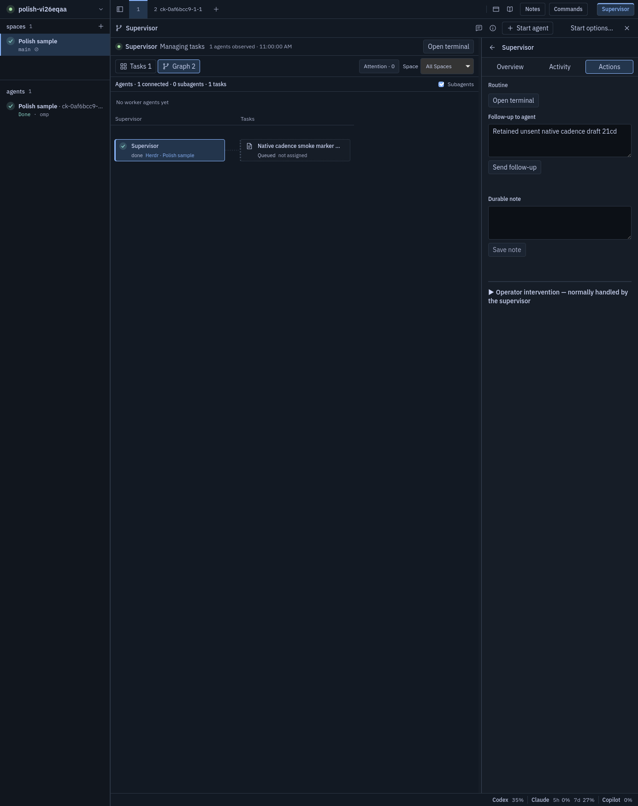

# Actual packaged-native Supervisor cadence evidence

This is retained evidence from Main's already-completed disposable native run, not a new probe or a conceptual/DTO mock. The supplied [summary](native/native-cadence-summary.json) reports the affected native cadence scenario passed and `quiet_ready: true`. Browser consumer acceptance remains separately documented in [BROWSER.md](BROWSER.md). This package does **not** establish CPU performance or independent worker retirement execution.

## Provenance and immutable artifact boundary

- Fixture: `/tmp/cpol-vi26eqaa`, session `polish-vi26eqaa`; real root `0af6bcc9-5ea7-4cfc-aea5-c09f8df793d6`, bound OMP session `01a11594-ce57-7479-aeb1-39979b8cd16b`.
- Actual native process: PID `29597`, start ticks `26525184`, frozen `cockpit-tauri`; origin and location `tauri://localhost`. The native invoke descriptor is nonconfigurable/nonwritable. Initial fixture gateway PID `29419` was ownership-verified and stopped; retained requests/callbacks use `ipc://localhost/orchestration_*`, not a substituted HTTP gateway.
- [Frozen-pair identity](native/frozen-pair-identity.json) retains compilation-source manifest SHA-256 `285754e6e4c78ee09fa8b79a0aff715ebc8fd66d0f3692be82f959af7eb577cd`, host/native/extension identities, build commands and historical qualifications. Its pre-smoke limits are preserved unchanged; the separate native summary and IPC observations supply the mounted-runtime evidence. Later test-only overlays/checks are not represented as this production compilation.

| Frozen component | Recorded SHA-256 |
|---|---|
| Host `cockpit` | `f01745dcb48c105a355e778a73e338a80ad873285bd81065566380bc99273d06` |
| Native `cockpit-tauri` | `151ded8c3749be09a1712dd9a93e8a364344f645a34b032a2d6cbf9056a993e4` |
| OMP orchestration extension | `fd59faa990ef0968d9215b2474d8a6170f05f531b6e14bc54859ccc1274cc3ee` |

The summary's `manifest_identity_matches` records all three matches. Actual embedded assets loaded from the native origin are `assets/index-BKVHZ90g.js` (2,616,370 bytes, SHA-256 `44f40b3f00368f5aa68ef8c042f42ff8ff0e9e9499b2c7562f54862a8049cbac`) and `assets/index-CQkiGs6e.css` (234,606 bytes, SHA-256 `83cefe178197fed46d367c1e9e7e4604e6564b0903a9af6e71a5f372c80d94a0`). Rendering is recorded as default: no exported GDK_GL/WebKit-disable flags or software fallback.

## Actual observations

| Exercised observation | Exact retained evidence |
|---|---|
| Initial actual native Rust IPC snapshot fulfilled at instrumentation `at: 1757`, revision 0, runtime fresh | [native-orchestration-ipc.json](native/native-orchestration-ipc.json) `/initial_orchestration/callbacks/0`; original pointer `/initial_ipc_proof/callbacks/8`, with matching initial request and native ownership/origin guards |
| Runtime-only `working → done` at unchanged durable revision/token, reflected in actual mounted Graph surfaces | [runtime-only-status-transition.json](native/runtime-only-status-transition.json) `/transitions/0..1`: revisions 19 and 23, elapsed 5,021 and 5,010 ms; `/observed_surfaces/0..1` retains nearest before/after UI observations and original indices |
| Same-revision refresh continues, updating runtime observation timestamps | [same-revision-cadence.json](native/same-revision-cadence.json) `/pairs/0..2` and all four `/native_snapshots`: revision 23, unchanged task token, intervals 5,009/5,012/5,013 ms over the recorded 16-second segment |
| Real native UI Answer mutation does not wait for the five-second cadence | [durable-immediate-path.json](native/durable-immediate-path.json): revision-20 mutation fulfilled at 80,326 ms, snapshot at 80,434 ms, delay **108 ms**; [answer-immediate-callbacks.json](native/answer-immediate-callbacks.json) retains the actual callbacks |
| Two actual pending UI surfaces disable controls and display Sending / wait messaging | [pending-action-observability.json](native/pending-action-observability.json) `/surfaces/0..1`. No rejected callback or deliberately forced native failure is claimed |
| Hide/reopen preserves logical Graph view, selected run, both scroll offsets and unsent draft | [hide-reopen-logical-state.json](native/hide-reopen-logical-state.json) `/before`, `/after`, `/logical_state_unchanged`; [raw comparison](native/hide-reopen.json) preserves `unchanged: false`, caused by transient React textarea IDs changing, not draft/view/selection/scroll loss |
| Real question answered and acknowledged; task remains canonical and unchecked | [bound-root-task-question.json](native/bound-root-task-question.json) retains the earlier question state; [final-native-snapshot.json](native/final-native-snapshot.json) revision 23 has ACKed question `fixture-smoke-21cd-confirmation` and Answer `f4ebc4e5-c597-4203-86cb-21b674a32fe8`; `/board/tasks/0/task/checked: false` for task `fd65f0f2-b920-46fd-951e-43ff819e2cd2`. Runtime `done` is not an explicit Result, acceptance or retirement: the root remains `active`, with `result` and `retirement` null |
| Owned cleanup and auth/config identity | Summary `/cleanup`, `/model_cleanup`, `/leftover_owned_running_processes` and [owned identity](native/owned-model-cleanup-identity.json)/[cleanup](native/owned-model-cleanup.json): owned OMP PID 39742 already exited, private compositor exited 0, fixture stop returned 0, no owned processes remaining. Redacted [before](native/auth-config-before-redacted.json)/[after](native/auth-config-after-redacted.json) hashes and mtimes match; OS read-only enforcement was **not** established |

### Actual native appearance

Original image bytes are retained unchanged, 1384×1749 pixels. This is native appearance/draft evidence, **not** a claim of a requested browser CSS viewport, DPR/fence or all-size geometry acceptance. Browser viewport-preserved images remain in the separate browser package.

## Trace retention and limits

[Native manifest](native/evidence-manifest.json) identifies every retained file, original path, byte count and SHA-256. Thirteen focused source JSON files are unchanged, including the frozen-pair identity; three JSON files are bounded projections, and the native image is unchanged. The large original `result.json` stays outside the repository; its source hash and byte count identify the exact read used for projection. No raw terminal frames, unrelated native callbacks, high-volume surface churn, compositor configuration or empty logs are copied.

`native-orchestration-ipc.json` retains all final `orchestration_*` requests/callbacks with original array-index pointers, millisecond timestamps, parsed request bodies, timeout/revision/token fields, native status/identity and bounded canonical task/message/run identities. Non-snapshot callback payloads are unchanged. The current captured trace has 64 snapshot / 59 wait / 3 mutation requests and 64 snapshot / 58 wait / 3 mutation callbacks; all 59 wait requests specify `timeout_ms: 5000`, with zero recorded rejected orchestration callbacks. These are **trace inventory counts**, not throughput/CPU measurements. The wait request/callback count differs by one; no absent callback outcome is inferred. Relative `at` values are copied from instrumentation and are not wall-clock process-CPU measurements.

No new build, test, browser/native action, model burst, provider/Notes/binding operation, credential-content read or large binary rehash was performed to retain this evidence. Failed-native-action behavior was not deliberately exercised. Actual independent retirement/shutdown, process-exit identity, owned terminal/Space closure and preservation, source-built CPU measurements and any final all-checks verdict remain outside this package; synthetic browser retirement DTO states and disposable fixture cleanup do not substitute for those proofs.

## Final delivery boundary: manual-test override

The supervisor's release at inbox sequence 50 cancels the remaining automated test/smoke/benchmark/review loops and the planned CPU quiet-window ABBA comparison; the user will test the final binary manually. The immutable **V3** packaged-native GUI/cadence proof above remains its own artifact-qualified observation, not proof that a later extension/embedded-host generation was run through this GUI scenario.

The later SDK correction handles permanent typed `caller_mismatch` by ending/disposing the revoked observer, not killing native OMP or closing its pane. That scoped branch does not change UI assets or the five-second cadence. No passing final revocation or owner-recovery runtime case is claimed here; the previously retained long-running recovery failure is not superseded by source inspection or build success. Observed CPU values do not establish a causal improvement, and the unrun ABBA comparison is explicitly waived rather than represented as passed.
