# 01 · Sidebar polish

Scope: session header, `spaces` section (space rows, worktree children, tree connectors, chevrons, add button), `agents` section (two-line rows), the sidebar's top band shared with the tab bar, and the sidebar collapse toggle. Herdr ordering, hierarchy, rollup and branch line are unchanged.

Mock (open in a browser, no build; it renders the same data through a "before" and an "after" renderer, 1x and 2x, every status state side by side): [`mocks/sidebar/before-after.html`](mocks/sidebar/before-after.html). **The mock and this spec agree; every number below is what the mock draws.** The 2x panels are CSS magnifications of 1x, not HiDPI renders.

Sources read: `research/ui-design-direction.md`, `research/ui-implementation-constraints.md`, `DECISIONS.md`, `CONTEXT.md` §5, `docs/keyboard-shortcuts.md`, `skill://cockpit-ui-parity`, `planning/stability-and-gitlab-2026-09-20/runs/run-20260920-a3e9b950/SIDEBAR-herdr-parity.md` (why rows look as they do), `planning/agent-control-plane-2026-09-12/tasks/03-sidebar.md` (its last acceptance line, "delete the superseded rules rather than adding another overriding CSS layer", was not followed). Line numbers are from `src/app/styles.css` (tag `DD81`) and `src/app/App.tsx` (tag `9988`); re-grep before editing.

Limits of this audit: no shell, so no fixture was started and nothing was measured in a live DOM. Geometry comes from the CSS cascade; visual observations come from the supplied screenshot (2879×1852; coordinates below are in its 1568-px display size, ≈0.9 display px per CSS px). The "before" panel is reconstructed from the final cascade, not traced from the screenshot. Section 9 lists the measurements the implementer must take.

---

## 1. Goal & users

One user: a developer supervising several Herdr Spaces and agents from one window. The sidebar answers *where am I* (session, Space) and *which agent needs me* (agents list). Polish means: one alignment grid; status marks big and colourful enough to be seen at a glance instead of "lost"; one row vocabulary shared by Spaces and agents; names that survive 224 px; clear hierarchy between a Space and its worktrees; states that never move a pixel.

## 2. Resolved decisions (from the user and Main; not open)

1. **Agent rows keep two lines.** Polish alignment, spacing and the sublabel; do not collapse to one line.
2. **Agents stay directly under Spaces** (as today). No pinned-bottom / 45 % cap. A consistent gap surrounds the divider instead (§4.2). No change to how the sidebar/main seam is drawn.
3. **Section labels stay Herdr lowercase** (`spaces`, `agents`). No uppercase/tracking.
4. **Sidebar toggle stays in the tab bar** (state-aware icon, shortcut in `title`).
5. **Shared icon scale**: 18 px status badge (Space and agent rows, header mark), 16 px icons (child-row badges, chevron/`+` icons, Library tree, top-bar icon buttons), stroke 1.5, state tint from existing state tokens. Agreed with `LibraryPolish`, which reuses it.
6. **Square rows.** `research/ui-design-direction.md:77` says "Use square corners inside the workbench. A 4 px radius is reserved for menus, tooltips, buttons, and inline notices", and `:284-286` rejects a card per Space/agent. So rows are **full-bleed and square**, with a 3 px accent pill marking selection. Buttons inside rows (chevron, `+`, session button) keep `--radius-control`. No `DECISIONS.md` deviation is needed.

## 3. Evidence: current state

### 3.1 Behaviour to preserve

| Behaviour | Where |
| --- | --- |
| Repository grouping: parent + ≥2 members, worktrees as children; collapsed parent shows the most urgent hidden worktree state | `projectSpaceTree` `App.tsx:135-182`, `spaceRowStatus` `:123-128` |
| Agent order blocked > done > working > idle > unknown, then `state_change_seq` desc | `orderAgentsByHerdrPriority` `App.tsx:98-106` |
| Branch as second line except linked worktrees; `↑n ↓n` after it | `App.tsx:412`, `:441`; rationale in `SIDEBAR-herdr-parity.md` |
| Trailing chevron on repository parents only (Herdr parity) | `App.tsx:443-445`, `.space-chevron` `styles.css:2625-2633` |
| Lowercase section labels (Herdr) | `styles.css:555-563` |
| Two-line agent rows, Space in bold and tab muted, agent below | `App.tsx:457`, `SIDEBAR-herdr-parity.md:26` |
| Width 224–360 px persisted; collapse persisted; drawer ≤800 px | `App.tsx:847-851`, `styles.css:2278-2314` |
| Tab-bar toggle is the only collapse control and survives collapse | `TabStrip` `App.tsx:480` |

### 3.2 Findings

| # | Finding | Evidence |
| --- | --- | --- |
| F1 | **Three left edges.** Header dot, section label and status glyph do not align. | Header `padding: 0 12px` (`:177`); heading `padding: 0 13px` (`:1420`); row content starts at 2 px border + 12 px inset = 14 (`:1428`, `:2596`). Screenshot: dot centre ≈ x23, "spaces" left ≈ x20, glyph centre ≈ x27. |
| F2 | **Status marks are small and lost.** They are text characters (`× ◐ ✓ ○ ·`) at 13 px in a 14 px box set in `--font-mono` (`:2327`, `:2609`), whose first families lack most of them, so size and weight come from fallback fonts. `·` (no agent) is about 3 px and `○` about 9 px with a hairline stroke. That is the "o vs ·" look and the user's "dots are too small and feel lost". | `stateGlyph` `App.tsx:69-77`; screenshot rows `system`/`main` (○) vs `lilygo-t3` and all worktrees (·). |
| F3 | **`·` is correct but unexplained** (it means "no agent in this Space") and sits beside `○` (idle agent). Space glyphs have no accessible state: the glyph is `aria-hidden` and `title` is on an aria-hidden node. | `App.tsx:440`; `.space-tree-row .resource-icon { color: text-muted }` `:2328`. |
| F4 | **Flat "terminal dump" density.** Rows are full-bleed with no gap, 30–32 px (Space) and 46 px (agent), labels 13 px on 16 px lines, no hierarchy cue between a Space (600) and its worktree (400) beyond weight, and selection is a 2 px border-left. | `:1427`, `:2595`, `:2613-2614`, `:602-605`. |
| F5 | **Truncated worktree names.** Child label starts at x≈70 (2 + 46 connector + 14 + 8) with ≈150 px of room. `worktreeLabel` strips `worktree/` only from the *branch*; when the branch is missing it falls back to the raw Herdr label, so `worktree-brave-forest-7518` keeps its prefix and the distinguishing part is cut. A branch like `cockpit/cockpit/SCRUM-…` repeats the parent's name. | `App.tsx:130-133`; `.space-connector` width `:2587`; screenshot y=148, 204, 231. Test data: `App.test.ts:192-201`. |
| F6 | **Connector lines** use `--text-muted` (`:1492`), brighter than any border in the sidebar; the trunk sits at x=37 (under the parent's *label*, not its glyph); child indent is 34 px of a 224 px rail; trunk/elbow are patched by three override layers (`:1498-1521`, `:2417-2418`, `:2634-2638`). | Screenshot x43-55, y133-148. |
| F7 | **Chevron** is a bare 14 px glyph in a 26×30 box, no hover fill, its own tab stop. | `:2625-2633`, `:2340`. |
| F8 | **Selection**: `border-left: 2px var(--accent)` + `--surface-selected` in both lists (consistent), but (a) selected child text goes 600 weight, changing text width and truncation (`:2613`); (b) `.resource-row.is-selected` also sets `--focus-strong` (`:1572`), a second definition; (c) hover on a selected row shows no change. A Space and its focused agent highlight together (screenshot y107-133 and y330-369); that mirrors one Herdr focus and stays. | `:602-605`, `:637-640`, `:1140-1143`, `:1571-1574`, `:2613`. |
| F9 | **Agent sublabel** repeats `omp` on every row and is the only content of line two. Rows are 46 px (7 + 16 + 2 + 14 + 7), pitch 39 vs Space 28 on screen. | `.agent-name` `:2644`, `.agent-details` gap `:2640`, `App.tsx:457`. |
| F10 | **Vertical rhythm** is set by six layers: single-line Space rows are 32 px (`:1427`) while their button is 30 px (`:2595`); headings 38 px; first row starts 85 px from the top (41 + 6 section padding + 38). Agents section has `margin-top: 26px` **above** its `border-top`, so the divider floats 26 px under the last Space and 19 px above the heading text (`:1671-1673`). | Screenshot: last Space "main" y=259, "agents" y=313. |
| F11 | **Header**: `● default   Session ⌄`. "Session" is a static caption whose slot doubles as the sync word when not live (`App.tsx:884-889`). The dot is `●` in `#779c91` (`:2343`, overrides `--idle`), colour-only. The selector has `padding: 0` (`:188`, wins over `:1387`), so its hover fill touches the text. | Screenshot (23,22)-(182,22). |
| F12 | **Top band**: header and tab bar are both 41 px with a 1 px bottom border, but backgrounds are `--sidebar-bg` `#11161e` vs a literal `#121923` repeated at `:766`, `:1713`, `:2346`, `:2347`. | |
| F13 | **Seam**: `.sidebar { border-right: 1px }` (`:138`) plus `.sidebar-resizer` `background: var(--border)`, `margin-left: -2px`, `flex: 0 0 1px` (`:237-246`, `:2401`, `:2415`). The screenshot's seam at x≈203 looks heavier than other 1-px borders. [INFERENCE: not measured.] Out of scope by decision 2; §9 asks the implementer to measure and report. | |
| F14 | **Sidebar toggle** (screenshot (222,22)): 36 px button with 4 px margins, class `.tab-sidebar-toggle`, reused by the browser button (`App.tsx:510`), so restyling one restyles both. Same icon open and closed; only `aria-label`, no `title`, no shortcut hint. | `:2344-2345`, `App.tsx:480`. |
| F15 | **Focus and busy**: rows are `<button disabled={busy}>` (`App.tsx:439`, `:444`). A disabled button loses DOM focus, so every mutation drops keyboard focus from the sidebar. `LibraryItemHeader.tsx:165` already uses `aria-disabled` for this. Global focus ring is `outline-offset: 1px` (`:110-117`), clipped by the lists' `overflow: auto`. | |
| F16 | **No sidebar keyboard model**: every row and chevron is its own tab stop; no arrows, no roving focus. `ui-design-direction.md:98-101` asks for a true tree interaction model. | `Spaces`/`Agents` have no `onKeyDown`. |
| F17 | **Empty copy**: `No spaces` (direction: `No Spaces in this session`, `:213`) and `Inbox empty` (direction and `DECISIONS.md:69` reject an inbox). No loading skeleton; no stale/disconnected treatment beyond the sync word. | `App.tsx:404`, `:452`; `ui-design-direction.md:199-205`, `:215`. |
| F18 | **Mutation error** (`dragMessage`) renders between the heading and the list, not under the row it concerns (`App.tsx:403`; direction `:101`, `:232`). | |
| F19 | **Cascade debt.** Same selectors defined up to six times: `.agent-row` (`:579`, `:628`, `:1682`, `:2409`, `:2592`, `:2639`), `.resource-icon` (`:279`, `:1439`, `:2328`, `:2599`), `.connection-mark` (`:452`, `:1401`, `:2342`, `:2343`), `.sidebar-section-heading` (`:543`, `:1417`), `.spaces-section` (`:532`, `:1409`), `.agents-section` (`:538`, `:1666`), `.space-chevron` (`:1463`, `:2625`), `.sidebar` (`:132`, `:1380`, `:2581`). Dead (no user in `src/app/**/*.tsx`): `.sidebar.is-collapsed*` (`:142-159`; `sidebarClass` is the constant `"sidebar"`, `App.tsx:1603`), `.space-row`, `.sidebar-collapse`, `.agent-context`, `.agent-status`, `.resource-meta`, `.session-selector select`, `.space-branch .ui-icon`. Drawer width is set twice, 360 (`:2291`) then 300 (`:2432`, wins). Hard-coded mono families at `:285`, `:614`, `:663`, `:1444`, `:1543`, `:1552` bypass `--font-mono`, so a row mixes two monospace fonts. | |

Already good, stays: 41 px header/tab-bar alignment, Herdr grouping/order/rollup, two independently scrolling lists, `↑↓` upstream label, persisted width/collapse, `focusSpace`/`focusAgent` logic.

## 4. Flow

```mermaid
stateDiagram-v2
  [*] --> Rest
  Rest --> Hover: pointer enters
  Hover --> Rest: pointer leaves
  Hover --> Pressed: pointerdown
  Rest --> Focused: Tab / arrow key (DOM focus only)
  Focused --> Pending: Enter / Space
  Pressed --> Pending: click
  Pending --> Selected: Herdr ack or event
  Pending --> Failed: Herdr rejects
  Failed --> Rest: note under the row; next action or Esc clears
  Selected --> Rest: another resource acknowledged
```



Every state is drawn by fill, pill colour or outline. Geometry is identical in all of them.

## 5. Target design

### 5.1 Grid and tokens

New file `src/app/sidebar.css` (imported from `styles.css` like `viewer.css`). Custom properties on `.sidebar`:

```css
--sb-edge: 14px;   /* header mark, section label, parent/top-level badge: all start here */
--sb-gap: 8px;
--sb-badge: 18px;  /* = --icon-badge */
--sb-label-x: 40px;/* edge 14 + badge 18 + gap 8 */
--sb-row: 32px;    /* single line */
--sb-row-2: 48px;  /* 7 + 18 (name line) + 2 + 14 (sub line) + 7 */
--sb-row-gap: 2px; /* margin-bottom on every row */
--sb-heading: 32px;
--sb-trunk-x: 23px;/* edge 14 + badge 18 / 2: under the parent badge centre */
--sb-conn: 34px;   /* child badge starts here; child label at 34 + 16 + 8 = 58px */
```

Tokens added to `styles.css :root` (four, all shared with other slices):

| Token | Value | Why |
| --- | --- | --- |
| `--chrome-bg` | `#121923` | The literal the tab bar already repeats at `:766`, `:1713`, `:2346`, `:2347`; the sidebar header now shares the band. |
| `--icon-size` | `16px` | The shared 16 px icon size (child badge, chevron/`+`/toggle icons, top-bar buttons, Library tree). Replaces per-component 13/14/15/16 px overrides. |
| `--icon-badge` | `18px` | The shared status-badge size. Agreed with `LibraryPolish` so Library pills and sidebar rows use the same shapes. |
| `--icon-mark` | `14px` | Chevrons (row chevron, header caret) and Library pill glyphs. Proposed by `LibraryPolish`; one shared set with `--icon-size` and `--icon-badge`. |

Everything else uses existing tokens: `--sidebar-bg`, `--surface-hover`, `--surface-selected`, `--surface-raised`, `--border`, `--border-strong`, `--accent`, `--focus-strong`, `--text-primary/secondary/muted`, `--blocked/--working/--done/--idle/--warning`, `--radius-control`, `--radius-small`, `--font-size-2xs/xs/sm`, `--font-mono`. Status tint reuses the state tokens: badge disc = `currentColor` at 16 % alpha (idle 10 %), so no new colours.

Typography: sans for labels; `--font-mono` for the second line of a row (branch line, agent state·kind) at 11/14; replace every hard-coded family.

Icon stroke is 1.5 in each symbol's own viewBox: `UiIcon` icons use a 24-box (`UiIcon.tsx:27`, `strokeWidth` 1.6 today → 1.5, one-line change, agreed with `LibraryPolish`), so they render ≈1 px at 16 px; badge shapes use an 18-box and render 1.5 px at 18 px. Both read as one weight beside 13 px text; check at 2x.

```text
x:   0 3   14        32 8 40                                 232 240
     |pill|[badge 18]|gap|label ......................... | 8 |     (top-level / parent row, full bleed)
     0                34 [badge16] 8 58 .................        (child row; trunk at x=23)
```

### 5.2 Sidebar layout

```text
┌ aside 224..360 (default 240) ────────────┐
│ header 41 (incl. 1px border) --chrome-bg │
│ spaces  7                          [+]   │ heading 32
│ list (scrolls, padding-bottom 8)         │ sec1: flex 0 1 auto; min-height 134
│  rows: 32 / 48, 2px apart, full bleed    │
├──────────────────────────────────────────┤ border-top 1px --border (8px of list padding above)
│                                          │ sec2 padding-top 8
│ agents  5                                │ heading 32
│ list (scrolls)                           │ sec2: flex 1 1 0; min-height 137 (8 + 32 + 2 rows of 48 + 1 border)
└──────────────────────────────────────────┘
```

* Agents sit **directly under Spaces**, as today. Section gap: 8 px of list padding above the divider, 8 px of `padding-top` below it, a 1 px `--border` line between; the 26 px margin is deleted (F10). Spaces content-sized; agents take the remainder and scroll their own list; when both overflow, Spaces shrinks to its 134 px minimum (heading + 3 rows) and agents keep 137 px.
* Each list scrolls itself; `scrollbar-width: thin; scrollbar-color: var(--border-strong) transparent`. No sticky heading is needed (headings sit outside the scroll area).
* Default width becomes **240** (`SIDEBAR_DEFAULT_WIDTH`, `App.tsx:849`; the CSS `224px` fallbacks at `:127`, `:1376`, `:2414` become `240px`). Minimum stays 224, maximum 360. Widths a user already persisted are kept; the resizer's Home key restores 240. The extra 16 px pays for the 18 px badges.
* The sidebar/main seam is untouched (F13).

### 5.3 Session header

| Property | Value |
| --- | --- |
| Band | 41 px total (40 + 1 border), `--chrome-bg`, `padding: 0 6px`; identical band to `.tab-toolbar` |
| Selector button | height 30, `padding: 0 8px`, `gap: 8px`, radius `--radius-control` (it is a button). Mark therefore starts at x=14 and the name at x=40, on the same columns as the rows. Hover fill has 8 px of air around the text. |
| Content | mark (18 px badge) · name · state chip (only when not live) · caret (`down`, `--icon-mark` 14 px, `--text-muted`, `margin-left: auto`) |
| Name | `--font-size-sm` (14) / 20, weight 600, `--text-primary`, single-line ellipsis |
| Mark | live = tinted disc with solid centre dot, `--idle`; resyncing (`sync=loading` with a snapshot) = working badge in `--warning`; stale = idle ring badge in `--warning`; disconnected = blocked ✕ badge in `--blocked`. Same badge family as the rows. |
| State chip | only when `sync !== "live"`: `Resyncing` / `Stale` / `Offline` (`Connecting` before the first snapshot); 11 px / 16, weight 400, 1 px outline in the mark colour, radius `--radius-small`, `padding: 0 5px`; `role="status"`. Replaces the static `Session` caption. |
| Hover / focus | hover `--surface-hover`; `focus-visible` 2 px `--focus-strong` ring, `outline-offset: -2px` |
| Tooltip / name | `title`: `Switch session (Ctrl+B g)`; accessible name `Switch session, current <name>, <connected \| resyncing \| stale \| disconnected>` |
| No session | name `No session`, muted ring mark, no chip |
| Drawer (≤800 px) | the existing 28 px `.sidebar-close` sits at the right |

Removed: `Session` caption, `#779c91`, the three `.connection-mark` overrides.

### 5.4 Section heading

Height 32 (was 38), `padding: 0 8px 0 14px`, `gap: 8px`, centred. Label: 13 px / 16, weight 500, `--text-secondary`, `text-transform: lowercase` (unchanged Herdr look; `<h2>` text stays `Spaces`/`Agents` for screen readers). Count: 11 px / 16, `--text-muted`, `font-variant-numeric: tabular-nums`. Spaces count stays the total Space count including hidden worktrees.

Add button (spaces only): 24×24, `--radius-control`, icon 16 px, `--text-secondary`; hover `--surface-hover` + `--text-primary`; inset focus ring; its right edge is 8 px from the sidebar edge, aligned with the chevrons. `title="Set up a task Space (Ctrl+B Shift+S)"`; `aria-label` unchanged; keeps `disabled` semantics (not a list row).

### 5.5 Space row anatomy

| Part | Spec |
| --- | --- |
| Row box | `position: relative; display: flex; align-items: flex-start; min-height: 32px` (48 with a branch line); `margin-bottom: 2px`; full bleed; `border-radius: 0`; no border |
| Selection pill | `::before`: `left: 0; top: 8px; bottom: 8px; width: 3px; border-radius: var(--radius-small); background: var(--accent)`. A mark, not a region. (Drop indicators must not use `::before`; see below.) |
| Select button | `flex: 1; min-width: 0; padding: 7px 8px 7px 14px; gap: 8px; align-items: flex-start`; child rows `padding-left: 0` (the connector supplies the offset) |
| Badge | 18×18 (16×16 on children, `margin-top: 1px` so both centre on the 18 px name line); see §5.6 |
| Label | 13 px (`--font-size-xs`) / 18, single-line ellipsis. Weight by hierarchy only: top-level and parent 600, child 400; **never changes with selection** (F8a). Colour: top-level/parent `--text-primary`; child `--text-secondary`; selected child `--text-primary`. |
| Branch line (top-level/parent with a branch; never linked worktrees) | second line, gap 2, 11 / 14, `--font-mono`, `--text-muted` (`--text-secondary` when selected); branch name ellipsizes; `↑n ↓n` after it in `--idle`, `flex: none` (Herdr parity) |
| Chevron (parents) | 24×24, `margin: 4px 8px 0 0`, `--radius-control`, icon `down`/`right` at `--icon-mark` (14 px), `--text-muted`; hover fill `--border-strong` + `--text-primary`; centred on the name line. Keeps `aria-expanded`, `aria-label="Collapse\|Expand <name>"`; a collapsed parent hiding an urgent worktree: `Expand <name> (worktree blocked)`. |
| Right edge | 8 px on every row (select padding-right, or chevron margin-right) |
| Trailing slot | none; pending is the pill, not a spinner |

Hierarchy cue between Space and worktree: parent 18 px badge + 600 label at x=14/40; child 16 px badge + 400 secondary-colour label at x=34/58 hanging from the trunk. Three signals (size, weight, colour) plus the connector.

Row states (all geometry-neutral; mock "row states"):

| State | Fill | Pill | Other |
| --- | --- | --- | --- |
| Rest | none | none | |
| Hover | `--surface-hover` (≤80 ms) | none | selected row: no change |
| Pressed | `--surface-selected` | none | |
| Focus-visible | (unchanged) | (unchanged) | 2 px `--focus-strong` ring, `outline-offset: -2px`, on the select button |
| Pending (target of `focusPending`) | `--surface-hover` | `--text-muted` | `aria-busy="true"`, cursor `progress`; not `--accent`, Herdr has not confirmed |
| Selected (confirmed) | `--surface-selected` | `--accent` | `aria-current="true"` |
| Busy (mutation in flight) | (unchanged) | (unchanged) | `aria-disabled="true"`, clicks ignored, **focus kept** (F15) |
| Drop target | none | none | 2 px `--accent` line on the top/bottom edge drawn as `box-shadow: inset 0 2px 0` / `inset 0 -2px 0`, replacing the 1 px outline and its pseudo-elements (`:1576-1598`) |
| Rename | label replaced by `.inline-rename` | | unchanged behaviour |

Badge colour follows state, never selection (drop `.is-selected .resource-icon { color: accent }`, `:2329`).

### 5.6 Status badges (Spaces, agents, header mark)

Replace `stateGlyph()` text with an inline-SVG `StateGlyph` component: an 18×18 badge (drawn at 16×16 by scaling on child rows) made of a disc tinted with the state colour plus one distinct shape, stroke 1.5, in that colour. Shapes match Herdr's distinct symbols so colour is never the only cue.

| State | Shape (inside tinted disc) | Colour | Disc alpha | Before |
| --- | --- | --- | --- | --- |
| blocked | ✕ | `--blocked` | 16 % | `×` |
| done | check | `--done` | 16 % | `✓` |
| working | ring, left half filled | `--working` | 16 % | `◐` |
| idle | ring | `--idle` | 10 % | `○` |
| unknown / Space with no agent | 5 px dot, **no disc**, 75 % alpha | `--text-muted` | none | `·` |

The idle disc is deliberately quieter and the no-agent mark quietest: absence recedes, attention pops. The SVG source is in the mock's `<symbol>` defs (`s-blocked`, `s-done`, `s-working`, `s-idle`, `s-unknown`, `s-live`). Each badge has a word in the row's `title` and accessible name (`Idle`, `Working`, …); agent rows also print it (§5.8). Library keeps its own text glyphs (`libraryState.ts:228`) until `LibraryPolish` adopts these shapes for its pills; do not touch them in this slice.

### 5.7 Tree connectors and worktree names

Connector (child rows only), width 34:

* Trunk: 1 px `--border-strong` at `left: 23px` (under the parent badge centre), extending 2 px past the row top and bottom so 2 px row gaps stay continuous.
* Elbow: 1 px, 8 px long at `top: 16px` (centre of the 18 px name line + 7 px padding − 0), then a 2 px gap to the 16 px child badge at x=34.
* Last child: the trunk stops at y=17 and turns into the elbow with a rounded corner, `border-bottom-left-radius: 6px`, 9 px wide, so the last child reads as a closed branch.
* Label at x=58 (before: 70). Room at 224 px: 157 px; at 240: 173 px (before ≈150).
* The parent's branch line (starts x=40) does not touch the trunk (x=23).

Name derivation, one pure exported function `spaceDisplayName(space)` used for **child** rows only (top-level and parent rows show Herdr's Space label untouched; the user names those):

1. Source: `git.branch`, else the Herdr `label`, else the basename of `git.checkout_path`.
2. Strip a leading `worktree/` or `worktree-`.
3. Drop leading path segments equal (case-insensitive) to the repository name (`git.repository`); if that empties the name keep the last segment.
4. Keep everything else, including the 4-hex Herdr suffix (`-7518`), which is identity.

| Raw | Repository | Displayed |
| --- | --- | --- |
| `worktree/brave-forest-7518` (branch) | lilygo | `brave-forest-7518` |
| `worktree-brave-forest-7518` (label, branch absent) | lilygo | `brave-forest-7518` |
| `cockpit/cockpit/SCRUM-142-inline-browser-pointer` | cockpit | `SCRUM-142-inline-browser-pointer` |
| `feature/SCRUM-142-x` | cockpit | `feature/SCRUM-142-x` (unchanged) |

Overflow after that: end ellipsis (CSS only), independent of selection and hover. The `title` carries three lines: full raw name; `branch · ↑n ↓n vs upstream`; `checkout_path`. The app has no tooltip component (grep of `styles.css`), so native `title` is used like every other control.

### 5.8 Agent row anatomy (two lines)

```text
[badge 18] 8 [ cockpit · main ..................... ]      line 1: 13/18  space 600 --text-primary, " · tab" 400 --text-muted
           8 [ Blocked · omp ......................... ]      line 2: 11/14 --font-mono
```

Row 48 px = 7 + 18 + 2 + 14 + 7, padding `7px 8px 7px 14px`, same columns, states, pill and fill as Space rows.

* Line 1 ellipsizes as one string, tab first to clip.
* **Sublabel treatment (F9):** line 2 is `State · agent`, so it now carries information that differs per row (the state word) instead of a repeated `omp`. The state word is `--blocked` 600 for Blocked, `--done` 600 for Done, `--text-muted` 400 for Working/Idle/Unknown; the agent name is `--text-muted`, `--font-mono`, ellipsizing; the state word never truncates (`flex: none`). `--text-secondary` when the row is selected.
* Tooltip and accessible name stay `Space · tab · agent name · status` (`App.tsx:457`); key stays `${pane_id}:${agent.name}`.

### 5.9 Sidebar collapse toggle

Stays in the tab bar as the shared `.tab-icon-button`:

| Property | Value |
| --- | --- |
| Box | 28×28, `margin: 6px` (slot 40 in a 41 px bar), radius `--radius-control`, icon `--icon-size` (16), `--text-secondary`; hover `--surface-hover` + `--text-primary` |
| Position | identical open and closed (it lives in the main area) |
| Icon | `sidebar-open` (outline with three ticks in the left rail) when open, `sidebar` when closed. New `UiIcon.tsx` path: `sidebar-open: "M9 4v16M3 4h18v16H3ZM5.5 8.5h1.5M5.5 12h1.5M5.5 15.5h1.5"` |
| Semantics | `aria-expanded`, `aria-controls="cockpit-sidebar"` (existing); `title` = `Hide sidebar (Ctrl+B b)` / `Show sidebar (Ctrl+B b)` |
| Shared class | rename `.tab-sidebar-toggle` → `.tab-icon-button` for the toggle, the browser button (`App.tsx:510`) and the Library button `LibraryPolish` adds. `LibraryPolish` adds `.tab-icon-button[aria-pressed="true"]`; this slice leaves that selector free. Order in `.tab-strip-actions`: browser, Library, Commands. |
| No Space selected | the absolute `.drawer-toggle` "Sidebar" button (`App.tsx:1624`) is unchanged and out of scope |

### 5.10 States

| Situation | Behaviour |
| --- | --- |
| Loading, no snapshot yet | Spaces: six neutral 32 px skeleton rows (18 px `--surface-raised` circle + bar of 33–62 % width), no shimmer; agents: two. Header chip `Connecting`. Frame and headings stay. |
| Resyncing / stale / disconnected | Rows stay as last known, not dimmed, none removed. Header mark + chip (§5.3). |
| No Spaces | `No Spaces in this session`, 12 px `--text-muted`, `padding: 2px 14px 8px`. `+` stays. |
| No session | header `No session`; lists `No session selected` in the same style; `+` disabled |
| No agents | `No agents detected` (replaces `Inbox empty`) |
| Many rows | each list scrolls; headings stay fixed |
| Long names | end ellipsis + tooltip; state word never truncates |
| Row mutation error (drag reorder, rename rejected) | note directly under the affected row: `role="status"`, `border-left: 2px solid --blocked`, `padding: 6px 12px 6px 40px`, 11/14 `--text-secondary`, e.g. `Move was not applied. Herdr kept the Space order.` (direction copy pattern, `ui-design-direction.md:238`). Cleared by the next action, or Esc in the list. |
| Drawer (≤800 px) | one rule, width `min(300px, calc(100vw - 48px))`; selecting closes it; Esc restores prior focus (existing) |

At 224 px the label column is 184 px (top-level, no chevron) / 157 px (child); no responsive hiding is needed.

## 6. Interaction & keyboard

Sidebar-local keys apply only while DOM focus is inside a list. They move DOM focus and never send a Herdr request (`ui-implementation-constraints.md:34`); activation sends the usual focus request.

| Key | Effect |
| --- | --- |
| Tab | Four stops: session button, `+`, Spaces list (roving), agents list (roving). Roving target is the selected row, else the first row. |
| ↓ / ↑, Home / End | next/previous, first/last visible row in the list |
| → | collapsed parent: expand; expanded parent: focus first child |
| ← | expanded parent: collapse; child: focus its parent |
| Enter / Space | select row (Herdr focus request, as click); Space does not scroll |
| Menu key / Shift+F10 | context menu at the row (as right click) |
| Esc | clear a row error note; otherwise return DOM focus to the previously focused region or the selected tab button. Never a Herdr request. |

Global chords, all after `Ctrl+B`, chosen by `KeyboardShortcuts` (`02-keyboard-shortcuts.md`): `b` toggle sidebar, `w` focus Spaces list, `a` focus agents list, `g` switch session, `Shift+S` set up a task Space. This spec consumes them only for tooltips and focus targets. Double-click rename and drag reorder are unchanged; keyboard reorder is not designed here. Chevron `tabIndex=-1` once roving lands. Pointer/keyboard parity: chevron click = ←/→; row click = Enter; right-click = Menu key.

## 7. Accessibility

* Rows stay `<button>` in a labelled group; a full ARIA `tree` is not adopted (rows are draggable, hold an inline rename input and a second button). `aria-current="true"` on the selected row; `aria-expanded` on the chevron; `aria-busy` on the pending row.
* Space rows get an accessible name `<display name>, <state word>[, branch <b>[, n ahead, m behind]]` (state is missing today, F3). Agent rows keep `Space, tab, agent, status`.
* `aria-disabled` replaces `disabled` on rows while busy (focus survives); `+` keeps `disabled`.
* Focus ring 2 px `--focus-strong`, inset so the list's `overflow` cannot clip it. Contrast of the tokens on `--surface-selected`/`--surface-hover` was **not measured** here; the implementer verifies text and non-text contrast (≥4.5:1 text, ≥3:1 badges and ring) in the browser and reports failures.
* Status is never colour only: five distinct shapes plus the state word in the name, and printed on every agent row. Header state has shape + chip word.
* `.sr-only` lives in `context.css:226`; move it to `styles.css` so the sidebar does not depend on the Context stylesheet.
* Motion: no animation of its own; the 120 ms drawer slide is already covered by the global reduced-motion rule (`styles.css:2316-2324`).
* Order: header → `+` → Spaces → agents → main.

## 8. Options considered

| Choice | Options | Recommendation and trade-off |
| --- | --- | --- |
| **Status mark** (F2) | (a) 14 px hairline SVG, same as the text shapes; (b) 16 px solid-filled shapes; (c) 18 px tinted disc + shape | **(c).** Reads at a glance, stays distinguishable in monochrome by shape, and idle/no-agent can be quieter by dropping alpha. (a) is only a redraw of the "lost" problem; (b) makes every idle Space shout. Cost of (c): 4 px more label column, offset by the 240 px default. |
| **Row shape** | inset rows with `--radius-control` (mock's first draft); full-bleed square rows + pill | **Full-bleed square + pill.** `ui-design-direction.md:77` reserves radius for buttons/menus/tooltips/notices and `:284-286` rejects cards per Space. Inset rounded rows would need a `DECISIONS.md` deviation. Cost: hover/selected fills touch the divider, mitigated by the pill and 2 px row gap. |
| **Worktree names** (F5) | (1) derived shorter name + ellipsis + tooltip; (2) two-line clamp; (3) JS middle-ellipsis; (4) hover card | **1.** Cheap and deterministic. 2 makes row height data-dependent; 3 needs a ResizeObserver per row; 4 adds an overlay component. Names differing only at the end still clip; tooltip covers it and the rail widens to 360. |
| **Agent sublabel** (F9) | keep `omp`; `State · agent`; state only | **`State · agent`.** Keeps the two-line Herdr shape and the agent kind, and line two now varies. State-only would drop kind information the user did not ask to remove. |
| **Tree connector colour/shape** | `--text-muted` square; `--border-strong` with rounded last elbow | **`--border-strong`, rounded last elbow.** Quieter than the labels, closes the group visually. |
| **Chevron side** | trailing (Herdr parity); leading | **Trailing.** Labels stay on one column across rows. |
| **Toggle location** | in the tab bar; in the sidebar header + reveal button | **Tab bar** (decided): one fixed position; cost: visually separated from what it hides, mitigated by open/closed icon and tooltip. |
| **Tree semantics** | buttons + roving focus; ARIA `tree` | **Buttons + roving focus** for now. |
| **Pending marker** | trailing spinner; neutral pill | **Neutral pill.** No slot, no motion, no shift; confirmation upgrades it to `--accent`. |

## 9. Implementation steps (in order)

1. **CSS consolidation with no visual change first.** Create `src/app/sidebar.css`, `@import` it from `styles.css`. Move the *final computed* sidebar rules into it, then delete the superseded layers from `styles.css`: `.sidebar*` (`:132-159`, `:1380-1382`, `:2581-2588`), `.session-*`/`.connection-mark` (`:161-214`, `:299-316`, `:452-459`, `:1384-1407`, `:2341-2343`), sections and headings (`:520-569`, `:1409-1424`), rows and agents (`:571-676`, `:1426-1574`, `:1666-1700`, `:2327-2340`, `:2409`, `:2589-2644`), drawer/resizer rules touching the sidebar (`:2278-2314`, `:2401-2418`, `:2431-2433`), and the dead classes in F19. Confirm by `grep` over `src` that `.resource-row`, `.resource-select`, `.resource-menu`, `.create-menu` have no non-sidebar user before deleting them. Replace hard-coded mono families with `--font-mono`.
2. **Tokens.** Add `--chrome-bg`, `--icon-size`, `--icon-badge`, `--icon-mark` to `:root`; replace the four `#121923` literals; `UiIcon` `strokeWidth` 1.6 → 1.5.
3. **Extract components.** Move `Spaces`, `Agents`, `SidebarHeader` and their pure helpers (`projectSpaceTree`, `spaceRowStatus`, `spaceStatus`, `orderAgentsByHerdrPriority`, `spaceDropBeforeId`) from `App.tsx` into `src/app/sidebar/` (`SidebarHeader.tsx`, `Spaces.tsx`, `Agents.tsx`, `StateGlyph.tsx`, `spaceTree.ts`). Update imports in `src/app/App.test.ts:1-20` and `App.integration.test.tsx`. Pure move.
4. **`StateGlyph` + `spaceStatus`.** Return `{ shape, className, word }` instead of a text glyph; render the SVGs of §5.6 at `--icon-badge` (child rows `--icon-size`). Update `App.test.ts:252-258` to assert shape names, not characters.
5. **`spaceDisplayName`** (§5.7) in `spaceTree.ts`, used by `projectSpaceTree` for `kind: "child"`; extend the tree test at `App.test.ts:191-203` with the table rows; three-line tooltip.
6. **Header** (`SidebarHeader.tsx`): mark, name, chip, caret per §5.3; remove `Session`; title with shortcut.
7. **Layout and headings** (`sidebar.css`, section markup): §5.2 and §5.4; agents directly under Spaces with the 8 px + 1 px + 8 px gap; default width 240 (`App.tsx:849`, CSS fallbacks).
8. **Space rows** (`Spaces.tsx`): §5.5 anatomy, connector geometry, chevron button, `aria-disabled` instead of `disabled`, `aria-current`, `aria-busy`, accessible name with state; prop `pendingSpaceId` derived from `state.focusPending` (`kind === "space"`) at the `aside` render (`App.tsx:1617`); move the drag/mutation message under the affected row; drop-line style.
9. **Agent rows** (`Agents.tsx`): §5.8 two-line anatomy, state word colouring, `pendingPaneId` from `focusPending` kinds `pane`/`agent`; copy `No agents detected`.
10. **Empty and loading states**: skeleton rows, `No Spaces in this session`, `No session selected`.
11. **Keyboard model**: roving-tabindex hook shared by both lists, keys per §6; chevron `tabIndex=-1`; hook the global chords from `02-keyboard-shortcuts.md` once that slice lands. Keep `.space-tree-row .resource-select` (invoker selector in `App.integration.test.tsx:973`) or update the test.
12. **Tab-bar toggle**: rename `.tab-sidebar-toggle` → `.tab-icon-button` (`styles.css:2344-2345`, `App.tsx:480`, `:510`, and the safe-focus list at `LibraryView.tsx:9`), 28×28 with 6 px margins; add `sidebar-open` to `UiIcon.tsx`; swap icon by state; title with shortcut. Land before or with `LibraryPolish`'s Library button.
13. **Docs**: add the sidebar keys to `docs/keyboard-shortcuts.md` (owned by `KeyboardShortcuts`); add E1–E2 (§11) to `DECISIONS.md`. Update `research/ui-design-direction.md` only where it now disagrees (its agent-row wireframe shows one line with the state word right-aligned; ours keeps two lines with the state word on line two).

## 10. Acceptance checks (browser build, disposable fixture)

Fixture: `python3 scripts/verify/ui_polish_runtime.py start` (never the user's session): a repository with two linked worktrees (one named `worktree-brave-forest-7518` via label only, one on branch `cockpit/cockpit/SCRUM-142-inline-browser-pointer`), a plain Space with a branch, a plain folder, and five agents set through `pane report-agent` (blocked, done, working, idle, idle). Measure with `getBoundingClientRect` at DPR 1 and 1.6, 1440×900 and 480×900 (drawer). Stop the fixture afterwards.

1. **One left edge.** Relative to the sidebar's left: header mark box, `spaces`/`agents` label boxes, and every top-level/parent/agent badge box start at x=14; their labels and the session name start at x=40. Child badge x=34, child label x=58.
2. **Sizes.** Badge boxes are 18×18 (children 16×16, header mark 18×18). Rows: single-line 32, branch-line 48, agent 48, row pitch +2; headings 32; header 41; the tab bar is 41 and its bottom border is on the same y as the header's.
3. **No layout shift.** Record all row rects; hover each row, Tab onto it, mouse-down, put a Space into pending, select it, run a mutation. The rect arrays are identical. Selecting a child leaves its label `scrollWidth` unchanged.
4. **Connectors.** Trunk at x=23, elbow at y=16, last child's trunk ends at the rounded elbow, computed `border-color` is `rgb(59, 71, 88)` (`--border-strong`).
5. **Names.** The two worktrees render `brave-forest-7518` and `SCRUM-142-inline-browser-pointer`; `title` shows raw name, branch line and checkout path; a 60-character name ends in an ellipsis at every width 224–360.
6. **Badges.** All five states are SVG (no text in `.agent-state`/`.resource-icon`), colour equals the state token, the no-agent mark has no disc; a screen-reader tree lists each Space with its state word. At 2x the shapes and disc stay crisp and read as one weight beside the 13 px labels.
7. **Agents.** Two lines; line 2 is `State · agent`; Blocked/Done words coloured 600; the state word is never truncated; the agents section sits directly under the last Space row with 8 px list padding, a 1 px border and 8 px section padding around the divider.
8. **Scroll.** With 40 Spaces the Spaces list scrolls, agents keep ≥137 px, headings stay visible; with 40 agents the agents list scrolls.
9. **Seam.** Measure the sidebar/main seam in a screenshot and report its width (F13); no change is expected from this slice.
10. **Header states.** Kill the fixture's Herdr socket: mark and chip change to disconnected (shape and word), rows stay; restore: live, no chip.
11. **Keyboard.** From the tab bar, Tab reaches header, `+`, Spaces, agents in four stops; ↑/↓/Home/End move focus with no focus request in the network log; Enter sends exactly one; ←/→ collapse/expand; Menu key opens the context menu; Esc returns focus with no Herdr call.
12. **Focus survives busy.** During a rename/mutation, `document.activeElement` is the same row button before, during and after.
13. **Errors and empties.** A rejected move shows its note directly under the target row and clears on Esc/next action. No agents: `No agents detected`; no Spaces: `No Spaces in this session`; initial load: six skeleton rows and a `Connecting` chip.
14. **Toggle.** Its rect is identical open and closed; `aria-expanded` flips; icon changes; hover fill covers 28×28; `title` contains `Ctrl+B b`; the browser button next to Commands has the same class and size.
15. **Drawer (480×900).** Width 300; selecting a Space closes it; Esc restores prior focus; no horizontal overflow at 200 % text zoom.
16. **Contrast.** Measure and report: label/sublabel text on `--sidebar-bg`, `--surface-hover`, `--surface-selected`; badge shape and focus ring against the same fills (§7).
17. **CSS hygiene.** `.agent-row {` is defined once; no `#121923` or `#779c91` literals remain; no `IBM Plex Mono` literal in sidebar rules; no row has a border-radius.

## 11. Proposed `DECISIONS.md` entries

Add under a new heading `## Sidebar presentation`:

- **E1.** The sidebar keeps Herdr's hierarchy, order, urgent-state rollup, lowercase section labels, two-line agent rows, branch line and trailing repository chevron. It intentionally differs in these ways only: (a) worktree children show a shortened name (Herdr label or branch without a leading `worktree/`, `worktree-` or repository segment) with the full name and checkout path in the tooltip; (b) the second line of an agent row is `State · agent` instead of the agent name alone; (c) status marks are drawn as SVG badges, a state-tinted disc with one of five distinct shapes, instead of text glyphs.
- **E2.** Sidebar keyboard navigation (arrows, Home/End, ←/→, Menu key) moves DOM focus only. A Herdr focus request is sent only by Enter/Space or a click, and selection chrome follows Herdr's acknowledgement. A pending target shows a neutral marker, not the selection accent. Rows use `aria-disabled` while a mutation is in flight so keyboard focus is kept.

## 12. Dependencies

* **`02-keyboard-shortcuts.md` (`KeyboardShortcuts`)**: chords are theirs; this spec consumes `Ctrl+B b` (toggle tooltip and behaviour), `w`/`a` (focus Spaces/agents list at the roving target), `g` (session tooltip), `Shift+S` (`+` tooltip). They asked that Space never scroll the page and that Esc in the sidebar return focus without a Herdr request; both are in §6. `Ctrl+B Shift+N` (Herdr new-workspace) is not the `+` button.
* **`LibraryPolish`**: reuses `.tab-icon-button` (28×28, 6 px margins, `--surface-hover`) and adds `.tab-icon-button[aria-pressed="true"]`; order browser, Library, Commands. They share the icon scale (decision 5) and will move Library pills to the §5.6 shapes; `--icon-size`/`--icon-badge` are the shared tokens. `LibraryView.tsx:9` references the old class and must follow the rename (step 12).
* **Top bar background**: step 2 changes `.tab-toolbar`/`.tab-strip`/`.tab-strip-actions` only to swap the literal for `--chrome-bg`.
* **`App.tsx` conflict risk**: steps 3, 8, 9, 12 edit `App.tsx`, which other slices also touch. Land the extraction (step 3) first.

## 13. Open questions

None require a user choice; every consequential fork is in §2 (resolved) or §8 (decided with trade-off). Items to verify rather than choose: the seam width (§10.9) and contrast (§10.16), both measurement tasks.

## 14. Examples

* [`mocks/sidebar/before-after.html`](mocks/sidebar/before-after.html): before/after at 1x; 2x crops of header, Spaces and agents; the five status states before vs after at 1x and 2x, inside Space, child and agent rows; row states; header states; empty/loading/error; 224/240/360 widths. Uses the repo's real tokens plus `--chrome-bg`; self-contained.
