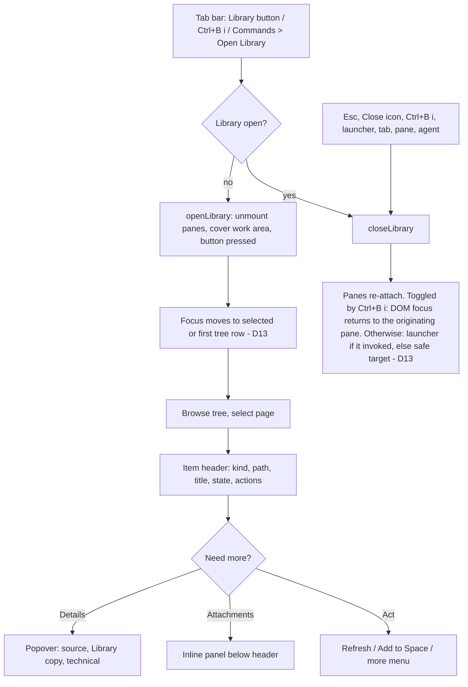

# 03 · Library view cleanup and top-bar Library button

Slice owner: LibraryPolish. Design only; no product code was changed. Mock: [`mocks/library/before-after.html`](mocks/library/before-after.html) (open directly in a browser).

Scope: (1) the global Library view (`src/app/library/*`, the Library root of `src/app/context/ContextViewer.tsx`), (2) a new Library launcher button in the tab bar next to the browser button. Sidebar polish is slice 01 and keyboard shortcuts are slice 02; see §12 Dependencies.

Screenshot reference: `pasted-image-e1e2658091594b94.png` (2879×1852). Coordinates below are in the 1568-wide downscaled view (multiply by 1.84 for native pixels). Calibration: a 26 px tree row (`viewer.css:495`) measures 23 display px, so 1 CSS px ≈ 0.88 display px (≈1.6 native px).

---

## 1. Goal and users

Users: a developer supervising agents who keeps reference material (Confluence pages, Jira/GitHub/GitLab items, folders) in the Cockpit-owned Library and reads it beside their terminals, and the same person doing a first-run check with no Herdr session (full-screen Library-only mode).

Goals:

1. The Library reads as one calm, aligned surface: one title style, one button system, one disclosure style, one timestamp format.
2. The page you are reading is visible above the fold: the item header is about 115 px (about 145 px with an attachments line), not about 300 px, until the user asks for more.
3. Reaching the Library is one click or one chord from any Space, with a visible "open" state.
4. The surface feels deliberate, like a polished desktop app: icons and status marks are present at one shared scale (§4.1a), provider identity is visible, hierarchy has structure (guides, weights, one primary action), and color comes only from existing state tokens.

Non-goals: new Library capabilities, provider behavior, Space-copy semantics (`spaceCopyPresentation.ts` verbs and states are unchanged), Herdr behavior. The Library is a Cockpit-owned view (DECISIONS.md "Context & Review" lines 36-39); opening or closing it never sends a Herdr request.

## 2. Evidence: current state

### 2.1 How the Library is opened today (files)

| Entry point | File:line | Behavior |
| --- | --- | --- |
| Commands palette `Open Library` | `src/app/App.tsx:1556` | `libraryOpen ? closeLibrary() : openLibrary()`: a toggle, but the label never changes and it shows no shortcut. |
| Palette `Add to Library…`, `Refresh Library` | `App.tsx:1557-1558` | `setLibraryAddOpen(true)`; `openLibrary({kind:"refresh"})` |
| State and open/close | `App.tsx:920` (`libraryOpen`), `:981-989` (`openLibrary`, `closeLibrary`) | Close also sets `attachFocusSuppressed` (D13). |
| Covering the work area | `App.tsx:1627` renders `<LibraryView>` in place of `.pane-canvas`; `:1610` empties `paneInstances`; `:1612` hides the browser while open | Pane renderers unmount while open (D13). |
| Leaving via tab, pane or agent | `App.tsx:1311-1312`, `:1326`, `:1329` | Each calls `setLibraryOpen(false)`. So the tab strip is already the way "back to terminals". |
| No session | `App.tsx:209-212` (`OpenLibraryButton`, `data-library-opener`), `:1899-1902` (`openNoSessionLibrary`, `noSessionLibrary`) | Library fills the window (`fullScreen`), Close returns focus to the opener. |
| Add dialog → `Open in Library` | `App.tsx:1720`, `AddContextDialog.tsx` | `openLibrary({kind:"open", itemId})` |
| Pane Context viewer root `Library` | `ContextViewer.tsx:711-714`, `chooseRoot(libraryRoot)` | A second, pane-scoped surface for the same Library; not the global view. |
| Prefix shortcut | none (`src/app/input/keymap.ts:9-36`, `App.tsx:674-698`) | The Library has no chord today. |

### 2.2 How the browser button is implemented

- `TabStrip` in `src/app/App.tsx:461-512`. Actions cluster at `:510`: `<div className="tab-strip-actions"><button className="tab-sidebar-toggle" … aria-label={browserOpen ? "Close browser" : "Open browser"} title={same} onClick={onBrowserToggle}><UiIcon name="browser" /></button><button className="tab-strip-action" onClick={onCommands}>Commands</button></div>`.
- Wiring at `App.tsx:1625`: `browserOpen={Boolean(selectedBrowserPresentation?.associationOpen)}`, `onBrowserToggle={() => browserAction(spaceId, associationOpen ? "close" : "open")}`. `TabStrip` renders only when `selection.spaceId` is set (`:1624-1625`). Assumption (user decision): a Space is always active while a Herdr session is live, so the tab strip, and with it the launcher, always exists; the no-Space branch (`.drawer-toggle` only) is not designed for. With no Herdr session the Library is the full-screen, Library-only view (§2.1) and has its own Close.
- Styling: the browser button reuses `.tab-sidebar-toggle` (`styles.css:2344-2345`: 36 px wide, `margin: 4px`, padding 5 px, transparent, hover `--surface-hover`). `.tab-strip-actions` (`styles.css:1776-1780`, `:2347`: padding `0 8px`, gap 5 px, bg `#121923`). `.tab-strip-action` (Commands) `styles.css:1782-1803`, `:2348-2349`, `:2429` (30 px tall, 11 px text).
- Gaps in the existing button: no `aria-pressed`/`aria-expanded`, no visual active state (only the label flips), the tooltip carries no shortcut (compare `title="New tab (Ctrl+B c)"` at `App.tsx:510`), it is disabled while a mutation is busy, and it does not close the Library first (`onBrowserToggle` never touches `libraryOpen`), so opening the browser while the Library is up gives no visible result (`:1612`).
- Icons: `src/app/UiIcon.tsx:2-22` has `browser`, `sidebar`, `info`, `more`, `refresh`, `wrap`, `close`, `down`, `right`, `file`, `search`, `plus`. There is no library, folder, paperclip or copy icon.

### 2.3 Findings in the Library view (screenshot + code)

Numbers are referenced by §11 acceptance checks.

| # | Finding | Screenshot | Code evidence |
| --- | --- | --- | --- |
| F1 | Title is lowercase `library`, styled like a sidebar section label. | (227,67) | `library.css:26-34` (`text-transform: lowercase`, `--font-size-xs`, `--text-secondary`), comment "Same treatment as the sidebar section headings". Sidebar section labels stay lowercase (Herdr parity, user decision recorded in slice 01, `styles.css:555-559`); that treatment labels a list region in the rail. The Library is a surface with its own title, so it takes sentence case. |
| F2 | Raw absolute path in the header, monospace, always visible. | (269-460,67) | `LibraryView.tsx:74`, `library.css:35-44`. Low-frequency information shown at top level. |
| F3 | `Close` is a 14 px text button, 28 px tall with border, unlike every other control. | (1513,67) | `library.css:45-54` (inherits body 14 px, `--surface-raised`); toolbar buttons are 12 px ghost (`viewer.css:377-382`). Contrast: the existing pattern for closing an overlay is a 28 px icon button (`context.css:307`, `.context-resources-close`; `task-setup-close` in `LibraryConfirmDialog.tsx:80`). |
| F4 | Toolbar mixes icon+text (`Files`), icon-only (search, refresh), text-only (`Add…`, `Refresh all`), a segmented control, and `Wrap` (icon+text). Two rules define its height. | y≈99 | `ContextViewer.tsx:1643-1660`; height `context.css:16-17` (43 px) vs `viewer.css:16` (36 px); padding `context.css:24` (`6px 10px`) vs `viewer.css:17` (`inline: 24px`). |
| F5 | Trailing `↻` icon is "re-read Context files" (local); `Refresh all` is "refresh from providers" (network). Same glyph family, different meaning, adjacent regions. | (1531,98) vs (363,98) | `ContextViewer.tsx:1651` vs `:1658`, `:1058-1061`. Tests: `ContextViewer.test.tsx:429,440,445`. |
| F6 | `Wrap` is shown while Preview is active, where it does nothing. | (1497,98) | Wrap applies only to `SourceLines` (`ContextViewer.tsx:368`); toolbar renders it unconditionally at `:1657`. |
| F7 | Tree: groups (provider, space) have chevron but no icon; pages have a file icon; `Attachments (1)` has no icon; three levels of visual grammar. | (229-283, 124-215) | `LibraryTree.tsx:477-486` (groups: disclosure + name only) vs `:435`, `:448` (file icon). |
| F8 | Row height is defined three times (30, 32, 26 px); the last wins. Indent is inline `8 + depth*16`. | row pitch 23 display px ≈ 26 CSS | `context.css:112` (30), `viewer.css:391-393` (32), `viewer.css:495-497` (26); `LibraryTree.tsx:415`. |
| F9 | `Attachments (1)` and meta `1 downloaded` say the same thing twice; meta wording differs from the header's `1 · 1 downloaded`. | (293-563,215) | `LibraryTree.tsx:473`, `LibraryItemHeader.tsx:218`. |
| F10 | `◉ Following` is a colored text glyph plus word; fine for a11y, but it competes with the label at full green. | (509-563,147) | `LibraryTree.tsx:482-485`, `library.css:83-87`. |
| F11 | Tree width default is 176 px (shared with Review); page titles clip. The screenshot shows the user had to widen it to about 410 CSS px. | tree edge x≈570 | `ViewerLayout.tsx:5` (`DEFAULT_TREE_WIDTH = 176`). |
| F12 | Eyebrow `CONFLUENCE PAGE` is uppercase accent, tracked, then a differently colored breadcrumb 8 px away using `/` (tooltip uses `›`). | (591-845,140) | `viewer.css:387` (`text-transform: uppercase; letter-spacing: .08em`), `LibraryItemHeader.tsx:146-147`, `:94`. `research/ui-design-direction.md:167` reserves uppercase for sidebar section labels, which slice 01 keeps lowercase, so uppercase is not a house style anywhere else. |
| F13 | Title (15 px / 500) is smaller than body `##` headings (16 px / 600), inverting hierarchy. | title (591,164) vs `Page body and refresh` (584,621) | `library.css:122-133` (`--font-size-md`, 500) vs `viewer.css:49-53` (h2 `--font-size-base`, 600). |
| F14 | Freshness phrase reads `checked · v3 by Konni Hartmann`: no time after "checked", and "by …" attaches to the version so it reads as "checked by". | (665-807,187) | Root cause below (F17). `LibraryItemHeader.tsx:157`. |
| F15 | Header actions are three different sizes/styles (`Refresh` 26 px bordered, `Add to cockpit` 26 px bordered, `···` 28 px). Label `Add to cockpit` reads like the app name. | (1381-1515,187) | `library.css:135-149` (26 px), `:160` (28 px `!important`); label from `spaceCopyPresentation.ts:70`. |
| F16 | Metadata is inline and expanded, about 210 px tall, pushes the body to y≈520. It duplicates the `ⓘ` popover (Provider, source identity, revision, path). | (591-1361,210-423) vs ⓘ (1515,140) | `LibraryItemHeader.tsx:183-215` vs `ContextViewer.tsx:1557-1575`. |
| F17 | **Raw epoch ms**: `Fetched 1790517466502`, `Checked 1790517466502`, while `Last updated` is ISO. Root cause: the Library index writes decimal epoch milliseconds (`crates/cockpit-core/src/project_store.rs:1329-1335`, used at `library.rs:883,1117,1245-1246`, `library/folder.rs:265`, `library/follow.rs:615`); the client passes the string through (`src/client/libraryProtocol.ts:57`) and `relativeTime` calls `Date.parse("1790517466502")`, which returns NaN (confirmed in both Bun/JSC and Node/V8), so it returns null (`libraryState.ts:237-250`). That is why the phrase in F14 has no time, why `Copied … ago` for folders and the `Not found at source on …` notice (`libraryState.ts:274`) can never show a time, and why the Metadata rows print digits (`LibraryItemHeader.tsx:208-209`). Existing tests only use ISO strings (`LibraryItemHeader.test.tsx:15,54`), which hides this. `Last updated` is ISO because it comes from Confluence frontmatter (`ContextViewer.tsx:292`). | rows (591-745, 370-388) | see left |
| F18 | Long identifiers (source link, Library path, `sha256:` 71 chars) sit in mono at 11 px, wrap anywhere, no copy affordance beside them. | (667-1361,353-423) | `library.css:168-171` (`overflow-wrap: anywhere`), `LibraryItemHeader.tsx:205,210,211`. |
| F19 | Three disclosure styles: native `▼`/`▶` marker on `Metadata` (default `<summary>`), a 12 px chevron icon on `Attachments`, 14 px chevron icons in the tree. | (595,210), (598,448), (229-284, tree) | `LibraryItemHeader.tsx:184` (no marker reset), `library.css:270` (12 px), `viewer.css:390` (14 px). |
| F20 | Attachments summary wraps into `1 · / 1 / downloaded` because the heading is a flex item inside a wrapping row. Table spans the full pane so `Open` is about 900 px from the file name; `State`/`Type` columns are not aligned to any header edge; the table indents 9 px right of the header edge. | (677-705,441-455), (600-1520,474-494) | `library.css:162-164,265`, `:264-281` (`table width:100%`, `padding: 2px 10px 2px 0`, action `width:1px`). |
| F21 | Header content starts at x≈591 and the body at x≈584, a 7 display px (≈8 CSS px) step. CSS intends both at 24 px: header `library.css:115` (literal `24px`), body `viewer.css:324-325` (`var(--viewer-document-inset)` = 24 px). The container/window rules that reduce the body to 20 px or 8 px (`viewer.css:66`, `:366`, `:435`) do not apply at this width. `[INFERENCE]` The static CSS does not explain the step; the implementer measures `getBoundingClientRect().left` of `.library-item-title` and `.context-markdown-body > :first-child` and reads computed `padding-left` to find the override. The design does not depend on the cause: header, notices, attachments panel and body all take the same `--viewer-document-inset` and the same column. Narrow widths have a real mismatch already: header stays 24 px (`library.css:115,161`) while body drops to 20 px (`viewer.css:435`) and `.context-document-header` to 20 px (`:436`). | title (591,164) vs body (584,529) | see left |
| F22 | Body measure is capped at 828 px including padding (`context.css:176-178`), left-anchored, so at 1500 px there is a wide dead zone on the right; header actions sit at the far right edge (1381-1515) while the title is at the far left. | (1277 wrap, 1515 actions) | `context.css:176-178`, `LibraryItemHeader.tsx:153-169` |
| F23 | Empty tree shows only `Empty`; empty document says `The Library is empty` with `Add context…` (different verb from the toolbar's `Add…`). | n/a | `ContextViewer.tsx:1694` vs `:1535`, `:1650` |
| F24 | Header `ⓘ` sits at the far right of the eyebrow line, far from what it describes, and looks like a decorative icon. | (1515,140) | `LibraryItemHeader.tsx:148-149`, `viewer.css:384-386` |
| F25 | **Icons are lost.** Tree icons are 14 px (`viewer.css:390`) in `--text-muted` (`#a6adc8`); the `.context-tree-icon` accent rule (`context.css:129`) is overridden by that muted rule. Every leaf is the same generic `file` glyph, providers and spaces have no icon at all, and the 1.6 stroke at 14 px next to 12 px labels reads as grey noise. Nothing tells a Confluence page from a folder at a glance. | icons at (257-285,170-238) | `viewer.css:390`, `context.css:129`, `LibraryTree.tsx:434-448,477-486`, `UiIcon.tsx:27` (`strokeWidth="1.6"`) |
| F26 | **Status marks are text.** `✓ Up to date`, `◉ Following`, `↑ Updated`, `✎ …` are Unicode characters set in the UI font, so glyph size, weight and baseline come from whichever fallback font has them (the same problem slice 01 F2 found in the sidebar). The header chip is a 1 px pill; the tree's `Following` and state marks have no pill and only color; the two are built differently. | (592-655,187), (509-563,147) | `libraryState.ts:221-235` (`glyph` strings), `library.css:83-90`, `context.css:348`, `LibraryTree.tsx:438,482-485` |
| F27 | **Top-bar actions are weightless and uneven.** The browser button is a 36 px box (4 px margin) around a bare icon with no pressed state; `Commands` is 11 px unbordered text, 30 px tall; nothing separates the actions from the tab strip's last tab; the heights (36, 30) do not line up. | (1465,22), (1520,22) | `styles.css:2344-2345`, `:2348-2349`, `:2429`, `:1776-1780`, `App.tsx:510` |
| F28 | **A deep tree has no structure.** The screenshot's path is five levels deep at 16 px steps with no guides; instance, space and page rows share one weight and color family, so the only cue is the chevron; selection is the only strong signal. | (229-293,124-215) | `LibraryTree.tsx:415`, `library.css:59-60` |
| F29 | **The page has no identity mark and no surface separation.** The item header sits on the same `--terminal-bg` as the body; the kind is 11 px text; `Refresh` and the primary `Add to cockpit` are identical bordered buttons. | (591-1515,140-187) | `library.css:110-118`, `:135-149` |

## 3. Flow



Primary path: launcher → tree row → read the body. Secondary: Details, Attachments, Refresh, Add to Space. Exit is always available from six places; none asks for confirmation (nothing is lost; view state is kept per `LibraryView` mount, not across close, as today).

## 4. Target design: Library view

### 4.1 Frame, tokens, type and spacing

Reuse tokens from `styles.css:12-75`. New tokens (add to `viewer.css :root` beside `--viewer-document-inset`):

| Token | Value | Use |
| --- | --- | --- |
| `--library-column` | `768px` | Content measure for header, notices, attachments panel and body text (was 780 px content inside an 828 px article). |
| `--library-tree-width-default` | `296px` | Library-only tree default (own preference key `cockpit.library.treeWidth`, min 200, max 640; Review/Context keep `DEFAULT_TREE_WIDTH = 176`, `ViewerLayout.tsx:5`). |
| `--library-row-height` | `28px` | Tree row height; equals `--compact-control-size`. |

Everything else uses existing tokens: `--viewer-document-inset` (24 px) for horizontal inset, `--border`, `--surface*`, `--radius-control` (4 px), `--radius-pill`.

Type scale, all existing tokens:

| Role | Token | Weight | Color |
| --- | --- | --- | --- |
| Library title | `--font-size-sm` (14) | 600 | `--text-primary` |
| Toolbar text, buttons, tree rows | `--font-size-control` (12) | 400 (group rows 500) | `--text-secondary` toolbar, `--text-primary` rows |
| Meta: eyebrow, state line, tree meta, panel, popover | `--font-size-2xs` (11) | 400 | `--text-muted`; values `--text-primary` |
| Item title | `--font-size-lg` (19), `line-height: var(--line-height-snug)` | 600 | `--text-primary` |
| Body | `--font-size-sm` (14), 1.65; `h2` 16/600 | | unchanged |

Hierarchy is now strictly ordered: title 19 > body h2 16 > h3 15 > body/title-row 14 (F13).

Spacing is a 4 px grid (4, 8, 12, 24). Every hover, focus, pressed, selected and expanded state changes color or fill only; no border widths, margins or paddings change (rows keep the transparent 2 px left border; buttons keep a constant 1 px border).

Button system (replaces the selector lists at `library.css:135-160,266-267` and the ad-hoc `.library-view-close`): three variants, all 28 px tall except panel-level 24 px.

| Variant | Where | Spec |
| --- | --- | --- |
| Ghost | Toolbar, title row, tab bar | transparent, no border (1 px transparent border kept), `--text-secondary`, hover `--surface-hover` + `--text-primary`, `aria-pressed="true"` = `--surface-selected` + icon `--accent`. Icon-only = 28×28 with a 16 px icon; icon+text = `0 8px` padding, 6 px gap, 16 px icon. |
| Bordered | In-content actions (item header, attachments panel, dialogs' inline buttons) | 1 px `--border`, bg `--surface-raised`, `--text-primary`, 12 px text, padding `0 10px`, radius 4, hover `--surface-hover`. Panel-level variant: 24 px tall, 11 px text. |
| Primary (bordered) | At most one per surface: `Add to <Space>` | Bordered variant plus border `color-mix(in srgb, var(--accent) 60%, var(--border))`, bg `color-mix(in srgb, var(--accent) 14%, var(--surface-raised))`, text `--text-primary`; hover bg mixes 22%. A tint, not a solid fill (solid accent is reserved for the selected tab, `styles.css:2351`). |

Disabled: `opacity: .6`, `cursor: default` (existing `library.css:156-159`). Focus: `outline: 2px solid var(--focus-strong); outline-offset: 1px` on every variant (existing `.task-setup button:focus-visible` pattern, `library.css:219-221`; toolbar inset variant where the button is flush to an edge).

Icon rule: view controls (tree, find, wrap, details, more, close) are icon-only with tooltip and `aria-label`; commands that change the Library (`Add…`, `Refresh all`, `Refresh`, `Add to <Space>`) carry words, with a leading 16 px icon. Segmented `Preview | Source` is text.

### 4.1a Icon scale, presence and tint (beautification)

Goal: icons and status marks feel present and deliberate, not lost (F25-F29), using one scale shared with the sidebar (slice 01) and the top bar. Scale decided in review:

| Size | Use | Notes |
| --- | --- | --- |
| 18 px | Status badge in sidebar Space/agent rows | Slice 01 only. The Library does not use 18 px. |
| 16 px | Tree row icons, every toolbar / title-row / tab-bar / header icon button (inside a 28×28 box), leading icons of icon+text buttons | The one working size. Was 14 px in the Library (`viewer.css:379-380,390`) and 13 px on `Commands` (`styles.css:2349`). |
| 14 px | Chevrons (tree, attachments toggle, Technical section), status-pill glyphs | Small marks that must not outweigh a 12 px label. |

Stroke is 1.5 at all sizes (`UiIcon.tsx:27` changes from 1.6; slice 01 owns that one-line edit). Icon boxes: 28×28 for buttons, 20 px wide slot in tree rows (16 px icon centered), 16 px slot for chevrons.

Color, from existing tokens only:

| Element | Rest | Notes |
| --- | --- | --- |
| Page / issue / MR icon (`file`) | `--accent` | Documents are what the tree is for. Selected and focused rows keep the same color (the row already has the accent border). |
| Space / repo / folder icon (`folder`) | `--text-secondary` | Containers recede behind documents. |
| `Attachments` group icon (`clip`), attachment icon | `--text-secondary`; downloaded attachment `--idle` | State-bearing, and the word is in the row meta. |
| Provider instance | 20×20 monogram tile (below) | |
| Toolbar and tab-bar icons | `--text-secondary`; hover `--text-primary`; pressed `--accent` | |
| Library icon in title row | `--accent` | Same glyph and color as the pressed launcher, so surface and button match. |

Provider monogram tile: text, not a brand logo (no invented logos, no new colors). Confluence `C`, Jira `J`, GitHub `GH`, GitLab `GL`, Gitea `Gt`, other = first letter of `providerFamily(...).name`. Tree tile 20×20, `--radius-control`, 1 px `color-mix(in srgb, var(--accent) 40%, var(--border))`, bg `color-mix(in srgb, var(--accent) 14%, var(--surface))`, letters 11/600 `--accent` (two-letter tiles use `letter-spacing: -.02em` at 11 px, since the type scale has nothing smaller). Header tile is the same recipe at 32×32, `--radius-panel` (6 px), 14/600. The family comes from `providerFamily(providers, provider_id)` (`libraryState.ts:38-42`) using the first item under an instance node; `LibraryInstanceNode` itself carries only `instance` and `label` (`libraryState.ts:302-309`). Folder copies use the `folder` icon on the same tile.

Status pill, one construction everywhere (tree, header, Space state, attachments, Details issues). Tint is the item's existing tone token (`--idle`, `--working`, `--blocked`, muted = `--text-secondary`):

| Property | Tree pill | Header pill |
| --- | --- | --- |
| Height | 18 px | 22 px |
| Padding, gap | `0 6px 0 4px`, 3 px | `0 8px 0 6px`, 4 px |
| Text | 11/500 | 12/500 |
| Glyph | 14 px inline SVG, `aria-hidden` | 14 px inline SVG, `aria-hidden` |
| Border | 1 px `color-mix(in srgb, var(--tint) 45%, var(--border))` | same |
| Background | `color-mix(in srgb, var(--tint) 14%, transparent)` | same |
| Text and glyph color | `var(--tint)` | same |
| Radius | `--radius-pill` | same |

Glyph shapes replace the Unicode characters of `libraryStateChip` (`libraryState.ts:221-235`); the chip data gets a `shape` name instead of `glyph`. Shapes coincide with slice 01's `StateGlyph` where the meaning does: `fresh` check, `failed` cross, `partial` half ring, `unknown` ring; the rest are added: `changed` up arrow (`M12 19V5m-6 6 6-6 6 6`), `removed_at_source` ring with slash (`M5.6 5.6l12.8 12.8M21 12a9 9 0 1 1-18 0 9 9 0 0 1 18 0`), `conflict` pencil (existing `edit`), `following` ring with a 3 px center dot. Tone stays per `libraryStateChip`, so `fresh` remains `--idle` (green) in the Library and no state word or meaning changes. Only `fresh` reads `Up to date`; the word is still printed in every pill (state is never color or shape alone).

Contrast: the tinted backgrounds are 14% of the tone over `--terminal-bg`/`--surface`, so text `--idle` `#a6e3a1`, `--working` `#f9e2af`, `--blocked` `#f38ba8`, `--text-secondary` `#bac2de` are each expected at ≥ 7:1 `[INFERENCE from the hex values]`; check B4 measures them.

### 4.2 Title row (`LibraryView.tsx:72-77`)

Height 36 px, bg `--sidebar-bg`, bottom 1 px `--border`, padding `0 6px 0 12px`, gap 8 px.

```
[▯ library-icon 16]  Library   12 items · 1 followed space  ················  [✕]
```

- `Library` (sentence case, 14/600, `--text-primary`). The lowercase sidebar treatment is dropped (F1): sidebar section labels stay lowercase (user decision, slice 01), but this is a surface title, not a list-region label.
- Leading 16 px `library` icon in `--accent` (new icon; same glyph and color as the pressed launcher so the surface and its button match).
- Count summary in 11 px `--text-muted`: `N items` (`N+ items` while `listing.next_offset` is non-null), plus ` · M followed spaces` when `listing.follows.length > 0`. Hidden while loading and at container width ≤ 520 px.
- Path: removed from the row (F2). It is the `title` (tooltip) of `Library` and the last entry of the toolbar `⋯` menu, `Copy Library folder path` (writes `listing.root.path`). A user who wants to see it hovers or copies; nobody needs it during reading.
- Close: 28×28 ghost icon button, icon `close`, `aria-label="Close Library"`, `title="Close Library (Esc)"`. Same dimension and icon as `.context-resources-close`. It stays even though the launcher toggles, because the no-session full-screen mode (`fullScreen`) has no launcher.

States: loading (title row unchanged, count hidden); listing error (title row unchanged; error is in the tree, §4.4); offline/no Herdr (unchanged: the Library does not depend on Herdr).

### 4.3 Toolbar (Library root of `ContextViewer.tsx:1643-1660`)

One height, 36 px (delete the 43 px pair `context.css:16-17`; `viewer.css:16` already says 36), padding `0 6px`, gap 2 px between buttons, groups separated by a 16 px × 1 px `--border` rule with 4 px margins.

```
[▤][⌕] │ [+ Add…] [↻ Refresh all]  ················  [Preview|Source] [⇌] [⋯]
 left      library commands                            view controls
```

| Control | Type | Label / tooltip | Notes |
| --- | --- | --- | --- |
| File tree | Ghost icon, `aria-pressed` = tree visible, `aria-controls` = tree id | `Hide file tree` / `Show file tree` (Alt+1 per slice 02) | Was `Files` icon+text. Text label dropped in Library only (class `is-library` scope) so Review's `Files 12` count button is unaffected. |
| Find | Ghost icon | `Find in Library (Ctrl+P)` | Unchanged behavior (`openFilePicker`). |
| Add… | Ghost icon+text (`plus` + `Add…`) | tooltip `Add a page, issue, MR/PR or folder to the Library` | Unchanged behavior (`setLibraryAdd("library")`). |
| Refresh all | Ghost icon+text (`refresh` + `Refresh all`) | tooltip `Refresh every item from its source`; no chord (slice 02: Ctrl+Shift+R is the browser hard-reload chord and would hit providers) | Disabled while busy or empty (existing rule `ContextViewer.tsx:1651`). |
| Preview \| Source | Segmented, text | `Preview (Alt+M)` / `Source (Alt+M)` (slice 02) | Shown only for Markdown/HTML documents (existing condition `:1655`). |
| Wrap | Ghost icon, `aria-pressed` | `Wrap long lines (Alt+Z)` / `Scroll long lines (Alt+Z)` | Rendered only while source lines are on screen (Source mode or a non-Markdown file) (F6). |
| `⋯` Library menu | Ghost icon, `aria-haspopup="menu"` | `Library actions` | Entries: `Reload listing` (shortcut hint `Ctrl+R`, local re-read only), `Copy Library folder path`. At container width ≤ 420 px it also carries `Add…` and `Refresh all` (existing compact rule `ContextViewer.tsx:1424-1434`). `LibraryMenuEntry` gains an optional `shortcut` string rendered right-aligned in `--text-muted`. |

The trailing `↻` icon is removed from the Library toolbar (F5). Its action, re-reading the Library directory listing, moves to `Reload listing` in `⋯` (still bound to Ctrl+R, still local only). What remains as a `↻` glyph is only the network command `Refresh all`, and it has words. The pane-scoped Context viewer toolbar is unchanged by this slice.

Tests to update: `ContextViewer.test.tsx:421-448` (uses `toolbarButton("Refresh Context files")`, `Add…`, `Refresh all`).

### 4.4 Tree (`LibraryTree.tsx`, `context.css:109-131`, `viewer.css:391-397,495-497`)

Row anatomy, every row, left to right:

```
| 2px sel border | indent (depth × 14, 1px guides) | chevron slot 16 | icon slot 20 | label (flex, ellipsis) | meta or pill (right, max 45%) | 8px |
```

- Height `--library-row-height` (28 px) declared once; delete the 30/32/26 declarations for Library rows (F8). `padding-block: 0`.
- Indent: `padding-left: calc(6px + var(--depth) * 14px)` via a `--depth` custom property instead of inline pixel math, so all rows and the page-node overlay button (`library.css:64-80`, `left: 2 + depth*16`) use one formula.
- Chevron slot: 16 px wide, holds a 14 px `right`/`down` `UiIcon`, `--text-muted`. Leaves keep the empty slot so icons align per depth. This is the one disclosure glyph in the Library; the header's Attachments toggle uses the same icons (F19). For page nodes the chevron remains a separate 24×28 hit target over the slot (existing behavior `LibraryTree.tsx:423-427`).
- Icon slot: 20 px wide, 16 px icon (§4.1a), stroke 1.5, colors per §4.1a. Provider rows hold the 20×20 monogram tile.

| Row kind | Icon | Label style | Meta |
| --- | --- | --- | --- |
| Provider instance (`Confluence · nnexai.atlassian.net`) | monogram tile 20×20 | 12/600 `--text-primary` | `Unavailable` tree pill (blocked tint, existing state) |
| Container / space / repo / ancestor / folder | `folder` 16, `--text-secondary` | 12/500 `--text-primary` | followed: `Following` tree pill (idle tint); when partial a second pill `have of total` (working tint) replaces `· ◐ n of m`; `Pages` and `Folder` stay plain 11 px `--text-muted` text (labels, not states) |
| Page or issue/MR item | `file` 16, `--accent` | 12/400 `--text-primary` | non-fresh state as a tree pill (glyph + word); fresh has no pill (quiet by default) |
| `Attachments` group | `clip` 16, `--text-secondary` | 12/400 `--text-secondary` | plain 11 px `--text-muted`: `not downloaded` / `N downloaded` / `d of N downloaded` (one formatter, §4.9) |
| Attachment | `file` 16, `--text-secondary` (`--idle` when downloaded) | 12/400 | 14 px `--idle` check + `100 B` when downloaded; else `size · state` in `--text-muted`; media type moves to the tooltip |

- `Attachments (1)` becomes `Attachments` plus meta; the count now lives in the meta (F9).
- Selection: `.is-selected` keeps `--surface-selected` and the 2 px `--accent` left border (constant transparent border when unselected, so no shift). Focus: inset 2 px `--focus-strong` ring (existing). Hover: `--surface-hover`. A selected row that also has focus shows both.
- Default width: Library uses its own width preference, default 296 px (F11). Splitter unchanged.
- Loading: six neutral skeleton rows (28 px, `--surface-hover` bars) per `ui-design-direction.md` "Loading"; replaces `Loading…` text (`ContextViewer.tsx:1689`).
- Empty: one row block, `Nothing in the Library yet`, and a bordered primary `Add…` button (same verb as the toolbar; replaces `Empty`, F23). The document area then shows the existing explanation with the same `Add…` verb instead of `Add context…`.
- Error: existing `context-tree-error` with `Retry`; copy unchanged (`Library unavailable: …. Space context is unaffected.`).
- Keyboard model unchanged (arrows, Home/End, Left/Right expand, Enter opens, Shift+F10/ContextMenu menu; `LibraryTree.tsx:357-395`).
- Indent guides (F28): one 1 px vertical line in `--border` per ancestor level, centered on that level's chevron (`x = 16 + 14·k` px for level `k`), drawn as a background on the row (`background: repeating-linear-gradient(90deg, var(--border) 0 1px, transparent 1px 14px) 15px 0 / calc(var(--depth) * 14px) 100% no-repeat`), so no extra elements and no layout change. Depth 0 rows have none. Guides stay the same on hover, selection and focus.
- Hierarchy by weight and tint, not by extra chrome: instance rows are 600 with a tile, containers 500 with a folder, pages 400 with an accent icon, attachments 400 with a secondary icon. No row height, border or padding changes with state.

### 4.5 Item header (`LibraryItemHeader.tsx`)

Container: `background: var(--surface)` (a slightly raised band so the header reads as the document's identity, distinct from the `--terminal-bg` body), `padding: 20px var(--viewer-document-inset) 12px`, bottom 1 px `--border`. Inner column `max-width: var(--library-column)` left-aligned; the provider tile, state line, actions, attachments panel and the body's text column share one left edge (the inset) and one width (F21, F22). Vertical gap 8 px. Notices (`library-item-notice`) keep the full-bleed treatment but use `margin-inline: calc(-1 * var(--viewer-document-inset))` and `padding-inline: var(--viewer-document-inset)` so they follow the same variable (F21).

Anatomy (default state, no disclosure open; ≈ 113 px tall, ≈ 145 px with the attachments line):

```
[tile 32]  Confluence page  SD › Cockpit Test Fixture f5521c0                [ⓘ]
[  C   ]  Library Page Read Smoke f5521c0
L2b (issues/reviews only) [Issue] [Open]  P1 · assignee · Updated 3 h ago
L3  [✓ Up to date] Checked 13 min ago · v3 edited 3 h ago by Konni Hartmann   [↻ Refresh] [+ Add to cockpit] [⋯]
L4  [▸ 1 attachment · downloaded]                                  (Confluence pages with attachments only)
```

- Identity block (L1+L2): a 32 px tile hangs at the left edge (the inset), the two text lines sit to its right (12 px gap, so the title text starts 44 px into the column; the tile, L3, L4, the attachments panel and the body all start at the inset). Tile per §4.1a (monogram or `folder` icon), vertically centered on the two lines. This keeps the alignment fix of F21 (the shared left edge is the tile's edge) and adds provider identity (F29).
- L1 left: kind label in 11/600 `--text-secondary`, sentence case, no letter-spacing, no accent (F12); scoped override on `.library-kind-chip`, other surfaces keep `.document-source-kind`. Then a breadcrumb in 11 px `--text-muted`, separators `›` (matches the tooltip and the `Library ›` crumb). Truncation: when it does not fit, keep the first segment (space key) and the last two, replace the middle with `…`; the full chain is the `title`. The `Library ›` crumb keeps its current rule (`rootCrumb`).
- L1 right: `ⓘ` Details, ghost icon button 28×28 (16 px icon), `aria-haspopup="dialog"`, `aria-expanded`, `aria-label="Details"`, `title="Details"`. It shows a 6 px `--working` dot (top right of the icon) plus the word in the accessible name (`Details, 2 issues`) when the item has diagnostics or edited-file conflicts, so a hidden problem is not invisible.
- L2 title: 19/600, `--text-primary`, two-line clamp (existing), `title` = full title.
- L3 left: header status pill (§4.1a: 22 px, tone-tinted, SVG glyph + word from `libraryStateChip`; no change to state semantics), then the phrase: `Checked <ago>` for the Cockpit clock, then ` · v<version> edited <ago> by <name>` for the source clock. Rules: omit `Checked …` if the time is unknown (never a bare `checked`, F14); omit `edited … by …` parts that are unknown; display names only (existing email guard `LibraryItemHeader.tsx:97`); the whole phrase truncates with ellipsis, `title` carries absolute times (§4.9). Other states keep their `libraryFreshness` phrases, computed with the fixed parser.
- L3 right: `Refresh` (bordered, `refresh` icon, disabled while `refreshBusy`), the Space action (**primary** variant, `plus` icon; label stays `Add to <Space>` from `headerSpaceAction`, tooltip `Copy this page into Space "<Space>"` because a Space named `cockpit` reads like the app), then `⋯` (28×28 bordered icon, existing menu entries). The primary tint is what separates the one main action from `Refresh` (F29). Space status text (`In api-review · ✓ Up to date`) becomes the same tree-size status pill (18 px, SVG glyph, word) and sits left of the buttons in the same slot; when they do not fit, the phrase truncates first, never the buttons. At container width ≤ 520 px `Refresh` and Space actions move into `⋯` (existing rule, `LibraryItemHeader.tsx:68`).
- L4: attachments toggle, see §4.7. Rendered only for Confluence pages with attachments.

States: `pending` replaces the state chip with the spinner chip and text (`Refreshing…`, `Downloading…`); `failed`/`conflict`/`partial` add the existing full-bleed notice under L3 with its `Retry`/`Replace with source version…` button; Space add/copy failures keep their `role="alert"` notices. These may increase height; they are state, not default.

### 4.6 Details popover (replaces inline `Metadata` and the old `ⓘ`)

One disclosure for all item and file facts (F16, F24). Trigger: the L1 `ⓘ`. Pattern: the existing `.viewer-details` popover (`viewer.css:29-36,384-386`): absolute, right-aligned to the trigger, `z-index: var(--z-dropdown)`, `--surface-raised`, 1 px `--border-strong`, radius 4, shadow `0 8px 24px #0006`. Width `min(480px, 100% - 16px)`, `max-height: min(60vh, 520px)`, scrolls inside. It overlays the body; opening never moves anything.

Sections (each `h4`: 11/600 `--text-secondary`, 12 px side inset; rows in a two-column grid, label column 96 px in `--text-muted`, gap 4×8):

1. **Issues** (only when diagnostics or edited-file conflicts exist): one line each, `--working`/`--blocked` glyph plus word, message. Replaces the trailing `Diagnostic`/`Edited file` rows (`LibraryItemHeader.tsx:212-213`).
2. **Source**: Space/project/repository (`container.label`); `Page ID` (Confluence) or `Source identity`; `Version` (Confluence, number without `v`) or `Source revision`; `Last updated` (`<absolute> · <name>`); `Provider` (`Confluence · nnexai.atlassian.net`, not the URL); `Source link` (single line, end-ellipsis, `title` = full, Copy button; and `Added from` only when it differs). Folder copies show `Copied from`, `Inventory`, `Copied` (files and size), and the four `Skipped …` counts here instead (existing content, `LibraryItemHeader.tsx:186-195`).
3. **Library copy**: `Fetched`/`Checked` (one row `Fetched · checked` when equal to the second, else two rows), `Folder` (`item_path`), `File` (relative document path), `Size`, `Revision` (`sha256:` first 8 hex … last 4, full in `title` and copied), `Media type`.
4. **Technical** (collapsed `<details>` inside the popover, chevron style of the tree): `Full path`, `Root identity`, `Provenance`, `Content hash`, `Frontmatter`, plus non-item diagnostics. Content moved from `ContextViewer.tsx:1561-1573` unchanged.

Redundant rows dropped: `Parent` and `Ancestors` (the breadcrumb and its tooltip already carry the chain; `LibraryItemHeader.tsx:199-200`), `Provider` URL duplicate, the old `Freshness` row (`ContextViewer.tsx:1570`, raw frontmatter time; replaced by `Fetched · checked`).

Value formatting rule: **identifiers you copy** (IDs, URLs, paths, hashes) are monospace 11 px, one line, end-ellipsis (paths middle-ellipsis: keep the first two and last segment), `title` = full value, and a 20×20 ghost icon button `copy` (new icon) after the value with `aria-label="Copy <label>"`. On copy the button shows a check mark for 1.2 s and announces `Copied` in a polite live region. **Human values** (names, dates, versions) are sans, wrap at word boundaries. Nothing uses `overflow-wrap: anywhere`.

Dismiss: Escape (stops propagation so the Library stays open; then focus returns to `ⓘ`), outside pointer down, or `ⓘ` again. Focus does not trap (it is a disclosure, not a modal); Tab leaves in DOM order and closes it on blur outside.

### 4.7 Attachments

Default: closed, one control on L4: a text-style ghost button (24 px tall, 11 px `--text-secondary`), `aria-expanded`, `aria-controls`, chevron `right`/`down` (14 px, same icon as the tree), label from `attachmentSummary` (§4.9): `1 attachment · downloaded`, `3 attachments · 1 downloaded`, `2 attachments`. It never wraps (`white-space: nowrap`), sits on its own line, so it cannot collide with other header items (F20). Pages without attachments render nothing.

Open (inline panel below L4, inside the column, `max-width: var(--library-column)`): 1 px `--border`, radius 4, bg `--surface`, 11 px text, `max-height: min(240px, 35vh)` with inner scroll (existing bound).

```
┌─────────────────────────────────────────────────────────────────────┐
│ 1 of 1 downloaded                       [Download all][Remove downloaded] │  panel header, 32 px
├─────────────────────────────────────────────────────────────────────┤
│ ☐  Name                              Size   Type        State       │  24 px, --text-muted
│    cockpit-library-e2e-…png        100 B   image/png   ✓ Downloaded [Open] │  28 px rows
└─────────────────────────────────────────────────────────────────────┘
```

- Real `<table aria-label="Attachments">`, `table-layout: fixed`, columns: select 28 px (only when actions exist), Name (flex, end-ellipsis, `title` = original name when different), Size 72 px right-aligned with `tabular-nums`, Type 120 px (`--text-muted`, ellipsis), State 112 px (glyph + word, tone as today), Action 72 px right-aligned. Cell padding `0 8px`; row separators 1 px `--border`; header row 24 px `--text-muted`, 400.
- Bulk actions (`Download selected (n)`, `Download all`, `Remove downloaded`) move out of the L4 line into the panel header, right-aligned, bordered 24 px buttons. `Remove downloaded` keeps its immediate behavior and gains the tooltip `Deletes the downloaded files from the Library. The page and its attachment list stay.` Progress and result still use `AttachmentReport` (`ContextViewer.tsx:1661`).
- Row action (`Open`, `Download`, `Retry`) is a 24 px bordered button in the Action column, so it sits within about 100 px of the file name (F20).
- At container width ≤ 520 px the existing stacked `<ul>` layout stays, restyled with the same tokens.

### 4.8 Body

- Left edge equals the header left edge: both use `var(--viewer-document-inset)` and the same column (F21).
- Text measure: `.context-markdown-body { max-width: calc(var(--library-column) + 2 * var(--viewer-document-inset)); }` (768 px content ≈ 100 characters at 14 px; was 780). Left-anchored, matching the header column. Code blocks and tables may scroll inside `pre`/table wrappers (existing).
- Vertical: first block `margin-top: 0`, body top padding 20 px (matches header top), bottom 30 px (existing).
- Source view is unchanged (full width, mono).
- The document title is not repeated: `hiddenTitle` (existing, `ContextViewer.tsx:1594`).
- Empty/selecting states: `Select a Library item to read it.` becomes a centered muted line with a `library` icon; unchanged copy.

### 4.9 Timestamp formatting rule

Wire formats found in code:

| Field | Format | Source |
| --- | --- | --- |
| `LibraryItemSummary.fetched_at`, `checked_at`; follow `last_refreshed_at` | decimal epoch milliseconds string, e.g. `"1790517466502"` | `project_store.rs:1329-1335` |
| Frontmatter `last_modified`, `fetched_at`, `generated` | ISO-8601 UTC, e.g. `2026-09-27T11:34:44.043Z` | Confluence/provider snapshots, `ContextViewer.tsx:292` |
| Test fixtures | ISO | tests |

Rule (one module, `libraryState.ts`; every Library surface uses it, and the raw string is never rendered):

1. `parseLibraryTime(value): number | null`: `null`/empty → `null`; `/^\d{13}$/` → `Number(value)` (epoch ms); otherwise `Date.parse(value)`, non-finite → `null`. Anything else is unknown.
2. `formatAgo(ms, now)`: existing thresholds: `< 60 s` → `just now`; `< 60 min` → `N min ago`; `< 24 h` → `N h ago`; `< 14 d` → `N d ago`; older → `formatDate`. Future times clamp to `just now`.
3. `formatDate(ms)`: `27 Sep` in the current year, `27 Sep 2025` otherwise (locale day/month order as today).
4. `formatDateTime(ms)`: local time zone, 24 h, no seconds: `YYYY-MM-DD HH:mm` (same shape as generated comment cards, `CONTEXT.md` §7.3).
5. Where each appears:
   - Inline (header phrase, tree meta, folder `Copied … ago`, notices): `formatAgo`.
   - Details rows: `formatDateTime`, then ` · <formatAgo>` in `--text-muted` when the age is under 14 days. Tooltip (`title`): full ISO-8601 UTC with milliseconds (`2026-09-27T14:17:46.502Z`).
   - Header phrase tooltip: `Checked 2026-09-27 16:17 · Version 3 edited 2026-09-27 13:34 by Konni Hartmann`.
6. Unknown/invalid → the row shows `Unknown` in `--text-muted` with the raw value in `title`; header phrase omits the segment. Missing → row omitted.
7. `Fetched` and `Checked` within one second of each other render as one row `Fetched · checked`.
8. Source clock and Cockpit clock never share a label: `Last updated`/`edited` = source; `Fetched`/`Checked` = Cockpit.

Worked example for the screenshot item (viewer time zone UTC+2, now = 16:30): `fetched_at = "1790517466502"` → `2026-09-27 16:17 · 13 min ago`; `last_modified = "2026-09-27T11:34:44.043Z"` → `2026-09-27 13:34`, `3 h ago`; header: `Checked 13 min ago · v3 edited 3 h ago by Konni Hartmann`.

Also `attachmentSummary(item)` (same module): 0 downloaded → `N attachment(s)`; all → `N attachment(s) · downloaded` (`all downloaded` when N > 1); partial → `N attachments · d downloaded`. Tree meta variant: `not downloaded` / `N downloaded` / `d of N downloaded`.

### 4.10 Progressive disclosure: what is visible when

| Information | Default | Behind |
| --- | --- | --- |
| Kind, breadcrumb, title | visible | |
| State chip, checked time, version, editor | visible (one line) | absolute times: tooltip and Details |
| Refresh, Add to Space, more | visible | |
| Attachment count and download state | visible (one control) | table and bulk actions: Attachments panel |
| Space, page ID, source link, provider, Last updated | | Details › Source |
| Fetched/Checked, paths, revision, size, media type | | Details › Library copy |
| Full path, root identity, provenance, content hash, frontmatter | | Details › Technical |
| Diagnostics, edited files | dot on `ⓘ` + existing state notice | Details › Issues |
| Library folder path | tooltip on title | toolbar `⋯` › Copy Library folder path |
| Provider refresh report, attachment operation report | inline strips (existing) when an operation runs | dismissible (existing) |

### 4.11 Responsive behavior

Existing breakpoints are kept: container ≤ 520 px (tree becomes overlay, header `Refresh`/Space actions move to `⋯`, `--viewer-document-inset` 8 px), ≤ 420 px (`Add…`/`Refresh all` into `⋯`), ≤ 280 px (toolbar icons only). Changes: the header now uses `--viewer-document-inset` everywhere so the 8 px inset applies to the header as well as the body (F21 narrow mismatch); the count in the title row hides ≤ 520 px; the Details popover width is `min(480px, 100% - 16px)`.

## 5. Library launcher button (tab bar)

### 5.1 Placement

In `.tab-strip-actions` (`App.tsx:510`), order left to right: `[browser] [Library] [Commands]`. Library is global (session-independent, D13); browser is Space-scoped; global controls sit next to `Commands`. 28×28 visible box, 6 px vertical margin in the 41 px bar (`--tab-strip-height`, `styles.css:52`), 2 px gap. It uses `.tab-icon-button`, the class slice 01 introduces to replace the icon use of `.tab-sidebar-toggle` (agreed with SidebarPolish: 28×28, hover `--surface-hover`, no layout shift). This slice adds only the toggle state below.

### 5.2 Icon

New `UiIcon` name `library`: an open book, in the same 24-grid, 1.5 stroke style:
`M12 6c-2-1.5-5-2-8-2v14c3 0 6 .5 8 2 2-1.5 5-2 8-2V4c-3 0-6 .5-8 2ZM12 6v14`. Rendered 16 px (scale §4.1a; the `.tab-strip-action .ui-icon` 13 px rule at `styles.css:2349` does not apply because the button uses `.tab-icon-button`), `currentColor`. It is visually distinct from `browser` (window frame), `sidebar` and `file`.

### 5.3 States

| State | Visual | Attributes |
| --- | --- | --- |
| Rest, Library closed | transparent, `--text-secondary` | `aria-pressed="false"` |
| Hover | `--surface-hover`, `--text-primary` | tooltip |
| Keyboard focus | 2 px `--focus-strong` outline, offset 1 px | |
| Pressed (Library open) | `--surface-selected` fill, icon `--accent`, plus `box-shadow: inset 0 -2px 0 var(--accent)` (a shape cue, not color alone; no layout change) | `aria-pressed="true"` |
| Mouse down | `--surface-selected` (existing pressed rule, no scale) | |
| Disabled | never disabled | The Library needs no session or Space (`DECISIONS.md:37`); Herdr `stale`/`disconnected` and mutation-busy do not disable it. |

The selector `.tab-icon-button[aria-pressed="true"]` is shared with the browser button (§5.6).

### 5.4 Tooltip and accessible name

- `title` (native, like `New tab (Ctrl+B c)` at `App.tsx:510`): `Open Library (Ctrl+B i)` when closed, `Close Library (Ctrl+B i)` when open. Chord agreed with KeyboardShortcuts (slice 02); it avoids Herdr's `prefix+shift+l` (swap pane right).
- `aria-label="Library"` constant, with `aria-pressed`. The label does not change with state (WAI toggle-button guidance); the tooltip does.

### 5.5 Behavior: toggle, not focus

Click, Enter/Space, `Ctrl+B i`, and the palette entry all run one `toggleLibrary` = `libraryOpen ? closeLibrary() : openLibrary()` (extract from `App.tsx:1556`). Pressing while open closes.

Rejected alternative: "if open and focus is elsewhere, focus the tree instead of closing". It gives the button two meanings and Escape/`Close` already handle closing from inside. Toggle keeps the pressed state truthful and the shortcut symmetric. See §8.

Focus (D13, `DECISIONS.md:39`, implemented in `LibraryView.tsx:46-66`): on open the invoker is the launcher (`document.activeElement` when it is a button in the strip), DOM focus moves to the selected/first tree row; on close focus returns to the launcher, else to the selected tab/sidebar toggle (`SAFE_FOCUS_TARGETS`, `LibraryView.tsx:9`). Where a browser does not focus buttons on click (Safari), the invoker is `body` and the safe target is used. **Exception, user accepted:** when the Library was toggled with `Ctrl+B i`, closing it with `Ctrl+B i` returns DOM focus to the originating pane, the pane that was the Herdr-selected pane when the Library opened (`selection.paneId`, read at open; nothing changes it while the Library is open). `closeLibrary` (`App.tsx:986-989`) sets `attachFocusSuppressed` to true; the chord path leaves it false for that pane so the remounted terminal may take DOM focus, and other panes never do. If that pane no longer exists the safe targets apply. DOM focus only: no Herdr focus request is sent either way. Esc, the title-row Close, the launcher click and tab/pane/agent selection follow the D13 rules above.

### 5.6 Relation to other entry points and the browser button

- All entry points call the same `openLibrary` (§2.1). The palette action changes to a state-aware label: `Open Library` / `Close Library`, and shows `Ctrl+B i` in its `shortcut` field.
- Palette `Add to Library…` and `Refresh Library` remain; `Refresh Library` opens the view and starts `Refresh all` (existing).
- Tab, pane and agent selection keep closing the Library (existing).
- **Browser button while the Library is open** (new; today it acts invisibly, §2.2): the button shows pressed when the browser association is open. Click with the Library open: close the Library, then, if the association was closed, open it; if it was already open (hidden under the Library), just reveal it. Reason: each strip button reveals its own surface. This is a small behavior change to `onBrowserToggle` (`App.tsx:1625`); acceptance check L12.
- The browser button also gets `aria-pressed` = `browserOpen`, constant label `Browser`, and tooltips `Open browser (Ctrl+B Shift+B)` / `Close browser (Ctrl+B Shift+B)` (chord from slice 02). It keeps its `busy` disabling (a Herdr mutation) unlike the Library button.
- The selected tab keeps its accent fill while the Library covers the work area; it remains the Herdr-selected tab (parity, `ui-design-direction.md:36`). Clicking it closes the Library. See Q3.

Launcher availability (assumption, user decision: a Space is always active while a Herdr session is live): the launcher lives in the tab strip, which therefore always exists in the workbench. No no-Space fallback is designed. With no Herdr session the full-screen Library-only view has its own Close (§4.2).

### 5.7 Presence and rhythm of the top-bar actions (beautification, F27)

| Element | Spec |
| --- | --- |
| Icon buttons (browser, Library) | 28×28, 16 px icon, stroke 1.5, `--text-secondary`; hover `--surface-hover` + `--text-primary`; pressed `--surface-selected` + icon `--accent` + 2 px inset accent underline (same rule for both, §5.3). Was a 36 px box (`styles.css:2344`) around a bare icon. |
| `Commands` | 28 px tall (was 30, `styles.css:2429`), 12/500 `--text-secondary` (was 11 px, `:2348`), 1 px `--border`, radius 4, padding `0 10px`, transparent; hover `--surface-hover` + `--text-primary` + border `--border-strong`; 2 px focus ring. Same height as the icon buttons so the cluster reads as one row. Tooltip `Commands (Ctrl+B ?)` (slice 02). |
| Cluster | `.tab-strip-actions`: `align-items: center`, `padding: 0 8px 0 6px`, 2 px between icon buttons, 8 px before `Commands`. A 16 px × 1 px `--border` rule with 4 px side margins separates the cluster from the tab strip's last element; it never changes with state. All controls are vertically centered in the 41 px bar. |
| Background | unchanged here (slice 01 swaps the `#121923` literal for its chrome token). |

## 6. Interaction and keyboard

Keys are owned by slice 02; this slice consumes them.

| Key | Action | Scope |
| --- | --- | --- |
| `Ctrl+B i` | toggle Library | workbench (new prefix command `toggle-library` in `keymap.ts`, entry in `prefixCommandActions`, handler in `runCommand`, `App.tsx:1449`) |
| `Esc` | close innermost: Details popover → menu/dialog → (tree overlay when narrow) → Library | Library |
| `Ctrl/Cmd+P`, `/` | Find in Library | Library viewer |
| `Alt+1` / `Alt+2` | focus tree / document | Library viewer |
| `Alt+M` | Preview ↔ Source | Library viewer |
| `Alt+Z` | Wrap | Source view |
| `Ctrl/Cmd+R` | Reload listing (local only) | Library viewer, not while an input has focus |
| `Shift+F10`, `ContextMenu` | row menu | tree row |
| Tree arrows/Home/End/Enter | existing | tree |

Pointer parity: every action reachable by keyboard has a button; every button has a tooltip and accessible name. Focus order in the Library: title-row Close → toolbar left to right → tree → item header (`ⓘ`, Refresh, Add to Space, `⋯`, attachments toggle) → document. (Tree first when opening, per D13.)

## 7. Accessibility

- Launcher: `button`, `aria-label="Library"`, `aria-pressed`, visible focus ring, hit area 28×28 (≥ the 28 px control size used elsewhere).
- Title row: `<section aria-label="Library">` unchanged; `h2` "Library".
- Toolbar icon buttons: each has `aria-label`; toggles use `aria-pressed`; the tree toggle has `aria-controls`.
- Tree: unchanged roles and labels; new meta strings are part of the row `aria-label` (`itemAccessibleName`, `LibraryTree.tsx:431,460`). State is glyph + word, never color alone (`Following`, `✓ Downloaded`).
- Details: trigger `aria-haspopup="dialog"`, popover `role="dialog"` with `aria-label="Details"` (non-modal), sections as `h4` in a `dl`; copy buttons have labels; copy result in a polite live region.
- Attachments toggle: `aria-expanded`, `aria-controls`; table has `aria-label`, header cells `scope="col"`.
- Contrast: `--text-muted` `#a6adc8` on `--sidebar-bg` `#11161e` and `--terminal-bg` `#0c1016` exceeds 7:1; `--idle` `#a6e3a1` on the same backgrounds exceeds 7:1. The pressed launcher adds a non-color cue (inset accent underline plus fill change).
- Motion: no new animation; spinner respects reduced motion (existing `library.css:104-107`).

## 8. Options considered

| Choice | Options | Recommendation and tradeoff |
| --- | --- | --- |
| Title row | (a) keep separate row, slimmer; (b) merge into toolbar; (c) drop it when embedded | **(a)**. `fullScreen` no-session mode needs Close, and the title identifies a Cockpit-owned surface. (b) saves 36 px but forces a slot API into the shared `ContextViewer` toolbar; (c) leaves `fullScreen` without an exit. |
| Item metadata | (a) inline disclosure (today); (b) popover; (c) side inspector | **(b)**. Inline pushes the body 210+ px; an inspector spends horizontal space the tree already uses. Cost: popover needs outside-click and Escape handling that `<details>` lacks. |
| Attachments | (a) inline panel; (b) popover; (c) tree only | **(a)**. It has checkboxes and bulk actions that need width and stable focus; a popover would be a second dialog-like layer. The tree keeps the per-file view. Cost: opening it pushes the body down, but only on request. |
| Long identifiers | (a) wrap anywhere; (b) end ellipsis + title + copy; (c) middle ellipsis | **(b)** for URLs, **(c)** for paths, short form for hashes. Cost: values are truncated on screen; the full value is one hover or click away. |
| Timestamps | (a) raw; (b) relative only; (c) absolute only; (d) relative inline, absolute+relative in details | **(d)**. Matches how freshness is used (is it recent?) and how debugging is done (exactly when?). |
| Timestamp fix location | (a) frontend parser accepts epoch ms and ISO; (b) backend emits ISO | **(a)**. Existing `.cockpit` indexes contain epoch strings, so (b) alone would not fix stored data and needs a migration; (a) is small and covers both. |
| Launcher behavior | (a) toggle; (b) open, or focus if already open | **(a)** (see §5.5). |
| Launcher position | (a) `[browser][Library][Commands]`; (b) `[Library][browser][Commands]` | **(a)**, decided by the user (resolved Q1): global controls next to `Commands`. |
| Tree grammar | (a) generic icons everywhere; (b) providers as text-only headers, icons below; (c) provider monogram tiles plus kind-tinted row icons | **(c)**. Tiles are letters in accent tint, not brand logos, so no new colors or artwork. Cost: two-letter monograms (`GH`, `GL`) are dense; they render at 11 px with tight tracking and the word is always in the label. |
| Row icon color | (a) all `--text-muted` (today); (b) kind-tinted (pages `--accent`, containers `--text-secondary`, downloaded `--idle`); (c) all `--accent` | **(b)**. (a) is the "lost" look (F25); (c) makes the tree a wall of blue. |
| Status marks | (a) Unicode glyph + text (today); (b) tinted pill with SVG glyph and the word | **(b)**. Matches slice 01's SVG state glyphs and the direction doc's "icon plus word". Cost: touches every consumer of `libraryStateChip` and the tests that assert glyph text. |

## 9. Implementation steps (ordered)

1. `src/app/library/libraryState.ts`: add `parseLibraryTime`, `formatAgo`, `formatDate`, `formatDateTime`, `attachmentSummary`; route `relativeTime`/`shortDate`/`libraryFreshness` through the parser; change the phrase composition (§4.5). Unit tests in `libraryState.test.ts`: epoch-ms string, ISO, invalid, future, 13-day vs 15-day boundary, other-year date. (Fixes F14, F17 independent of any visual work.)
2. `src/app/UiIcon.tsx`: add `library`, `folder` (`M3 6h6l2 2h10v11H3Z`), `clip` (`M20 11l-8 8a5 5 0 0 1-7-7l9-9a3.5 3.5 0 0 1 5 5l-9 9a2 2 0 0 1-3-3l8-8`), `copy` (`M9 9h11v11H9ZM5 15V4h11`).
3. `src/app/viewer.css`: add `--library-column`; delete the 43 px toolbar pair at `context.css:16-17` and the competing padding at `context.css:24`; keep one toolbar rule (36 px, `padding: 0 6px`); scope `is-library` overrides (icon-only Files, hidden Wrap) so Review is unaffected.
4. `src/app/library/library.css`: title row (`.library-view-header`, drop `text-transform`, remove `.library-view-path`, replace `.library-view-close` with the ghost icon variant); button system (three variants) replacing `:135-160,:266-267`; header container/inset/column (`:110-118,:161`); title 19/600 (`:122-133`); kind label override; attachments panel and table (`:264-283`); Details popover; remove `.library-metadata` inline styles (`:162-171`).
5. `src/app/library/LibraryView.tsx`: new title row, count from `library.listing`, tooltip path, Close icon; pass `fullScreen` unchanged. Also `SAFE_FOCUS_TARGETS` (`:9`): replace `.tab-sidebar-toggle:not(:disabled)` with `.tab-icon-button[aria-controls="cockpit-sidebar"]:not(:disabled)` (slice 01 renamed the class; the selector must name the sidebar toggle specifically because the browser and Library buttons now share `.tab-icon-button`). Required whether or not the rest of this step has landed.
6. `src/app/context/ContextViewer.tsx`: Library-root toolbar (§4.3): icon-only Files and Find in Library, icon+text `Add…`/`Refresh all`, hide Wrap unless source lines are shown, remove trailing refresh icon in Library, `⋯` menu always in Library with `Reload listing` and `Copy Library folder path`; merge `documentDetails` (`:1557-1575`) into a new `LibraryDetails` component fed by item + document (used for Library items; non-Library documents keep the current `ⓘ`); empty-state verbs (`:1535`, `:1694`); Library-only tree-width preference.
7. `src/app/library/LibraryItemHeader.tsx`: restructure to L1-L4 (§4.5), delete the inline `<details className="library-metadata">` (`:182-215` region), new attachments toggle line and panel (`:216-253`), Space action tooltip, diagnostics dot.
8. `src/app/library/LibraryTree.tsx`: row anatomy and `--depth` indent (`:414-488`), icons, meta strings, `Attachments` label, skeleton/empty states; `LibraryMenuEntry.shortcut` (`:9`, `:112-114`).
9. `src/app/App.tsx`: `toggleLibrary`; `TabStrip` props `libraryOpen`, `onLibraryToggle`; Library button between browser and `Commands` (`:510`); browser button `aria-pressed`, constant label, tooltip with chord, close-Library-first behavior (`:1625`); palette action label/shortcut (`:1556`); `prefixCommandActions` entry (`:674-698`) and `runCommand` case (`:1449`); `src/app/input/keymap.ts` add `toggle-library` on `i` (no Shift) and `toggle-browser` per slice 02.
10. `src/app/styles.css`: `.tab-icon-button` (slice 01) plus `[aria-pressed="true"]` rule (§5.3).
11. Tests: update `ContextViewer.test.tsx:389-451` (toolbar buttons), `LibraryItemHeader.test.tsx:29-32,71-75` (Details replaces `details.library-metadata`), `LibraryAttachments.test.tsx:37` (toggle class), `App.integration.test.tsx:954-961` (palette label), `App.test.ts` keymap table. New behavior tests: epoch-ms timestamp display (F17), launcher toggle and `aria-pressed`, focus return to launcher.
12. `docs/keyboard-shortcuts.md`: slice 02 owns the table; ensure `Ctrl+B i` and Library-view keys appear.
13. Icon scale and pills (§4.1a; lands with steps 4, 7, 8): `src/app/UiIcon.tsx` adds `up`, `check`, `ring`, `half-ring`, `slash-ring` paths; add `StatePill` (`src/app/library/StatePill.tsx`) and `ProviderMark` (`src/app/library/ProviderMark.tsx`, monogram from `providerFamily`). `libraryStateChip` (`libraryState.ts:221-235`) returns `shape` instead of `glyph`; migrate every caller: `LibraryTree.tsx:438,451,482-485`, `LibraryItemHeader.tsx:156,163`, `SpaceContextList.tsx:214-215,284`, `spaceCopyPresentation.ts` (`SpaceCopyChip`, `HeaderSpaceAction.text` split into `shape` + word), attachment state chips. No Unicode state glyph remains in Library DOM text.
14. Icon tokens and sizes: slice 01 defines `--icon-size: 16px` and `--icon-badge: 18px` in `styles.css :root`; this slice adds one more, `--icon-mark: 14px` (chevrons, pill glyphs), and both specs use exactly this set of three (no `--icon-md`/`--icon-sm`). Slice 01 lands its tokens first; add them here if this slice lands first. Library CSS uses only these; `UiIcon` stroke 1.5 (slice 01). Set `.context-toolbar .ui-icon`, `.review-toolbar .ui-icon` (`viewer.css:379-380`) to `--icon-size` for the Library root; tree icon size `viewer.css:390` to `--icon-size` for Library rows; chevrons and pill glyphs to `--icon-mark`. Pill glyphs are the bare shapes of slice 01's `StateGlyph` (`s-blocked`, `s-done`, `s-working`, `s-idle`) drawn without their 18-box tinted disc, since the pill itself carries the tint.
15. Tree guides, item-header surface, tile and primary tint (§4.4, §4.5, §4.1): `library.css` (`--depth` guides, `.library-item-header { background: var(--surface) }`, tile, primary variant); `LibraryItemHeader.tsx` identity block.
16. Top-bar polish (§5.7): `styles.css` `.tab-strip-actions` cluster, separator, `Commands` restyle (`:1782-1803`, `:2347-2349`, `:2429`); `App.tsx:510` markup for the separator. Chord-close focus exception (§5.5): `App.tsx` `closeLibrary` variant for `toggle-library` that records `selection.paneId` at open and leaves `attachFocusSuppressed` false on close.
17. Tests for 13-16: pill and tile rendering (no glyph characters in text, word present), `libraryStateChip` shapes, `SpaceContextList.test.tsx:61`, `ContextViewer.test.tsx:1169` (`In api-review · ✓ Up to date` text becomes pill + word), `LibraryTree.test.tsx` icon/tile rows, chord-close focus.

## 10. Proposed `DECISIONS.md` entries

Under "Context & Review" (after the D13 line):

- The tab bar's Library button toggles the Cockpit-owned Library view and shares its handler with the Commands entry and `Ctrl+B i`. It shows pressed while the view is open, is never disabled by Herdr or mutation state, and, like every entry point, sends no Herdr request. Selecting the browser button with the Library open closes the Library first, then shows or opens the browser.
- Library index timestamps (`fetched_at`, `checked_at`, follow `last_refreshed_at`) are decimal epoch milliseconds; provider frontmatter timestamps are ISO-8601. The UI parses both through one helper and never shows a raw value: relative under 14 days inline, `YYYY-MM-DD HH:mm` local plus relative in details, ISO UTC in tooltips.
- Library item facts live in one Details popover; the item header shows kind, breadcrumb, title, state and freshness, actions and one attachment-summary control, and nothing expands the header by default. Paths, hashes and links are single-line with copy actions.
- D13 amendment: when the Library is toggled with `Ctrl+B i`, closing it with `Ctrl+B i` restores DOM focus to the originating pane (the Herdr-selected pane when the Library opened) by letting that pane's terminal attach focus. Other close paths keep D13. This is DOM focus only and sends no Herdr focus request.
- Icons and state marks share one scale: 18 px status badge (sidebar rows only), 16 px icons in rows and controls, 14 px chevrons and pill glyphs, stroke 1.5. Library state marks are tone-tinted pills with an SVG glyph and the state word; provider identity is a monogram tile; colors come only from existing state and accent tokens.

No Herdr behavior is replaced by this slice, so no parity-difference entry is needed.

## 11. Acceptance checks (browser build, disposable fixture)

Use `python3 scripts/verify/ui_polish_runtime.py start` with a Library holding at least one followed Confluence page with one downloaded attachment (`skill://cockpit-library-confluence-e2e`), and stop it afterwards. Never the user's session.

Title row and toolbar
- A1 Title reads `Library` (capital L), 14 px/600, with a leading icon; the header contains no absolute path text; hovering the title shows the path in a tooltip.
- A2 Close is a 28×28 icon button (`aria-label="Close Library"`); `getComputedStyle` font-size of the row's text is 14 px only for the title.
- A3 Toolbar height is 36 px in the Library root and equals the Review toolbar height; button heights are 28 px; toolbar icons are 16×16; `Files` and Find are icon-only with tooltips; `Add…` and `Refresh all` each show a 16 px icon and a word; no `↻` icon-only button exists in the toolbar; `Reload listing` is in `⋯`.
- A4 With Preview active there is no Wrap button; switching to Source (or opening a non-Markdown file) shows it.

Tree
- A5 Every non-provider row has a 16×16 icon in a 20 px slot; provider rows show a 20×20 monogram tile and are 600 weight; icon x-positions are identical for same-depth rows; all rows are 28 px tall (`getBoundingClientRect().height`).
- A6 `Attachments` row reads label `Attachments`, meta `1 downloaded`; the meta and the header control agree on counts.
- A7 Selecting a row, hovering, and focusing change no sibling's bounding rect (compare before/after rects).
- A8 Fresh Library with no items shows `Nothing in the Library yet` and an `Add…` button.

Item header, Details, timestamps
- A9 With Details and Attachments closed, `.library-item-header` height is ≤ 120 px for a page without attachments and ≤ 150 px with them, and the first body paragraph's top is above y = 320 (1080p).
- A10 The header phrase for the fixture reads `Checked <N> min|h ago · v3 edited <N> h ago by <name>`; there is no bare `checked`. (Fails before the fix: no time.)
- A11 Open Details: no row shows a run of 10+ digits; `Fetched · checked` shows `YYYY-MM-DD HH:mm · <ago>`, its `title` is ISO UTC; `Last updated` shows `YYYY-MM-DD HH:mm · <name>`; opening Details does not change the body's `getBoundingClientRect().top`.
- A12 In Details, Source link, Path and Revision are single-line (row height ≤ 20 px), have a Copy button; clicking Copy writes the full value to the clipboard and shows `Copied`; Revision text is `sha256:` + 8 hex + `…` + 4 hex.
- A13 Escape with Details open closes only Details (Library stays); a second Escape closes the Library.
- A14 Style check: the only disclosure glyphs in the Library are the 14 px `right`/`down` chevron icons (no native `<summary>` marker visible).
- A15 Unit: `parseLibraryTime("1790517466502")` = `1790517466502`; `parseLibraryTime("2026-09-27T11:34:44.043Z")` = 1790508884043; `parseLibraryTime("nope")` = null.

Attachments
- A16 At Library container widths 1400, 900 and 560 px the toggle reads on one line (`white-space: nowrap`, height 24 px).
- A17 Open panel: Name/Size/Type/State/Action columns align to their header cells (compare `left` of `th` and `td`), Size is right-aligned, the `Open` button's left edge is within 160 px of the Name cell's right edge, and bulk buttons are in the panel header.

Alignment and measure
- A18 At 1400, 900 and 560 px container width, `left` of `.library-item-tile`, the status pill, the attachments toggle/panel, `.library-item-notice > span` and the first body block are equal (0.5 px tolerance). The title text is 44 px right of the tile (32 px tile + 12 px gap) by design.
- A19 Body text column width ≤ 768 px; title row, header column and body share that max width.

Beautification (icons, pills, hierarchy)
- B1 Sizes and stroke: every tree row icon is 16×16, chevrons 14×14, pill glyphs 14×14, toolbar / title-row / tab-bar icons 16×16; computed `stroke-width` is 1.5 on every `.ui-icon` in the Library and tab strip.
- B2 Presence: page icons compute to `--accent`, folder and attachment icons to `--text-secondary`; each provider instance row shows a 20×20 tile with the family monogram; no two different row kinds share the same icon and color.
- B3 Pills: `Up to date` (22 px) and tree `Following` (18 px) are pills with a 1 px tinted border, tinted 14% background and text in the tone token; no character from `✓◉↑✎⊘◐` appears in Library DOM text; each pill's glyph is an `aria-hidden` SVG and the state word is present in text.
- B4 Contrast: measured pill text on its tinted background is ≥ 4.5:1 for `--idle`, `--working`, `--blocked` and muted tones (devtools).
- B5 Top bar: `Commands` is 28 px tall with a 1 px border, the same height as the browser and Library buttons; a 16 px separator rule sits between the tab strip and the cluster; pressed launcher icon computes to `--accent`.
- B6 Guides: at depth ≥ 1 each row has one 1 px `--border` line per ancestor level at `x = 16 + 14·k`; depth-0 rows have none; hover, selection and focus change no row rect and no guide.
- B7 Header: `.library-item-header` background is `--surface`; the 32×32 tile matches the tree's provider tile family; the Space action has the accent-tinted border and background and `Refresh` does not.

Launcher
- L1 A `Library` button exists between the browser button and `Commands` in `.tab-strip-actions`, 28×28 (measured), 41 px bar height unchanged.
- L2 Rest: `aria-pressed="false"`, tooltip `Open Library (Ctrl+B i)`; click: Library opens, `aria-pressed="true"`, fill `--surface-selected` and 2 px accent inset underline, tooltip `Close Library (Ctrl+B i)`; the neighbors' rects do not move between states.
- L3 Click again closes; `Escape`, the title-row Close, `Ctrl+B i`, and clicking a tab or pane also close and clear the pressed state.
- L4 Focus: after opening by keyboard from the button, `document.activeElement` is the selected/first tree row; after closing with the button, focus is on the Library button (browsers that focus buttons on click). See L11 for the chord.
- L5 With Herdr `stale` or a mutation pending, the Library button stays enabled and works.
- L6 Commands palette entry reads `Close Library` while open, `Open Library` while closed, and lists `Ctrl+B i`.
- L7 `Ctrl+B i` toggles from a terminal, from the tab strip, and from the Library itself; typing `i` in a terminal without the prefix does nothing special.
- L8 Browser button: `aria-pressed` follows `associationOpen`; with the Library open and the browser open, clicking it closes the Library and shows the browser without closing the association; with the browser closed, it closes the Library and opens the browser.
- L9 Keyboard: Tab reaches browser, Library, Commands in that order with a 2 px focus ring on each.
- L10 No-session full-screen Library still exposes Close and `Open Library` returns focus to its opener (existing behavior, `App.tsx:1890-1902`).
- L11 Chord focus: with pane 2 selected and focused, `Ctrl+B i` opens the Library (focus in the tree); `Ctrl+B i` again closes it and `document.activeElement` is pane 2's terminal input; the Herdr-focused pane is unchanged and no `pane.focus` or workspace-focus request is sent (check the gateway log). Closing with Esc or the Close icon does not move focus into a terminal.

## 12. Dependencies

- Slice 01 (sidebar): owns `.tab-icon-button` (rename of the icon use of `.tab-sidebar-toggle`, `styles.css:2344-2345`, and the sidebar-toggle instance). This slice consumes it and adds `[aria-pressed="true"]`. Agreed by message.
- Slice 02 (keyboard shortcuts): owns `Ctrl+B i` (Library toggle), `Ctrl+B Shift+B` (browser toggle), `Alt+M`, `Ctrl+R` (local reload), the no-chord decision for `Refresh all`, Escape innermost-first, `keymap.ts`, and `docs/keyboard-shortcuts.md`. Tooltip strings here quote its decisions; if it changes them, only tooltip text and the acceptance strings change. The `Commands` button tooltip (`Commands (Ctrl+B ?)`) is theirs.
- Shared `viewer.css` toolbar classes also serve Review; every Library toolbar change is scoped to the Library root.
- Icon scale (Main decision, shared with slice 01): 18 px status badge (sidebar rows only), 16 px row/control/top-bar icons, 14 px chevrons and pill glyphs, 1.5 stroke. Token set agreed with slice 01: `--icon-size` (16), `--icon-badge` (18), and `--icon-mark` (14, added here). Slice 01 owns the `UiIcon` stroke edit and the sidebar `StateGlyph` shapes; Library reuses their bare shapes (check, cross, half ring, ring) without the disc. This slice restyles `Commands` (§5.7) inside the `.tab-strip-actions` cluster; slice 01 only swaps that cluster's background literal.
- Slice 02: the `Ctrl+B i` chord-close focus exception (§5.5) depends on its key routing; pane cycling (`Ctrl+B Tab`) is theirs and untouched here.

## 13. Resolved decisions and open questions

Resolved decisions (user):

- R1 (was Q1) Launcher order in the strip is `[browser][Library][Commands]`.
- R2 (was Q2) A Space is always active, so the launcher always exists in the tab strip; no no-Space fallback. Recorded as an assumption in §2.2 and §5.6.
- R3 Sidebar section labels stay lowercase and agent rows keep two lines (slice 01 decisions); the Library does not borrow the lowercase label style (F1).
- R4 Confirmed fact: `Date.parse("1790517466502")` is NaN in Bun/JSC and Node/V8 (F17, no longer an inference).
- R5 `Ctrl+B i` closing the Library returns focus to the originating pane; pane cycling is `Ctrl+B Tab` (§5.5).
- R6 Icon scale: 18 px status badge (sidebar only), 16 px icons, 14 px chevrons, 1.5 stroke, state tint from existing tokens (§4.1a).

Open questions (defaults apply until answered):

| # | Question | Options | Recommended default |
| --- | --- | --- | --- |
| Q3 | Selected tab while the Library covers the work area | (a) unchanged accent fill; (b) demote to an outlined fill so the pressed Library button is the only "active" cue | (a): the tab is still Herdr's selected tab (parity), and the pressed launcher plus the covering view are enough. |
| Q4 | Also change the Rust `timestamp()` to ISO-8601 | (a) no, frontend parser only; (b) yes plus a one-time index migration | (a): stored indexes already hold epoch strings, and the parser makes the wire format irrelevant to display. |

## 14. Examples

- [`mocks/library/before-after.html`](mocks/library/before-after.html): (1) before, reconstructed from the screenshot with findings; (2) after, default state (16 px icons, provider tiles, tinted pills, guides, header tile, bordered `Commands`); (3) after, Details popover and Attachments panel open; (4) launcher and top-bar states (rest, hover, focus, active, both surfaces). Standalone; tokens copied from `src/app/styles.css`.
